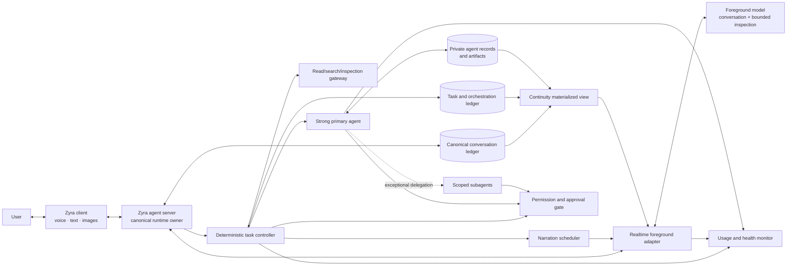

# Zyra Voice-Agent Architecture

**Status: Draft specification — accepted design direction, implementation pending.**
**Audience:** maintainers, agent-framework builders, voice-interface researchers, and contributors.
**Last reviewed:** 2026-08-02.

This package specifies a persistent, voice-first coding assistant that can answer immediately, inspect safely, delegate durable work, narrate useful outcomes, and resume across physical realtime sessions. Voice is a mode of a canonical Zyra chat. Speech, text, images, tasks, approvals, and background results retain the same conversation identity.

The architecture is provider-aware and provider-neutral at its core. The first experimental adapter targets subscription-backed Codex realtime through the open-source Codex App Server. Other realtime and coding-agent providers can implement the same seams.

> This is a public design and interoperability specification. It does not claim that every described capability is implemented in Zyra today, and it does not claim invention of voice handoffs, supervisor agents, or durable workflows. See [Implementation status](#implementation-status) and [Prior art](prior-art.md).

## Outcome

A user can speak naturally with one persistent Zyra identity while deeper work continues through a strong coding agent:

1. The **realtime foreground agent** handles conversation and bounded read/search/inspection/status work.
2. The **task controller** turns durable intent into versioned tasks, routes work, enforces policy, and records typed events.
3. One **strong primary agent** normally owns execution, integration, and verification.
4. **Subagents** are exceptional, narrowly scoped workers. They never address the user directly.
5. The **narration scheduler** decides which verified events deserve speech. The foreground agent remains the sole voice.
6. The **continuity service** prepares a bounded materialized view so a new physical voice session can resume silently without another summarization model.

## System at a glance

## Non-negotiable invariants

The key words **MUST**, **MUST NOT**, **SHOULD**, **SHOULD NOT**, and **MAY** are normative.

1. **One conversation identity.** Voice, text, and images MUST append to the same canonical chat and task context.
2. **One user-facing identity.** Background agents MUST NOT speak or write user-facing messages directly. Primary work runs in a private task session; only the foreground/conversation gateway can commit canonical assistant messages.
3. **Deterministic authority.** Task state, permissions, approvals, context versions, cancellation, and completion MUST be enforced outside model memory.
4. **Bounded foreground tools.** The realtime role MAY read, search, inspect, and check status through dedicated tools. It MUST NOT receive unrestricted shell, file writes, tests, Git mutation, deployment, or consequential application control.
5. **Preserved intent.** Every delegation packet MUST retain the user’s verbatim request. Summaries and findings supplement it; they never replace it.
6. **Primary ownership.** One strong primary agent SHOULD own a task end to end. The initial policy allows one active strong-primary attempt per canonical conversation; another can start only after a durable park/terminal slot-release receipt. Only the primary can submit overall verification evidence.
7. **Exceptional subagents.** A subagent MUST have an explicit objective, inherited constraints, attenuated capabilities, and a machine-checkable return contract.
8. **Silent, idempotent narration.** Raw tool calls, code, logs, tests, internal reasoning, and worker discussions MUST NOT enter text-to-speech. Spoken delivery and canonical text commits MUST have durable dedupe/recovery state.
9. **Separate decisions and permissions.** A collaboration preference or spoken/model text MUST NOT grant authority. Trusted approval resolution issues a separate bounded capability lease.
10. **Versioned steering.** Corrections, constraints, decisions, and approval changes MUST target the correct task and active descendants through context revisions.
11. **Prepared continuity.** Resume context MUST be a bounded projection of canonical ledgers. Critical pending choices, safety state, constraints, and narration outcomes cannot be silently truncated; the projection MUST NOT become a competing source of truth.
12. **Safe restart.** Consequential operations and unknown-outcome speech MUST NOT be replayed after uncertainty. Side effects and canonical message commits use durable intent/receipt records and stable IDs.
13. **Separate usage meters.** Realtime voice usage and coding-agent work usage MUST be presented separately.
14. **Provider truth.** Adapters MUST discover and report capabilities. Generic Realtime API features MUST NOT be assumed to exist in subscription-backed Codex thread realtime.

## Request classes

| Class | Owner | Examples | Durable task? |
|---|---|---|---|
| Conversation | Foreground agent | Explanation, clarification, brainstorming | Usually no |
| Quick inspection | Foreground agent through bounded gateway | Read one file, search symbols, check task status | Promote if the budget or capability boundary is crossed |
| Durable work | Strong primary agent through task controller | Edit, run commands, test, investigate multiple systems | Yes |
| Consequential action | Primary agent plus permission gate | Deploy, publish, destructive Git, external side effect | Yes; explicit approval when policy requires |
| Exceptional specialist work | Scoped subagent owned by primary | Independent audit, massive separable research, high-value verification | Child run of a durable task |

The routing contract is detailed in [Lifecycle and routing](lifecycle-and-routing.md).

## Existing Zyra foundations

This design extends current Zyra architecture instead of introducing a second agent platform:

- [Agent server](../agent-server.md) already owns durable workers, client detach/reconnect, ordered replay, and canonical chat attachment.
- [Canonical chat integrity](../canonical-chat-integrity.md) already defines the Pi session JSONL as conversation truth and Desktop SQLite as a rebuildable projection.
- [Agent surfaces](../agent-surface.md) already separate provider-neutral semantics from TUI and Desktop rendering.
- [Subagents and workflows](../../guides/subagents-workflows.md) already provide event-sourced fleet records, capability attenuation, cancellation trees, worktree isolation, model routing, and retained child transcripts.
- [Agent-control security](../../security/agent-control.md) already keeps consequential desktop authority in a trusted broker with revocable grants.
- The Instructor Voice Lab is an experimental, isolated interoperability surface. Production Voice must merge into the canonical chat rather than retain a parallel conversation.

## Implementation status

| Area | Status | Meaning |
|---|---|---|
| Canonical chat and server-owned runtime | **Implemented foundation** | Existing public Zyra architecture |
| Event-sourced fleet, workflows, capability attenuation | **Implemented foundation** | Existing public Zyra architecture |
| Isolated Codex realtime Voice Lab | **Experimental prototype** | Useful media/protocol evidence; not production conversation architecture |
| Task controller, canonical controller store, and first-class task ledger | **Specified here** | Implementation pending |
| Foreground inspection gateway | **Specified here** | Implementation pending |
| Central narration scheduler | **Specified here** | Implementation pending |
| Continuity materialized view | **Specified here** | Implementation pending |
| Provider-neutral adapter contract | **Specified here** | Implementation pending |
| Production voice mode in canonical chat | **Specified here** | Implementation pending |

## Documentation map

| Document | Purpose |
|---|---|
| [System architecture](system-architecture.md) | Ownership, processes, seams, and data flow |
| [Lifecycle and routing](lifecycle-and-routing.md) | Task states, routing, promotion, decisions, cancellation, and recovery |
| [Context and continuity](context-and-continuity.md) | Ledgers, context revisions, delegation packets, resume packets, and hydration |
| [Contracts](contracts.md) | Normative records, events, invariants, and JSON Schemas |
| [Narration and interaction](narration-and-interaction.md) | Selective speech, interruptions, multimodal behavior, and accessibility |
| [Security and privacy](security-and-privacy.md) | Threat model, capability policy, approval isolation, retention, and redaction |
| [Provider adapters](provider-adapters.md) | Provider-neutral seams and Codex-specific experimental behavior |
| [Usage and operations](usage-and-operations.md) | Voice/task accounting, health, observability, and operator behavior |
| [Evaluation plan](evaluation.md) | Contract, routing, safety, continuity, and end-to-end evals |
| [Implementation roadmap](roadmap.md) | Phased delivery plan and release gates |
| [Prior art](prior-art.md) | Related systems, supported claims, and novelty limits |
| [Glossary](glossary.md) | Canonical terms used throughout the specification |
| [Contributing](CONTRIBUTING.md) | How to propose changes, providers, diagrams, and evaluations |
| [`schemas/`](schemas/) | Draft 2020-12 machine-readable contracts |
| [`examples/`](examples/) | Valid example task, event stream, delegation, and resume records |

## Decision records

The architecture’s load-bearing choices are recorded under [`docs/adr/`](../../adr/):

- [ADR-0001: Voice is a mode of the canonical conversation](../../adr/0001-voice-is-a-canonical-conversation-mode.md)
- [ADR-0002: Use two model roles with bounded foreground tools](../../adr/0002-two-model-roles-and-bounded-foreground-tools.md)
- [ADR-0003: Keep task authority in deterministic ledgers](../../adr/0003-deterministic-task-controller-and-ledgers.md)
- [ADR-0004: Keep one central narrator and exceptional subagents](../../adr/0004-central-narration-and-exceptional-subagents.md)
- [ADR-0005: Build continuity as a materialized view](../../adr/0005-continuity-as-a-materialized-view.md)
- [ADR-0006: Separate involvement preferences from permissions](../../adr/0006-separate-involvement-from-permissions.md)

## Scope and non-goals

This specification covers local Zyra clients and a server-owned local runtime. It leaves cloud synchronization, unattended remote control, provider credential brokering, and generalized distributed consensus outside the initial scope. It does not make worker transcripts public, turn every utterance into a durable task, or require a subagent fleet for normal work.

## Publication posture

This package is intended to be reusable. Provider-specific observations are labeled **documented**, **experimentally verified**, or **proposed**. Experimental Codex integration must remain replaceable behind adapters, and contributors should cite public sources or reproducible clean-room behavior rather than copied proprietary application code.
