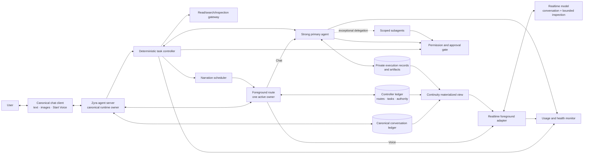

# Zyra Voice-Agent Architecture

**Status: Draft specification — accepted design direction, implementation pending.**
**Audience:** maintainers, agent-framework builders, voice-interface researchers, and contributors.
**Last reviewed:** 2026-08-04.

This package specifies a persistent multimodal coding assistant with an ordinary strong-agent Chat surface and optional low-latency Voice. A typed Chat turn goes directly to the strong agent; starting Voice attaches a realtime foreground to the same canonical conversation and any active task. Speech, text, images, tools, tasks, approvals, and background results retain one conversation identity within that scope.

The committed product direction is sequenced in two independently usable phases. **Phase One / V1** ships the conversation-scoped architecture in this package. **Phase Two / V2** optionally adds a relationship-first Zyra Home, conversation-first work threads, a hybrid Inbox, and voice-led focus visits after Phase One gates pass. V1/V2 are product interaction profiles, not protocol or schema versions. See [Product phases](product-phases.md) and [Phase Two — relationship-first interaction](relationship-first-interaction.md). A separate [adaptive-coaching future direction](future-adaptive-coaching.md) synthesizes lessons from the Betum learning-engine review; it is research only and changes neither phase contract.

The architecture is provider-aware and provider-neutral at its core. The first experimental adapter targets subscription-backed Codex realtime through the open-source Codex App Server. Other realtime and coding-agent providers can implement the same seams.

> This is a public design and interoperability specification. It does not claim that every described capability is implemented in Zyra today, and it does not claim invention of voice handoffs, supervisor agents, durable workflows, or persistent-assistant interaction. See [Implementation status](#implementation-status) and [Prior art](prior-art.md).

## Product phases

| Phase | Profile | User entry point | Availability contract |
|---|---|---|---|
| **Phase One / V1** | `conversation_scoped` | Select/create a canonical conversation; optionally Start Voice inside it | Required first release and permanent supported profile |
| **Phase Two / V2** | `relationship_first` | Talk directly in Zyra Home; substantial work branches into scoped threads | Optional additive profile implemented only after Phase One passes |

Phase Two groups separate canonical conversations under one logical relationship. It never creates one unbounded lifetime transcript, and disabling it never deletes or rewrites Phase One data.

## Outcome

A user can work in a normal coding chat and enter Voice on any later turn without losing context or interrupting durable work:

1. The **strong primary agent** owns direct user-facing responses in Chat and shows structured tool, command, diff, and test activity.
2. The **realtime foreground agent** owns conversation and bounded read/search/inspection/status work while Voice is active.
3. One active **foreground route** determines which role may produce canonical assistant responses; old-route provider events are rejected.
4. The **task controller** turns durable intent into versioned tasks, routes work, enforces policy, and records typed events.
5. One **strong primary agent** normally owns execution, integration, and verification even when Realtime becomes the narrator.
6. **Subagents** are exceptional, narrowly scoped workers. They never address the user directly.
7. The **narration scheduler** decides which verified events deserve speech. Realtime remains the sole spoken narrator in Voice.
8. The **continuity service** prepares a bounded materialized view so Voice can attach or resume silently without another summarization model.

In optional Phase Two, the same authorities compose across a distinguished Home conversation and separate work-thread conversations. One relationship focus lease, hybrid Inbox, authorized retrieval-first context escalation, and idempotent Home activity receipts create the persistent-assistant experience without merging histories or changing task authority.

## System at a glance

The core diagram is Product Phase One. Phase Two composes the same modules through the relationship host documented in [System architecture](system-architecture.md#phase-two-relationship-overlay).

## Non-negotiable invariants

The key words **MUST**, **MUST NOT**, **SHOULD**, **SHOULD NOT**, and **MAY** are normative.

1. **One conversation identity.** Voice, text, images, and direct strong-agent Chat turns MUST append to the same canonical chat and task context.
2. **One active foreground route.** Every non-deleted conversation MUST have exactly one response owner before accepting input or output: the strong primary in Chat or Realtime in Voice. Background agents MUST NOT address the user. Every canonical assistant commit passes through the conversation gateway and binds to the current route epoch.
3. **Deterministic authority.** Foreground ownership, task state, permissions, approvals, context versions, cancellation, and completion MUST be enforced outside model memory.
4. **Bounded realtime tools.** The realtime role MAY read, search, inspect, and check status through dedicated tools. It MUST NOT receive unrestricted shell, file writes, tests, Git mutation, deployment, or consequential application control. The strong role uses ordinary scoped coding tools only under task, sandbox, and approval policy.
5. **Preserved intent.** Every delegation packet MUST retain the user’s verbatim request. Summaries and findings supplement it; they never replace it.
6. **Primary ownership.** One strong primary agent SHOULD own a task end to end. The initial policy allows one active strong-primary attempt per canonical conversation; another can start only after a durable park/terminal slot-release receipt. Only the primary can submit overall verification evidence.
7. **Exceptional subagents.** A subagent MUST have an explicit objective, inherited constraints, attenuated capabilities, and a machine-checkable return contract.
8. **Inspectable execution, selective speech.** Structured tool and command lifecycle events MAY render inline in Chat. Raw arguments, code, logs, test output, internal reasoning, and worker discussion MUST NOT become assistant prose or text-to-speech. Spoken delivery and canonical text commits MUST have durable dedupe/recovery state.
9. **Separate decisions and permissions.** A collaboration preference or spoken/model text MUST NOT grant authority. Trusted approval resolution issues a separate bounded capability lease.
10. **Versioned steering.** Corrections, constraints, decisions, and approval changes MUST target the correct task and active descendants through context revisions.
11. **Prepared continuity.** Resume context MUST be a bounded projection of canonical ledgers. Critical pending choices, safety state, constraints, and narration outcomes cannot be silently truncated; the projection MUST NOT become a competing source of truth.
12. **Safe restart.** Consequential operations and unknown-outcome speech MUST NOT be replayed after uncertainty. Side effects and canonical message commits use durable intent/receipt records and stable IDs.
13. **Separate usage meters.** Realtime voice usage and coding-agent work usage MUST be presented separately.
14. **Provider truth.** Adapters MUST discover and report capabilities. Generic Realtime API features MUST NOT be assumed to exist in subscription-backed Codex thread realtime.
15. **Phase One independence.** The `conversation_scoped` profile MUST remain usable without Phase Two relationship, Inbox, focus-visit, or work-thread presentation.
16. **Scoped relationship.** In Phase Two, Zyra Home and every work thread retain distinct canonical conversation histories. Relationship membership MUST NOT merge messages or grant cross-thread retrieval.
17. **One relationship focus owner.** A nonretired Phase Two relationship has one server-authoritative active-or-parked focus snapshot and at most one live lease owner; detached focus is parked/silent, and organization removal makes it terminal `retired`; accepted interaction requires a fresh generation. Multi-client takeover is explicit; a focus visit grants no execution or approval authority.
18. **Retrieval before interruption.** Workers MUST escalate missing context to the strong coordinator. Authorized, provenance-bearing retrieval is attempted before one user attention item is created.
19. **Attention, not noise.** Routine work remains inside its thread. Needs you contains only actionable input/review. Home receives idempotent structured activity receipts; natural assistant text/speech still requires an active route owner.

## Request classes

| Class | Owner | Examples | Durable task? |
|---|---|---|---|
| Direct Chat conversation | Strong primary as foreground owner | Explanation, clarification, brainstorming | Usually no |
| Voice conversation | Realtime foreground | Natural dialogue, clarification, status | Usually no |
| Quick Voice inspection | Realtime through bounded gateway | Read one file, search symbols, check task status | Boundary crossing returns promotion-required; explicit intent or acceptance governs task launch |
| Phase Two strong consultation | Strong role returns private facts to Realtime | Deeper one-shot reasoning without mutation | No; budget crossing returns promotion-required evidence, then explicit work intent/acceptance governs launch |
| Phase Two work thread | Strong coordinator plus thread primary | Substantial asynchronous or multi-step chunk of work | May prepare conversationally; requires one or more durable tasks before execution |
| Durable work from either surface | Strong primary through task controller | Edit, run commands, test, investigate multiple systems | Yes |
| Consequential action | Strong primary plus permission gate | Deploy, publish, destructive Git, external side effect | Yes; explicit approval when policy requires |
| Exceptional specialist work | Scoped subagent owned by primary | Independent audit, massive separable research, high-value verification | Child run of a durable task |

The routing contract is detailed in [Lifecycle and routing](lifecycle-and-routing.md).

## Existing Zyra foundations

This design extends current Zyra architecture instead of introducing a second agent platform:

- [Agent server](../agent-server.md) already owns durable workers, client detach/reconnect, ordered replay, and canonical chat attachment.
- [Canonical chat integrity](../canonical-chat-integrity.md) already defines the Pi session JSONL as conversation truth and Desktop SQLite as a rebuildable projection.
- [Agent surfaces](../agent-surface.md) already separate provider-neutral semantics from TUI and Desktop rendering.
- [Subagents and workflows](../../guides/subagents-workflows.md) already provide event-sourced fleet records, capability attenuation, cancellation trees, worktree isolation, model routing, and retained child transcripts.
- [Agent-control security](../../security/agent-control.md) already keeps consequential desktop authority in a trusted broker with revocable grants.
- The Instructor Voice Lab is an experimental, isolated interoperability surface. Production Voice must merge into the canonical chat rather than retain a parallel conversation.

## Implementation status

| Area | Status | Meaning |
|---|---|---|
| Canonical chat and server-owned runtime | **Implemented foundation** | Existing public Zyra architecture |
| Event-sourced fleet, workflows, capability attenuation | **Implemented foundation** | Existing public Zyra architecture |
| Isolated Codex realtime Voice Lab | **Experimental prototype** | Useful media/protocol evidence; not production conversation architecture |
| Task controller, canonical controller store, and first-class task ledger | **Specified here** | Implementation pending |
| Exclusive Chat/Voice foreground routing | **Specified here** | Implementation pending |
| Direct strong-agent Chat output and structured activity projection | **Specified here** | Implementation pending |
| Foreground inspection gateway | **Specified here** | Implementation pending |
| Central narration scheduler | **Specified here** | Implementation pending |
| Continuity materialized view | **Specified here** | Implementation pending |
| Provider-neutral adapter contract | **Specified here** | Implementation pending |
| Production voice mode in canonical chat | **Specified here** | Phase One implementation pending |
| Conversation-scoped interaction profile | **Specified here** | Phase One implementation pending; remains supported after V2 |
| Relationship-first Zyra Home and work threads | **Phase Two specified here** | Optional implementation pending after Phase One |
| Hybrid Inbox, active-work strip, and focus visits | **Phase Two specified here** | Optional implementation pending after Phase One |
| Strong consultation and retrieval-first escalation | **Phase Two specified here** | Optional implementation pending after Phase One |
| Evidence-owned adaptive coaching | **Future exploration** | Betum-informed research note; not a Phase One/Two commitment |

## Documentation map

| Document | Purpose |
|---|---|
| [Product phases](product-phases.md) | Phase One/V1 and optional Phase Two/V2 sequencing, coexistence, and rollback |
| [Phase Two — relationship-first interaction](relationship-first-interaction.md) | Zyra Home, work threads, Inbox, strong consultation, context escalation, and focus visits |
| [Future direction — adaptive coaching](future-adaptive-coaching.md) | Betum-informed separation of bounded AI tutoring from controller-owned evidence, pacing, progression, and simulation |
| [System architecture](system-architecture.md) | Ownership, processes, seams, and data flow |
| [Lifecycle and routing](lifecycle-and-routing.md) | Task states, routing, promotion, decisions, cancellation, and recovery |
| [Context and continuity](context-and-continuity.md) | Ledgers, context revisions, delegation packets, resume packets, and hydration |
| [Contracts](contracts.md) | Normative records, events, invariants, and JSON Schemas |
| [Narration and interaction](narration-and-interaction.md) | Selective speech, interruptions, multimodal behavior, and accessibility |
| [Security and privacy](security-and-privacy.md) | Threat model, capability policy, approval isolation, retention, and redaction |
| [Provider adapters](provider-adapters.md) | Provider-neutral seams and Codex-specific experimental behavior |
| [Usage and operations](usage-and-operations.md) | Voice/task accounting, health, observability, and operator behavior |
| [Evaluation plan](evaluation.md) | Contract, routing, safety, continuity, and end-to-end evals |
| [Implementation roadmap](roadmap.md) | Phased delivery plan and release gates |
| [Prior art](prior-art.md) | Related systems, supported claims, and novelty limits |
| [Glossary](glossary.md) | Canonical terms used throughout the specification |
| [Contributing](CONTRIBUTING.md) | How to propose changes, providers, diagrams, and evaluations |
| [`schemas/`](schemas/) | Draft 2020-12 machine-readable contracts |
| [`examples/`](examples/) | Valid example task, event stream, delegation, and resume records |

## Decision records

The architecture’s load-bearing choices are recorded under [`docs/adr/`](../../adr/):

- [ADR-0001: Voice is a mode of the canonical conversation](../../adr/0001-voice-is-a-canonical-conversation-mode.md)
- [ADR-0002: Use two model roles with bounded foreground tools](../../adr/0002-two-model-roles-and-bounded-foreground-tools.md)
- [ADR-0003: Keep task authority in deterministic ledgers](../../adr/0003-deterministic-task-controller-and-ledgers.md)
- [ADR-0004: Keep one central narrator and exceptional subagents](../../adr/0004-central-narration-and-exceptional-subagents.md)
- [ADR-0005: Build continuity as a materialized view](../../adr/0005-continuity-as-a-materialized-view.md)
- [ADR-0006: Separate involvement preferences from permissions](../../adr/0006-separate-involvement-from-permissions.md)
- [ADR-0007: Keep canonical Chat primary and make Voice an explicit foreground route](../../adr/0007-canonical-chat-and-explicit-voice-foreground-routing.md)
- [ADR-0008: Offer relationship-first interaction as an optional second phase](../../adr/0008-offer-relationship-first-interaction-as-an-optional-second-phase.md)
- [ADR-0009: Group Home and work threads with relationship focus](../../adr/0009-group-home-and-work-threads-with-relationship-focus.md)
- [ADR-0010: Use strong consultation and retrieval-first worker escalation](../../adr/0010-use-strong-consultation-and-retrieval-first-worker-escalation.md)
- [ADR-0011: Use attention items, focus visits, and Home receipts](../../adr/0011-use-attention-items-focus-visits-and-home-receipts.md)

## Scope and non-goals

This specification covers local Zyra clients and a server-owned local runtime. It leaves cloud synchronization, unattended remote control, provider credential brokering, and generalized distributed consensus outside the initial scope. It does not make worker transcripts public, turn every utterance into a durable task, or require a subagent fleet for normal work. Phase Two also excludes a merged lifetime transcript, nested work threads, automatic cross-project memory, automatic Voice activation, and removal of the V1 conversation-scoped profile.

## Publication posture

This package is intended to be reusable. Provider-specific observations are labeled **documented**, **experimentally verified**, or **proposed**. Experimental Codex integration must remain replaceable behind adapters, and contributors should cite public sources or reproducible clean-room behavior rather than copied proprietary application code.
