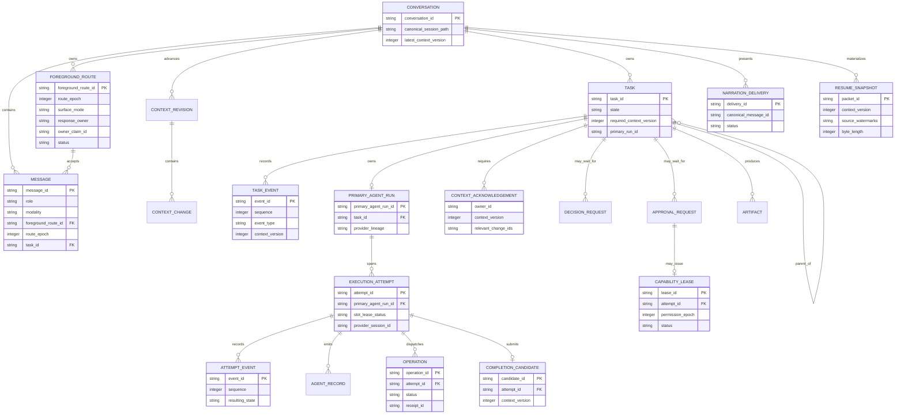
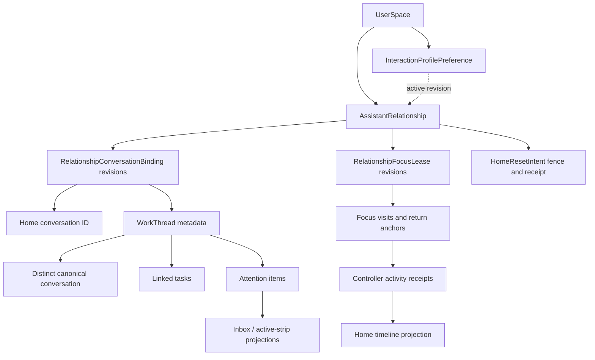
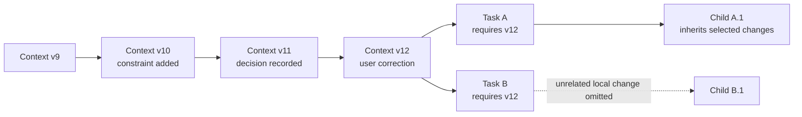
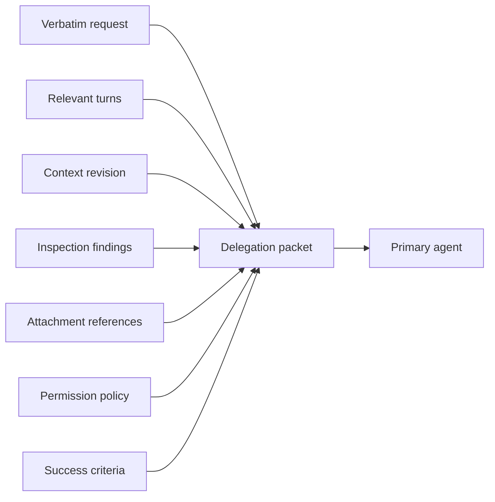
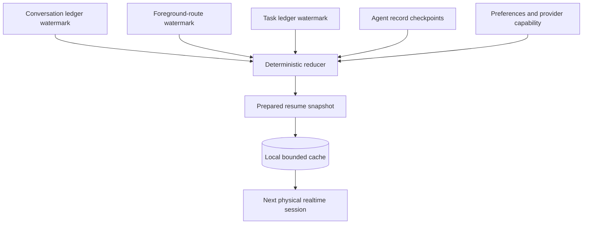
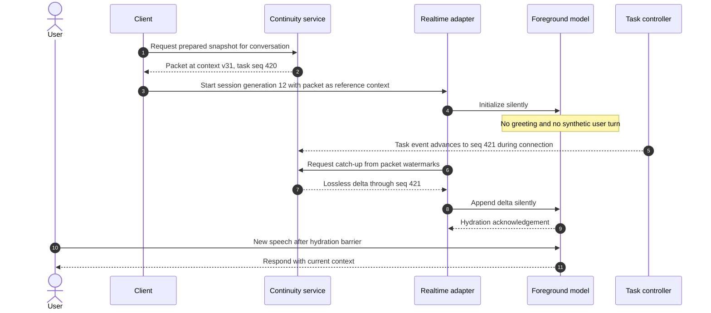
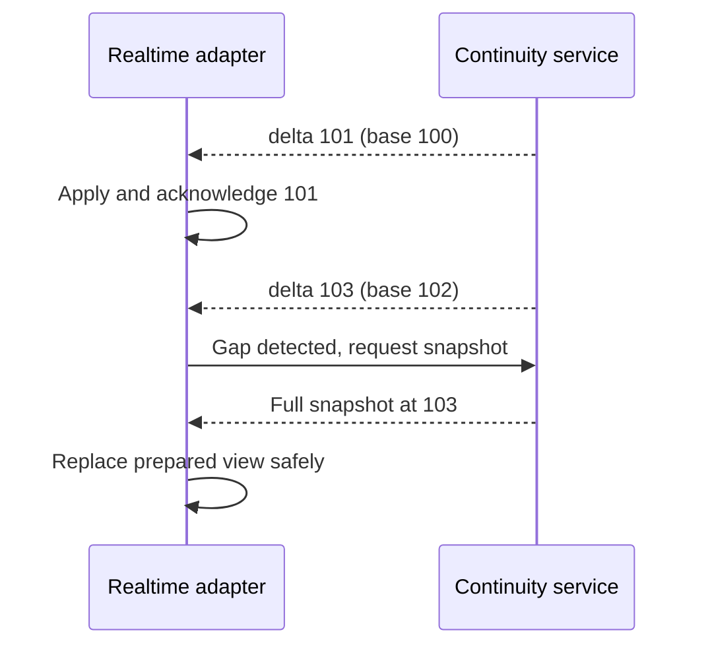

# Context and continuity

**Status: Draft specification.**
**Parent:** [Zyra Voice-Agent Architecture](README.md).

## Context layers

Phase One maintains four context scopes. Optional Phase Two composes two additional scopes without copying conversation history:

| Scope | Purpose | Typical consumers |
|---|---|---|
| Global | Public product policy, user preferences, provider capability policy | All roles, selectively |
| Conversation | User-visible turns, attachments, shared decisions, current focus | Foreground and relevant tasks |
| Task | Verbatim request, constraints, acceptance criteria, artifacts, status | Controller and primary |
| Child run | One narrow objective, inherited constraints, scoped evidence | One subagent |
| Relationship (Phase Two) | Home generation, thread/attention index, interaction preferences, relationship focus lease, and budget heads | Relationship host and continuity reducer; never sent wholesale to a model |
| Work thread (Phase Two) | One substantial objective, scoped conversation, linked tasks/decisions/artifacts | Focused foreground, strong coordinator, and relevant primaries |

More context is not automatically better. Each role receives a deterministic envelope containing only what it needs.

## Canonical records

### Phase Two relationship records

The stable user-space ID, InteractionProfilePreference, AssistantRelationship, and RelationshipConversationBinding records live in `controller.sqlite`. Prompt profiles and provider accounts do not define relationship identity. Bindings are the canonical membership source. They index and coordinate canonical sources but never become a merged message ledger. `RelationshipFocusLease`, `FocusVisit`, and `AttentionItem` revisions are append-only. Inbox, active strip, thread status, and Home activity receipts remain projections. A receipt retains source thread/task/visit identity and watermarks but is not a canonical assistant message; natural text/speech still follows the active foreground route.

### Conversation ledger

The canonical Pi session JSONL remains the user-visible message and model-context history. Speech transcripts, typed messages, image-backed messages, and direct strong-agent Chat responses MUST become ordinary canonical messages with stable IDs, modality metadata, `foreground_route_id`, and route epoch. Assistant messages also retain the durable canonical commit receipt that proves they committed while that route/owner claim was active.

A voice transcript or streamed strong response is not authoritative until its provider/turn identity, completion state, and current foreground owner claim are known. Pre-routing canonical messages retain their original JSONL bytes and gain route/modality/receipt metadata only through hash-verified [`LegacyMessageRouteBinding`](schemas/legacy-message-route-binding.schema.json) records tied to an initial `migration` Chat route. An unverified legacy record blocks v3 materialization rather than receiving guessed metadata. Partial deltas are presentation events; final or interrupted text commits idempotently. Output from a superseded route epoch cannot append to history.

### Foreground-route ledger

`ForegroundRoute` revisions live in `controller.sqlite` beside task authority records. Transactional uniqueness plus a conversation invariant require exactly one active route for every non-deleted conversation before input or output is accepted. A new route records its predecessor, monotonic epoch, surface, response owner, non-authorizing claim ID, context version, an immutable snapshot of relevant active task IDs at activation, and physical realtime session identity when applicable. Route history is canonical orchestration truth; renderer mode state is only a projection.

A Voice route becomes active only after complete hydration. Superseding the prior route and installing the new gateway claim commit together. Task attempts and capability authority are referenced for context but never transferred by this transaction.

### Task and orchestration ledger

First-class `task.*` events SHOULD reuse the existing fleet/controller domain model while meeting the transactional store contract. The reference persistence is the append-only event and immutable-record tables in `controller.sqlite`; an implementation may migrate compatible fleet records into that store rather than running two orchestration authorities. Private provider/worker streams can remain under `.zyra/agent-runs/<root-session-id>/` and link by task/run/attempt IDs.

The reduced task snapshot is derived. The append-only controller events and immutable decision/approval/context records remain authoritative.

### Private agent records

Primary and child transcripts, detailed tool payloads, code, logs, and large results remain private task records. While Chat owns the foreground route, the strong primary may emit gateway-controlled response text and structured execution lifecycle events; the raw payloads remain private. While Voice owns the route, primary output is private task evidence and Realtime receives bounded validated summaries and artifact references. A user can inspect redacted activity inline or in task details without injecting raw execution data into assistant prose, model history, or speech.

### Reconnect journals and UI databases

Agent-server event journals support ordered detach/reconnect replay. Desktop search/timeline SQLite and renderer stores remain rebuildable projections; they are distinct from canonical `controller.sqlite`. Neither projection becomes a source of task, permission, or conversation identity.

## Context revisions

A `ContextRevision` is an immutable, monotonically numbered set of changes. A revision has one parent, an explicit scope, actor, timestamp, and change list.

Supported change kinds:

- `constraint.added`
- `constraint.replaced`
- `constraint.removed`
- `correction.recorded`
- `decision.recorded`
- `decision.superseded`
- `approval.reference.updated` — references a separate approval record; it never embeds or broadens a grant
- `preference.changed`
- `focus.changed`
- `assumption.confirmed`
- `assumption.rejected`
- `attachment.added`
- `task.linked`

Approvals use their own records and events. Resolving, expiring, or revoking an approval advances task context through `approval.reference.updated`, containing only the approval ID and status. For an approval requested at relevant context N, the controller compares every revision through current version M. A relevant change expires the request; otherwise resolution commits revision M+1 and an accepted result can issue a separate capability lease whose `issued_context_version` is M+1 and whose `action_hash` still matches. The resumed attempt, rather than the parked requesting attempt, owns that lease. Any later relevant revision requires action/precondition revalidation and revokes a mismatched lease. The revision MUST NOT turn a grant into a general preference or inherited constraint.

### Propagation rules

1. Conversation-scoped constraints apply to new tasks and active tasks unless explicitly excluded by scope.
2. Task-scoped constraints propagate to active descendants by default.
3. Child-local findings do not propagate laterally unless the primary or controller promotes them.
4. User corrections targeting an active task advance its `required_context_version` immediately.
5. Every active owner records its own acknowledgement `{owner_kind, owner_id, context_version, relevant_change_ids}` at a safe boundary; one task-wide scalar is insufficient.
6. A stale owner can continue only work proven unaffected by the change.
7. Completion is rejected when the primary lacks the required acknowledgement or when accepted evidence came from an active child that had not acknowledged its highest relevant version.
8. Superseded decisions remain auditable and are excluded from current envelopes.

## Delegation packet

A delegation packet is the primary agent’s task-start contract. It MUST contain:

- packet and schema version;
- conversation, task, and attempt IDs;
- user’s verbatim request;
- relevant verbatim turns, including corrections;
- attachment references and safe metadata;
- current task state and exact success criteria;
- applicable constraints and decisions with IDs;
- required context version;
- foreground inspection findings with provenance;
- project/cwd and source-state references;
- capability policy, approval requirements, and only exact active lease references assigned to this attempt;
- requested model role, effort, and budgets;
- expected event/return contract.

The packet’s summary fields MAY compress background context. They MUST NOT replace the verbatim request or active constraints.

## Child context envelope

The primary creates a narrower packet for a child. It contains:

- one objective and explicit non-goals;
- parent task/run IDs;
- inherited constraints and required version;
- bounded evidence or artifact references;
- exact read/write scopes and tools;
- isolation mode;
- success criteria and output schema;
- prohibition on user-facing communication and approval claims;
- integration owner and deadline/budget.

A child does not automatically receive the full canonical conversation or primary transcript.

## Continuity service

The continuity service is a deterministic materialized view over canonical records. It updates when any source watermark relevant to an active conversation changes. In Phase Two, a small relationship index identifies Home generation, relationship focus-lease head/owner, work-thread/task heads, pending actionable attention, activity receipts, and budget reservations, while each focused conversation retains an isolated packet and delta stream.

A Phase Two focus packet may include relationship-level attention summaries and typed references to sibling threads. It never includes complete sibling transcripts. Preparing a focus visit saves source watermarks/return cue and hydrates the target packet. Chat visits keep a null realtime binding and compare-and-swap focus while validating unchanged Chat route heads. Visits entered from active Voice additionally create an immutable target provider-thread/session binding and atomically transition focus plus source/target routes. Returning performs the inverse through current source watermarks. Other clients mirror or receive explicit takeover/conflict state.

The service MUST NOT:

- call a third summarization model;
- merge Home and work-thread conversations into one model history;
- treat relationship membership as cross-thread retrieval authority;
- write new facts back into canonical ledgers;
- convert unverified worker claims into decisions;
- include credentials, raw tool logs, or hidden reasoning;
- emit a user message merely because a session resumed.

## Resume packet

A prepared packet contains:

1. **Identity and watermarks** — conversation ID, context version, active foreground-route epoch, task/event sequences, generation time.
2. **Active foreground route** — exact Chat/Voice owner claim, predecessor, physical session generation when applicable, and attached active tasks.
3. **Current focus** — what the user is discussing or waiting for.
4. **Pending user obligations** — exact decision question/options or approval action/hash/scope/expiry, never a summary alone.
5. **Active task cards** — task state plus exact task revision/event-sequence head, current attempt/primary lineage, exact current attempt state and event-sequence head, latest verified activity, blockers, and next expected event. At most one card is `running`, and its attempt matches the canonical primary slot and exact writer-lock ID set.
6. **Exact active constraints** — stable IDs and scope.
7. **Current decisions** — selected option and rationale, excluding superseded decisions.
8. **Recent verbatim turns** — enough dialogue to preserve deixis, tone, and corrections, including canonical conversation sequence, modality, route identity, and assistant commit receipt.
9. **Retrieval references** — canonical message, artifact, and task-record pointers for older detail.
10. **Safety state** — permission epoch, emergency-stop state, active lease IDs, revocation watermark, primary slot, writer-lock owner, and exact writer-lock IDs.
11. **Operation revision index** — one entry for every operation source sequence through the watermark, carrying operation ID, exact safe revision/status, complete immutable-identity SHA-256, idempotency, canonical-message, and assigned-receipt identities. The explicit index and its resulting delta watermark cannot exceed 256 entries; overflow fails closed. Terminal entries remain tombstones; succeeded/failed/cancelled entries preserve their assigned receipt while outcome-unknown entries preserve null. Removing any entry creates a gap, preventing ID reuse while supporting cross-packet continuation, forward-only status transitions, and terminal finality.
12. **Narration delivery watermark** — terminal sequence plus pending and unknown-outcome delivery IDs, preventing speech replay after a crash.
13. **Integrity and usage** — critical-record completeness/hash/staleness plus optional safe usage context.

`packet_integrity.canonical_sha256` is SHA-256 over RFC 8785 canonical JSON after omitting that hash field. The initial target is **24–32 KiB encoded JSON**, to be validated experimentally per provider. This is a conservative proposal, not a published Codex limit.

### Deterministic priority and truncation

When the packet exceeds its adapter-specific budget, retain content in this order:

1. active foreground route and any unresolved response ownership;
2. unresolved approvals and questions;
3. active blockers and failures;
4. exact active constraints and corrections;
5. active task state and latest verified evidence;
6. current decisions;
7. current focus;
8. recent verbatim turns;
9. older summaries;
10. retrieval references for omitted material.

The reducer truncates complete records only. Active foreground route/epoch, pending decisions/approvals, active constraints/corrections, safety state, active task ownership, blockers, and narration unknown-outcome records are **critical** and cannot be omitted. In Phase Two, the relationship focus lease head, active visit/return state, actionable attention source revisions, and unknown/exhausted budget reservations are also critical. If the critical set alone exceeds the adapter’s safe context limit, materialization fails closed and Voice does not answer history-dependent input until a complete larger packet or safe replacement snapshot is available. Noncritical omissions generate typed retrieval references and section/count metadata; UTF-8 strings are never cut mid-record.

## Silent activation and resume flow

Starting Voice from Chat and replacing an expired Voice session use the same hydration barrier. The current route remains canonical while the realtime transport prepares. During first activation that route is Chat. After packet/delta acknowledgement, the controller atomically activates a new Voice route epoch; failed initial preparation or replacement activates a fresh Chat route epoch/owner claim before direct output resumes.

Activation behavior:

- Before materialization, the gateway quiesces any strong Chat output and commits its completed/interrupted prefix; the snapshot conversation watermark includes that receipt.
- The client SHOULD load that prepared snapshot before allowing the first model response.
- A Chat-to-Voice handoff atomically supersedes the Chat route and activates the Voice route only after hydration covers the committed Chat prefix and every startup delta; attached primary execution continues unchanged.
- Canonical commits and provider callbacks carry route epoch as well as physical session generation, and either stale identity causes rejection.
- The packet is reference/developer context, never a new user utterance.
- The foreground remains silent until the user speaks or a pending urgent event requires policy-approved narration.
- Input can be captured during connection, but the adapter buffers response generation behind a hydration barrier until every delta through the connection high-watermark is acknowledged.
- State changes during or after connection become ordered, lossless silent deltas; task completion, revocation, and pending user items are never summary-only updates.
- Physical session expiry closes that generation, reconciles in-flight narration delivery, and prepares a new physical session from a fresh packet. Successful hydration activates a new Voice route epoch; failed replacement activates a fresh Chat route epoch/owner claim. A speech request without a terminal receipt becomes `outcome_unknown` and is not replayed.
- The foreground mentions “catching up” only when a complete packet cannot be applied promptly and the user asks a history-dependent question.
- In Phase Two, target focus preparation follows the same barrier. The source remains authoritative until the target packet and startup deltas are acknowledged; a safe provider-session replacement may occur behind the stable canvas.
- A focus return hydrates the saved source conversation through current watermarks before restoring it. Detailed target messages remain in the target ledger; Home receives one compact controller activity receipt after resolution/defer state commits.
- Return never waits for `ack_deadline_at`: independent `return_deadline_at` restores source Voice or safe Chat first; unresolved worker acknowledgement persists as `returned_pending_ack`, then terminally becomes acknowledged or a new blocker after the user is back.

## Delta hydration

A [`ResumeDelta`](schemas/resume-delta.schema.json) contains exact changed domain records, before/after source watermarks, resulting safety state, and an integrity hash computed over RFC 8785 canonical JSON with `canonical_sha256` omitted. Deltas are not truncated. For each delta, the adapter recomputes and validates both packet and delta integrity hashes, then validates base packet ID, monotonic context/watermarks, record schemas, foreground-route transitions, and safety authority. Any slot/lock/lease change requires matching same-conversation task, attempt, exact writer-lock IDs, and lease identities plus the corresponding watermark advance. Unrelated valid records cannot justify safety state. Task and attempt watermarks retain each type’s latest global controller sequence. Their included-event union must cover every controller sequence between the packet and delta high-watermarks without gaps, duplicates, or reordering; task and attempt records also share one globally unique event-ID namespace, and each advancing type ends at its own to watermark. Every other supported stream advances by exactly its included record count, all records with a conversation identity match the packet, and conversation messages cover exact new sequence numbers without reusing message IDs from the packet or delta; decision, approval, lease, operation, and narration records carry contiguous per-stream source sequences plus unique canonical identity/revision keys, so duplicates cannot satisfy coverage; operation idempotency/message identities cannot change within a lineage or move to an alias `operation_id`, and receipt identity is fixed once assigned; context records form a contiguous parent/version chain, backwards watermarks fail, and the checkpoint watermark remains fixed because v3 has no checkpoint delta record type. Gap validation iterates only bounded included records and rejects huge arithmetic differences without allocating by watermark size. Every JSON counter used for identity or coverage is capped at `Number.MAX_SAFE_INTEGER`, preventing distinct raw integers from collapsing to one JavaScript number. Task events continue exact packet revisions/states and reduce through legal transitions. Attempt events use unique event IDs and idempotency keys and reduce in increasing canonical sequence with legal state continuity and immutable lineage. The first event for an existing attempt continues the exact packet task, primary lineage, state, and sequence head; an unseen attempt starts with `attempt.created`. Intermediate authority snapshots may differ. The reducer carries forward packet task/attempt heads. Contiguous task/attempt records with one `transaction_id` apply atomically, and task/current-attempt/slot/lock/lease invariants are checked after every transaction group. It then simulates every ordered authority and lease record. It rejects transient slot overlap, transient leases issued to non-slot attempts, terminal task state with live authority, locks or leases on non-slot attempts, and any final mismatch between the task/current lineage and projected slot owner. A queued task may hold the slot only while its matching attempt is `starting`; `running` or `parking` attempts require the matching task to be `running`. The final slot-owner writer-lock and capability-lease ID sets must equal the safety projection even when that projection appears unchanged, preventing reordering, a hidden second owner, or a stale final lock set from bypassing validation. A slot A → B delta proves A released slot/locks/leases before B acquired, and terminal lease revisions continue the exact prior identity. Route heads are selected by highest valid revision regardless of input order. Route-bound canonical-message operations inside a delta undergo the same half-open route-lifetime validation as live gateway commits before their receipts are projected. The adapter then applies the delta transactionally in order and acknowledges the resulting watermark. Duplicate delta IDs are idempotent. A gap, hash mismatch, unsupported record, or oversized delta requests a fresh complete snapshot rather than guessing.

## Checkpoint production

Both model roles contribute structured checkpoints during normal work:

- the active Chat or Voice foreground owner checkpoints current focus, recent user-visible conclusions, and unresolved conversational references;
- the strong primary checkpoints task progress, verified evidence, blockers, artifacts, and expected next action regardless of foreground route;
- controller validates and stores these as typed records;
- continuity reducer selects from those records without invoking another model.

Checkpoints are bounded and factual. A model-authored summary is evidence with provenance until the controller links it to verified events.

## Retrieval

The foreground can request older detail through a dedicated read-only retrieval operation. Retrieval returns canonical records by stable reference, applies redaction, and has a bounded result. Retrieved detail is appended as temporary session context unless a new user-visible fact or task context revision must be persisted.

In Phase Two, every worker escalation first receives a ContextRetrievalAuthorization binding requester, purpose, exact allowed source IDs/data classes, policy/context revisions, redaction/size limits, expiry, and use budget. Within it, retrieval follows least-privilege order: acknowledged task context, current thread, project decisions, provenance-linked Home exchanges, then explicitly related threads/artifacts. Every access writes a receipt with requested/returned/denied sources and watermarks. Stale, conflicting, injected, or unauthorized results are not silently selected; one revision-bound attention item asks the user. Found context becomes a scoped revision and requires affected-owner acknowledgements before completion.

## Retention and deletion

- Canonical conversation retention follows Zyra’s existing session policy.
- Task events and approval records follow local agent-run retention and audit requirements.
- Ephemeral physical realtime state is disposed after disconnect.
- Resume caches are replaceable, encrypted at rest with OS-backed key storage, owner-only ACLs, and deleted with their canonical conversation.
- Deleting a UI projection does not delete canonical data.
- A canonical deletion flow MUST remove or tombstone derived resume packets and private task references consistently.
- Phase Two source deletion/redaction first terminalizes dependent attention/visits as non-actionable `source_unavailable`; relationship indexes and Home activity receipts retain only minimal non-opening provenance tombstones and cannot preserve deleted private detail.
- Active Home cannot be directly deleted. Reset Home requires trusted non-speech confirmation after active/preparing Voice returns to fresh quiescent Chat and physical Realtime closes, then CAS-installs a generation-bound writer fence, blocks new turn/visit/takeover/profile/activity-projection writes, drains pre-fence operation/receipt/NarrationDelivery streams exactly (uncertain speech becomes nonreplayable `outcome_unknown`), holds post-fence source receipts generation-unassigned, receipts the replacement header, then revalidates fence/heads/watermarks while atomically appending its epoch-1 Chat route/binding, advancing Home/focus, and assigning pending receipts to the selected generation. Recovery resumes or safely aborts the fenced intent; no messages copy. Reset archives the old Home as searchable V1/History data under existing retention, and erasure requires a separate trusted post-activation content cascade.
- Disabling the relationship-first profile retains additive records, exposes underlying Home/thread conversations and unresolved source affordances through the same V2-capable runtime’s V1 projection, and is not deletion. Removing relationship organization preserves those canonical sources; deleting content requires an explicit resumable per-source cascade.

## Schema references

Phase One machine-readable definitions:

- [`foreground-route.schema.json`](schemas/foreground-route.schema.json)
- [`legacy-message-route-binding.schema.json`](schemas/legacy-message-route-binding.schema.json)
- [`context-revision.schema.json`](schemas/context-revision.schema.json)
- [`delegation-packet.schema.json`](schemas/delegation-packet.schema.json)
- [`resume-packet.schema.json`](schemas/resume-packet.schema.json)
- [`resume-delta.schema.json`](schemas/resume-delta.schema.json)

Phase Two adds schemas for relationship, focus lease, work-thread, attention, visit, consultation, retrieval authorization/access receipt, budget/reservation, context escalation, and Home activity receipt records during its contract milestone. Their required semantics are defined now in [Phase Two — relationship-first interaction](relationship-first-interaction.md#proposed-controller-records); Phase One schemas are not overloaded before that milestone.
