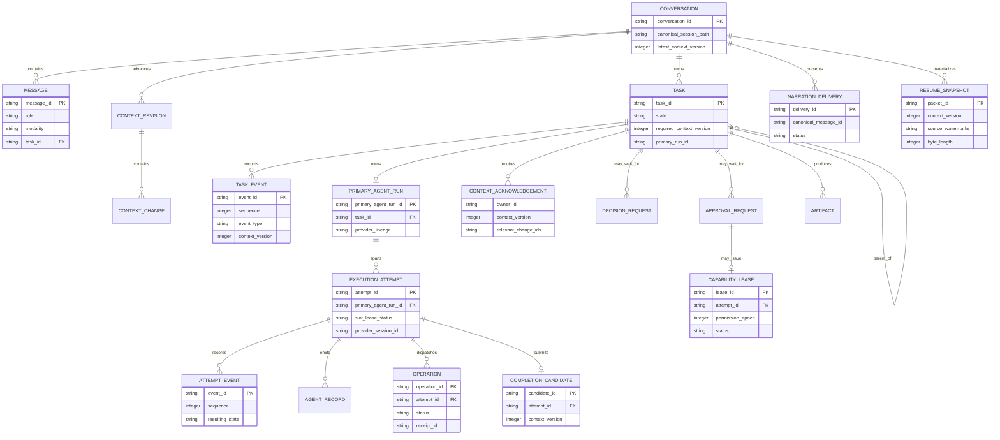
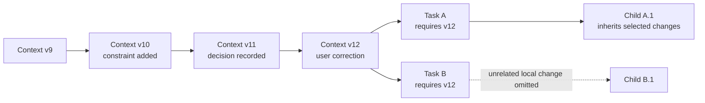
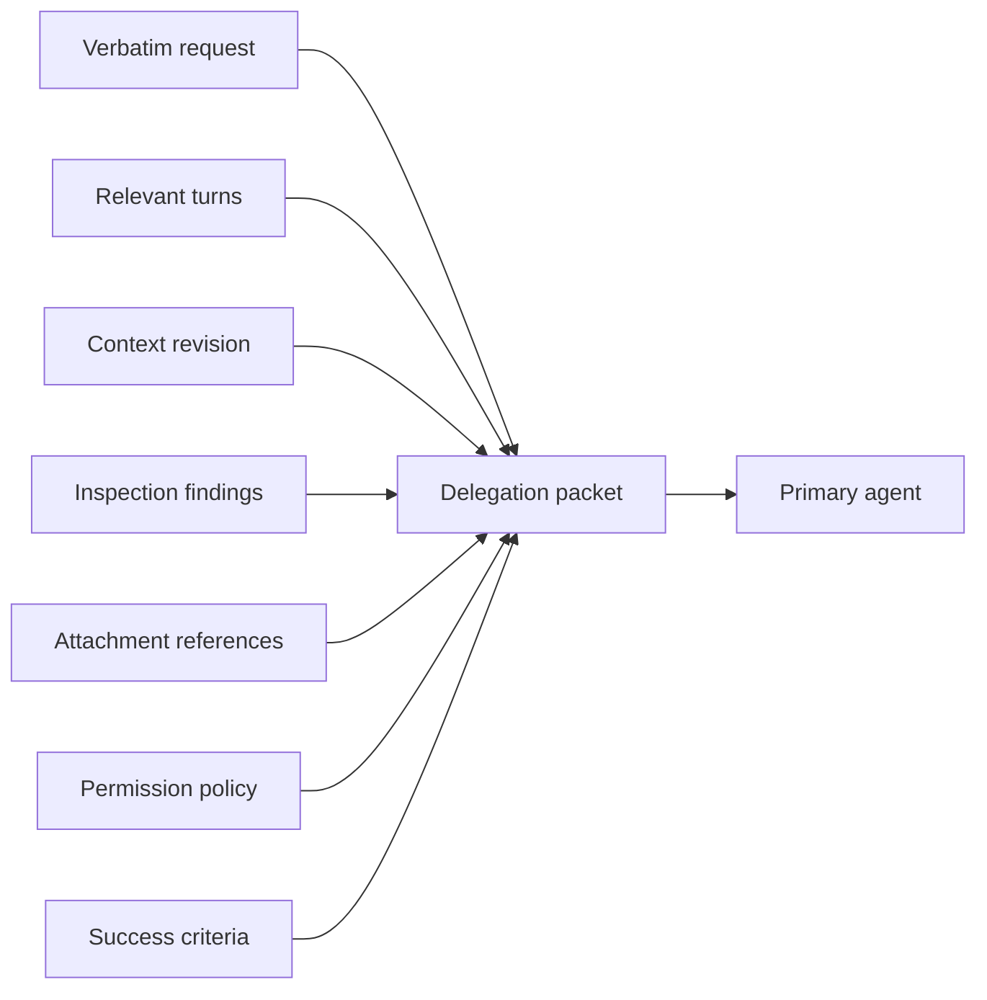
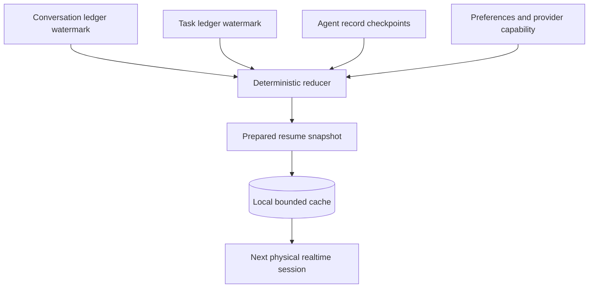
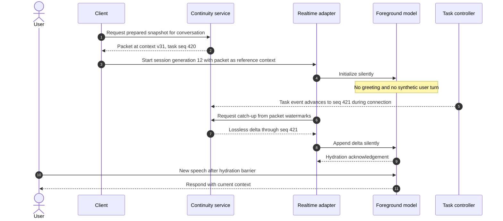
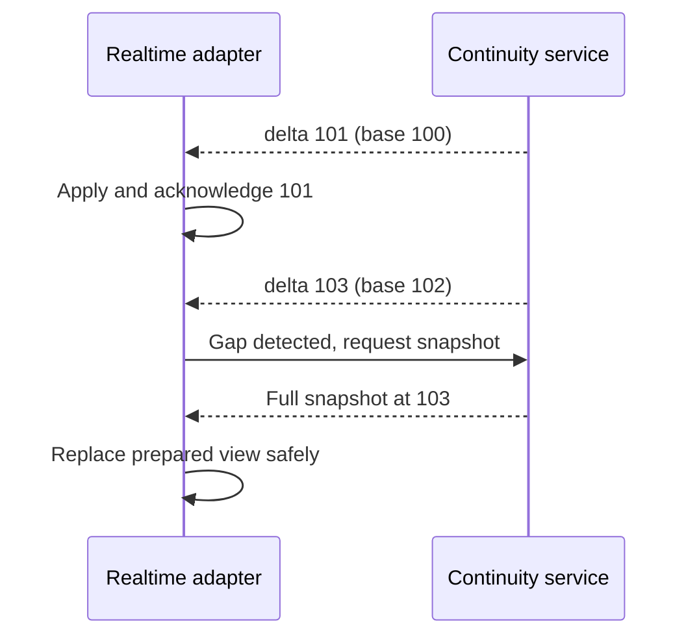

# Context and continuity

**Status: Draft specification.**
**Parent:** [Zyra Voice-Agent Architecture](README.md).

## Context layers

Zyra maintains four context scopes:

| Scope | Purpose | Typical consumers |
|---|---|---|
| Global | Public product policy, user preferences, provider capability policy | All roles, selectively |
| Conversation | User-visible turns, attachments, shared decisions, current focus | Foreground and relevant tasks |
| Task | Verbatim request, constraints, acceptance criteria, artifacts, status | Controller and primary |
| Child run | One narrow objective, inherited constraints, scoped evidence | One subagent |

More context is not automatically better. Each role receives a deterministic envelope containing only what it needs.

## Canonical records

### Conversation ledger

The canonical Pi session JSONL remains the user-visible message and model-context history. Speech transcripts, typed messages, and image-backed messages MUST become ordinary canonical messages with stable IDs and modality metadata.

A voice transcript is not authoritative until the turn identity and completion state are known. Partial transcript deltas are presentation events; the final canonical message is idempotently committed by provider turn/item identity or a client-generated message ID.

### Task and orchestration ledger

First-class `task.*` events SHOULD reuse the existing fleet/controller domain model while meeting the transactional store contract. The reference persistence is the append-only event and immutable-record tables in `controller.sqlite`; an implementation may migrate compatible fleet records into that store rather than running two orchestration authorities. Private provider/worker streams can remain under `.zyra/agent-runs/<root-session-id>/` and link by task/run/attempt IDs.

The reduced task snapshot is derived. The append-only controller events and immutable decision/approval/context records remain authoritative.

### Private agent records

Primary and child transcripts, detailed tool events, code, logs, and large results remain private task records. A primary uses a private provider/Pi session linked by task and attempt IDs, never the canonical user-facing root turn. The foreground receives bounded summaries and artifact references. A user can inspect private details through task UI without injecting them into speech or the main message timeline.

### Reconnect journals and UI databases

Agent-server event journals support ordered detach/reconnect replay. Desktop search/timeline SQLite and renderer stores remain rebuildable projections; they are distinct from canonical `controller.sqlite`. Neither projection becomes a source of task, permission, or conversation identity.

## Context revisions

A `ContextRevision` is an immutable, monotonically numbered set of changes. A revision has one parent, an explicit scope, actor, timestamp, and change list.

Supported change kinds:

- `constraint.added`
- `constraint.replaced`
- `constraint.removed`
- `correction.recorded`
- `decision.recorded`
- `decision.superseded`
- `approval.reference.updated` — references a separate approval record; it never embeds or broadens a grant
- `preference.changed`
- `focus.changed`
- `assumption.confirmed`
- `assumption.rejected`
- `attachment.added`
- `task.linked`

Approvals use their own records and events. Resolving, expiring, or revoking an approval advances task context through `approval.reference.updated`, containing only the approval ID and status. For an approval requested at relevant context N, the controller compares every revision through current version M. A relevant change expires the request; otherwise resolution commits revision M+1 and an accepted result can issue a separate capability lease whose `issued_context_version` is M+1 and whose `action_hash` still matches. The resumed attempt, rather than the parked requesting attempt, owns that lease. Any later relevant revision requires action/precondition revalidation and revokes a mismatched lease. The revision MUST NOT turn a grant into a general preference or inherited constraint.

### Propagation rules

1. Conversation-scoped constraints apply to new tasks and active tasks unless explicitly excluded by scope.
2. Task-scoped constraints propagate to active descendants by default.
3. Child-local findings do not propagate laterally unless the primary or controller promotes them.
4. User corrections targeting an active task advance its `required_context_version` immediately.
5. Every active owner records its own acknowledgement `{owner_kind, owner_id, context_version, relevant_change_ids}` at a safe boundary; one task-wide scalar is insufficient.
6. A stale owner can continue only work proven unaffected by the change.
7. Completion is rejected when the primary lacks the required acknowledgement or when accepted evidence came from an active child that had not acknowledged its highest relevant version.
8. Superseded decisions remain auditable and are excluded from current envelopes.

## Delegation packet

A delegation packet is the primary agent’s task-start contract. It MUST contain:

- packet and schema version;
- conversation, task, and attempt IDs;
- user’s verbatim request;
- relevant verbatim turns, including corrections;
- attachment references and safe metadata;
- current task state and exact success criteria;
- applicable constraints and decisions with IDs;
- required context version;
- foreground inspection findings with provenance;
- project/cwd and source-state references;
- capability policy, approval requirements, and only exact active lease references assigned to this attempt;
- requested model role, effort, and budgets;
- expected event/return contract.

The packet’s summary fields MAY compress background context. They MUST NOT replace the verbatim request or active constraints.

## Child context envelope

The primary creates a narrower packet for a child. It contains:

- one objective and explicit non-goals;
- parent task/run IDs;
- inherited constraints and required version;
- bounded evidence or artifact references;
- exact read/write scopes and tools;
- isolation mode;
- success criteria and output schema;
- prohibition on user-facing communication and approval claims;
- integration owner and deadline/budget.

A child does not automatically receive the full canonical conversation or primary transcript.

## Continuity service

The continuity service is a deterministic materialized view over canonical records. It updates when any source watermark relevant to an active conversation changes.

The service MUST NOT:

- call a third summarization model;
- write new facts back into canonical ledgers;
- convert unverified worker claims into decisions;
- include credentials, raw tool logs, or hidden reasoning;
- emit a user message merely because a session resumed.

## Resume packet

A prepared packet contains:

1. **Identity and watermarks** — conversation ID, context version, task/event sequences, generation time.
2. **Current focus** — what the user is discussing or waiting for.
3. **Pending user obligations** — exact decision question/options or approval action/hash/scope/expiry, never a summary alone.
4. **Active task cards** — state, current attempt/primary lineage, latest verified activity, blockers, and next expected event.
5. **Exact active constraints** — stable IDs and scope.
6. **Current decisions** — selected option and rationale, excluding superseded decisions.
7. **Recent verbatim turns** — enough dialogue to preserve deixis, tone, and corrections.
8. **Retrieval references** — canonical message, artifact, and task-record pointers for older detail.
9. **Safety state** — permission epoch, emergency-stop state, active lease IDs, revocation watermark, primary slot, and writer-lock owner.
10. **Narration delivery watermark** — terminal sequence plus pending and unknown-outcome delivery IDs, preventing speech replay after a crash.
11. **Integrity and usage** — critical-record completeness/hash/staleness plus optional safe usage context.

`packet_integrity.canonical_sha256` is SHA-256 over RFC 8785 canonical JSON after omitting that hash field. The initial target is **24–32 KiB encoded JSON**, to be validated experimentally per provider. This is a conservative proposal, not a published Codex limit.

### Deterministic priority and truncation

When the packet exceeds its adapter-specific budget, retain content in this order:

1. unresolved approvals and questions;
2. active blockers and failures;
3. exact active constraints and corrections;
4. active task state and latest verified evidence;
5. current decisions;
6. current focus;
7. recent verbatim turns;
8. older summaries;
9. retrieval references for omitted material.

The reducer truncates complete records only. Pending decisions/approvals, active constraints/corrections, safety state, active task ownership, blockers, and narration unknown-outcome records are **critical** and cannot be omitted. If the critical set alone exceeds the adapter’s safe context limit, materialization fails closed and Voice does not answer history-dependent input until a complete larger packet or safe replacement snapshot is available. Noncritical omissions generate typed retrieval references and section/count metadata; UTF-8 strings are never cut mid-record.

## Silent resume flow

Activation behavior:

- The client SHOULD load the prepared snapshot before allowing the first model response.
- The packet is reference/developer context, never a new user utterance.
- The foreground remains silent until the user speaks or a pending urgent event requires policy-approved narration.
- Input can be captured during connection, but the adapter buffers response generation behind a hydration barrier until every delta through the connection high-watermark is acknowledged.
- State changes during or after connection become ordered, lossless silent deltas; task completion, revocation, and pending user items are never summary-only updates.
- Physical session expiry closes that generation, reconciles in-flight narration delivery, and starts a new generation from a fresh packet. A speech request without a terminal receipt becomes `outcome_unknown` and is not replayed.
- The foreground mentions “catching up” only when a complete packet cannot be applied promptly and the user asks a history-dependent question.

## Delta hydration

A [`ResumeDelta`](schemas/resume-delta.schema.json) contains exact changed domain records, before/after source watermarks, resulting safety state, and an integrity hash computed over RFC 8785 canonical JSON with `canonical_sha256` omitted. Deltas are not truncated. The adapter validates base packet ID, monotonic context/watermarks, record schemas, and hash; applies each delta transactionally in order; and acknowledges the resulting watermark. Duplicate delta IDs are idempotent. A gap, hash mismatch, unsupported record, or oversized delta requests a fresh complete snapshot rather than guessing.

## Checkpoint production

Both active model roles contribute structured checkpoints during normal work:

- foreground checkpoints current focus, recent user-visible conclusions, and unresolved conversational references;
- primary checkpoints task progress, verified evidence, blockers, artifacts, and expected next action;
- controller validates and stores these as typed records;
- continuity reducer selects from those records without invoking another model.

Checkpoints are bounded and factual. A model-authored summary is evidence with provenance until the controller links it to verified events.

## Retrieval

The foreground can request older detail through a dedicated read-only retrieval operation. Retrieval returns canonical records by stable reference, applies redaction, and has a bounded result. Retrieved detail is appended as temporary session context unless a new user-visible fact or task context revision must be persisted.

## Retention and deletion

- Canonical conversation retention follows Zyra’s existing session policy.
- Task events and approval records follow local agent-run retention and audit requirements.
- Ephemeral physical realtime state is disposed after disconnect.
- Resume caches are replaceable, encrypted at rest with OS-backed key storage, owner-only ACLs, and deleted with their canonical conversation.
- Deleting a UI projection does not delete canonical data.
- A canonical deletion flow MUST remove or tombstone derived resume packets and private task references consistently.

## Schema references

Machine-readable definitions:

- [`context-revision.schema.json`](schemas/context-revision.schema.json)
- [`delegation-packet.schema.json`](schemas/delegation-packet.schema.json)
- [`resume-packet.schema.json`](schemas/resume-packet.schema.json)
- [`resume-delta.schema.json`](schemas/resume-delta.schema.json)
