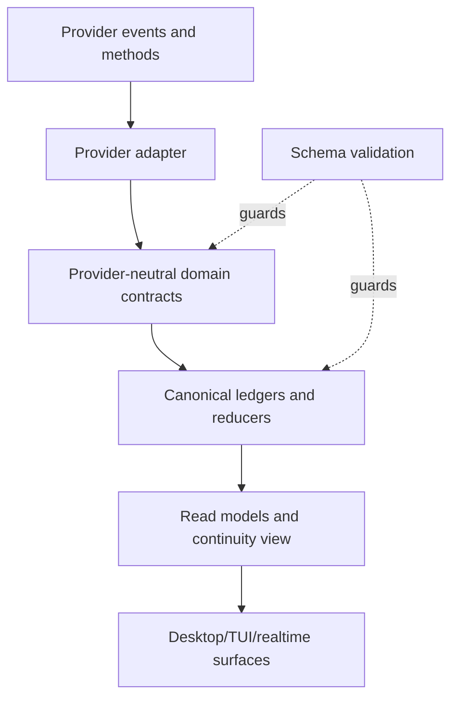

# Contracts

**Status: Draft specification.**
**Parent:** [Zyra Voice-Agent Architecture](README.md).

The contracts separate durable domain truth from provider protocols and UI presentation. Machine-readable definitions live under [`schemas/`](schemas/).

## Contract layers



1. **Provider wire contract** — versioned and adapter-specific.
2. **Domain contract** — foreground routes, tasks, context, approvals, narration, and usage.
3. **Persistence contract** — immutable events plus reduced snapshots.
4. **Presentation contract** — surface-specific projection with stable semantic IDs.

A provider payload MUST NOT be persisted as domain truth without normalization. Raw payloads MAY be retained as bounded diagnostic evidence under privacy policy.

## Identity graph

| ID | Lifetime | Rule |
|---|---|---|
| `conversation_id` | Canonical chat | Stable across Desktop, TUI, text, image, and voice sessions |
| `message_id` | Canonical user/assistant message | Idempotent across retries and replay |
| `foreground_route_id` | One committed Chat or Voice ownership epoch | Exactly one active route per conversation; response authority only |
| `owner_claim_id` | One route-bound response claim | Required for canonical assistant commit; grants no execution capability |
| `realtime_provider_thread_id` | Provider thread carrying one or more physical foreground sessions | Mapped to a canonical conversation; remains non-canonical |
| `realtime_session_id` | One physical provider session | Disposable; never used as conversation identity |
| `task_id` | Durable user intent | Stable across execution retries |
| `primary_agent_run_id` | Logical private primary worker/session lineage | Stable when the provider/runtime resumes it across attempts |
| `attempt_id` | One acquired primary execution-slot period | New on retry, recovery, or resume after a durable park |
| `primary_provider_session_id` | Private provider/Pi task session | Evidence provenance only; never a canonical conversation thread |
| `agent_run_id` | One fleet worker lineage | Linked to a task; current Zyra may retain it across new attempt IDs |
| `event_id` | One immutable event | Globally unique and idempotent |
| `decision_request_id` | One meaningful choice | Resolution immutable; supersession is explicit |
| `approval_request_id` | One scoped permission request | Cannot be reused for a wider action |
| `capability_lease_id` | One exact authority lineage | Status/action-count changes append revisions; never a bearer token |
| `operation_id` | One idempotent side-effect intent | Stable from intent through receipt/unknown outcome |
| `narration_id` | One safe narration instruction | Stable across queueing/coalescing policy |
| `delivery_id` | One narration delivery lineage | Stable across prepared/requested/terminal revisions |
| `context_version` | Conversation/task steering revision | Monotonic within a conversation |
| `packet_id` | One delegation/resume materialization | Includes source watermarks |

The canonical conversation maps to one active foreground route and a history of Chat/Voice route epochs. Each Voice route binds exactly one physical realtime session generation; a provider thread MAY span a sequence of fresh Voice route epochs, while each durable task maps to a primary lineage and one or more attempts. Provider threads never substitute for `conversation_id`. Strong output is canonical only while bound to an active Chat owner claim; under Voice it remains private/task evidence. Realtime output is canonical only while bound to the active Voice claim. Every assistant message still commits idempotently through the conversation gateway.

For every append-only revisioned record, the controller enforces same-record identity, `revision = previous_revision + 1` where that field is present (task snapshots use event `task_revision`), compare-and-swap against the current revision, nondecreasing timestamps, and immutable prior bytes. A concurrent losing proposal is rejected/rebased; it never creates a fork under the same ID.

## Foreground route

[`foreground-route.schema.json`](schemas/foreground-route.schema.json) defines append-only revisions for exclusive response ownership. A committed route records conversation, monotonic route epoch, `chat` or `voice` surface, response owner, non-authorizing owner claim, context version, an immutable activation-time task snapshot, predecessor/successor, timestamps, and physical realtime identity when Voice owns the route.

The controller enforces:

- exactly one active route for every non-deleted conversation before input or output is accepted;
- monotonically increasing route epochs for new route IDs;
- revision 1 begins `active`; at most one revision 2 terminates it as `superseded`, `released`, or `failed`;
- terminal route IDs and owner claims can never reactivate or receive further revisions;
- runtime recovery supersedes the replayed pre-crash route with a fresh Chat route using `activation_reason: recovery` before accepting input or output;
- route epoch 1 is Chat with `conversation_open` or `migration` and no predecessor;
- `start_voice` permits Chat → Voice, `replace_voice_session` permits Voice → Voice, and `exit_voice` permits Voice → Chat;
- `voice_preparation_failed` and `recovery` permit only a fresh Chat route; `recovery` can never activate Voice;
- every epoch after 1 names the immediately preceding route, whose terminal revision names it back in the same transaction;
- the predecessor’s `terminal_at` equals the successor’s `created_at`; ownership intervals are half-open `[created_at, terminal_at)`, so no commit belongs to both routes at the handoff instant;
- contiguous revisions and immutable route identity fields;
- Chat implies `strong_primary` with no realtime session;
- Voice implies `realtime_foreground` with exact physical session generation;
- superseding the old route and activating the new route in one transaction;
- gateway rejection when route ID, epoch, owner claim, provider item, or physical generation is stale;
- no mutation of task attempt, slot, locks, leases, or cancellation merely because the route changes.

A route claim is not a capability lease. It permits response production and canonical commit only.

### Legacy canonical-message binding

[`legacy-message-route-binding.schema.json`](schemas/legacy-message-route-binding.schema.json) migrates messages created before foreground routing without rewriting canonical JSONL. A migration transaction creates an initial epoch-1 Chat route with `activation_reason: migration`, verifies each original record by stable message ID, source sequence, timestamp, and SHA-256, and stores one binding under a shared manifest hash. Assistant bindings include a deterministic migration receipt proving pre-existence in canonical storage; the receipt grants no claim about a historical provider route. Missing or unverifiable records fail closed and cannot enter resume v2.

## Task snapshot

[`task.schema.json`](schemas/task.schema.json) defines the reduced view. Required invariants:

- `verbatim_request` is immutable after creation. Corrections are context revisions and relevant verbatim turns.
- `revision` advances once per accepted task event and is the compare-and-swap guard;
- state changes only through valid task events;
- `required_context_version` never decreases;
- `context_acknowledgements` contains at most one latest snapshot per `{owner_kind, owner_id}` and tracks each primary/subagent owner independently;
- completion includes evidence for every unwaived acceptance criterion;
- a primary run belongs to only one active attempt, and a conversation holds only one active primary-slot lease;
- terminal/waiting/paused/verifying tasks have no current attempt;
- terminal tasks have no active capability leases;
- `terminal_at` exists only for terminal records.

## Execution attempt

[`execution-attempt.schema.json`](schemas/execution-attempt.schema.json) defines the reduced view of one primary-slot ownership period. [`attempt-event.schema.json`](schemas/attempt-event.schema.json) is its append-only transition/authority log; every event includes the resulting validated snapshot for deterministic replay. The reducer also enforces envelope/snapshot ID equality, legal `previous_state → resulting_state`, ordinal monotonicity, and unchanged state for authority/checkpoint-only events. A stable `primary_agent_run_id` MAY span multiple attempts; every retry, recovery after interruption, or resume from `parked` receives a new `attempt_id`.

After in-flight operations are quiescent, one controller transaction commits the terminal/`parked` attempt snapshot, slot-release receipt, cleared writer locks, and revoked/released capability leases together. Neither released authority with a nonterminal attempt nor a terminal/`parked` attempt without its release receipt is valid. Parking and completion also require a durable checkpoint. A task-state transition cannot substitute for this atomic receipt set.

## Operation intent and receipt

[`operation-intent.schema.json`](schemas/operation-intent.schema.json) defines append-only revisions of one idempotent side-effect operation from durable intent through dispatch and terminal receipt. Task execution requires task/attempt IDs and leaves foreground fields null. A conversation-level canonical message commit may leave task/attempt null and instead MUST bind conversation, deterministic message ID, active foreground route/epoch, and owner claim. Speech transport uses the dedicated narration-delivery state machine. Protected operations reference the exact capability lease/action hash. `outcome_unknown` requires proof that dispatch began, a terminal uncertainty reason, and no fabricated receipt; consequential or irreversible unknown outcomes cannot be replayed automatically.

The controller transaction reserves any lease action count and writes the intent plus encrypted protected outbox payload/digest before dispatch. Only the trusted adapter resolves `protected_payload_ref`; models, renderers, narration, and logs receive the redacted summary. A receipt records observed outcome and a bounded result reference, never raw credentials or unrestricted command output.

## Completion candidate

[`completion-candidate.schema.json`](schemas/completion-candidate.schema.json) is the primary’s immutable verification submission: criterion-level evidence, changed artifacts, tests, assumptions, fallbacks, gaps, per-owner context acknowledgements, cleanup/worktrees, and suggested summaries. `task.verification_started` references the durably stored candidate; the controller independently validates it before a terminal `task.completed` event.

## Event envelope

[`task-event.schema.json`](schemas/task-event.schema.json) defines the append-only envelope:

```json
{
  "schema_version": 1,
  "event_id": "evt_01",
  "transaction_id": "tx_42",
  "sequence": 42,
  "task_revision": 9,
  "conversation_id": "chat_01",
  "task_id": "task_01",
  "context_version": 7,
  "event_type": "task.progressed",
  "actor": { "role": "primary", "id": "agent_run_01" },
  "attempt_id": "attempt_01",
  "agent_run_id": "agent_run_01",
  "idempotency_key": "task_01:attempt_01:progress:tests",
  "occurred_at": "2026-08-02T12:00:00Z",
  "payload": {
    "kind": "testing",
    "summary": "The focused contract suite passed.",
    "speakable": false
  }
}
```

Reducers MUST:

- reject unsupported schema versions;
- ignore duplicate event IDs;
- detect sequence gaps and stop projection until repaired;
- validate legal state transitions;
- reject unknown events from a live current-version producer before append; when recovery/import encounters an already durable unknown event or version, preserve its raw bytes, stop projection before it, and mark projector health `needs_upgrade` and hold the affected task read-only; never skip it or infer later state;
- append event, update snapshot/watermarks, and enqueue side-effect intent in one `controller.sqlite` transaction;
- stop and restore from the last valid transaction on integrity, checksum, or migration failure.

## Context revision

[`context-revision.schema.json`](schemas/context-revision.schema.json) records immutable changes. A revision is applied only when its `parent_version` matches the current version. Concurrent proposals are rebased by the controller into a new ordered revision.

A context change has stable provenance and explicit propagation. Removing a constraint records a tombstone change; history is never rewritten.

## Decision request

[`decision-request.schema.json`](schemas/decision-request.schema.json) captures append-only revisions of a product or scope choice. Every request includes:

- why the user is needed;
- two to five concrete options;
- consequences for each option;
- an optional recommendation and rationale;
- current involvement mode;
- a single immutable resolution or explicit supersession.

A child agent cannot create a user-facing decision directly. It reports uncertainty to the primary, which may submit a candidate to the controller.

## Approval request

[`approval-request.schema.json`](schemas/approval-request.schema.json) captures append-only request/resolution revisions for one exact capability/action scope. Approval records are independent from context preferences.

An accepted approval issues a separate [`capability-lease.schema.json`](schemas/capability-lease.schema.json) record whose status/action-count changes append new revisions. For a request created at relevant context N, the controller reads current conversation context M (M ≥ N) and checks every intervening revision. Any relevant change expires the request and requires a newly hashed request; unrelated revisions allow resolution. One controller transaction then records the challenge-bound request revision, trusted challenge receipt, immutable resolution, `approval.reference.updated` revision M+1, queued task/new attempt, and lease bound to that attempt and M+1; crash recovery sees all or none. `action_hash` is lowercase SHA-256 over [RFC 8785](https://www.rfc-editor.org/rfc/rfc8785) canonical JSON containing exactly `{action, capability, preconditions, scope}`; the gate recomputes it rather than trusting model input.

A lease MUST bind:

- task, authorized attempt, and issued context version;
- action/capability and a stable exact-action hash;
- target and scope;
- expiry;
- `once` or `session` grant mode (`once` fixes `max_actions` to 1);
- durable active/consumed/expired/revoked status;
- maximum action count and current use count.

The permission gate enforces `actions_used <= max_actions`. A broader action, changed hash/precondition, newer relevant context, expiry, or attempt park/release revokes the lease and requires a new request when authority is still needed.

## Delegation packet

[`delegation-packet.schema.json`](schemas/delegation-packet.schema.json) is immutable after an attempt starts. Steering arrives as context deltas referencing later versions.

The primary MUST acknowledge the packet’s context version before mutating state. The controller MUST reject a malformed packet before provider submission.

## Resume packet and delta

[`resume-packet.schema.json`](schemas/resume-packet.schema.json) is a replaceable materialized view. Its identity includes all source watermarks, safety state, integrity metadata, and byte budget. Pending choices preserve exact decision options or exact approval action/hash/scope rather than free-form summaries. Critical records cannot be truncated. It is safe to regenerate and unsafe to treat as canonical history.

The packet includes the exact active foreground route and its watermark as nontruncatable state. At most one active task can be `running`; that task’s attempt, the primary-slot owner, and any writer lock must agree. Every recent message retains modality and route identity; each assistant message also names the canonical commit receipt proving route-valid delivery. It excludes completed tasks unless they remain part of current focus or a recent unresolved reference. Typed retrieval references preserve access to noncritical omitted history.

[`resume-delta.schema.json`](schemas/resume-delta.schema.json) carries complete typed records between packet and current watermarks. It is transactional, hash-checked, ordered, and never truncated; gaps and unsupported records force a fresh packet. A changed primary slot, writer lock, or lease set is rejected unless same-conversation task/attempt/lease identities, resulting statuses, and watermarks match in the same delta; an unrelated valid record grants no hydration authority. A slot handoff delta includes the old attempt’s complete slot/lock/lease release before the new attempt’s acquisition; watermark increments equal the included authority-record counts. Terminal lease revisions must continue the exact prior lease identity before their IDs leave the active set.

## Narration item

[`narration-item.schema.json`](schemas/narration-item.schema.json) is the only task-event path into explicit speech. It carries safe facts, priority, timing policy, dedupe key, and expiry.

A suggested utterance is a hint. The foreground can phrase it naturally but cannot add unsupported facts. `contains_sensitive_detail` is required and fixed to `false`; every non-silent item requires at least one approved safe fact. A redaction failure blocks speech.

[`narration-delivery.schema.json`](schemas/narration-delivery.schema.json) records append-only delivery revisions with explicit predecessor status, terminal finality, and the Voice route/epoch/owner claim that was active during delivery, preparation, physical session generation, speech request/provider item identity, idempotent canonical message ID, playback/interruption, terminal status, and watermark sequence. Speech with unknown crash outcome is never replayed automatically.

## Usage snapshot

[`usage-snapshot.schema.json`](schemas/usage-snapshot.schema.json) enforces two top-level meters:

- `voice` — physical realtime usage/allowance;
- `agent_work` — strong model and subagent work usage.

Every value identifies whether it came from a provider or local estimate. UI code MUST NOT merge these into one percentage.

## Provider capabilities

[`provider-capabilities.schema.json`](schemas/provider-capabilities.schema.json) is refreshed independently for each realtime or strong-agent adapter at startup, expiry, and provider upgrades. One report has exactly one adapter role and cannot combine providers, credentials, versions, evidence, or expiry windows. `observed_at` must precede `expires_at`; capability evidence cannot be dated after observation, and routing rejects the report once expired. Routing depends on each capability’s explicit `supported`/`unsupported`/`unknown` state, stability, method, evidence, and verification time; `unknown` never acts as supported.

Capabilities are evidence, not configuration wishes. An unavailable capability selects a fallback route or blocks with an explicit reason.

## Provider-neutral interfaces

The following TypeScript-like interfaces describe the intended seams. They are illustrative; JSON Schemas remain the persisted wire definitions.

```ts
interface RealtimeForegroundAdapter {
  capabilities(): Promise<ProviderCapabilityReport>
  connect(input: {
    conversationId: string
    resumePacket: ResumePacket
    output: 'audio' | 'text'
    signal: AbortSignal
  }): Promise<RealtimeSessionHandle>
  appendContext(sessionId: string, delta: ResumeDelta): Promise<HydrationReceipt>
  requestSpeech(input: {
    sessionId: string
    item: NarrationItem
    preparedDelivery: NarrationDelivery
  }): Promise<SpeechSubmissionReceipt>
  close(sessionId: string, reason: string): Promise<SessionCloseReceipt>
  subscribe(listener: (event: RealtimeDomainEvent) => void): () => void
}

interface PrimaryAgentAdapter {
  capabilities(): Promise<ProviderCapabilityReport>
  respondDirect(input: {
    conversationId: string
    route: ForegroundRoute
    userMessageId: string
    signal: AbortSignal
  }): Promise<DirectTurnHandle>
  start(packet: DelegationPacket, signal: AbortSignal): Promise<AttemptHandle>
  steer(attemptId: string, revision: ContextRevision): Promise<OwnerContextAcknowledgement>
  pause(attemptId: string): Promise<ParkEvidence>
  cancel(attemptId: string, reason: string): Promise<CancellationEvidence>
  subscribe(listener: (event: PrimaryAgentEvent) => void): () => void
}

interface TaskController {
  activateForeground(input: ForegroundActivation): Promise<ForegroundRoute>
  releaseForeground(routeId: string, reason: string): Promise<ForegroundRoute>
  route(input: CanonicalUserInput): Promise<RouteDecision>
  proposeTask(input: TaskProposal): Promise<Task>
  applyTaskEvent(event: TaskEvent): Promise<Task>
  commitAttempt(input: AttemptTransitionProposal): Promise<ExecutionAttempt>
  recordOperation(input: OperationIntent): Promise<OperationIntent>
  resolveDecision(input: DecisionResolution): Promise<Task>
  resolveApproval(input: TrustedApprovalResolution): Promise<{ task: Task; lease: CapabilityLease | null }>
  cancel(taskId: string, reason: string): Promise<Task>
  snapshot(taskId: string): Task | null
}
```

## Realtime domain events

A provider adapter SHOULD normalize at least:

- `realtime.session.connecting`
- `realtime.session.ready`
- `realtime.session.closed`
- `realtime.session.error`
- `realtime.user.transcript.delta`
- `realtime.user.transcript.completed`
- `realtime.assistant.transcript.delta`
- `realtime.assistant.transcript.completed`
- `realtime.audio.started`
- `realtime.audio.stopped`
- `realtime.interrupted`
- `realtime.usage.updated`
- `realtime.context.applied`
- `realtime.speech.completed`

Every event carries session generation and provider item/turn identity when available. Consumers reject events from stale generations.

## Primary-agent events

A primary adapter normalizes provider-specific direct Chat and task events into:

- direct-turn text deltas/finals bound to foreground route and owner claim;
- structured tool/command/diff/test activity for redacted timeline projection;
- attempt start/heartbeat/finish;
- bounded progress;
- artifact/evidence attachment;
- decision candidate;
- approval request;
- blocker/failure;
- context acknowledgement;
- completion candidate;
- usage update.

Raw tool output remains in private records. Chat may render bounded, redacted structured activity inline; neither raw output nor activity rows become canonical assistant prose or TTS.

## Compatibility policy

- Persisted schema changes follow [`schemas/README.md`](schemas/README.md). This foreground-routing revision introduces operation-intent, narration-delivery, resume, and provider-report version 2; v1 records follow the documented migration/discard rules rather than being validated as v2.
- Adapter protocol versions are independent from domain schema versions.
- Experimental provider fields remain inside adapter modules.
- A startup compatibility check fails closed when a required method or event is absent.
- An older UI MAY show a generic card for a server-normalized presentation event the server already understands. An unknown canonical controller event is never ignored: server projection stops and the affected task remains read-only.

## Examples

Validated records are available under [`examples/`](examples/). They use fictional IDs and paths and contain no credentials or private data.
