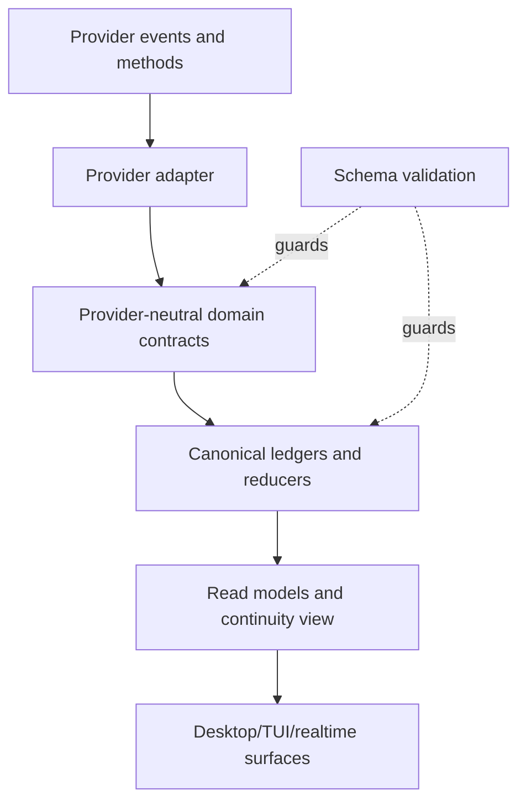

# Contracts

**Status: Draft specification.**
**Parent:** [Zyra Voice-Agent Architecture](README.md).

The contracts separate durable domain truth from provider protocols and UI presentation. Machine-readable definitions live under [`schemas/`](schemas/).

## Contract layers



1. **Provider wire contract** — versioned and adapter-specific.
2. **Domain contract** — foreground routes, tasks, context, approvals, narration, and usage.
3. **Persistence contract** — immutable events plus reduced snapshots.
4. **Presentation contract** — surface-specific projection with stable semantic IDs.

A provider payload MUST NOT be persisted as domain truth without normalization. Raw payloads MAY be retained as bounded diagnostic evidence under privacy policy.

## Identity graph

| ID | Lifetime | Rule |
|---|---|---|
| `conversation_id` | Canonical chat | Stable across Desktop, TUI, text, image, and voice sessions |
| `message_id` | Canonical user/assistant message | Idempotent across retries and replay |
| `foreground_route_id` | One committed Chat or Voice ownership epoch | Exactly one active route per conversation; response authority only |
| `owner_claim_id` | One route-bound response claim | Required for canonical assistant commit; grants no execution capability |
| `realtime_provider_thread_id` | Provider thread carrying one or more physical foreground sessions | Mapped to a canonical conversation; remains non-canonical |
| `realtime_session_id` | One physical provider session | Disposable; never used as conversation identity |
| `task_id` | Durable user intent | Stable across execution retries |
| `primary_agent_run_id` | Logical private primary worker/session lineage | Stable when the provider/runtime resumes it across attempts |
| `attempt_id` | One acquired primary execution-slot period | New on retry, recovery, or resume after a durable park |
| `primary_provider_session_id` | Private provider/Pi task session | Evidence provenance only; never a canonical conversation thread |
| `agent_run_id` | One fleet worker lineage | Linked to a task; current Zyra may retain it across new attempt IDs |
| `event_id` | One immutable event | Globally unique and idempotent |
| `decision_request_id` | One meaningful choice | Resolution immutable; supersession is explicit |
| `approval_request_id` | One scoped permission request | Cannot be reused for a wider action |
| `capability_lease_id` | One exact authority lineage | Status/action-count changes append revisions; never a bearer token |
| `operation_id` | One idempotent side-effect intent | Stable from intent through receipt/unknown outcome |
| `narration_id` | One safe narration instruction | Stable across queueing/coalescing policy |
| `delivery_id` | One narration delivery lineage | Stable across prepared/requested/terminal revisions |
| `context_version` | Conversation/task steering revision | Monotonic within a conversation |
| `packet_id` | One delegation/resume materialization | Includes source watermarks |
| `user_space_id` | One OS-user-owned Zyra data store/installation identity | Distinct from prompt profiles, provider accounts, projects, models, and interaction profiles |
| `relationship_id` | One Phase Two assistant relationship | Unique per user space initially; groups bound Home/thread references and preferences; grants no authority |
| `relationship_conversation_binding_id` | One append-only relationship membership lineage | Binds one canonical conversation role/source without granting retrieval |
| `work_thread_id` | One Phase Two substantial-work container | Maps to exactly one canonical conversation and never denotes a provider thread |
| `focus_generation` | One relationship-wide conversational scope epoch | Owned by a RelationshipFocusLease; stale generations reject output across clients |
| `attention_item_id` | One Phase Two attention lineage | References one canonical source condition; never resolves it by itself |
| `focus_visit_id` | One accepted purpose-bound work visit | Created only after acceptance/explicit open; stable across prepare, enter, resolve, acknowledge, and return revisions; pre-acceptance defer stays on AttentionItem |
| `relationship_receipt_id` | One compact Home controller activity receipt | Deterministic from source thread/visit/kind/revision; never a canonical assistant message |
| `consultation_id` | One bounded Phase Two strong consultation | Read-only, private, metered, and promotable with provenance |

The canonical conversation maps to one active foreground route and a history of Chat/Voice route epochs. Each Voice route binds exactly one immutable realtime scope binding and physical session generation. A provider thread MAY span replacement sessions/route epochs for the same canonical conversation, but it never rebinds to another conversation. Each durable task maps to one immutable `conversation_id`, a primary lineage, and one or more attempts. Provider threads never substitute for `conversation_id`. Strong output is canonical only while bound to an active Chat owner claim; under Voice it remains private/task evidence. Realtime output is canonical only while bound to the active Voice claim. Every assistant message still commits idempotently through the conversation gateway.

For every append-only revisioned record, the controller enforces same-record identity, `revision = previous_revision + 1` where that field is present (task snapshots use event `task_revision`), compare-and-swap against the current revision, nondecreasing timestamps, and immutable prior bytes. A concurrent losing proposal is rejected/rebased; it never creates a fork under the same ID.

## Phase Two proposed contracts

Phase Two machine-readable schemas are introduced only after Phase One release gates pass. Until then, [Phase Two — relationship-first interaction](relationship-first-interaction.md#proposed-controller-records) defines their required semantics and prevents Phase One schemas from being overloaded prematurely.

The following is the authoritative Phase Two persisted-contract inventory; roadmap and schema guidance must mirror it exactly:

- `UserSpace` — random stable ID for one owner-ACL-protected local Zyra store, store generation/import lineage, lifecycle, and timestamps; never derived from prompt profiles or provider accounts;
- `InteractionProfilePreference` — milestone-9 user-space requested/active profile, revision, compatibility/activation status, source, and timestamps; pure V1 predates/needs no record, while persisted V1 needs no relationship;
- `AssistantRelationship` — unique user-space mapping, Home conversation ID/generation, active profile-preference/relationship/policy revisions, lifecycle, and timestamps;
- `RelationshipConversationBinding` — relationship/conversation role, optional thread/folder/project, source/catalog manifest, status, and timestamps; canonical membership source with no retrieval authority;
- `ConversationCreationIntent`/`ConversationCreationReceipt` — deterministic conversation/initial-Chat-route IDs, role/idempotency/controller heads, durably flushed canonical header/path hash, and activation status;
- `WorkThreadCreationIntent` — relationship/origin/folder/objective, optional promotion-source task and expected authority-release heads, status, and activation receipt;
- `HomeResetIntent`/`HomeResetReceipt` — trusted-control confirmation with disclosed old/new IDs, `archive` disposition and retention setting, fenced Home generation, expected relationship/Chat-route/focus/visit/operation/relationship-receipt/narration-delivery heads and physical-Realtime absence, writer-fence token, drained operation/receipt/narration watermarks, generation-unassigned post-fence receipt intents, replacement conversation receipt, activation/abort result, and timestamps;
- `RelationshipFocusLease` — relationship, active/parked/retired lifecycle, optional owner attachment, lease revision/heartbeat/expiry/takeover state, monotonic focus generation, exact current conversation/thread/task, route/epoch, and realtime scope binding required only while Voice-focused/null for Chat/parked/retired;
- `FocusTakeoverRequest`/`FocusTakeoverReceipt` — requester/current owner, observed lease head, target/reason/expiry, yield/disconnect policy evidence, winner/loser, quiescence, new generation/route, and timestamp;
- `ProfileSwitchReceipt` — old/new interaction profile, selected source conversation, route/focus heads, quiescence proof, Voice conversion/fallback outcome, and committed timestamp;
- `RelationshipCascadeManifest`/`RelationshipCascadeReceipt` — exact organization/content scope, ordered source IDs, precondition heads, per-source attention/visit closure and deletion/tombstone outcome, external failures, and resumable watermark;
- `WorkThread` — relationship, distinct canonical conversation, origin message/scope, optional folder/project, objective, task IDs, related sibling links, and projection inputs;
- `TaskContinuation` — immutable original/successor task IDs, revisions, conversation IDs, reason/work thread, transaction, checkpoint/operation heads, authority-release receipts, and timestamps; separate from Phase One task schemas;
- `KickoffRequest` — work thread/conversation, source message, missing brief fields, exact question, deterministic action ID per request revision, source watermark, status, canonical reply commit receipt, immutable resolution/supersession, and timestamps; V1 receives that identity in a normalized pending-question activity;
- `AttentionItem` — exact source ID/type/revision/watermark, context/policy/focus revisions, kind, facts, question, options/recommendation, required answer, priority, lifecycle, snooze/expiry, source-unavailable tombstone, and resume action;
- `FocusVisit` — immutable source and selected `chat`/`voice` modalities plus required fallback-consent identity when they differ, source/target focus lease and route identities, item/source revisions, return anchor, hydration watermarks, target realtime scope binding required only for Voice/null for Chat, exact persisted state enum, separate resolution/return-transport outcomes, answer/context revision, independent acknowledgement/return deadlines, acknowledgement result, and terminal recovery status;
- `RelationshipReceipt` — deterministic append-only controller activity ID/revision, Home projection target, source provenance/watermark/deletion state, and redacted verified summary; never a canonical assistant message;
- `StrongConsultation` — exact request, scoped inputs/retrieval provenance, hard budget, read-only result/uncertainty, usage reservation/receipt, and optional promotion reference;
- `ContextRetrievalAuthorization` — requester task/attempt/owner, purpose/query class, allowed source IDs/data classes, policy/context revisions, redaction/size limits, expiry, and use budget;
- `ContextAccessReceipt` — authorization, requested/returned/denied source IDs/watermarks, redaction decision, hashes, outcome, and timestamp;
- `ContextEscalation` — worker/task/thread identity, missing-information shape, authorization/access receipts, found provenance or conflict, resulting context revision or AttentionItem;
- `RelationshipBudget` and `UsageReservation` — provider/account meter, concurrency/usage policy, revision/window, atomic reservations, provider reconciliation, and conservative unknown/exhausted behavior.

`FocusVisit.state` is exactly `preparing | active | resolving | resolution_committed | return_preparing | returning | returning_degraded | returned_pending_ack | returned_acknowledged | returned_blocked | returned | preparation_failed`. Attention deferral is not a visit state. `resolution_outcome` and `return_transport_outcome` are orthogonal fields.

Required cross-record invariants:

1. every relationship Home/thread/Inbox/active-strip/receipt/task-source reference resolves through one current RelationshipConversationBinding; verified ambiguous backing conversations use `ordinary_reference`, while missing/unverifiable sources are excluded and block V2 activation when running/actionable. Membership never authorizes retrieval or execution, and every cross-thread read has exact authorization/access receipt;
2. Home and every work thread retain distinct `conversation_id` values; every task retains its creation conversation forever;
3. one nonretired relationship has one current active-or-parked focus snapshot and at most one active lease owner; exactly one fresh owner/generation is required for an accepted relationship turn, while detached state is parked and silent. Multi-client takeover quiesces/terminalizes the old attachment/session and activates the new owner/generation in one CAS transaction with explicit winner/loser receipts; old generations reject all relationship interaction; `retired` is terminal and can only be followed by fresh relationship bootstrap with a new ID;
4. Chat focus changes advance only relationship focus while validating unchanged Chat route heads and carrying no realtime binding; Voice focus changes compose exact per-conversation route transitions plus an immutable provider-thread binding. Neither transfers task leases, locks, approvals, or operations;
5. one source revision creates one attention lineage; resolution validates current item/source/context/focus revisions atomically;
6. routine completion enters Completed directly; Needs you contains only actionable input/review;
7. Inbox/active strip/thread status/relationship receipts are controller projections over canonical records, not assistant messages;
8. one detailed visit transcript remains in its target conversation while Home receives at most one activity receipt lineage per source/kind revision;
9. a resolved Chat visit CASes focus back while validating unchanged Chat route heads and restores its anchor (safe degraded Chat if hydration fails); a Voice visit returns by an independent deadline with safe Chat/degraded-Voice fallback; pending acknowledgement has one later acknowledged/blocker terminal revision;
10. a hidden consultation has no mutation capability; crossing budget returns exact `promotion_required` evidence, and the controller launches work only when the original request satisfies explicit substantial-work policy or the user accepts one Ask;
11. consultations, coordinator work, and new thread attempts reserve relationship usage/concurrency atomically before dispatch;
12. profile switching cannot alter canonical messages, task/attempt state, authority, retention, or V1 visibility of unresolved source items; it commits at a quiescent boundary, safely closes any visit, parks/claims relationship focus, and either explicitly converts same-conversation Voice binding or falls back to fresh Chat before the new profile renders;
13. active Home deletion is rejected. Reset is confirmed only by trusted non-speech control after active/preparing Voice returns to a fresh quiescent Chat route and physical Realtime closes. It CAS-installs a generation-bound writer fence after validating requester-owned Home focus and relationship/Chat-route/focus/visit/operation/receipt/narration heads; conversation, narration, focus, takeover/profile/visit, and activity-projection gateways then reject new generation-bound Home mutation. Pre-fence operations/receipts/NarrationDelivery drain exactly, uncertain speech becomes nonreplayable `outcome_unknown`, post-fence receipts wait generation-unassigned, and narration candidates remain undelivered source events. Final activation revalidates the fence token plus unchanged/drained heads before atomically switching Home/route/focus generations and assigning pending receipts to the new generation (or the retained old generation on abort); pre-fence receipts never copy. Reset defaults to archived/searchable old Home under its existing retention policy and never claims erasure; erasing it requires a separate post-activation trusted content cascade. Recovery resumes the same fenced intent or aborts by retaining the old generation, superseding its fenced route with fresh Chat, and releasing the fence; it never copies messages or accepts an indeterminate generation;
14. the gateway first durably flushes/receipts the deterministic intended conversation ID/header; one later controller transaction appends its epoch-1 Chat route plus Home/work-thread metadata, bindings, tasks, and activity receipts; until then the header is non-listable/non-attachable `pending_activation`, and crash recovery reconciles the same intent without dispatching an orphan;
15. deleting/redacting/withdrawing an attention source terminalizes its open item as `source_unavailable`, removes Needs-you actionability, safely closes/returns any visit, and retains only a non-opening minimal provenance tombstone; stale answers reject;
16. default `ask_if_ambiguous` launch policy permits automatic thread launch only for explicit substantial-work intent; discussion/ideas remain conversational and proactive offers are natural-pause/actionable-only. Focus entry always has explicit acceptance/command, never starts Realtime from Chat, and changes Voice → Chat only after a separate fallback choice; decline creates no visit and leaves attention pending;
17. pure pre-milestone-9 V1 is implicit `conversation_scoped` and requires neither preference nor relationship record; milestone-9 persisted V1 preference/activation requires no AssistantRelationship; requested and active profile are distinct, V2 becomes active only in the compatible relationship/route/focus switch transaction, and interruption leaves the prior profile active;
18. V2 disablement deletes nothing; trusted-control relationship-organization removal terminalizes bindings/projections but preserves canonical sources, while content deletion requires a trusted-control explicit ordered per-source cascade that closes dependent attention/visits before each source tombstone;
19. each V1 pending-question action binds one KickoffRequest ID/revision/source watermark; resolution requires its exact action plus canonical user-message commit receipt, replay is idempotent, and stale/unbound replies resolve nothing else;
20. one TaskContinuation transaction binds an original terminal `promoted_to_work_thread` cancellation to exactly one successor whose `supersedes_task_id` names it, after original authority release; Phase One task schemas remain unchanged;
21. proposing/offering a visit performs no target retrieval, hydration, or provider allocation. Exact acceptance first CAS-creates `FocusVisit.state = preparing`; only that accepted visit ID may authorize bounded target preparation, and preparation still grants no focus authority.

## Foreground route

[`foreground-route.schema.json`](schemas/foreground-route.schema.json) defines append-only revisions for exclusive response ownership. A committed route records conversation, monotonic route epoch, `chat` or `voice` surface, response owner, non-authorizing owner claim, context version, an immutable activation-time task snapshot, predecessor/successor, timestamps, and physical realtime identity when Voice owns the route.

The controller enforces:

- exactly one active route for every non-deleted conversation before input or output is accepted;
- monotonically increasing route epochs for new route IDs;
- revision 1 begins `active`; at most one revision 2 terminates it as `superseded`, `released`, or `failed`;
- terminal route IDs and owner claims can never reactivate or receive further revisions;
- runtime recovery supersedes the replayed pre-crash route with a fresh Chat route using `activation_reason: recovery` before accepting input or output;
- route epoch 1 is Chat with `conversation_open` or `migration` and no predecessor;
- `start_voice` permits Chat → Voice, `replace_voice_session` permits Voice → Voice, and `exit_voice` permits Voice → Chat;
- `voice_preparation_failed` and `recovery` permit only a fresh Chat route; `recovery` can never activate Voice;
- every epoch after 1 names the immediately preceding route, whose terminal revision names it back in the same transaction;
- the predecessor’s `terminal_at` equals the successor’s `created_at`; ownership intervals are half-open `[created_at, terminal_at)`, so canonical-message intent, dispatch, terminal result, and receipt observation must all precede `terminal_at`, and no commit belongs to both routes at the handoff instant;
- contiguous revisions and immutable route identity fields; the canonical head is the highest valid revision, never whichever record happens to arrive last;
- Chat implies `strong_primary` with no realtime session;
- Voice implies `realtime_foreground` with exact physical session generation;
- superseding the old route and activating the new route in one transaction;
- gateway rejection when route ID, epoch, owner claim, provider item, or physical generation is stale;
- no mutation of task attempt, slot, locks, leases, or cancellation merely because the route changes.

A route claim is not a capability lease. It permits response production and canonical commit only.

### Legacy canonical-message binding

[`legacy-message-route-binding.schema.json`](schemas/legacy-message-route-binding.schema.json) migrates messages created before foreground routing without rewriting canonical JSONL. A migration transaction creates an initial epoch-1 Chat route with `activation_reason: migration`, verifies each original record by stable message ID, source sequence, timestamp, and SHA-256, and stores one binding under a shared manifest hash. Assistant bindings include a deterministic migration receipt proving pre-existence in canonical storage; the receipt grants no claim about a historical provider route. Missing or unverifiable records fail closed and cannot enter resume v3.

## Task snapshot

[`task.schema.json`](schemas/task.schema.json) defines the reduced view. Required invariants:

- `verbatim_request` is immutable after creation. Corrections are context revisions and relevant verbatim turns.
- `revision` advances once per accepted task event and is the compare-and-swap guard;
- state changes only through valid task events;
- `required_context_version` never decreases;
- `context_acknowledgements` contains at most one latest snapshot per `{owner_kind, owner_id}` and tracks each primary/subagent owner independently;
- completion includes evidence for every unwaived acceptance criterion;
- a primary run belongs to only one active attempt, and a conversation holds only one active primary-slot lease;
- terminal/waiting/paused/verifying tasks have no current attempt;
- terminal tasks have no active capability leases;
- `terminal_at` exists only for terminal records.

### Phase Two standalone-task continuation

Phase Two never changes a task’s `conversation_id` and does not add a forward-link field to the Phase One Task/TaskEvent schemas. The successor uses existing `supersedes_task_id`; a separate Phase Two `TaskContinuation` carries the immutable forward/audit link. Promotion is an atomic lineage transition, not reparenting:

1. quiesce/park any attempt and reconcile operations, leaving the original safely nonterminal;
2. append a deterministic WorkThread/ConversationCreationIntent and obtain the durably flushed target ConversationCreationReceipt;
3. in one controller transaction validate the receipt, activate the relationship binding/thread metadata, commit original task cancellation using existing reason `promoted_to_work_thread`, create the successor whose existing `supersedes_task_id` names the original, and append `TaskContinuation` with both task/revision/conversation IDs, checkpoint/operation heads, and release receipts;
4. re-evaluate every protected action for the successor; old capability leases never transfer;
5. dispatch the successor only after that activation/release transaction commits.

If safe release, target conversation creation, or unknown-operation reconciliation cannot be proven, promotion is rejected and the original task remains visible in its safe parked/nonterminal state. The product can present one seamless promotion while audit/details preserve both IDs.

## Execution attempt

[`execution-attempt.schema.json`](schemas/execution-attempt.schema.json) defines the reduced view of one primary-slot ownership period. [`attempt-event.schema.json`](schemas/attempt-event.schema.json) is its append-only transition/authority log; every event includes the resulting validated snapshot for deterministic replay. The reducer also enforces envelope/snapshot ID equality, legal `previous_state → resulting_state`, ordinal monotonicity, and unchanged state for authority/checkpoint-only events. A stable `primary_agent_run_id` MAY span multiple attempts; every retry, recovery after interruption, or resume from `parked` receives a new `attempt_id`.

After in-flight operations are quiescent, one controller transaction commits the terminal/`parked` attempt snapshot, slot-release receipt, cleared writer locks, and revoked/released capability leases together. Neither released authority with a nonterminal attempt nor a terminal/`parked` attempt without its release receipt is valid. Parking and completion also require a durable checkpoint. A task-state transition cannot substitute for this atomic receipt set.

## Operation intent and receipt

[`operation-intent.schema.json`](schemas/operation-intent.schema.json) defines append-only revisions of one idempotent side-effect operation from durable intent through dispatch and terminal receipt. Task execution requires task/attempt IDs and leaves foreground fields null. A conversation-level canonical message commit may leave task/attempt null and instead MUST bind conversation, deterministic message ID, active foreground route/epoch, and owner claim. Speech transport uses the dedicated narration-delivery state machine. Protected operations reference the exact capability lease/action hash. `outcome_unknown` requires proof that dispatch began, a terminal uncertainty reason, and no fabricated receipt; consequential or irreversible unknown outcomes cannot be replayed automatically.

The controller transaction reserves any lease action count and writes the intent plus encrypted protected outbox payload/digest before dispatch. Only the trusted adapter resolves `protected_payload_ref`; models, renderers, narration, and logs receive the redacted summary. A receipt records observed outcome and a bounded result reference, never raw credentials or unrestricted command output.

## Completion candidate

[`completion-candidate.schema.json`](schemas/completion-candidate.schema.json) is the primary’s immutable verification submission: criterion-level evidence, changed artifacts, tests, assumptions, fallbacks, gaps, per-owner context acknowledgements, cleanup/worktrees, and suggested summaries. `task.verification_started` references the durably stored candidate; the controller independently validates it before a terminal `task.completed` event.

## Event envelope

[`task-event.schema.json`](schemas/task-event.schema.json) defines the append-only envelope:

```json
{
  "schema_version": 1,
  "event_id": "evt_01",
  "transaction_id": "tx_42",
  "sequence": 42,
  "task_revision": 9,
  "conversation_id": "chat_01",
  "task_id": "task_01",
  "context_version": 7,
  "event_type": "task.progressed",
  "actor": { "role": "primary", "id": "agent_run_01" },
  "attempt_id": "attempt_01",
  "agent_run_id": "agent_run_01",
  "idempotency_key": "task_01:attempt_01:progress:tests",
  "occurred_at": "2026-08-02T12:00:00Z",
  "payload": {
    "kind": "testing",
    "summary": "The focused contract suite passed.",
    "speakable": false
  }
}
```

Reducers MUST:

- reject unsupported schema versions;
- ignore duplicate event IDs;
- detect sequence gaps and stop projection until repaired;
- validate legal state transitions;
- reject unknown events from a live current-version producer before append; when recovery/import encounters an already durable unknown event or version, preserve its raw bytes, stop projection before it, and mark projector health `needs_upgrade` and hold the affected task read-only; never skip it or infer later state;
- append event, update snapshot/watermarks, and enqueue side-effect intent in one `controller.sqlite` transaction;
- stop and restore from the last valid transaction on integrity, checksum, or migration failure.

## Context revision

[`context-revision.schema.json`](schemas/context-revision.schema.json) records immutable changes. A revision is applied only when its `parent_version` matches the current version. Concurrent proposals are rebased by the controller into a new ordered revision.

A context change has stable provenance and explicit propagation. Removing a constraint records a tombstone change; history is never rewritten.

## Decision request

[`decision-request.schema.json`](schemas/decision-request.schema.json) captures append-only revisions of a product or scope choice. Every request includes:

- why the user is needed;
- two to five concrete options;
- consequences for each option;
- an optional recommendation and rationale;
- current involvement mode;
- a single immutable resolution or explicit supersession.

A child agent cannot create a user-facing decision directly. It reports uncertainty to the primary, which may submit a candidate to the controller.

## Approval request

[`approval-request.schema.json`](schemas/approval-request.schema.json) captures append-only request/resolution revisions for one exact capability/action scope. Approval records are independent from context preferences.

An accepted approval issues a separate [`capability-lease.schema.json`](schemas/capability-lease.schema.json) record whose status/action-count changes append new revisions. For a request created at relevant context N, the controller reads current conversation context M (M ≥ N) and checks every intervening revision. Any relevant change expires the request and requires a newly hashed request; unrelated revisions allow resolution. One controller transaction then records the challenge-bound request revision, trusted challenge receipt, immutable resolution, `approval.reference.updated` revision M+1, queued task/new attempt, and lease bound to that attempt and M+1; crash recovery sees all or none. `action_hash` is lowercase SHA-256 over [RFC 8785](https://www.rfc-editor.org/rfc/rfc8785) canonical JSON containing exactly `{action, capability, preconditions, scope}`; the gate recomputes it rather than trusting model input.

A lease MUST bind:

- task, authorized attempt, and issued context version;
- action/capability and a stable exact-action hash;
- target and scope;
- expiry;
- `once` or `session` grant mode (`once` fixes `max_actions` to 1);
- durable active/consumed/expired/revoked status;
- maximum action count and current use count.

The permission gate enforces `actions_used <= max_actions`. A broader action, changed hash/precondition, newer relevant context, expiry, or attempt park/release revokes the lease and requires a new request when authority is still needed.

## Delegation packet

[`delegation-packet.schema.json`](schemas/delegation-packet.schema.json) is immutable after an attempt starts. Steering arrives as context deltas referencing later versions.

The primary MUST acknowledge the packet’s context version before mutating state. The controller MUST reject a malformed packet before provider submission.

## Resume packet and delta

[`resume-packet.schema.json`](schemas/resume-packet.schema.json) is a replaceable materialized view. Its identity includes all source watermarks, safety state, integrity metadata, and byte budget. Pending choices preserve exact decision options or exact approval action/hash/scope rather than free-form summaries. Critical records cannot be truncated. It is safe to regenerate and unsafe to treat as canonical history.

The packet includes the exact active foreground route and its watermark as nontruncatable state. Every active task carries its canonical task revision/event-sequence head; when it has a current attempt, it also carries that attempt’s canonical state and latest event sequence. At most one active task can be `running`; that task’s attempt head, the primary-slot owner, and the exact writer-lock ID set must agree. The packet carries a complete operation revision index: one compact entry for every operation source sequence from 1 through its watermark. Each entry records operation ID, safe revision/status, complete immutable-identity SHA-256, idempotency key, canonical message identity, and assigned receipt. Terminal entries remain identity tombstones. `succeeded`, `failed`, and `cancelled` entries retain their assigned receipt ID; `outcome_unknown` retains null. Omitting a lower lineage creates a sequence gap and a cross-packet record cannot appear from nowhere, replace lineage identity, regress `dispatched` to `intended`, or reopen/reuse a terminal ID. The v3 index is capped at 256 and is critical: a delta whose resulting watermark would require entry 257 fails hydration closed until conversation deletion or a future authenticated compact-index schema replaces explicit entries. Every recent message retains its canonical conversation sequence, modality, and route identity; each assistant message also names the canonical commit receipt proving route-valid delivery. It excludes completed tasks unless they remain part of current focus or a recent unresolved reference. Typed retrieval references preserve access to noncritical omitted history.

[`resume-delta.schema.json`](schemas/resume-delta.schema.json) carries complete typed records between packet and current watermarks. It is transactional, verifies both packet and delta RFC 8785 SHA-256 values on every application, is ordered, and is never truncated; gaps and unsupported records force a fresh packet. A changed primary slot, writer-lock ID set, or lease set is rejected unless same-conversation task/attempt/lease identities, exact resulting lock IDs, resulting statuses, and watermarks match in the same delta; an unrelated valid record grants no hydration authority. A slot handoff delta includes the old attempt’s complete slot/lock/lease release before the new attempt’s acquisition. Task events likewise continue the packet task revision/state head, lie inside their task-watermark interval, and reduce through legal task transitions before authority is accepted. Task and attempt watermarks store each type’s latest global controller sequence. The union of included task/attempt events must cover every global controller sequence strictly after the packet high-watermark through the delta high-watermark without a gap, duplicate, or reorder; event IDs are globally unique across both task and attempt records. Each type’s final included event equals that type’s to watermark when it advances. Conversation, context, decision, approval, lease, operation, and narration watermark advances equal their included record counts, and every typed record carrying `conversation_id` must match the packet. Conversation messages cover each exact sequence and cannot reuse packet/delta message IDs. Decision, approval, lease, operation, and narration delta wrappers carry an exact per-stream `source_sequence` and a unique canonical `{record_id, revision}` key, so duplicate revisions cannot replace omitted records. Operation idempotency keys and canonical message IDs are immutable within one `operation_id` lineage, and a receipt ID becomes immutable once assigned. The reverse mappings also bind those natural identities to that one lineage, preventing replacement or relabeled aliases; context revisions also form an exact parent/version chain. A checkpoint watermark cannot advance until the delta contract carries a checkpoint record type. Coverage checks compare bounded included records against arithmetic sequence expectations; they never allocate memory proportional to an untrusted watermark gap. JSON-encoded versions, epochs, sequences, and watermarks are limited to `Number.MAX_SAFE_INTEGER` (`9,007,199,254,740,991`); larger counters require a future string/big-integer schema version and are rejected before arithmetic. The first event for an existing attempt continues the packet’s exact task, primary lineage, state, and sequence head; an existing `attempt_id` cannot move to another task or `primary_agent_run_id`. A previously unseen attempt begins with `attempt.created`. Attempt events are unique by event ID and idempotency key and reduce in increasing canonical sequence with legal state continuity and immutable lineage. Intermediate authority snapshots may differ. Task/attempt events sharing a controller transaction are applied as one contiguous atomic group; after every group, running-task/current-attempt/slot/lock/lease invariants must hold. Splitting attempt release from its task transition is rejected. The reducer also simulates slot ownership and lease issuance across every ordered record, rejecting even transient overlap or a lease issued to a temporary non-slot attempt. After all task and attempt streams reduce, at most one task is `running`. An acquired `starting` attempt matches its queued-or-running task/current lineage; an acquired `running` or `parking` attempt matches its running task/current lineage. Exactly that projected attempt may remain acquired; every non-slot attempt has empty writer-lock and capability-lease sets. The final slot owner’s snapshot must reproduce the complete writer-lock and capability-lease ID projections even when the submitted safety object is byte-identical to the prior packet. Every route-bound canonical-message operation carried by a delta is revalidated against its route’s half-open lifetime before its receipt can enter the projection. Terminal lease revisions must continue the exact prior lease identity before their IDs leave the active set.

## Narration item

[`narration-item.schema.json`](schemas/narration-item.schema.json) is the only task-event path into explicit speech. It carries safe facts, priority, timing policy, dedupe key, and expiry.

A suggested utterance is a hint. The foreground can phrase it naturally but cannot add unsupported facts. `contains_sensitive_detail` is required and fixed to `false`; every non-silent item requires at least one approved safe fact. A redaction failure blocks speech.

[`narration-delivery.schema.json`](schemas/narration-delivery.schema.json) records append-only delivery revisions with explicit predecessor status, terminal finality, and the Voice route/epoch/owner claim that was active during delivery, preparation, physical session generation, speech request/provider item identity, idempotent canonical message ID, playback/interruption, terminal status, and watermark sequence. Speech with unknown crash outcome is never replayed automatically.

## Usage snapshot

[`usage-snapshot.schema.json`](schemas/usage-snapshot.schema.json) enforces two top-level meters:

- `voice` — physical realtime usage/allowance;
- `agent_work` — strong model and subagent work usage.

Every value identifies whether it came from a provider or local estimate. UI code MUST NOT merge these into one percentage.

## Provider capabilities

[`provider-capabilities.schema.json`](schemas/provider-capabilities.schema.json) is refreshed independently for each realtime or strong-agent adapter at startup, expiry, and provider upgrades. One report has exactly one adapter role and cannot combine providers, credentials, versions, evidence, or expiry windows. `observed_at` must precede `expires_at`; capability evidence cannot be dated after observation, and routing rejects the report once expired. Routing depends on each capability’s explicit `supported`/`unsupported`/`unknown` state, stability, method, evidence, and verification time; `unknown` never acts as supported.

Capabilities are evidence, not configuration wishes. An unavailable capability selects a fallback route or blocks with an explicit reason.

## Provider-neutral interfaces

The following TypeScript-like interfaces describe the intended seams. They are illustrative; JSON Schemas remain the persisted wire definitions.

```ts
interface RealtimeForegroundAdapter {
  capabilities(): Promise<ProviderCapabilityReport>
  connect(input: {
    conversationId: string
    resumePacket: ResumePacket
    output: 'audio' | 'text'
    signal: AbortSignal
  }): Promise<RealtimeSessionHandle>
  appendContext(sessionId: string, delta: ResumeDelta): Promise<HydrationReceipt>
  requestSpeech(input: {
    sessionId: string
    item: NarrationItem
    preparedDelivery: NarrationDelivery
  }): Promise<SpeechSubmissionReceipt>
  close(sessionId: string, reason: string): Promise<SessionCloseReceipt>
  subscribe(listener: (event: RealtimeDomainEvent) => void): () => void
}

interface PrimaryAgentAdapter {
  capabilities(): Promise<ProviderCapabilityReport>
  respondDirect(input: {
    conversationId: string
    route: ForegroundRoute
    userMessageId: string
    signal: AbortSignal
  }): Promise<DirectTurnHandle>
  start(packet: DelegationPacket, signal: AbortSignal): Promise<AttemptHandle>
  steer(attemptId: string, revision: ContextRevision): Promise<OwnerContextAcknowledgement>
  pause(attemptId: string): Promise<ParkEvidence>
  cancel(attemptId: string, reason: string): Promise<CancellationEvidence>
  subscribe(listener: (event: PrimaryAgentEvent) => void): () => void
}

interface TaskController {
  activateForeground(input: ForegroundActivation): Promise<ForegroundRoute>
  releaseForeground(routeId: string, reason: string): Promise<ForegroundRoute>
  route(input: CanonicalUserInput): Promise<RouteDecision>
  proposeTask(input: TaskProposal): Promise<Task>
  applyTaskEvent(event: TaskEvent): Promise<Task>
  commitAttempt(input: AttemptTransitionProposal): Promise<ExecutionAttempt>
  recordOperation(input: OperationIntent): Promise<OperationIntent>
  resolveDecision(input: DecisionResolution): Promise<Task>
  resolveApproval(input: TrustedApprovalResolution): Promise<{ task: Task; lease: CapabilityLease | null }>
  cancel(taskId: string, reason: string): Promise<Task>
  snapshot(taskId: string): Task | null
}
```

Phase Two introduces additional interfaces behind feature flags:

```ts
interface CanonicalConversationProvisioner {
  fulfill(intent: ConversationCreationIntent, signal: AbortSignal): Promise<ConversationCreationReceipt>
  reconcile(intentId: string): Promise<ConversationCreationReceipt | ConversationCreationConflict>
  quarantine(conflictId: string, trustedAction: OrphanRecoveryAction): Promise<void>
}

interface RelationshipRegistry {
  bootstrap(input: RelationshipBootstrapRequest, expected: UserSpaceCas): Promise<AssistantRelationship>
  createWorkThread(input: WorkThreadCreationRequest, expected: RelationshipCreationCas): Promise<WorkThread>
  bindConversation(input: RelationshipConversationBindingProposal, expected: RelationshipBindingCas): Promise<RelationshipConversationBinding>
  switchProfile(input: InteractionProfileSwitch, expected: RelationshipRouteFocusCas): Promise<ProfileSwitchReceipt>
  removeOrganization(input: RelationshipRemovalRequest, expected: RelationshipCascadeCas, trusted: TrustedDeletionControl): Promise<RelationshipCascadeReceipt>
  deleteContainedContent(input: RelationshipContentCascadeRequest, trusted: TrustedDeletionControl): Promise<RelationshipCascadeReceipt>
}

interface RelationshipHost {
  currentFocusLease(relationshipId: string): RelationshipFocusLease
  requestTakeover(input: FocusTakeoverRequest): Promise<{ lease: RelationshipFocusLease; receipt: FocusTakeoverReceipt }>
  parkDetachedFocus(relationshipId: string, expected: FocusLeaseCas): Promise<RelationshipFocusLease>
  acceptVisit(input: FocusVisitProposal, acceptance: UserVisitAcceptance, expected: AttentionSourceCas): Promise<FocusVisit>
  prepareAcceptedVisit(visitId: string, expected: FocusLeaseCas, signal: AbortSignal): Promise<PreparedFocusVisit>
  enterPreparedVisit(preparedVisitId: string, expected: FocusLeaseCas): Promise<RelationshipFocusLease>
  resolveVisit(visitId: string, resolution: VisitResolution, expected: AttentionSourceCas): Promise<FocusVisit>
  returnFromVisit(visitId: string, expected: FocusLeaseCas): Promise<RelationshipFocusLease>
  resetHome(input: HomeResetRequest, expected: HomeResetCas): Promise<{ relationship: AssistantRelationship; receipt: HomeResetReceipt }>
}

interface StrongConsultationAdapter {
  consult(input: StrongConsultationRequest, signal: AbortSignal): Promise<StrongConsultationResult>
}

interface WorkCoordinator {
  routeSubstantialWork(input: SubstantialWorkProposal, reservation: UsageReservation): Promise<WorkThread>
  authorizeContext(input: ContextEscalationRequest): Promise<ContextRetrievalAuthorization>
  retrieveContext(authorization: ContextRetrievalAuthorization): Promise<{ resolution: ContextEscalationResolution; receipt: ContextAccessReceipt }>
  acknowledgeResolution(visitId: string, ownerAck: OwnerContextAcknowledgement): Promise<FocusVisit>
}

interface AttentionQueue {
  project(relationshipId: string): RelationshipInbox
  resolveKickoff(reply: KickoffReplyWithCanonicalCommitReceipt, expected: KickoffRequestActionCas): Promise<KickoffRequest>
  offerNext(input: AttentionOfferPolicy): Promise<AttentionItem | null>
  defer(itemId: string, instruction: DeferralInstruction, expected: AttentionSourceCas): Promise<AttentionItem>
}

interface RelationshipBudgetController {
  reserve(input: RelationshipUsageProposal, expectedBudgetRevision: number): Promise<UsageReservation>
  reconcile(reservationId: string, providerReceipt: ProviderUsageReceipt | null): Promise<RelationshipBudget>
}

interface RelationshipActivityStore {
  appendReceipt(receipt: RelationshipReceipt): Promise<RelationshipReceipt>
  projectHome(relationshipId: string, homeGeneration: number): RelationshipReceipt[]
}
```

Interface-only value contracts are strict, versioned DTOs/read models. They are not new persistence authorities; a persisted result is always one of the authoritative records above.

| Value contract | Required fields/meaning |
|---|---|
| `ConversationCreationConflict` | Intent/intended ID, observed path/header hash/size, reference status, conflict reason, inspection timestamp; grants no recovery action |
| `OrphanRecoveryAction` | Trusted-control receipt, conflict/intent ID, `quarantine` or proven-empty `remove`, expected observed hash, idempotency key |
| `RelationshipBootstrapRequest` / `UserSpaceCas` | User-space ID/store generation, requested profile, deterministic relationship/Home IDs, expected absence/current revisions, idempotency key |
| `WorkThreadCreationRequest` / `RelationshipCreationCas` | Verbatim origin/objective/folder, deterministic conversation/route/thread IDs, optional promotion source, expected relationship/binding/task/authority heads |
| `RelationshipConversationBindingProposal` / `RelationshipBindingCas` | Relationship/conversation/role/source/manifest plus expected relationship, binding-lineage, and catalog heads |
| `InteractionProfileSwitch` / `RelationshipRouteFocusCas` | Requested profile/source attachment, selected canonical conversation, expected preference/relationship/focus/route/visit heads, quiescence and Voice conversion/fallback choice |
| `RelationshipRemovalRequest` / `RelationshipContentCascadeRequest` / `RelationshipCascadeCas` | Organization-only or exact content scope, ordered source manifest/hash, expected retired/parked focus, binding/task/attention/visit/artifact heads, idempotency key |
| `TrustedDeletionControl` | Broker-owned non-speech control receipt binding exact organization-removal or content-cascade manifest hash/revision and one-use decision; no model/renderer bearer authority |
| `FocusLeaseCas` / `AttentionSourceCas` | Exact relationship/lease generation/owner and route heads; the latter also binds AttentionItem/source/context/policy revisions and watermarks |
| `FocusVisitProposal` | Exact item/source and source/target identities, proposed source/selected modality, optional fallback offer, and return-anchor request; it performs no target retrieval, hydration, or provider allocation |
| `UserVisitAcceptance` | Explicit action/proposal/item revision plus selected modality and fallback-consent ID when different; its CAS commit creates the durable `preparing` FocusVisit before preparation begins |
| `PreparedFocusVisit` | Accepted visit ID/revision, hydration receipts/watermarks, optional Voice binding, preparation expiry; preparation grants no focus authority |
| `VisitResolution` | Required-answer result plus canonical message/decision/context commit receipt and expected source revisions |
| `HomeResetRequest` / `HomeResetCas` | Trusted-control receipt, expected Home Chat route, physical-Realtime absence, relationship/focus/visit/operation/receipt/narration heads, fence/intent revision and drain watermarks |
| `StrongConsultationRequest` / `StrongConsultationResult` | Exact question, scoped provenance/budget/expiry; typed facts, uncertainty, usage, and promotion-required evidence with no mutation claim |
| `SubstantialWorkProposal` | Verbatim actionable request, routing evidence, intended thread/task IDs, acceptance/launch-policy proof, reservation identity |
| `ContextEscalationRequest` / `ContextEscalationResolution` / `OwnerContextAcknowledgement` | Requester/task/attempt/owner and missing-information shape; authorization/access provenance and resulting context revision; exact owner/version acknowledgement |
| `RelationshipInbox` / `AttentionOfferPolicy` / `DeferralInstruction` | Read-only projection watermark and ordered item IDs; owner/natural-boundary/quiet/segment policy; exact snooze/later/recommend/stop intent |
| `KickoffReplyWithCanonicalCommitReceipt` / `KickoffRequestActionCas` | Action/request/revision/source watermark, canonical user-message ID/commit receipt, expected current request/action, idempotency key |
| `RelationshipUsageProposal` / `ProviderUsageReceipt` | Provider/account/window/lane/estimate and expected budget revision; signed/observed provider usage identity, amount, status, timestamp |

These are orchestration interfaces. They do not allow renderers or models to mint focus authority, controller activity receipts, context truth, usage reservations, or approvals. A RelationshipReceipt is not a canonical message; natural assistant output still uses the Phase One gateway/narration interfaces.

## Realtime domain events

A provider adapter SHOULD normalize at least:

- `realtime.session.connecting`
- `realtime.session.ready`
- `realtime.session.closed`
- `realtime.session.error`
- `realtime.user.transcript.delta`
- `realtime.user.transcript.completed`
- `realtime.assistant.transcript.delta`
- `realtime.assistant.transcript.completed`
- `realtime.audio.started`
- `realtime.audio.stopped`
- `realtime.interrupted`
- `realtime.usage.updated`
- `realtime.context.applied`
- `realtime.speech.completed`

Every event carries session generation and provider item/turn identity when available. Phase Two additionally requires focus generation plus immutable provider-thread/scope-binding identity. Consumers reject events from stale or mismatched identities.

## Primary-agent events

A primary adapter normalizes provider-specific direct Chat and task events into:

- direct-turn text deltas/finals bound to foreground route and owner claim;
- structured tool/command/diff/test activity for redacted timeline projection;
- attempt start/heartbeat/finish;
- bounded progress;
- artifact/evidence attachment;
- decision candidate;
- approval request;
- blocker/failure;
- context acknowledgement;
- completion candidate;
- usage update.

Raw tool output remains in private records. Chat may render bounded, redacted structured activity inline; neither raw output nor activity rows become canonical assistant prose or TTS.

## Compatibility policy

- Persisted schema changes follow [`schemas/README.md`](schemas/README.md). This foreground-routing revision introduces operation-intent, narration-delivery, and provider-report version 2. Resume packet/delta version 3 adds exact task/attempt heads, conversation-message sequences, and writer-lock IDs; v2 resume caches are regenerated from canonical attempt/authority records rather than inferring IDs from owner or scope text. Older records follow the documented migration/discard rules instead of validating as current.
- Adapter protocol versions are independent from domain schema versions.
- Product Phase One/V1 and Phase Two/V2 labels are interaction profiles, not schema versions. Phase Two records receive independent schema versions when their contract milestone begins.
- Selecting the Phase One profile uses the same V2-capable server/runtime that implements these contracts. Its V1 presentation lists/opens Home and work-thread canonical conversations while ignoring relationship orchestration and normalizes every unresolved kickoff request, decision, approval, blocker/failure action, or review into known conversation/task activity; pending kickoff activity preserves exact action/request/source revision and canonical-reply receipt CAS.
- Profile rollback is not binary/schema downgrade. An older protocol-compatible client receives only server-normalized records it understands; an incompatible client gets `upgrade_required` or read-only export. An older executable cannot write a Phase Two store or skip unknown records without a separately proven compatible migration/reader.
- Experimental provider fields remain inside adapter modules.
- A startup compatibility check fails closed when a required method or event is absent.
- An older compatible UI MAY show a generic card for a server-normalized presentation event the server already understands, but any actionable reply control must round-trip the server’s opaque stable action identity. An unknown canonical controller event is never ignored: server projection stops and the affected task remains read-only.

## Examples

Validated records are available under [`examples/`](examples/). They use fictional IDs and paths and contain no credentials or private data.
