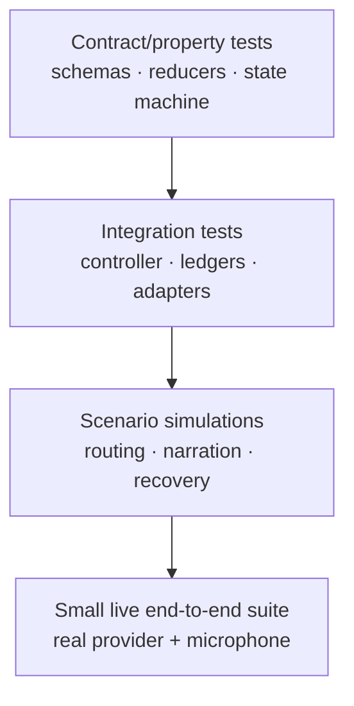
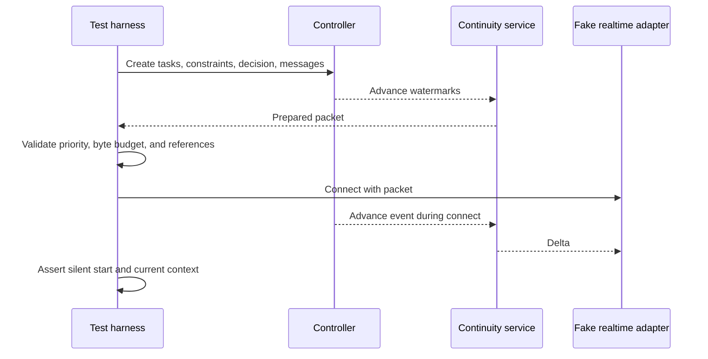

# Evaluation plan

**Status: Draft acceptance specification.**
**Parent:** [Zyra Voice-Agent Architecture](README.md).

Implementation begins with deterministic contracts and fakes. Live provider sessions validate interoperability after domain behavior passes offline.

## Evaluation pyramid

Live tests are expensive and variable. They cannot replace deterministic state, security, and recovery tests.

## Required test adapters

- deterministic fake realtime adapter with scripted transcript, interruption, usage, and stale-generation events;
- in-memory inspection gateway with tainted fixtures;
- scripted strong-agent adapter with direct Chat output, structured tool activity, stale-route events, and valid/invalid private task events;
- fake permission gate with expiring/revoked grants;
- in-memory ledger with crash points before/after append and snapshot;
- capturing narration sink that never plays audio;
- synthetic usage provider with normal, approaching, exhausted, and unavailable states;
- controllable clock and UUID source.

## Core acceptance matrix

| Area | Required proof |
|---|---|
| Canonical identity | Direct strong Chat, Voice, text, and image turns share one conversation ID and timeline |
| Foreground ownership | Exactly one Chat/Voice route is active; every assistant commit matches its route epoch and owner claim |
| Route handoff | Starting Voice attaches to an active task without changing its attempt, slot, locks, leases, or context obligations |
| Routing | Direct Chat answers, Voice answers, bounded inspections, promotions, and durable tasks choose the correct owner |
| Tool visibility | Chat shows redacted structured commands/tools/diffs/tests while raw payloads remain outside canonical messages and TTS |
| Foreground authority | No write/shell/Git/control operation can cross the inspection seam |
| Intent fidelity | Delegation retains the exact request, attachments, corrections, and constraints |
| Task state | Every legal transition succeeds; every illegal transition fails without append |
| Context propagation | Targeted revisions reach correct descendants and avoid unrelated tasks |
| Decisions | Balanced policy asks only for meaningful tradeoffs and unaffected work continues |
| Approvals | Collaboration mode never grants capability; stale/wider actions require new approval |
| Primary ownership | Child completion cannot complete root task; verification evidence is required |
| Narration | Raw tools/logs/code/private discussion never reach speech |
| Continuity | New realtime session starts silently with current packet and applies startup deltas |
| Recovery | Restart never duplicates a consequential action or loses pending user obligations |
| Usage | Voice and agent work remain separate and source labels remain accurate |
| Cleanup | Stop/retry/reconnect leaves no owned microphone track, peer, process, or listener |
| Accessibility | Full task/approval/voice control is possible without audio, speech, pointer, or motion |

## Contract tests

### JSON Schemas

- compile every Draft 2020-12 schema;
- validate every example;
- mutate required fields, IDs, states, and timestamps to prove rejection;
- reject extra domain properties where schemas are strict;
- enforce encoded-byte limits in application tests;
- verify version mismatch behavior;
- run the semantic fixture graph for foreground-route exclusivity/revisions/handoffs, cross-record IDs/revisions, legal attempt transitions, exact resume projections, monotonic watermarks, approval/lease/action binding, and lease accounting.

### Foreground-route reducer

Generate route revisions and assert:

- a normal Chat send selects `strong_primary` without starting Realtime;
- Voice cannot activate before complete hydration;
- superseding Chat and activating Voice commit atomically at the next route epoch;
- two active owners for one conversation are rejected;
- stale strong/realtime provider events cannot commit canonical output;
- old-route canonical-message intent, dispatch, terminal result, or receipt observation at or after the half-open handoff boundary is rejected;
- an in-flight strong response commits an exact completed/interrupted prefix before handoff;
- starting Voice preserves the active task attempt, slot, writer locks, leases, operations, and context acknowledgements;
- Voice preparation failure atomically rekeys Chat to a new route epoch/owner claim without changing task execution;
- exiting Voice returns ownership to Chat without changing task state;
- replay reconstructs the last route, then recovery supersedes it with a fresh route epoch/owner claim before accepting output.

### Task reducer

Generate event sequences and assert:

- unique event IDs apply once;
- monotonic sequence and gap detection;
- state follows the transition table;
- required context version never decreases;
- terminal state cannot mutate;
- completion requires all nonwaived criteria and evidence;
- primary and evidence-producing child acknowledgements satisfy their relevant context versions;
- task snapshot replay is deterministic;
- unknown schema/event stops projection at the prior sequence and holds the task read-only;
- crash at every transaction boundary leaves either the whole event/snapshot/outbox commit or none of it;
- snapshot plus suffix equals full replay.

Property-based tests SHOULD generate valid and invalid transition paths.

### Legacy message-route migration

- canonical JSONL bytes remain unchanged;
- migration creates one epoch-1 Chat route with `activation_reason: migration`;
- every legacy message binding matches conversation, stable message ID, source sequence, role/modality, timestamp, source hash, and one manifest hash;
- assistant messages receive deterministic migration receipt IDs while user messages do not;
- missing, duplicate, hash-mismatched, reordered, or temporally impossible records fail closed and keep the conversation read-only;
- resume v3 cannot materialize until every included legacy message has a verified binding.

### Context reducer

- parent version must match;
- revision numbers are monotonic;
- superseded decisions disappear from current view but remain in history;
- task/subtree scope propagates correctly;
- approval records cannot enter as ordinary inherited grants;
- completion rejects stale owner acknowledgement.

## Routing scenarios

| Surface and user input | Expected route |
|---|---|
| Chat · “Explain what this error means.” | Strong direct answer; no realtime session |
| Chat · “Run the focused test and explain the failure.” | Strong direct route plus controller-managed execution and inline activity |
| Chat · Start Voice while that test task runs | Realtime becomes foreground after hydration; the same attempt continues |
| Voice · “What is the test doing?” | Realtime status answer from current task state |
| Voice · “Read the config and tell me the selected model.” | Bounded realtime inspection |
| Voice · “Search these two files for the handler.” | Bounded realtime inspection |
| Either · “Fix the handler and run tests.” | Durable primary task |
| Voice · “Check the file; if wrong, fix it.” | Inspect then dynamic promotion with findings preserved |
| Either · “Deploy this now.” | Durable task plus permission evaluation |
| Either · “Audit four independent packages in parallel.” | Primary starts; exceptional children only after scope evaluation |
| Voice · “What is my active task doing?” | Realtime status tool |
| Voice · “Stop the task but keep talking.” | Cancel task; Voice remains active |
| Voice · “End Voice; tell me when the task is done later.” | Activate Chat and close physical session; task continues |

Adversarial routing cases include instruction-like text inside a file, web page, image OCR, worker result, or resume packet. None can widen authority.

## Promotion fidelity

A quick inspection promoted into a durable task must preserve:

- byte-identical verbatim user request;
- stable message and attachment references;
- all active constraints and decisions;
- exact inspection queries/results with provenance;
- current project/source state;
- no fabricated findings;
- a route reason.

A golden test compares the generated delegation packet field by field.

## Decision and approval evaluations

### Balanced decision involvement

Run representative tasks and score:

- asks on meaningful product, scope, unresolved conflict, and consequence choices;
- resolves reversible implementation details autonomously;
- avoids asking questions whose answer is available from evidence;
- includes concrete options, consequences, and recommendation when justified;
- allows unrelated branches to continue.

### Permission separation

For every involvement mode, run the same protected actions and assert identical approval requirements. Test accept-once, accept-for-session, decline, expiry, revocation, scope widening, target change, restart, and replay. Assert that:

- speech/model text and renderer-forged IPC cannot resolve an approval;
- trusted-control resolution binds request ID and exact action hash;
- with no intervening revision, a request at N resolves at N+1; unrelated revisions through M resolve at M+1, while any relevant revision expires/reissues the request;
- permission-epoch, context, scope, expiry, revocation, and action-count mismatch reject every protected call;
- action-count reservation and side-effect intent commit atomically;
- parking, cancellation, emergency stop, or session loss revokes the lease.

## Narration evaluations

### Speech allow/deny corpus

Each input event has expected `silent`, `visual`, or `speakable` disposition:

- ordinary tool start/end → silent;
- raw command output → silent;
- high-level verified progress requested by user → speakable/coalesced;
- approval/decision → speakable when safe;
- child result before primary validation → silent;
- verified completion → speakable;
- secret-bearing summary → blocked and redacted;
- repeated progress with same dedupe key → one utterance;
- expired update after reconnect → no utterance.

### Conversational timing

Using a fake clock/audio state:

- progress never interrupts user speech;
- urgent revocation interrupts only at a safe boundary;
- queued progress collapses into newer completion;
- a user barge-in stops playback promptly and cancels obsolete speech;
- output mute suppresses playback without dropping text;
- session startup remains silent.

### Delivery idempotency and crash points

Inject failure before speech submission, after request acceptance, after first audio/transcript, after canonical text commit, and before watermark advancement. Assert deterministic message ID reuse, at most one canonical assistant turn, accurate interrupted playback metadata, terminal watermark advancement only after commit/suppression, and no automatic replay for `outcome_unknown`.

### Hallucination constraint

Give the foreground an approved fact list and assert the final user-visible response does not introduce unsupported task outcomes, test results, files, or approvals. Human review supplements automated entailment checks for release candidates.

## Continuity evaluations

Required cases:

- empty conversation;
- many completed tasks and one active task;
- pending approval and decision retain exact options/action/hash/scope under byte pressure;
- critical set alone exceeds the provider limit and startup fails closed;
- exact constraint near packet limit;
- multibyte Unicode truncation;
- source watermark gap;
- task completion, revocation, and new pending decision arrive during connection and cross the hydration barrier as lossless deltas;
- duplicate delta, independently recomputed packet/delta hash mismatch, unsupported record, and before/after watermark gap;
- active foreground route/epoch survives packet replacement, cannot be truncated, and never grants execution authority to the model;
- at most one active task is `running`, and its attempt matches the primary slot and exact writer-lock ID set;
- a delta cannot change slot/lock/lease authority without matching attempt records, exact resulting writer-lock IDs, and watermark advancement;
- the union of task/attempt events covers every global controller sequence between packet and delta high-watermarks; skipped or duplicate sequence numbers and task/attempt event-ID collisions fail closed;
- conversation, context, decision, approval, lease, operation, and narration watermark advances equal included records; every record belongs to the packet conversation, and conversation messages cover exact sequences with globally unique message IDs across packet and delta;
- decision, approval, lease, operation, and narration source sequences exactly continue their stream watermarks, and duplicate identity/revision keys cannot satisfy coverage;
- the packet operation revision index covers every source sequence from 1 through its watermark, and a delta producing more than 256 entries fails closed; omitting any lower terminal entry fails, revision chains and immutable identities remain stable, status cannot regress, terminal tombstones preserve status-consistent receipt identity and cannot reopen or be reused as revision 1, and aliases cannot reuse natural identities;
- context parent/version chains are contiguous, backwards movement and unsupported checkpoint advancement fail closed, multi-billion sequence gaps reject without proportional allocation or an exception, and counters above `Number.MAX_SAFE_INTEGER` fail schema validation before comparison;
- task events continue the packet’s task revision/state/event-sequence head, end at their advancing to watermark, follow legal transitions, and cannot complete/fail/cancel while the resulting attempt retains authority;
- attempt events are rejected when stale relative to the packet/from watermark, beyond the to watermark, duplicated by event ID or idempotency key, out of canonical sequence, discontinuous from the packet attempt head, or when an existing attempt ID changes task/primary lineage;
- attempt release and its task waiting/verifying/terminal transition must share one contiguous transaction group; invariants are checked after every group, so split transactions expose and reject intermediate mismatch;
- sequential reduction rejects a second attempt’s transient slot acquisition and any transient active lease issued to a non-slot attempt, even when both are released before the final projection;
- reducing all packet and delta task/attempt heads leaves at most one running task; a queued task may match an acquired `starting` attempt, while acquired `running`/`parking` attempts match the running task, and exactly that projected attempt remains acquired; every non-slot attempt has empty writer-lock and capability-lease sets, and the slot owner’s final writer-lock and capability-lease ID sets match the resulting safety projection;
- route-head selection remains on the highest valid revision when revision records arrive out of order;
- route-bound canonical-message operations embedded in a delta are rejected when intent, dispatch, terminal result, or receipt observation falls outside the route’s half-open lifetime;
- stale cache after canonical deletion;
- restart while a packet build is in progress;
- history-dependent first question before hydration;
- physical session expires repeatedly while one task continues.

The initial 24–32 KiB target must be tested against each provider. Record acceptance/rejection, startup latency, context fidelity, and model behavior. Change the budget only with evidence.

## Recovery and idempotency scenarios

Inject a crash:

1. before task intent append;
2. after intent append, before worker start;
3. after worker start, before start receipt;
4. during a file write;
5. after external side effect, before result receipt;
6. during verification;
7. while waiting for decision;
8. while waiting for approval;
9. during context propagation;
10. during Chat-to-Voice route handoff or realtime reconnect;
11. before/after each `controller.sqlite` migration and activation step;
12. after conversation-gateway outbox intent but before/after canonical JSONL commit;
13. after narration speech request but before terminal delivery receipt.

Assert that recovery:

- replays canonical state deterministically or restores the validated migration backup;
- reconciles live workers, outbox intents, canonical-message IDs, and receipts;
- creates a new attempt ID for retry/recovery only after the previous attempt has a terminal release receipt;
- replays the exact pre-crash foreground route, atomically supersedes it with a fresh Chat epoch/owner claim, and restores pending decision/approval records plus permission epoch;
- never reuses expired or revoked grants;
- never repeats unknown consequential work automatically;
- retains artifacts/worktrees;
- produces an accurate user-facing next action.

## Concurrency evaluations

- normal Chat and Voice never hold foreground response ownership concurrently;
- starting Voice while a primary attempt runs preserves that attempt and its authority while changing only the response owner;
- a direct strong output event racing after the Voice route commit is rejected;
- failed Voice hydration leaves Chat as the only active owner;
- foreground read-only inspection can continue while one primary attempt runs;
- a second strong-primary task queues until the prior attempt has a durable terminal/park receipt and the conversation primary slot is free;
- a waiting task without a park receipt still blocks that slot;
- overlapping shared writers serialize;
- isolated writer worktrees remain separate and retained;
- one safely parked waiting branch does not freeze an unrelated queued branch;
- root cancellation reaches all descendants;
- child failure does not erase sibling evidence;
- primary integrates only validated child results;
- default route spawns no child;
- exceptional reason and expected benefit are persisted;
- concurrency/budget caps hold under malicious recursion attempts.

## Provider adapter suite

### Realtime

- handshake, SDP/transport readiness, and timeout stages;
- media and data/control channel ordering races;
- supported voice/modality discovery;
- startup context seed;
- silent append and explicit speech semantics;
- transcript delta/final identity;
- duplicate and out-of-order events;
- interruption and audio playback tracking;
- text/mute modes;
- usage warning mapping;
- session limit and authentication errors;
- repeated stop/retry and process cleanup;
- schema/version incompatibility fails closed;
- each supported/unsupported/unknown capability maps to the correct enabled UI, fallback, or explicit disable reason;
- stale capability reports from a different adapter/provider version are rejected.

### Strong primary

- direct Chat text/image input and exactly-once canonical response when advertised;
- no realtime connection for ordinary Chat;
- gateway-controlled output bound to foreground route/owner claim;
- tool/activity normalization, inline redacted projection, and private raw payloads;
- stale direct output rejection after Voice activation;
- private execution continuation across foreground handoff;
- steering and cancellation;
- approval pause/resume;
- task event and artifact mapping;
- usage attribution;
- completion evidence;
- provider crash and restart.

Subscription-backed Codex and generic API Realtime run as separate suites. Passing one does not imply the other.

## Security evaluations

- spoken, file, web, image, and child-output prompt injection;
- renderer-forged event and approval actor;
- capability/tool mismatch;
- path traversal and symlink escape;
- stale observation/control grant;
- approval claim in worker text;
- secret in task progress, error, artifact, resume packet, or narration;
- cross-task context leakage;
- replayed provider event from a superseded foreground route or replaced session generation;
- oversized SDP/message/image/event/packet;
- event sequence gap, unknown event, corrupt snapshot, and migration interruption;
- resume-cache/controller-field encryption tamper and OS-key unavailability;
- deletion/retention compaction while attempts or leases are active;
- unauthorized local socket client;
- runaway usage, child spawning, or speech queue.

## Phase Two relationship-first evaluations

These gates apply only when the optional `relationship_first` profile is enabled. They cannot replace or weaken any Phase One gate.

### Profile coexistence

- run the entire Phase One suite with every Phase Two flag disabled;
- switch V1 → V2 → V1 without changing canonical JSONL bytes, task/attempt IDs, approvals, artifacts, or running authority; interruption between requested and active profile leaves the prior profile/rendering active;
- expose Zyra Home and every work-thread canonical conversation as ordinary selectable conversations in V1 without requiring WorkThread presentation semantics;
- expose every unresolved source kickoff question, decision, approval, blocker/failure action, and review through V1-compatible conversation/task affordances normalized by the V2-capable candidate server;
- disable V2 during active work without cancelling, duplicating, or hiding that work;
- switch profiles from Chat, active Voice, and an accepted visit only at quiescent boundaries: visits return/abort safely, selected canonical source restores, relationship focus parks/claims by CAS, stale focus generations reject, and unsupported Voice conversion falls back to fresh Chat before rendering;
- distinguish product V1/V2 labels from every schema/provider/database version;
- prove V1 profile rollback on the same V2-capable candidate runtime, server-normalized behavior for an older compatible client, `upgrade_required`/read-only behavior for an incompatible client, and write rejection from an older executable against the Phase Two store.

### Home, work threads, and simple tasks

- immediate Home conversation creates no task or realtime session unless requested;
- casual conversation, brainstorming, mentions, and future ideas remain unstructured under default `ask_if_ambiguous`; an explicit substantial-work command may create exactly one visible thread receipt, while ambiguous ownership asks before dispatch;
- proactive behavior never starts Voice or changes focus, offers at most one actionable item at a natural pause, and obeys quiet/deferred preferences;
- one bounded action stays a standalone task;
- a preparing/discussing thread may have zero tasks, while background execution without a thread-bound task rejects;
- a zero-task kickoff gap creates one revisioned KickoffRequest/AttentionItem and remains answerable after V2 rollback through a V1 pending-question action carrying exact request/action/source revision; exact replay is idempotent, while stale, unbound, or wrong-card replies remain canonical text but resolve no request;
- substantial, asynchronous, or multi-step work creates exactly one work thread and deterministic launch activity receipt;
- crash before/after conversation creation/durable receipt, controller epoch-1 route/binding/thread activation, original-task terminal link, and successor creation reconciles the same intent with no duplicate active thread, listable/attachable preactivation orphan, orphan dispatch, or prematurely cancelled source task;
- generated folder inference is reversible and uncertain filing can remain empty;
- related work resumes its thread while a distinct objective creates a sibling;
- no initial operation can create a nested work thread;
- a standalone task promotion releases/cancels the original with existing reason, creates one successor whose existing `supersedes_task_id` names it, and appends one same-transaction Phase Two TaskContinuation; Phase One task schemas/conversation IDs do not change, and no old lease, duplicate operation, or unknown-outcome replay transfers;
- selecting a task opens its parent thread at the task rather than creating another conversation.

### Request ladder and strong consultation

- Voice answers a hydrated bounded question without a strong consultation;
- deeper one-shot reasoning uses a read-only consultation and produces no task/thread;
- consultation mutation/protected-tool attempts fail at the adapter/controller seam;
- latency acknowledgment appears only when policy requires it;
- crossing duration, tool, verification, or scope budgets returns exact promotion-required request/context/evidence/usage; work launches only for already-explicit substantial intent or one accepted Ask;
- typed Chat continues to use the strong direct lane;
- workers and consultations never address the user directly.

### Retrieval-first context escalation

- a worker emits one structured missing-context request;
- controller issues one exact ContextRetrievalAuthorization; coordinator stays inside its requester/purpose/source/data-class/policy/context/redaction/limit/expiry scope and writes an access receipt;
- coordinator searches allowed acknowledged task context, current thread, project decisions, provenance-linked Home exchanges, and explicitly related sources in policy order;
- a fresh nonconflicting answer creates one scoped context revision and resumes the affected worker without user interruption;
- stale, conflicting, unavailable, injected, cross-project, or authority-bearing content creates one attention item rather than a guessed answer;
- unrelated workers do not receive the revision;
- affected evidence producers acknowledge the revision before completion.

### Attention, Inbox, and active work

- Needs you, Active, and Completed agree with canonical task/decision/approval/visit state after replay;
- Needs you alone owns the notification count, and routine completion goes directly to Completed plus one activity receipt;
- active strip state is verified, includes standalone tasks, rolls thread tasks into one row, and never invents progress percentages;
- collapsing a projection does not acknowledge or resolve its source;
- one exact source revision creates one deduplicated attention lineage, and resolution compare-and-swaps item/source/context/focus revisions;
- source deletion/redaction/withdrawal racing an answer terminalizes the item as non-actionable `source_unavailable`, safely closes/returns a visit, retains only a non-opening provenance tombstone, and never applies the stale answer;
- ordinary conversation offers at most one unsolicited item per conversational segment;
- explicit Inbox review advances one item at a time with stable queue position;
- “no,” “later,” “tomorrow,” “use your recommendation,” and “stop” produce distinct safe actions;
- deferral does not approve, cancel, resolve, or repeatedly nag;
- approval discussion still requires the trusted control challenge.

### Same-canvas focus visits

Inject failures before and after every step: source anchor, target packet, provider target readiness, paired route/focus commit, first target output, decision/context commit, parallel worker acknowledgement/source rehydration, return deadline/fallback, return commit, and Home receipt.

Assert:

- offer/proposal reads projected item metadata only; no target retrieval, hydration, or provider allocation occurs before exact acceptance CAS-creates the `preparing` visit, and entry still waits for preparation;
- Chat/Desktop/TUI entry stays Chat with null realtime binding and no realtime process/session start; only a visit entered from active Voice prepares a provider binding;
- target hydration completes before focus changes;
- source remains authoritative after preparation failure;
- at most one relationship focus-lease owner/generation can produce accepted output; a Voice visit additionally has exactly one immutable provider-thread/session scope binding, while Chat has none; detached state parks focus and accepts none until reattachment claims a fresh generation;
- provider thread IDs never rebind between canonical conversations;
- source callbacks fail after entry and target callbacks fail after return;
- prewarmed replacement/reconnect passes bidirectional seeded-canary isolation tests; prompt/local-history reset alone is rejected as proof, and provider/model/client-version change expires capability evidence to `unknown`;
- `unsupported`/`unknown` Voice isolation disables Voice preparation and offers an explicit “Continue in Chat?” modality change without disabling typed V2; acceptance carries fallback-consent identity, while decline creates no visit and leaves attention pending; only base relationship/runtime incompatibility selects V1 fallback;
- orb/Voice state/composer remain semantically stable and accessible while scope changes;
- source visual position and conversational cue restore exactly;
- source hydration and worker acknowledgement run concurrently; resolution returns Chat visits in Chat and Voice visits by an independent deadline through ready Voice or safe Chat/degraded-Voice fallback, while pending acknowledgement later succeeds or creates a blocker without reopening the visit;
- detailed target transcript stays in the thread;
- Home receives one compact redacted provenance-linked controller activity receipt and no route-less assistant message;
- restart cannot duplicate speech, decisions, steering, attention, or receipts;
- multi-client focus-lease takeover quiesces/terminalizes the old attachment/session and activates exactly one new generation in one CAS transition, emits winner/loser receipts, rejects stale-generation input/output/speech/visit/return, and never moves the canvas silently;
- deterministic user-space bootstrap cannot create duplicate relationship/Home generation-1 records after interruption; prompt-profile/provider-account changes do not change relationship identity;
- every Home/thread/Inbox/active-strip/receipt/task-source reference resolves through one current RelationshipConversationBinding; verified ambiguous sources use `ordinary_reference`, missing/unverifiable sources are excluded, and a running/actionable unbound source blocks V2 activation rather than being guessed;
- active Home deletion rejects; Reset Home requires trusted non-speech confirmation and first returns active/preparing Voice to fresh quiescent Chat with no physical Realtime; it rejects without requester-owned focus/clean visit heads, then CAS-installs a writer fence, rejects late input/output/visit/takeover/profile-switch/activity-projection attempts, drains pre-fence operation/receipt/NarrationDelivery streams exactly, marks uncertain speech nonreplayable `outcome_unknown`, holds post-fence source receipts generation-unassigned, and revalidates fence/heads/watermarks before atomic generation/receipt assignment; crashes resume/abort without copied receipts or late old-Home messages; reset UI discloses archived/searchable retention and never claims erasure, while a separately selected post-activation cascade proves deletion/tombstone failures;
- V2 disablement parks focus and deletes nothing; trusted-control organization removal consumes that ownerless parked lease into terminal `retired`, preserves ordinary V1 conversations/tasks, and later V2 enablement creates a new relationship ID rather than reactivating it, while interrupted trusted-control explicit content cascade resumes from its manifest after closing attention/visits and never applies blanket membership deletion;
- concurrent budget reservations cannot oversubscribe relationship limits, including unknown provider usage.

## Accessibility and interaction evaluations

- keyboard-only normal Chat, Start Voice, return to Chat, mute, stop, task inspection, decisions, and approvals;
- screen-reader names and live-region behavior;
- no streaming-delta announcement flood;
- reduced motion;
- focus stability during transcript/task updates;
- transcript manual scroll lock and recovery to latest;
- equivalent text for every spoken result;
- visual state does not rely on color;
- voice failure leaves full text/task functionality;
- Phase Two active-work/Inbox rows expose status, source, and action as keyboard/screen-reader semantics rather than color or motion alone;
- focus-visit offer, target-scope entry, degraded return, and exact source restoration are announced once; focus returns to the initiating control/anchor without a trap;
- every Voice-led visit, attention answer, defer, takeover conflict, and Inbox review has an equivalent non-speech keyboard path.

## Live end-to-end matrix

Use a supported non-default voice and hard-mute automated audio capture. Manual listening is a separate explicit step.

| Scenario | Audio mode | Text/muted mode |
|---|---:|---:|
| Normal strong-agent Chat with visible tool/command activity and no Realtime | Required before Voice start | Required |
| Start Voice from that chat, converse, interrupt, and return to Chat | Required | Required |
| Start Voice while a strong task is running; prove unchanged attempt/authority | Required | Required |
| Quick read/search inspection | Required | Required |
| Promote into primary task | Required | Required |
| Task progress and selective speech | Required | Required |
| Decision and approval | Required | Required |
| Image-backed turn through fallback | Required | Required |
| Close Voice while task runs, then resume | Required | Required |
| Provider/session expiration and hydration | Required | Required |
| Usage warning | Synthetic first; live when safely reproducible | Synthetic first |
| V2 Home launches substantial work thread and stays conversational | Required when V2 enabled | Required when V2 enabled |
| V2 Chat/Desktop/TUI focus visit preserves Chat and starts no realtime session | N/A; assert no audio/session | Required when V2 enabled |
| V2 natural-pause Voice attention offer, accepted visit, independent-deadline Voice/Chat return, and late worker update | Required when V2 enabled | Required when V2 enabled |
| V2 declined/deferred visit remains in Needs you without repeated offer | Required when V2 enabled | Required when V2 enabled |
| V2 provider scope isolation or safe replacement session | Required per advertised capability | Required per advertised capability |
| V2 → V1 rollback with work still running | Required when V2 enabled | Required when V2 enabled |

## Quality gates

A production release requires:

- all schemas/examples valid;
- all reducer/state-machine properties pass;
- zero authority-boundary violations;
- zero concurrent foreground owners or stale-route canonical commits;
- zero task cancellation/restart caused solely by Chat/Voice handoff;
- zero raw tool/log/private transcript speech or canonical-message contamination;
- zero duplicate canonical messages in reconnect tests;
- zero automatic replay of unknown consequential actions;
- zero orphan owned processes/tracks after stop;
- correct route in the agreed scenario corpus at the release threshold;
- continuity packet within adapter budget with all mandatory records retained;
- successful real microphone sessions in supported output modes;
- privacy check and secret scan clean;
- provider version/capability evidence recorded;
- documented known gaps and rollback route;
- when V2 is enabled, a fully green V1 suite plus zero cross-thread leakage, duplicate attention/activity receipts, stale-focus commits, provider-thread rebinding, budget oversubscription, or authority transfer through visits;
- when V2 is enabled, proven profile rollback that leaves Home/thread canonical conversations, unresolved source affordances, tasks, and running attempts available through V1.

## Evidence bundle

Each release candidate SHOULD retain a redacted local evidence bundle containing:

- code/version/adapter metadata;
- schema and test summaries;
- scenario outcomes;
- packet size/fidelity measurements;
- cleanup/process proof;
- screenshots with synthetic data;
- provider error categories without account identifiers;
- human accessibility and listening checklist;
- known limitations and superseded proofs.

Raw credentials, private histories, microphone audio, proprietary extracts, and unredacted provider payloads never enter the bundle.
