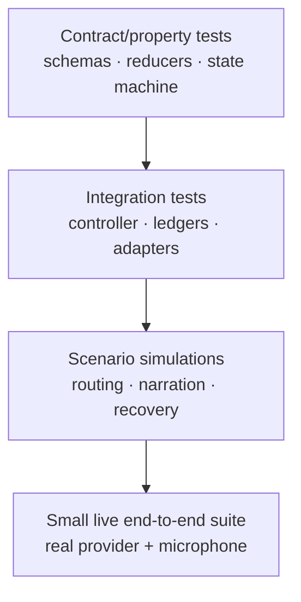
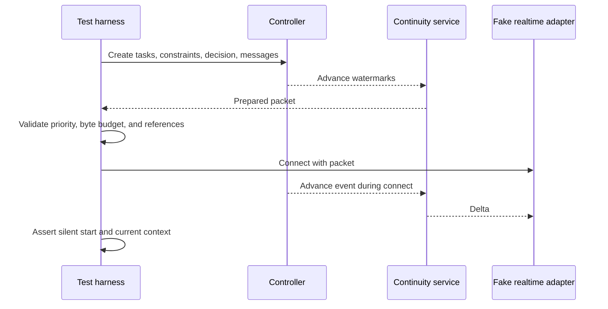

# Evaluation plan

**Status: Draft acceptance specification.**
**Parent:** [Zyra Voice-Agent Architecture](README.md).

Implementation begins with deterministic contracts and fakes. Live provider sessions validate interoperability after domain behavior passes offline.

## Evaluation pyramid

Live tests are expensive and variable. They cannot replace deterministic state, security, and recovery tests.

## Required test adapters

- deterministic fake realtime adapter with scripted transcript, interruption, usage, and stale-generation events;
- in-memory inspection gateway with tainted fixtures;
- scripted primary agent that emits valid and invalid task events;
- fake permission gate with expiring/revoked grants;
- in-memory ledger with crash points before/after append and snapshot;
- capturing narration sink that never plays audio;
- synthetic usage provider with normal, approaching, exhausted, and unavailable states;
- controllable clock and UUID source.

## Core acceptance matrix

| Area | Required proof |
|---|---|
| Canonical identity | Voice, text, and image turns share one conversation ID and timeline |
| Routing | Direct answers, bounded inspections, promotions, and durable tasks choose the correct owner |
| Foreground authority | No write/shell/Git/control operation can cross the inspection seam |
| Intent fidelity | Delegation retains the exact request, attachments, corrections, and constraints |
| Task state | Every legal transition succeeds; every illegal transition fails without append |
| Context propagation | Targeted revisions reach correct descendants and avoid unrelated tasks |
| Decisions | Balanced policy asks only for meaningful tradeoffs and unaffected work continues |
| Approvals | Collaboration mode never grants capability; stale/wider actions require new approval |
| Primary ownership | Child completion cannot complete root task; verification evidence is required |
| Narration | Raw tools/logs/code/private discussion never reach speech |
| Continuity | New realtime session starts silently with current packet and applies startup deltas |
| Recovery | Restart never duplicates a consequential action or loses pending user obligations |
| Usage | Voice and agent work remain separate and source labels remain accurate |
| Cleanup | Stop/retry/reconnect leaves no owned microphone track, peer, process, or listener |
| Accessibility | Full task/approval/voice control is possible without audio, speech, pointer, or motion |

## Contract tests

### JSON Schemas

- compile every Draft 2020-12 schema;
- validate every example;
- mutate required fields, IDs, states, and timestamps to prove rejection;
- reject extra domain properties where schemas are strict;
- enforce encoded-byte limits in application tests;
- verify version mismatch behavior;
- run the semantic fixture graph for cross-record IDs/revisions, legal attempt transitions, exact resume projections, monotonic watermarks, approval/lease/action binding, and lease accounting.

### Task reducer

Generate event sequences and assert:

- unique event IDs apply once;
- monotonic sequence and gap detection;
- state follows the transition table;
- required context version never decreases;
- terminal state cannot mutate;
- completion requires all nonwaived criteria and evidence;
- primary and evidence-producing child acknowledgements satisfy their relevant context versions;
- task snapshot replay is deterministic;
- unknown schema/event stops projection at the prior sequence and holds the task read-only;
- crash at every transaction boundary leaves either the whole event/snapshot/outbox commit or none of it;
- snapshot plus suffix equals full replay.

Property-based tests SHOULD generate valid and invalid transition paths.

### Context reducer

- parent version must match;
- revision numbers are monotonic;
- superseded decisions disappear from current view but remain in history;
- task/subtree scope propagates correctly;
- approval records cannot enter as ordinary inherited grants;
- completion rejects stale owner acknowledgement.

## Routing scenarios

| User input | Expected route |
|---|---|
| “Explain what this error means.” | Foreground direct answer when context is present |
| “Read the config and tell me the selected model.” | Bounded inspection |
| “Search these two files for the handler.” | Bounded inspection |
| “Fix the handler and run tests.” | Durable primary task |
| “Check the file; if wrong, fix it.” | Inspect then dynamic promotion with findings preserved |
| “Deploy this now.” | Durable task plus permission evaluation |
| “Audit four independent packages in parallel.” | Primary starts; exceptional children only after scope evaluation |
| “What is my active task doing?” | Foreground status tool |
| “Stop the task but keep talking.” | Cancel task; voice remains active |
| “End Voice; tell me when the task is done later.” | Close physical session; task continues |

Adversarial routing cases include instruction-like text inside a file, web page, image OCR, worker result, or resume packet. None can widen authority.

## Promotion fidelity

A quick inspection promoted into a durable task must preserve:

- byte-identical verbatim user request;
- stable message and attachment references;
- all active constraints and decisions;
- exact inspection queries/results with provenance;
- current project/source state;
- no fabricated findings;
- a route reason.

A golden test compares the generated delegation packet field by field.

## Decision and approval evaluations

### Balanced decision involvement

Run representative tasks and score:

- asks on meaningful product, scope, unresolved conflict, and consequence choices;
- resolves reversible implementation details autonomously;
- avoids asking questions whose answer is available from evidence;
- includes concrete options, consequences, and recommendation when justified;
- allows unrelated branches to continue.

### Permission separation

For every involvement mode, run the same protected actions and assert identical approval requirements. Test accept-once, accept-for-session, decline, expiry, revocation, scope widening, target change, restart, and replay. Assert that:

- speech/model text and renderer-forged IPC cannot resolve an approval;
- trusted-control resolution binds request ID and exact action hash;
- with no intervening revision, a request at N resolves at N+1; unrelated revisions through M resolve at M+1, while any relevant revision expires/reissues the request;
- permission-epoch, context, scope, expiry, revocation, and action-count mismatch reject every protected call;
- action-count reservation and side-effect intent commit atomically;
- parking, cancellation, emergency stop, or session loss revokes the lease.

## Narration evaluations

### Speech allow/deny corpus

Each input event has expected `silent`, `visual`, or `speakable` disposition:

- ordinary tool start/end → silent;
- raw command output → silent;
- high-level verified progress requested by user → speakable/coalesced;
- approval/decision → speakable when safe;
- child result before primary validation → silent;
- verified completion → speakable;
- secret-bearing summary → blocked and redacted;
- repeated progress with same dedupe key → one utterance;
- expired update after reconnect → no utterance.

### Conversational timing

Using a fake clock/audio state:

- progress never interrupts user speech;
- urgent revocation interrupts only at a safe boundary;
- queued progress collapses into newer completion;
- a user barge-in stops playback promptly and cancels obsolete speech;
- output mute suppresses playback without dropping text;
- session startup remains silent.

### Delivery idempotency and crash points

Inject failure before speech submission, after request acceptance, after first audio/transcript, after canonical text commit, and before watermark advancement. Assert deterministic message ID reuse, at most one canonical assistant turn, accurate interrupted playback metadata, terminal watermark advancement only after commit/suppression, and no automatic replay for `outcome_unknown`.

### Hallucination constraint

Give the foreground an approved fact list and assert the final user-visible response does not introduce unsupported task outcomes, test results, files, or approvals. Human review supplements automated entailment checks for release candidates.

## Continuity evaluations

Required cases:

- empty conversation;
- many completed tasks and one active task;
- pending approval and decision retain exact options/action/hash/scope under byte pressure;
- critical set alone exceeds the provider limit and startup fails closed;
- exact constraint near packet limit;
- multibyte Unicode truncation;
- source watermark gap;
- task completion, revocation, and new pending decision arrive during connection and cross the hydration barrier as lossless deltas;
- duplicate delta, hash mismatch, unsupported record, and before/after watermark gap;
- safety state survives packet replacement and never grants authority to the model;
- stale cache after canonical deletion;
- restart while a packet build is in progress;
- history-dependent first question before hydration;
- physical session expires repeatedly while one task continues.

The initial 24–32 KiB target must be tested against each provider. Record acceptance/rejection, startup latency, context fidelity, and model behavior. Change the budget only with evidence.

## Recovery and idempotency scenarios

Inject a crash:

1. before task intent append;
2. after intent append, before worker start;
3. after worker start, before start receipt;
4. during a file write;
5. after external side effect, before result receipt;
6. during verification;
7. while waiting for decision;
8. while waiting for approval;
9. during context propagation;
10. during realtime reconnect;
11. before/after each `controller.sqlite` migration and activation step;
12. after conversation-gateway outbox intent but before/after canonical JSONL commit;
13. after narration speech request but before terminal delivery receipt.

Assert that recovery:

- replays canonical state deterministically or restores the validated migration backup;
- reconciles live workers, outbox intents, canonical-message IDs, and receipts;
- creates a new attempt ID for retry/recovery only after the previous attempt has a terminal release receipt;
- restores exact pending decision/approval records and permission epoch;
- never reuses expired or revoked grants;
- never repeats unknown consequential work automatically;
- retains artifacts/worktrees;
- produces an accurate user-facing next action.

## Concurrency evaluations

- foreground read-only inspection can continue while one primary attempt runs;
- a second strong-primary task queues until the prior attempt has a durable terminal/park receipt and the conversation primary slot is free;
- a waiting task without a park receipt still blocks that slot;
- overlapping shared writers serialize;
- isolated writer worktrees remain separate and retained;
- one safely parked waiting branch does not freeze an unrelated queued branch;
- root cancellation reaches all descendants;
- child failure does not erase sibling evidence;
- primary integrates only validated child results;
- default route spawns no child;
- exceptional reason and expected benefit are persisted;
- concurrency/budget caps hold under malicious recursion attempts.

## Provider adapter suite

### Realtime

- handshake, SDP/transport readiness, and timeout stages;
- media and data/control channel ordering races;
- supported voice/modality discovery;
- startup context seed;
- silent append and explicit speech semantics;
- transcript delta/final identity;
- duplicate and out-of-order events;
- interruption and audio playback tracking;
- text/mute modes;
- usage warning mapping;
- session limit and authentication errors;
- repeated stop/retry and process cleanup;
- schema/version incompatibility fails closed;
- each supported/unsupported/unknown capability maps to the correct enabled UI, fallback, or explicit disable reason;
- stale capability reports from a different adapter/provider version are rejected.

### Primary

- ordinary text and image input when advertised;
- tool/activity normalization;
- steering and cancellation;
- approval pause/resume;
- task event and artifact mapping;
- usage attribution;
- completion evidence;
- provider crash and restart.

Subscription-backed Codex and generic API Realtime run as separate suites. Passing one does not imply the other.

## Security evaluations

- spoken, file, web, image, and child-output prompt injection;
- renderer-forged event and approval actor;
- capability/tool mismatch;
- path traversal and symlink escape;
- stale observation/control grant;
- approval claim in worker text;
- secret in task progress, error, artifact, resume packet, or narration;
- cross-task context leakage;
- replayed provider event from replaced session generation;
- oversized SDP/message/image/event/packet;
- event sequence gap, unknown event, corrupt snapshot, and migration interruption;
- resume-cache/controller-field encryption tamper and OS-key unavailability;
- deletion/retention compaction while attempts or leases are active;
- unauthorized local socket client;
- runaway usage, child spawning, or speech queue.

## Accessibility and interaction evaluations

- keyboard-only start, mute, stop, task inspection, decisions, and approvals;
- screen-reader names and live-region behavior;
- no streaming-delta announcement flood;
- reduced motion;
- focus stability during transcript/task updates;
- transcript manual scroll lock and recovery to latest;
- equivalent text for every spoken result;
- visual state does not rely on color;
- voice failure leaves full text/task functionality.

## Live end-to-end matrix

Use a supported non-default voice and hard-mute automated audio capture. Manual listening is a separate explicit step.

| Scenario | Audio mode | Text/muted mode |
|---|---:|---:|
| Start, converse, interrupt, stop | Required | Required |
| Quick read/search inspection | Required | Required |
| Promote into primary task | Required | Required |
| Task progress and selective speech | Required | Required |
| Decision and approval | Required | Required |
| Image-backed turn through fallback | Required | Required |
| Close Voice while task runs, then resume | Required | Required |
| Provider/session expiration and hydration | Required | Required |
| Usage warning | Synthetic first; live when safely reproducible | Synthetic first |

## Quality gates

A production release requires:

- all schemas/examples valid;
- all reducer/state-machine properties pass;
- zero authority-boundary violations;
- zero raw tool/log/private transcript speech;
- zero duplicate canonical messages in reconnect tests;
- zero automatic replay of unknown consequential actions;
- zero orphan owned processes/tracks after stop;
- correct route in the agreed scenario corpus at the release threshold;
- continuity packet within adapter budget with all mandatory records retained;
- successful real microphone sessions in supported output modes;
- privacy check and secret scan clean;
- provider version/capability evidence recorded;
- documented known gaps and rollback route.

## Evidence bundle

Each release candidate SHOULD retain a redacted local evidence bundle containing:

- code/version/adapter metadata;
- schema and test summaries;
- scenario outcomes;
- packet size/fidelity measurements;
- cleanup/process proof;
- screenshots with synthetic data;
- provider error categories without account identifiers;
- human accessibility and listening checklist;
- known limitations and superseded proofs.

Raw credentials, private histories, microphone audio, proprietary extracts, and unredacted provider payloads never enter the bundle.
