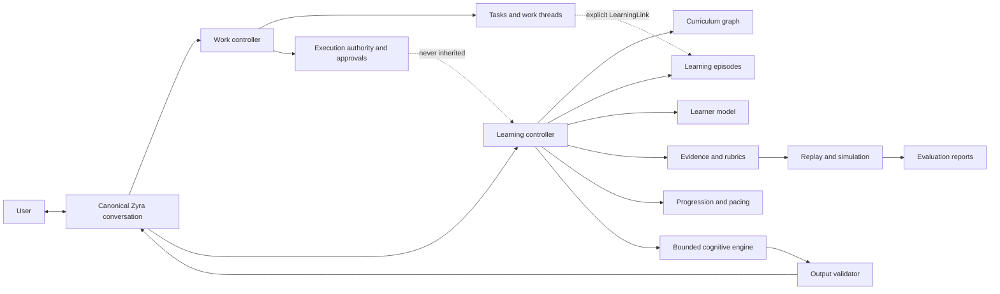
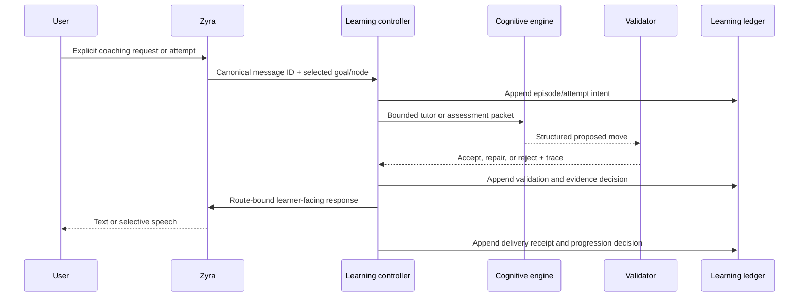
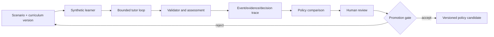

# Future direction — evidence-owned adaptive coaching

**Status: exploratory direction after Phase Two; not a Phase One or Phase Two commitment.**

This note explores a larger direction for Zyra after the conversation-scoped and relationship-first profiles are proven.

## Design-input provenance

The exact Betum design-input manifest is repository identity `justelson/betum`, base commit `25e640adc4e69d2c4ae69dc5486657c52b4ca6d5`, accessed 2026-08-04, limited to committed versions of:

- `README.md`, SHA-256 `d13fc74c2c7a5d20fd4131b415f754e9a15a068320fade8f46b52e777b10f6f8`;
- `docs/architecture.md`, SHA-256 `e128dad87296c03f2e6422530f66e50dcc45952a03382e8772beee2c08c43d15`;
- `docs/build-roadmap.md`, SHA-256 `d6f6b8a77b8e1bc9c7ebd58d572bd90f521da7051d77ff6f38921d028037c2be`.

The repository was not publicly fetchable without authorization at review time, so this manifest is provenance for a user-owned design input rather than a public prior-art citation. The review did not inspect implementation source, fixtures, learner/storage data, histories, secrets, or runtime artifacts. The text below is Zyra’s independent conceptual synthesis: no Betum code, prose, schemas, or data was copied, and no Betum file was changed.

**Zyra synthesis:** AI may generate explanations, questions, examples, and feedback inside a bounded learning contract. A deterministic controller owns curriculum boundaries, evidence, pacing, progression, and replay.

That separation could let Zyra grow from a coding assistant that completes work into an opt-in development companion that also helps the user build durable skill. The learning plane remains distinct from work execution, relationship orchestration, model memory, and permissions.

## Relationship to Product Phases

| Layer | User promise | Status |
|---|---|---|
| **Phase One / `conversation_scoped`** | Canonical Chat with optional Voice and deterministic durable work | Required first product |
| **Phase Two / `relationship_first`** | Persistent Zyra Home, scoped work threads, hybrid Inbox, and focus visits | Optional additive profile |
| **Future adaptive-coaching plane** | Explicit goals, bounded learning episodes, evidence-backed adaptation, and inspectable progression | Research only; separate opt-in capability |

The future plane is not a third mandatory interaction profile. It could be enabled inside either V1 or V2:

- V1 can open a coaching conversation directly;
- V2 can start an explicit coaching episode from Home or link one to a work thread;
- disabling coaching leaves Chat, Voice, tasks, work threads, and permissions unchanged;
- coaching records never become required to open an ordinary conversation or complete work.

## Product thesis

A relationship-first assistant can observe many work outcomes, but observation alone is not proof that the user learned anything. A trustworthy coaching system must distinguish:

- work the agent completed;
- work the user completed;
- what the user declared they know;
- what bounded evidence suggests;
- temporary working assumptions used to choose an explanation;
- an actual progression decision.

Zyra should never infer mastery merely because a project compiled, a worker finished a task, or the user accepted an answer. Learning state changes only from explicit evidence under a declared coaching contract.

## Architectural separation

The boundaries are normative for any future implementation:

1. The **work controller** continues to own tasks, attempts, operations, capabilities, approvals, and artifacts.
2. The **learning controller** owns goals, curriculum nodes, episode state, evidence, pacing, and progression decisions.
3. The **cognitive engine** generates bounded tutor moves; it cannot advance curriculum or edit learner state directly.
4. The **validator** can accept, repair, or reject a proposed tutor move before delivery.
5. A **LearningLink** may reference a work thread or artifact only after explicit user choice and retrieval authorization.
6. Neither successful work nor model confidence grants learning credit, execution authority, or permission.

## Proposed sources of truth

| Concern | Canonical source | Projection only |
|---|---|---|
| User-visible coaching dialogue | Existing canonical conversation JSONL | Search/UI cache |
| Coaching episode state | Learning-controller append-only records | Current episode card |
| Curriculum and prerequisite boundaries | Versioned curriculum graph | Suggested next topics |
| Declared goals/confidence/interests | Revisioned declared-profile records | Welcome-back summary |
| Observed learning signals | Immutable evidence records with source receipts | Mastery visualization |
| Working teaching assumptions | Revisioned, expiring working-profile records | Style/pacing hints |
| Progression | Controller decision with rubric/evidence references | “Ready to continue” UI |
| Simulation | Isolated synthetic scenario/events/results | Policy comparison report |

Provider sessions, model memories, hidden prompts, and full work transcripts are never canonical learning state.

## Minimal domain records

A future contract should begin with a small set of revisioned records rather than an open-ended “memory” blob.

### LearningGoal

Records the user’s explicit objective, scope, desired outcome, time horizon, status, and provenance. It can be edited, paused, or deleted. A relationship or project membership does not create a goal automatically.

### CurriculumNode

Defines one bounded concept or skill, prerequisites, allowed concepts, rubric, misconception catalog, exercise constraints, and version. The controller chooses the active node; the model cannot silently widen it.

### LearningEpisode

Binds one canonical conversation segment to one learner, goal, curriculum-node version, mode, start/end watermarks, budget, and terminal reason. Episodes are bounded rather than endless tutoring chats.

### TutorMoveIntent and TutorMoveReceipt

The intent gives the cognitive engine the exact node, permitted move types, current evidence gaps, learner-facing context, output schema, and leakage constraints. The receipt records proposed output, validation result, repair path, delivered canonical message ID, model/usage provenance, and latency.

### LearnerAttempt

Records the exact user response or artifact submitted for assessment. Agent-produced content is labeled and cannot masquerade as the learner’s attempt.

### LearningEvidence

An immutable, source-bound signal such as correct use, misconception, self-correction, transfer, hint dependence, or unresolved confusion. It includes rubric dimension, strength/confidence, source message/artifact watermarks, extraction method, validator result, and expiry/decay policy.

### LearnerObservation

A revisioned hypothesis derived from evidence. It is labeled as declared, observed, or working; retains confidence and counterevidence; and never presents inference as fact.

### ProgressionDecision

A deterministic controller decision to continue, remediate, practice, review, pause, or advance. It references the exact curriculum version, evidence set, rubric coverage, policy version, and explanation. One weak signal cannot advance a node.

### EpisodeCapsule

A bounded resume view containing the current node, accepted evidence summary, unresolved misconceptions, due review, user choices, and safe next options. It is a projection, not a replacement source of truth.

### LearningLink

An explicit, revocable bridge from a coaching episode to selected work-thread messages, artifacts, decisions, or tasks. It carries retrieval authorization and access receipts and never imports execution authority.

### SimulationRun

Defines a synthetic learner/scenario, isolated policy/model versions, seed, event stream, validator outcomes, and comparison metrics. Synthetic evidence can evaluate policy but cannot update a real learner profile.

### LearningDeletionManifest and LearningDeletionReceipt

The manifest binds trusted-control identity, exact user/scope (`goal`, `episode`, profile layer, source, simulation, or all learning data), ordered record/source IDs, derived-dependency closure, external/provider artifact list, backup policy, and expected heads. The receipt records each deletion/redaction/tombstone result, failure, retry watermark, and completion time. It grants no work-content deletion beyond explicitly selected sources.

## Controlled learning loop

The controller loop is:

1. select one active curriculum node and allowed mode;
2. assemble only authorized learner context and evidence gaps;
3. ask the cognitive engine for a typed move;
4. validate node boundaries, unsupported claims, answer leakage, and output structure;
5. deliver through the existing canonical foreground route;
6. assess a learner attempt against the node rubric;
7. append evidence and a fully explained controller decision;
8. stop, review, remediate, or advance under explicit pacing policy;
9. end with a bounded episode capsule.

## Relationship-first integration

Adaptive coaching should fit the Phase Two relationship without turning Home into a school dashboard.

- The user may say “teach me what changed,” “let me try this part,” or “help me understand this architecture.”
- Zyra asks before creating a learning goal or linking private work context.
- A coaching episode remains conversation-first and may use the same stable Voice canvas.
- The active-work strip can show a compact optional practice item, but learning progress does not pollute work completion.
- The hybrid Inbox receives only genuine learner choices or due reviews the user opted to schedule.
- Routine observations stay inside the episode; Home may receive one compact outcome receipt.
- Work threads and coaching episodes remain separate scopes even when linked.

A completed work thread may offer a **reflection**, never an inferred mastery update. For example:

- what the user wants explained;
- one decision the user made and why;
- one concept to practice;
- whether the user wants future assistance to explain more or act more.

Declining the offer creates no learning record beyond the preference/deferral needed to avoid nagging.

## Personalization without hidden profiling

The learner model should use three explicit layers:

| Layer | Meaning | Update rule |
|---|---|---|
| **Declared** | Goals, confidence, interests, constraints, and preferences the user stated | User-controlled revision; weak prior, not proof |
| **Observed** | Source-bound behavior from explicit coaching attempts | Evidence/validator pipeline only |
| **Working** | Current teaching assumptions such as pacing or example style | Expiring, confidence-labeled, inspectable, and correctable |

Required controls:

- show why a teaching move or example was chosen;
- let the user inspect, correct, export, or delete every profile layer;
- keep sensitive identity or emotional inference out unless explicitly supplied and needed;
- attach confidence, evidence count, freshness, and counterevidence;
- decay style assumptions and weak observations;
- never use a coaching profile to broaden work permissions, provider access, or retrieval scope;
- do not infer protected traits or diagnose ability, disability, mood, or mental state.

## Voice behavior

Voice can make coaching natural, but the existing foreground and narration rules still apply.

- A coaching episode uses the active canonical conversation and one foreground route.
- Spoken explanations, questions, hints, and concise feedback are learner-facing content.
- Rubric traces, scoring mechanics, model prompts, validator logs, and profile updates remain silent structured activity.
- “I think you may be mixing these two ideas—want to check?” is a user choice, not a hidden profile verdict.
- Barge-in, mute, text-only output, and exact transcript access remain available.
- Voice cannot approve protected actions or turn a work artifact into learning evidence without the user’s explicit attempt/link.

## Pacing and episode boundaries

An endless relationship does not require endless learning sessions. The controller should support:

- new-concept caps;
- total active-time caps;
- confusion-loop limits;
- fatigue signals that ask rather than diagnose;
- review-only and project-only modes after new learning closes;
- explicit stop/continue choices;
- a resumable episode capsule instead of replaying the full transcript.

A welcome-back prompt should be a low-pressure choice with a learning purpose, not an unsolicited test. Due review can appear quietly and must respect snooze, quiet, and deletion preferences.

## Simulation and policy evaluation

Before automatic progression, the system should support replayable deterministic and model-backed simulations.

Simulation rules:

- the synthetic learner receives learner context only and cannot see hidden evaluation goals;
- scenario evidence is labeled synthetic and isolated from real user state;
- every run fixes curriculum, policy, prompt, model, and seed identities where possible;
- reports compare learning evidence, drift, answer leakage, confusion loops, latency, cost, and unsafe progression;
- a model cannot grade its own policy into production without deterministic checks and human review;
- background optimization proposes a policy/version; it never silently changes a live learner controller.

## Correction, retention, deletion, and replay

Append-only means accepted revisions are not silently rewritten; it does not override user deletion. Correction appends a superseding revision with provenance. Trusted-control deletion follows a resumable cascade:

1. stop/terminalize affected episodes, review jobs, simulations, and profile writers;
2. freeze the manifest’s exact source/dependency heads so new evidence cannot race the cascade;
3. terminalize LearningLinks and dependent evidence/observations/progression decisions as `source_unavailable` before payload removal;
4. delete selected coaching canonical conversations through the ordinary conversation-deletion contract, while leaving linked work conversations/artifacts intact unless separately selected;
5. remove selected attempts, evidence payloads, profile data, capsules, simulation data, search/continuity caches, and encrypted derivatives;
6. request deletion of enumerated external/provider artifacts and record retryable failures rather than claiming success;
7. retain only a minimal non-opening tombstone containing deletion scope/version, salted identity hashes, completion/failure status, and audit timestamp when policy requires it; never retain learner content or inferential labels in that tombstone;
8. expire or cryptographically erase covered backups under the disclosed backup-retention policy and report the bounded delay.

Reducers encountering a tombstoned source do not skip it and do not regenerate deleted evidence, observations, mastery, progression, hooks, or capsules from surviving summaries. A replay produces the same `source_unavailable` closure. Re-import or relinking requires a fresh explicit user action and new record identity; a deleted profile lineage never silently reopens. Partial deletion remains visibly incomplete and resumes from the manifest watermark.

Deleting one learner observation invalidates every derived working assumption/progression decision that depended on it. Deleting a LearningLink removes the coaching system’s future retrieval path and derived copied context, not the separately retained source work. “Delete all learning data” covers real learner state and separately asks whether isolated synthetic runs should also be erased.

## Security, privacy, and manipulation risks

The future plane adds sensitive inference and therefore requires a stricter threat model.

1. **False mastery or deficit claims** — progression needs multiple rubric-bound signals and counterevidence.
2. **Hidden behavioral profiling** — profile layers are visible, purpose-limited, correctable, and deletable.
3. **Prompt injection through work artifacts** — linked content is untrusted reference data and passes retrieval/redaction policy.
4. **Answer leakage** — validators enforce hint/solution boundaries for the selected mode.
5. **Dependency and unwanted nudging** — proactive review is opt-in, bounded, quiet-aware, and never emotionally coercive.
6. **Cross-purpose use** — learning observations cannot change approval, employability, pricing, model access, or execution permissions.
7. **Sensitive child/education use** — any deployment involving minors requires separate policy, consent, retention, and safety review; it is outside this architecture’s initial scope.
8. **Simulation contamination** — synthetic and real identities, evidence, storage, and analytics remain disjoint.

## Evaluation gates

A first experimental release should prove:

- no learning goal or work link is created from casual conversation;
- model output cannot directly mutate evidence, mastery, progression, or profile state;
- every evidence item resolves to an immutable user attempt/artifact watermark and rubric dimension;
- declared, observed, and working profile data remain distinguishable in storage and UI;
- deleting a source freezes exact heads, terminalizes dependent links/evidence/observations/progression, removes payloads/derivatives, and leaves only the policy-required non-opening tombstone;
- replay cannot regenerate deleted learner state from summaries/caches, interrupted cascades resume exactly, and external/provider deletion failures remain visible/retryable;
- one weak or contradictory signal cannot advance a curriculum node;
- invalid/off-node/answer-leaking tutor output is rejected or repaired before delivery;
- episode caps and stop commands cannot be overridden by the model;
- V1 and V2 remain fully usable with coaching disabled;
- work execution authority never crosses a LearningLink;
- synthetic runs cannot mutate real learner state;
- deterministic replay reproduces controller decisions from the same versions and event stream;
- the user can inspect, correct, export, and delete learner/profile records;
- every spoken coaching action has an equivalent text/keyboard path.

## Staged research plan

### Exploration A — reflection receipts

Offer an opt-in, read-only reflection after selected completed work. Store no mastery. Measure whether users find it useful or intrusive.

### Exploration B — bounded coaching episode

Add one explicit goal, one curriculum node, typed tutor-move contracts, validation traces, episode caps, and canonical delivery. No automatic progression.

### Exploration C — evidence and profile layers

Introduce source-bound evidence plus declared/observed/working profile separation. Keep all updates inspectable and conservative.

### Exploration D — deterministic progression

Add rubric completeness, misconception pressure, review scheduling, and explained controller choices. Require replay/property tests before live advancement.

### Exploration E — simulation lab

Compare candidate tutoring and pacing policies with isolated synthetic learners and fixed traces. Human review remains the production gate.

### Exploration F — relationship integration

Only after the learning loop is trustworthy, add optional Home reflection offers, work-thread LearningLinks, Voice coaching, due-review attention, and welcome-back choices.

## Open questions

- Should curriculum be authored locally, imported from signed packages, or both?
- What minimum evidence is sufficient for different kinds of skill?
- How should artifact-based evidence distinguish user work from agent-generated work?
- Which profile observations should decay, and on what schedule?
- How should multi-device learning records synchronize without broadening relationship authority?
- Which simulation metrics correlate with real user learning rather than synthetic-learner compliance?
- How can a user choose “do it for me,” “do it with me,” or “teach me” without turning involvement preference into permission?
- What data should be impossible to infer or retain even with user consent?

## Decision boundary

This document does not authorize implementation, add a Phase Three release promise, or change Phase One/Phase Two acceptance gates. Its durable architectural recommendation is narrower:

**If Zyra gains adaptive coaching, the controller must own evidence and progression while AI remains a bounded cognitive engine.**
