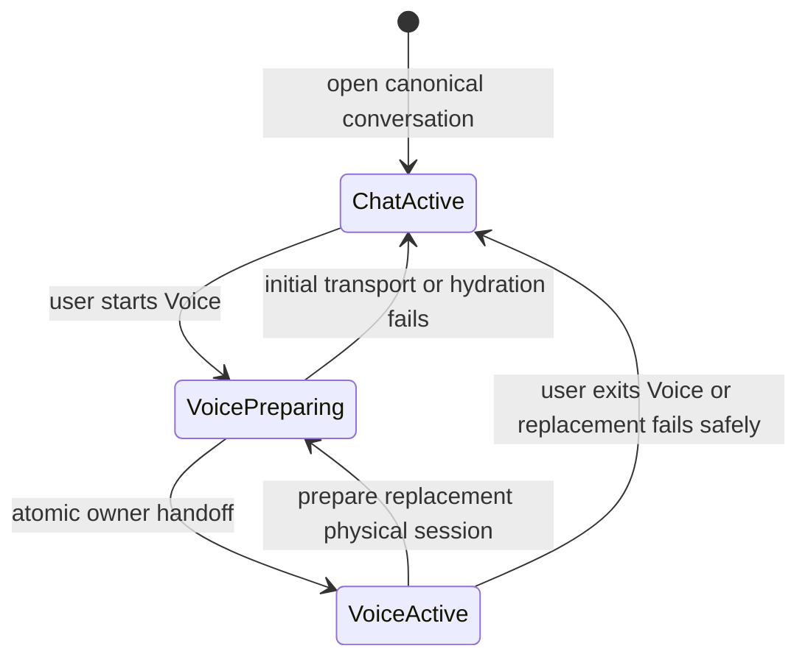
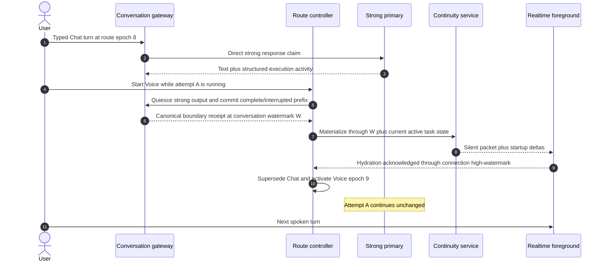
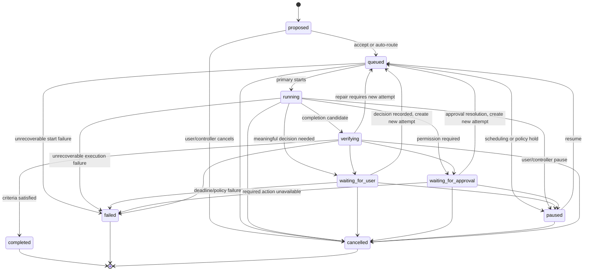
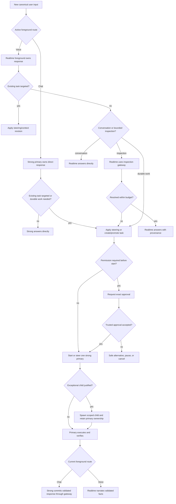
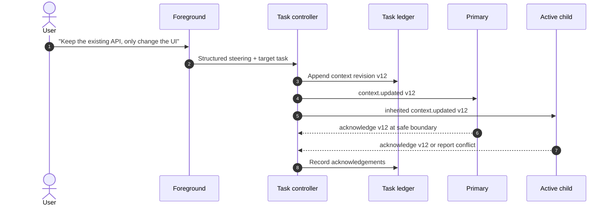
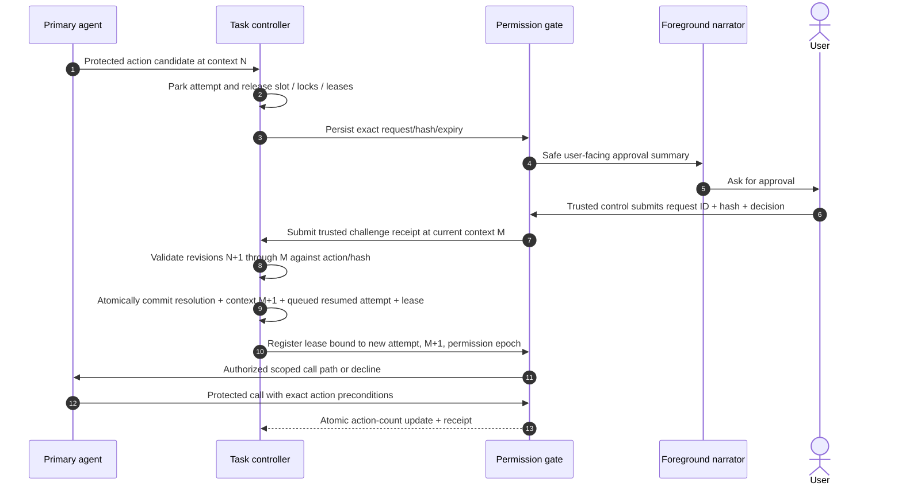
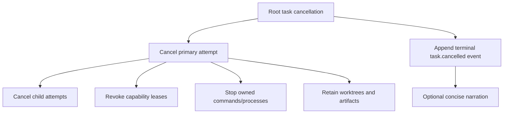
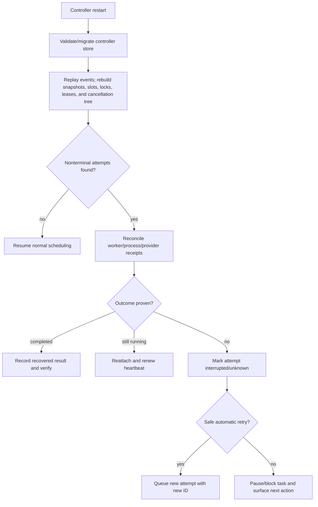

# Lifecycle and routing

**Status: Draft specification.**
**Parent:** [Zyra Voice-Agent Architecture](README.md).

## Foreground route lifecycle

A [`ForegroundRoute`](schemas/foreground-route.schema.json) decides who may produce user-facing responses for a canonical conversation. It is independent from task and execution-attempt state.

`VoicePreparing` is transport/preparation state, not an active route record. The current Chat or Voice route remains canonical while a candidate physical session applies a complete packet and all startup deltas through the hydration barrier. During first activation that owner is Chat. A successful replacement supersedes the prior route and activates a new Voice route epoch atomically with `activation_reason: replace_voice_session`. Failed preparation or replacement activates a fresh Chat route epoch/owner claim with `activation_reason: voice_preparation_failed` before direct response resumes, invalidating callbacks from the quiesced or failed route. On ordinary exit, another transaction releases Voice and activates Chat. Every predecessor `terminal_at` equals its successor `created_at`; half-open ownership intervals make the handoff instant belong only to the successor.

Rules:

1. Every non-deleted canonical conversation has exactly one `status: active` foreground route before it can accept input or output, enforced transactionally.
2. Chat assigns `response_owner: strong_primary`; Voice assigns `response_owner: realtime_foreground`.
3. The owner claim permits canonical response production only and grants no execution capability.
4. Canonical user and assistant messages bind to the accepting `foreground_route_id` and `route_epoch`.
5. A stale owner/provider event cannot append text, request speech, or advance delivery state.
6. Starting Voice while a task runs attaches that task to Voice context; it does not cancel, pause, park, restart, or release the execution attempt.
7. If strong response text is in flight, the gateway quiesces that output lane and commits a completed or explicitly interrupted canonical prefix before materializing Voice context. Voice must hydrate through that commit and every startup delta before the route swap. Commands or other task operations continue under their existing attempt.
8. A route begins active and can terminate once as `superseded`, `released`, or `failed`; its route ID, epoch, and owner claim never reactivate.
9. Exiting Voice closes/detaches media and returns the next ordinary send to a new strong Chat route epoch.

## Task versus execution attempt

A **task** represents durable user intent. A **primary agent run** is a stable private worker/session lineage for that task. An **execution attempt** is one period in which that lineage owns the canonical conversation’s single strong-primary execution slot. Their state machines remain separate.

- One task MAY have multiple attempt IDs after retry, recovery, or resume from a durable park.
- Existing Zyra may retain one `agent_run_id` across those attempt IDs; the contracts preserve that cardinality.
- One attempt belongs to exactly one task and one primary agent-run lineage.
- A task can wait for the user while another queued task takes the released primary slot.
- Agent-run states already used by Zyra (`starting`, `recovering`, `interrupted`, and others) do not become root task states.

### Execution-attempt states

```mermaid
stateDiagram-v2
    [*] --> created
    created --> queued
    created --> cancelled
    queued --> starting: acquire conversation primary slot
    queued --> cancelled
    starting --> running: private worker ready
    starting --> failed
    starting --> cancelled

    running --> parking: question, approval, pause, or safe yield
    running --> completed: completion candidate/checkpoint emitted
    running --> failed
    running --> cancelled
    running --> interrupted: process/session lost; reconcile and release

    parking --> parked: checkpoint durable, operations stopped, locks and leases released
    parking --> running: park aborted before release
    parking --> failed

    parked --> [*]
    completed --> [*]
    failed --> [*]
    cancelled --> [*]
```

`parked`, `completed`, `failed`, `cancelled`, and `interrupted` are terminal for that attempt. Resuming or recovering the task creates a new `attempt_id` with `resumes_attempt_id` and MAY reuse the stable `primary_agent_run_id` and private provider transcript. Before `parked` or any terminal release, the controller requires no active side-effecting operation, released writer locks, revoked/released capability leases, and a durable primary-slot release receipt; `parked` and `completed` also require a checkpoint. If safe release cannot be proved, another primary attempt cannot start.

Only `starting`, `running`, and `parking` hold the primary slot. See [`execution-attempt.schema.json`](schemas/execution-attempt.schema.json).

## Task states

`completed`, `failed`, and `cancelled` are terminal for that task record. A retry, follow-up, or reopened effort creates a linked task using `parent_task_id` or `supersedes_task_id`; history is never reopened in place.

## Transition authority

| Transition | Who may propose | Controller requirements |
|---|---|---|
| `proposed → queued` | Foreground, user, primary | Valid request, context revision, owner, and capability route |
| `queued → running` | Scheduler | Durable attempt created and start event acknowledged |
| `running → waiting_for_user` | Primary | Structured decision passes Balanced filtering; current attempt reaches `parked` first |
| `running → waiting_for_approval` | Permission gate | Exact scoped request; collaboration mode is ignored and current attempt reaches `parked` first |
| `running → verifying` | Primary | Completion candidate and checkpoint persisted; attempt completes and releases slot/locks/leases |
| Waiting/paused/verifying → `queued` | Controller | New attempt ID references the parked/completed attempt and current context |
| `verifying → completed` | Controller on primary evidence | Required checks passed; no stale constraints or unresolved blockers |
| Any active state → `paused` | User/controller | Durable checkpoint and safe attempt park/cancel behavior |
| Any nonterminal state → `failed` | Controller | Unrecoverable task failure recorded; current attempt terminal with slot/locks/leases released |
| Any nonterminal state → `cancelled` | User/controller | Cancellation tree invoked; current authority revoked/released; terminal event persisted |

Attempt terminal/park state, slot-release receipt, lock/lease revocations, task state/current-attempt update, and relevant outbox intent commit in one controller transaction, so no durable snapshot exposes `waiting` with live authority or `running` with a released attempt. A model never writes state directly; it emits a typed proposal that the controller validates and records.

## Routing algorithm

The controller first honors the explicit active foreground route, then classifies work inside that route:

### Direct-answer contracts

In Chat, the strong primary MAY answer without a durable task when no external state or durable execution is needed. Its response streams directly through the conversation gateway under the active Chat owner claim.

In Voice, the realtime foreground MAY answer without a durable task for explanations, planning discussion, clarification, status, and responses grounded in current context or bounded inspection. Realtime remains subject to the narrower tool boundary.

### Bounded inspection contract

The initial conservative budget is a proposal to validate through evals:

| Limit | Default |
|---|---:|
| Tool calls per user turn | 3 |
| Wall-clock inspection budget | 15 seconds |
| Total returned tool content | 64 KiB |
| Files per read/search request | 20 |
| Mutation capability | None |
| Recursive delegation | None |

The controller MUST create or promote a durable task from either surface when any of these is true:

- a write, command, test, Git mutation, deployment, or application action is required;
- the answer depends on a multi-step investigation beyond the budget;
- permission or meaningful user choice is required;
- verification requires running code or changing state;
- the user asks to continue work asynchronously;
- foreground confidence is insufficient and deeper reasoning has material value.

A quick Voice inspection is a bounded `InspectionTrace`, not a durable `Task`. A direct Chat turn can reach the same promotion transaction as soon as it needs durable execution. Promotion is a creation transaction:

1. the canonical user message already exists with its stable message ID;
2. the controller freezes the bounded inspection trace and provenance;
3. `task.proposed` creates a new durable task from the original verbatim request;
4. `task.promoted` records that the task originated from foreground inspection and attaches evidence references; it does not change task state;
5. `task.routed` selects the primary;
6. `task.queued` makes the task schedulable.

A durable task never uses `running → queued` for foreground promotion. Promotion preserves the exact request, foreground route/epoch, inspection results with provenance, attachments, recent relevant turns, and the current context version.

### Durable-task route

The task controller creates one primary run by default. In Chat, that strong role can retain the direct foreground response lane while the user remains on the Chat route. In Voice, the same execution becomes private and Realtime narrates validated facts. Switching routes changes no task ID, primary lineage, attempt ID, slot, lock, lease, or model policy. Model selection remains a policy choice based on task complexity, live availability, capability, and usage.

### Exceptional subagent route

A primary MAY request a child only with a structured `delegation_reason`:

- `independent_large_scope`
- `specialist_capability`
- `independent_verification`
- `isolated_read_only_research`
- `explicit_user_request`

The request MUST include expected benefit, objective, success criteria, context scope, tools, read/write scope, and integration owner. `speed` alone is insufficient.

Conservative defaults:

- one primary writer;
- zero children at task start;
- at most one child concurrently unless a reviewed workflow explicitly allows more;
- read-only children preferred;
- overlapping write scopes serialized or isolated in retained worktrees;
- no child-to-child delegation in the first production release.

## Typed lifecycle events

Foreground ownership changes use append-only `ForegroundRoute` revisions with a monotonic per-conversation route epoch. Preparing a provider session does not change canonical ownership. Superseding the old route, activating the new route, advancing the active foreground-route epoch watermark, and installing the gateway owner claim commit atomically. Route changes are not task-state transitions.

Execution-attempt state/authority changes use append-only [`AttemptEvent`](schemas/attempt-event.schema.json) records with a resulting snapshot. When one action changes both attempt and task state, the attempt event, task event, slot/lock/lease updates, and outbox intent commit atomically in one controller transaction with a contiguous ordered sequence range.

The canonical task event vocabulary is:

| Event | Resulting state or effect | Narration default |
|---|---|---|
| `task.proposed` | Creates task | Silent |
| `task.routed` | Records the validated foreground/primary/controller owner | Silent |
| `task.queued` | `queued` | Visual |
| `task.started` | `running` | Optional speakable acknowledgment |
| `task.promoted` | Records that a newly proposed task originated from a bounded inspection trace; no state change | Optional concise acknowledgment |
| `task.progressed` | Updates activity/checkpoint | Visual; coalesced speech only when useful |
| `task.context_updated` | Advances required context or records one owner acknowledgement | Silent |
| `task.artifact_attached` | Adds durable evidence/reference | Silent |
| `task.decision_required` | `waiting_for_user` | Speakable, noninterrupting unless urgent |
| `task.decision_resolved` | `queued` for a new attempt, or a terminal/safe alternative | Silent confirmation unless user needs it |
| `task.approval_required` | `waiting_for_approval` | Always surfaced; speech follows privacy policy |
| `task.approval_resolved` | `queued` for a new authorized attempt, or a terminal/safe alternative | Concise outcome when useful |
| `task.blocked` | Records blocker; state chosen by controller | Speakable |
| `task.paused` | `paused` | Speakable when user-visible |
| `task.resumed` | `queued` | Usually visual |
| `task.verification_started` | `verifying` | Usually visual |
| `task.completed` | `completed` | Speakable conclusion |
| `task.failed` | `failed` | Speakable failure and next option |
| `task.cancellation_requested` | Persists cancellation intent while cleanup runs | Visual |
| `task.cancelled` | `cancelled` after cleanup/revocation | Concise confirmation |

Every event carries a unique event ID, controller transaction ID, monotonic controller-ledger sequence, per-task revision, task ID, conversation ID, context version, timestamp, actor, attempt ID when applicable, and bounded payload. Appends use compare-and-swap against the expected task revision. Event application is idempotent.

## Steering and context revisions

A new user correction is recorded before delivery to a worker:

Rules:

1. The controller identifies the target conversation, task, or subtree.
2. New constraints propagate to active descendants unless marked local to one owner.
3. Approvals never propagate as ordinary constraints; they follow capability-lease rules.
4. A completion event is rejected unless the primary and every evidence-producing active child have acknowledged their highest relevant context versions.
5. Unaffected task branches continue when safe.

## Decisions

A decision request asks the user to choose among materially different valid outcomes. The primary sends it to the controller; children report uncertainty to the primary first.

The default **Balanced** involvement policy asks the user about:

- product behavior or experience choices;
- meaningful tradeoffs without a clear evidence-based winner;
- scope expansion or abandonment;
- unresolved constraint conflicts;
- irreversible or externally consequential intent;
- assumptions likely to invalidate substantial work.

The agent resolves routine implementation details, reversible choices, and evidence-backed defaults. Future involvement levels MAY alter when decisions are requested:

- Mostly autonomous
- Balanced
- Highly collaborative
- Tightly controlled

These settings cannot alter permission requirements.

## Approvals

An approval authorizes a defined action or capability. It includes exact scope, risk, expiry, and whether it is one-time or session-bound.

Approval text MUST avoid secrets while preserving enough detail for informed consent. Speech can discuss or navigate to the request but cannot authorize it in the reference profile. A user’s general autonomy preference is never treated as approval. Lease material remains inside the trusted gate; the model receives a callable authorized path, not a bearer token.

## Concurrency and writer ownership

Tasks MAY remain active concurrently when their read/write scopes and required authority do not conflict. Foreground route ownership is orthogonal: switching between Chat and Voice neither consumes nor releases the strong-primary execution slot. The initial production policy allows at most one active strong-primary attempt per canonical conversation. Another queued task can take that slot only after the prior attempt is durably `parked` or terminal and its slot, writer locks, in-flight operations, and capability leases are released. A task-state label such as `waiting_for_user` does not itself prove release. Foreground read-only inspection and safely isolated existing work can continue around it. The controller enforces:

- one active strong-primary attempt per canonical conversation in the initial release, enforced by a transactional uniqueness constraint on acquired slot leases;
- one integration owner per root task;
- one active writer per overlapping shared scope;
- retained worktrees for isolated writers;
- deterministic lock ordering to avoid deadlock;
- child cancellation under parent cancellation;
- independent continuation of unaffected branches;
- bounded concurrency based on provider and user policy.

A waiting task does not freeze the conversation or unrelated tasks. An active task also does not prevent a Chat-to-Voice handoff; Voice attaches to its current materialized state while execution continues.

## Idempotency

Every side-effecting operation MUST produce an [`OperationIntent`](schemas/operation-intent.schema.json) with an idempotency key derived from conversation ID, task/attempt IDs when present, operation class, and stable operation identity. In one controller transaction, the system records the intent, exact precondition/action hash, capability lease/action-count reservation, and outbox entry before execution; the eventual external receipt closes that same intent. Canonical assistant-message commits use deterministic narration/provider-item IDs through the same pattern.

On timeout:

1. query the provider/tool for a receipt when possible;
2. mark the operation `outcome_unknown` when proof is unavailable;
3. do not replay consequential work automatically;
4. move the task to a safe waiting or failed condition;
5. ask the user only when the unresolved outcome affects their decision.

## Cancellation

Cancellation is hierarchical:

The controller persists cancellation intent before signaling workers. Cleanup failures are recorded and surfaced; they do not rewrite the terminal user intent.

## Completion authority

A primary [`CompletionCandidate`](schemas/completion-candidate.schema.json) contains:

- outcome summary;
- acceptance criteria with pass/fail evidence;
- changed artifacts and source references;
- tests/checks performed and exact results;
- remaining assumptions, fallback behavior, and known gaps;
- per-owner context acknowledgement evidence for the primary and accepted child evidence;
- pending cleanup or retained worktrees;
- suggested user-facing and speakable summaries.

The controller moves to `verifying`, validates required evidence, and then records `completed`. Child completion can never complete the root task.

## Recovery after restart

Recovery MUST replay and preserve the exact pre-crash foreground route for audit, then atomically supersede it with a fresh Chat route epoch and owner claim before accepting input or output. A later explicit Voice activation creates another fresh route after hydration. This rekey makes every delayed pre-crash provider callback stale. Recovery also preserves pending decision options, exact approval action/hash/scope, permission epoch, revocations, writer ownership, and narration delivery watermarks. Expired approvals and leases are not revived. Orphaned slot/lock/lease authority is revoked before scheduling. Automatic attempt replacement requires the old attempt to be terminal or durably parked and is permitted only for operations proven absent or safely idempotent. Unknown consequential operations and unknown-outcome speech are never replayed automatically.
