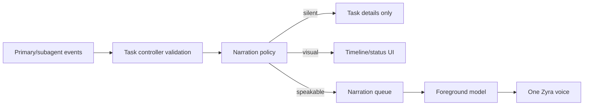
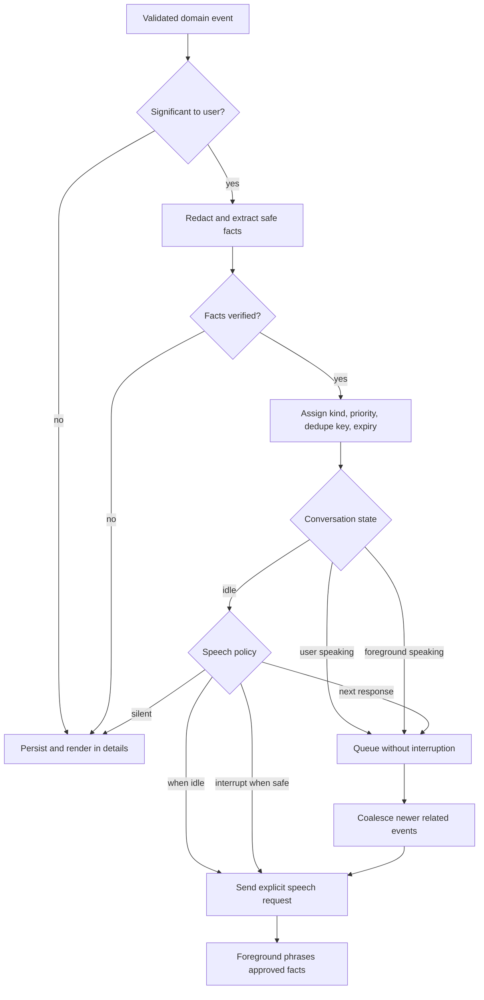
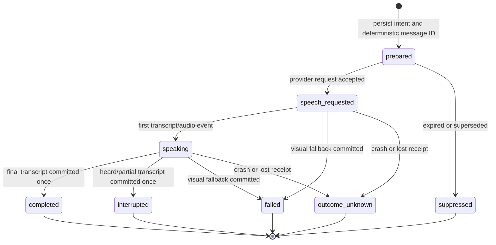
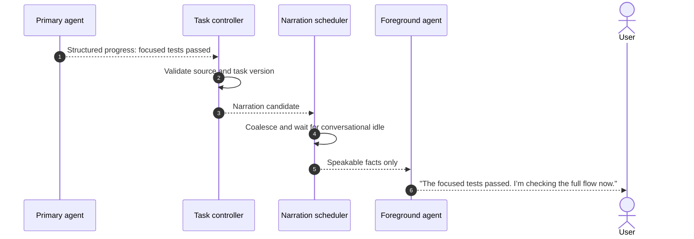
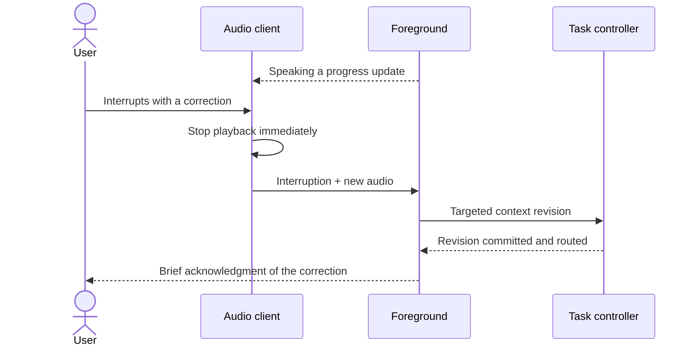
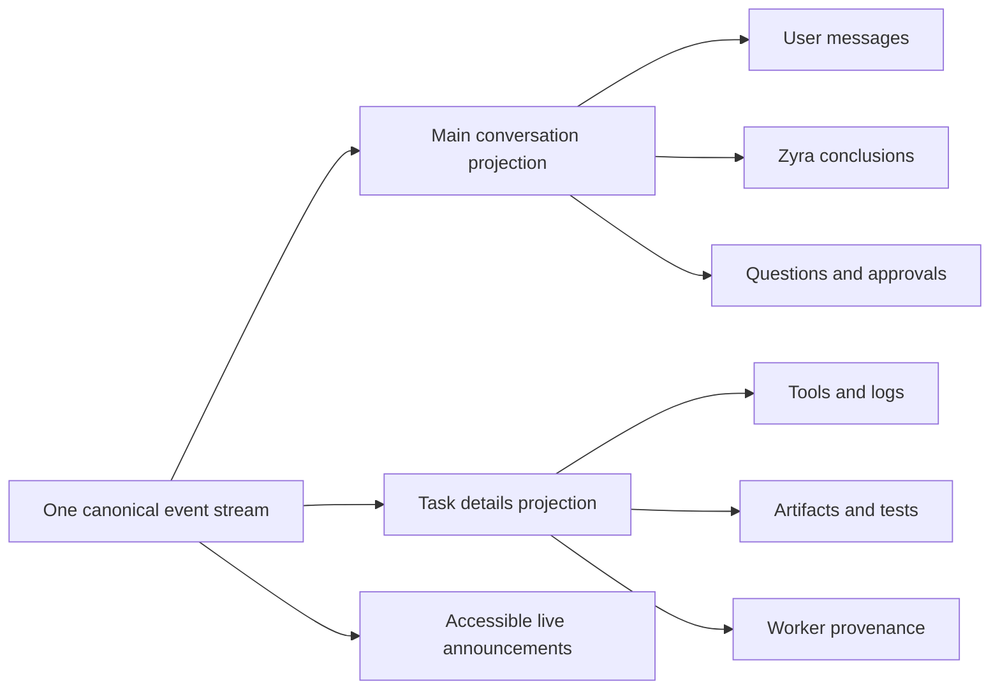

# Narration and interaction

**Status: Draft specification.**
**Parent:** [Zyra Voice-Agent Architecture](README.md).

## One conversational identity

The user speaks with Zyra. Worker names, provider names, tool calls, and internal routing do not become competing speakers. The foreground model is the sole conversational narrator across voice and text output.

Background agents produce structured events and private evidence. The narration scheduler decides when verified facts should enter the conversation. The foreground turns approved facts into natural language.

## Speech eligibility

| Content | Main conversation | TTS | Task details |
|---|---:|---:|---:|
| Natural answer to the user | Yes | Yes in audio mode | Optional |
| Useful task start acknowledgment | Yes | Optional | Yes |
| Material progress or changed ETA | Optional | Coalesced | Yes |
| Meaningful user decision | Yes | Yes when safe | Yes |
| Permission approval | Yes | Yes when safe and sufficiently specific | Yes |
| Blocker or failure | Yes | Yes | Yes |
| Verified completion and remaining gaps | Yes | Yes | Yes |
| Raw tool call/arguments | No | No | Yes, redacted |
| Command output and logs | No | No | Yes, bounded/redacted |
| Source code or diff body | No | No | Yes |
| Tests executing normally | Usually no | No | Yes |
| Internal worker discussion/reasoning | No | No | Private record only |
| Unverified child claim | No | No | Yes, marked unverified |

## Narration pipeline

The scheduler is deterministic. The foreground model may improve phrasing but cannot decide that a private event deserves speech.

## Priorities and timing

| Kind | Default priority | Default speech behavior |
|---|---|---|
| Start acknowledgment | Normal | Next response or immediate when idle |
| Routine progress | Low | Visual; combine with later update |
| Material progress | Normal | Speak when idle if the user requested updates |
| Decision required | High | Ask after the current user/assistant turn |
| Approval required | High | Ask after the current turn; never bury |
| Blocker | High | Speak when idle |
| Failure | High | Speak when idle with a useful next option |
| Completion | High | Speak after verification |
| Safety-critical revocation | Urgent | Interrupt when safe |

Normal progress MUST NOT interrupt the user. The scheduler SHOULD combine related updates by task and dedupe key. A newer state supersedes an unsaid older state, such as replacing “tests are running” with “tests passed.”

Conservative debounce defaults to evaluate:

- routine progress: wait up to 15 seconds for coalescing;
- repeated same-kind update: suppress unless facts changed;
- completion/failure/blocker: no artificial delay after the current speech turn;
- expired progress: never replay after reconnect.

## Delivery and canonical-message contract

A [`NarrationDelivery`](schemas/narration-delivery.schema.json) binds one narration item to one deterministic canonical assistant message ID, one physical session generation, and provider speech/item identities.

Rules:

1. The scheduler derives `canonical_message_id` deterministically from `narration_id` and persists `prepared` before provider submission.
2. Streaming text remains provisional presentation state.
3. Final or interrupted foreground transcript commits idempotently through the conversation gateway using that message ID; the primary never performs the commit.
4. Provider item ID, speech request ID, physical session generation, and measured playback duration attach to the delivery record.
5. The narration watermark advances only after a terminal delivery has either a canonical message commit receipt or an explicit `suppressed/not_applicable` result.
6. If the process loses certainty after speech was requested, recovery records `outcome_unknown`, does not replay speech automatically, and surfaces delivery uncertainty visually.
7. A newer deduplicating narration can supersede only a delivery that has not requested speech.
8. Ordinary foreground conversational responses use the same provider-item-to-canonical-message idempotency rule, even when no task narration item exists.

## Explicit speech contract

Only a validated [`NarrationItem`](schemas/narration-item.schema.json) with `contains_sensitive_detail: false` and at least one approved `speakable_fact` can request app-injected speech. The adapter uses its provider’s explicit-speech route when available. The adapter uses its provider’s explicit-speech route when available. If unavailable:

1. commit the redacted `visual_summary` once through the conversation gateway using the deterministic narration message ID;
2. mark audio delivery as unavailable/failed;
3. do not fake playback state;
4. do not convert the event into a synthetic user message;
5. advance the narration watermark only after the commit receipt;
6. continue the task and preserve the delivery record for inspection.

## Background update sequence

The primary does not author the final spoken turn. Its suggested summary is evidence and phrasing input.

## Interruption and barge-in

Voice interactions MUST support user interruption:

1. stop local playback promptly;
2. record how much audio was actually presented when the provider supports playback tracking;
3. preserve the partial assistant transcript with interruption metadata;
4. prioritize the new user utterance;
5. cancel obsolete queued narration items;
6. steer the targeted active task when the new utterance changes its constraints;
7. keep unrelated task work running when safe.

A transcript must reflect what was spoken or interrupted, rather than silently replacing an interrupted answer with its unplayed tail.

## Multimodal message semantics

Speech, typed text, and images share one message pipeline:

- each user message gets a stable client message ID;
- attachments are stored once and referenced from the canonical message;
- the same permission and task-routing policy applies regardless of modality;
- image interpretation uses a provider route that actually supports image input;
- provider fallback does not create a second conversation;
- private primary results become validated task events and narration items; only the foreground/conversation gateway commits the resulting user-facing assistant message to the canonical timeline.

A realtime adapter that cannot accept images MAY route the image-bearing turn through the primary/ordinary multimodal agent and then return a safe result to the foreground. The UI MUST disclose the active route in task details without presenting a second assistant identity.

## Transcript contract

- Partial user and assistant text appears immediately when available.
- Final provider item/turn identity determines idempotent completion.
- Canonical storage contains final messages and explicit interruption state.
- Duplicate deltas from reconnect/replay do not create duplicate messages.
- Transcript arrival does not move unrelated controls or steal manual scroll position.
- Long transcripts preserve newest content, allow manual review, and indicate hidden overflow without destructive ellipsis.

These are presentation requirements derived from the current Voice Lab findings; surface-specific animation remains owned by Desktop.

## Conversation and task presentation

The main timeline contains user-visible turns. Task mechanics remain inspectable without flooding that timeline:

A user can open task details for exact commands, diffs, logs, artifacts, child runs, and usage. Closing task details does not alter task state.

## Output modes

- **Audio:** approved foreground responses and narration play as speech and render as text.
- **Text:** the same responses render without local audio playback. A provider MAY still require an audio-capable transport; the adapter reports that implementation detail.
- **Muted:** the session can remain connected while local playback is suppressed. The UI MUST distinguish muted output from provider text-only capability.

Changing voice after a provider has emitted audio may require a new physical session. Logical conversation identity remains unchanged.

## Silent activation

A newly connected or resumed session starts without a greeting. Resume context is reference data. Zyra waits for the user unless a pending approval, decision, blocker, or urgent safety event already qualifies for narration.

“Catching up” is used only when:

- hydration is materially stale;
- the user asks a history-dependent question before current context arrives;
- answering immediately would risk contradiction.

## Accessibility

Voice mode remains fully operable without hearing, speech, pointer input, or animation:

- every spoken response has a synchronized text equivalent;
- microphone, mute, start/stop, settings, task details, and “latest” controls are keyboard accessible;
- status changes use concise live regions and do not repeatedly announce streaming deltas;
- reduced-motion settings disable nonessential motion without hiding state;
- color is never the only status signal;
- focus remains stable when transcripts and task updates arrive;
- images require accessible labels or user-supplied context where possible;
- user speech is never required for approvals or decisions;
- errors identify a recovery action rather than relying on sound alone.

## Privacy in speech

The scheduler blocks TTS for secrets, credentials, hidden file contents, sensitive paths, private child transcripts, and unredacted approval arguments. A visual approval can show more detail behind an intentional disclosure control while speech uses a safe summary.

Headphones and physical environment are outside software control, so “speakable” means safe under the configured policy, not universally private.

## User controls

Users MUST be able to:

- end the physical voice session without cancelling tasks;
- mute output and microphone independently;
- stop a task explicitly;
- pause or resume a task;
- inspect why work was delegated;
- view pending decisions and approvals;
- change involvement mode independently from permission mode;
- disable automatic progress narration;
- review what Zyra believes is currently active.
