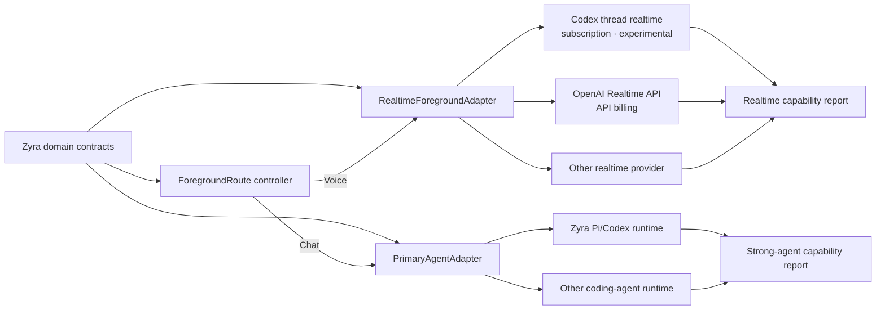
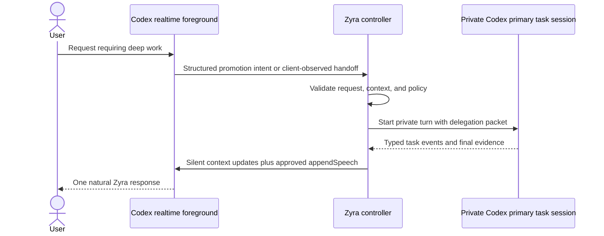
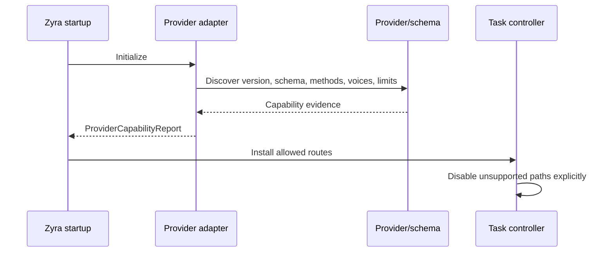

# Provider adapters

**Status: Draft specification with documented and experimental provider facts.**
**Parent:** [Zyra Voice-Agent Architecture](README.md).
**Facts reviewed:** 2026-08-02.

## Adapter rule

The core architecture depends on capabilities, not provider names. Every concrete adapter emits its own [`ProviderCapabilityReport`](schemas/provider-capabilities.schema.json) at startup with exactly one `adapter_role`: `realtime_foreground` or `strong_agent`. Reports never merge separate providers, authentication modes, versions, evidence, or expiry windows. Required capabilities fail closed; optional capabilities select an explicit fallback.

## Capability matrix

This matrix distinguishes public documentation from local interoperability observations. Provider behavior can change; runtime discovery wins over this table.

| Capability | Generic OpenAI Realtime API | Codex thread realtime through App Server | Zyra requirement |
|---|---|---|---|
| Audio over WebRTC | Documented | Documented experimental method | Required for initial Desktop audio mode |
| Transcript item/delta identity | Documented provider events | Version-specific realtime item/transcript notifications | Required for idempotent canonical delivery |
| Text input | Documented | `thread/realtime/appendText` documented | Required |
| Image input in realtime conversation | Documented by generic Realtime | No thread realtime append-image method documented | Optional; route through a private primary task session |
| Arbitrary client function tools | Documented by generic Realtime | No equivalent arbitrary client-tool registration in the documented thread realtime surface | Optional; never assume parity |
| Seed startup context | Generic conversation/session events | V3 `initialItems` documented | Required for seamless resume or use adapter fallback |
| Silent context append | Generic conversation item path | `appendText` documented; response behavior must be tested per version | Required for delta hydration or reconnect with fresh packet |
| Explicit speech from text | Generic response creation | `thread/realtime/appendSpeech` documented | Preferred for selective spoken background results; visual fallback required |
| Voice-list discovery | Provider dependent | `thread/realtime/listVoices` documented | Required before exposing a provider voice selector |
| Sideband/control path | Documented for supported server control patterns | App Server control connection is adapter-specific | Required when client-managed routing depends on it |
| Session expiry signal/limit | Documented session limits | Version-specific | Required as explicit supported/unsupported/unknown capability; timer fallback allowed |
| Direct strong Chat turn | Ordinary model/agent response path | `turn/start` documented | Required for Chat; output must be interceptable by the conversation gateway |
| Structured tool/activity stream | Provider/runtime dependent | Turn/item events | Required for normal coding-chat activity projection |
| Private coding task turn | Separate agent/API path | `thread/start` + `turn/start` documented | Required when Realtime owns Voice |
| Private task-output stream | Provider/runtime dependent | Ordinary turn stream | Required; remains noncanonical whenever Realtime owns the foreground route |
| Steering active coding turn | Provider dependent | `turn/steer` documented | Recommended |
| Cancel realtime response | Provider dependent | Version-specific; local playback stop is distinct | Optional only with immediate local stop and stale item/generation quarantine |
| Interrupt coding turn | Provider dependent | `turn/interrupt` documented | Required |
| Voice usage warning/event | Provider dependent | Provider/session events are version-specific | Recommended; local estimate fallback |
| Task usage/rate limits | Provider dependent | App Server account/rate-limit APIs and turn usage | Required for operational display |
| Checkpoint/session resume | Provider dependent | Thread resume exists; exact task checkpoint semantics are adapter-owned | Optional; deterministic controller checkpoint remains authoritative |

Each report records `support`, stability, exact method, evidence class, verification time, and notes for every branch used by routing or UI. The strong-agent report separately proves direct Chat turns, gateway-controlled output, structured tool events, and private task sessions. `unknown` never behaves as supported. Audio mode is disabled unless session, audio input/output, transcript identity, startup context strategy, interruption, and required transport capabilities validate. Unsupported realtime response cancellation requires immediate local playback stop plus stale provider item/generation quarantine; the UI must not imply server-side cancellation. Image attachment controls are disabled unless direct realtime image input or private-primary image input validates. A report is valid only when `observed_at < expires_at`, every capability evidence time is no later than `observed_at`, and the current clock remains before expiry. An expired, future-evidence, or different adapter/provider-version report is discarded and regenerated. The UI shows the normalized fallback or reason rather than guessing from provider name.

## Codex subscription-backed adapter

### Public protocol foundation

The open-source Codex App Server describes a JSONL JSON-RPC interface used for rich Codex clients. Its public README documents:

- `initialize` / `initialized` connection handshake;
- `thread/start`, `thread/resume`, and `thread/fork`;
- `turn/start`, streaming item events, `turn/steer`, and `turn/interrupt`;
- experimental `thread/realtime/start`;
- experimental `thread/realtime/appendAudio`, `appendText`, `appendSpeech`, and `stop`;
- WebRTC SDP exchange for supported realtime versions;
- V3 startup `initialItems` and client-managed handoff options;
- version-specific schema generation through `generate-ts` and `generate-json-schema`.

Sources: [OpenAI Codex App Server](https://developers.openai.com/codex/app-server) and the [open-source App Server README](https://github.com/openai/codex/blob/main/codex-rs/app-server/README.md).

The adapter MUST generate or inspect schemas from the installed Codex version and SHOULD pin its tested compatibility range. Experimental methods can change without the stability expected from a general availability API.

OpenAI’s [ChatGPT Voice documentation](https://developers.openai.com/codex/features/voice) also describes the first-party product starting longer task threads, checking active threads, steering them, and returning progress, blockers, and results to the voice conversation under the task’s normal permissions. Zyra treats that as product precedent rather than a complete third-party integration contract.

### Subscription versus API billing

Codex thread realtime uses the supported Codex/ChatGPT account path available to the App Server. Generic OpenAI Realtime uses API credentials and API billing. They are separate adapters with different capabilities, authentication, limits, and terms.

The implementation MUST NOT:

- pass a subscription token to generic API endpoints;
- claim generic Realtime function-tool support exists in Codex thread realtime;
- identify Zyra as an unrelated first-party client;
- require users to expose or paste auth tokens;
- hide which billing/usage path is active.

### Recommended session configuration

The Codex adapter SHOULD:

1. initialize App Server with truthful Zyra client metadata;
2. opt into experimental methods only when the installed schema exposes them;
3. create or resume a provider realtime thread mapped to the canonical Zyra conversation only after the user starts Voice, while keeping its provider ID non-canonical and separate from direct Chat and private primary execution threads;
4. use V3 only after capability validation;
5. seed a bounded prepared resume packet through supported startup context;
6. set client-managed handoffs when Zyra’s controller owns routing and narration;
7. keep provider audio transport active when required even if local playback is muted;
8. map all provider IDs to stable domain IDs;
9. close the physical realtime session without stopping the canonical task thread.

Exact fields remain inside the adapter because the method is experimental.

### Input semantics

Public App Server documentation says `appendText` appends role-bearing text and `appendSpeech` appends text that the realtime model should speak. Interoperability tests against one V3 build observed that `appendText` alone acts as context and does not reliably request a reply, while `appendSpeech` is the explicit spoken-output route. This observation MUST be regression-tested and MUST NOT be generalized to the generic Realtime API.

Microphone/VAD response generation, ordinary Codex `turn/start`, context append, and explicit speech are separate operations.

### Images

The documented Codex thread realtime surface has no `appendImage` method. A normal Chat image turn therefore uses the strong multimodal route directly when supported. A Voice image turn uses a multimodal turn inside the private primary task session when native realtime image input is unavailable. Its stream remains private task evidence; after controller validation, a narration item returns safe facts to Realtime. Only the conversation gateway commits the active owner’s final user-facing message.

If a future installed schema exposes native image input, capability discovery can enable it without changing the domain contract.

### Client-managed routing

Subscription-backed V3 does not expose the same arbitrary named client-tool surface as generic API Realtime. Zyra therefore manages task promotion outside the realtime provider session. Foreground Chat/Voice ownership is already fixed by the user’s explicit surface action:

The exact promotion signal requires an isolated compatibility proof before production. If the provider cannot emit a reliable structured handoff, Zyra MAY use deterministic client routing from canonical user input or an ordinary classification turn. It must preserve the two-role architecture and record the route.

### Session generation and cleanup

Every start creates a generation token. A session that becomes foreground also binds a new Voice route epoch. SDP, media, data-channel, transcript, and close callbacks carry or capture both identities. Replaced generations or superseded routes cannot mutate current state. Stop is idempotent and owns:

- realtime provider stop request;
- peer connection and data-channel closure;
- microphone track stop;
- audio element detachment;
- App Server subscription/process cleanup when adapter-owned;
- pending request rejection;
- usage checkpoint emission.

## Generic OpenAI Realtime API adapter

OpenAI’s public Realtime documentation describes speech-to-speech sessions over WebRTC/WebSocket/SIP, conversation items, image input, function tools, response creation, usage events, and session limits. The OpenAI Agents SDK adds realtime handoffs, tools, approvals, local history, and usage aggregation.

Sources:

- [Realtime conversations](https://developers.openai.com/api/docs/guides/realtime-conversations)
- [OpenAI Agents SDK: Realtime agents guide](https://openai.github.io/openai-agents-python/realtime/guide/)

This adapter is useful for provider-neutral validation and deployments using API billing. It MUST expose API cost and rate limits independently from a ChatGPT/Codex subscription.

The generic API can implement foreground inspection tools directly through function calling. Zyra still applies the same controller capability policy; model-callable availability is not authorization.

## Strong primary-agent adapter

The first strong adapter reuses Zyra’s existing Pi/Codex execution and fleet machinery through two explicit lanes:

- **Direct Chat:** an ordinary strong turn accepts canonical text/image input while `strong_primary` owns the foreground route. The adapter exposes text and structured tool/item events to the conversation gateway, which validates the route claim and commits canonical assistant text once.
- **Private execution:** a server-owned task session receives a delegation packet while Realtime owns Voice or when work continues asynchronously. Provider output becomes private records and typed task events rather than direct assistant messages.

It maps:

- active Chat route + canonical user message → gateway-controlled direct strong turn;
- normalized tool/item events → bounded redacted timeline activity;
- delegation packet → private primary task session linked to canonical conversation/task IDs;
- context revision → steer or queued follow-up;
- approval request → Zyra permission gate;
- usage → task-attributed usage summary;
- completion candidate → controller verification.

The adapter MUST quarantine output from stale route epochs, keep provider thread/turn IDs as provenance, and preserve canonical Zyra conversation/task IDs. Starting Voice changes the output lane without cancelling the active primary attempt.

## Capability negotiation

Required checks include:

- authentication mode and account eligibility;
- direct strong Chat turns, gateway-controlled output, and structured tool events;
- transport availability;
- supported realtime version;
- input/output modalities;
- startup context and context append;
- explicit speech;
- ordinary text/image task input;
- steering and interruption;
- usage events/endpoints;
- provider model/voice availability.

A cached report has an observation timestamp and adapter/provider version. A version change invalidates the cache.

## Error normalization

Adapters map provider failures into stable categories:

- `authentication_required`
- `feature_unavailable`
- `incompatible_protocol`
- `session_limit_reached`
- `agent_usage_limit_reached`
- `transport_failed`
- `permission_required`
- `request_rejected`
- `provider_overloaded`
- `cancelled`
- `unknown_outcome`

Provider messages remain available in redacted task details. User-facing and spoken errors use actionable safe language.

## Adapter acceptance suite

Every realtime adapter must pass:

- connect/ready/stop and repeated stop;
- stale-generation event rejection;
- user/assistant transcript identity and deduplication;
- interruption and playback stop;
- silent resume seed and delta hydration;
- explicit speech or declared visual fallback;
- output mute without false text-only claims;
- usage event mapping;
- provider limit/error mapping;
- complete media/process cleanup.

Every primary adapter must pass:

- direct Chat response streaming and exactly-once gateway commit;
- structured tool activity projection with raw payload redaction;
- stale Chat route output rejection after Voice activation;
- active task continuation across Chat-to-Voice handoff;
- verbatim request preservation;
- image/text route where advertised;
- steering context acknowledgement;
- approval pause/resume;
- cancellation and unknown-outcome handling;
- completion evidence and usage mapping;
- restart/reconciliation.
