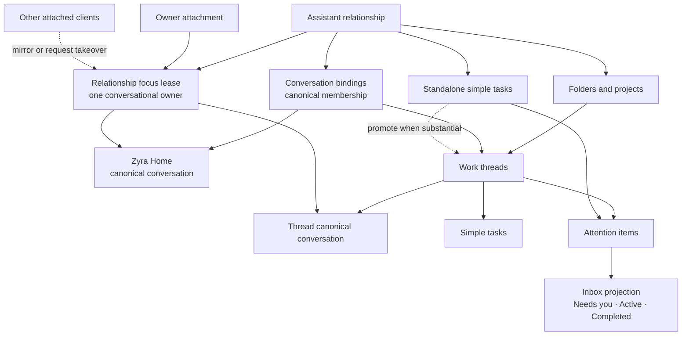
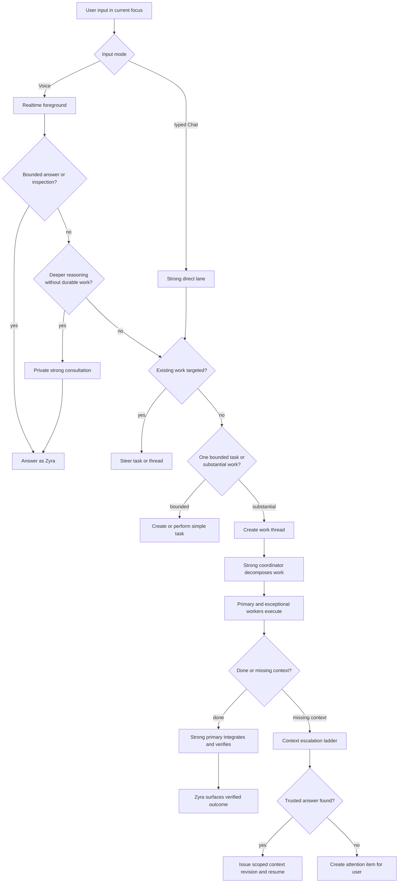
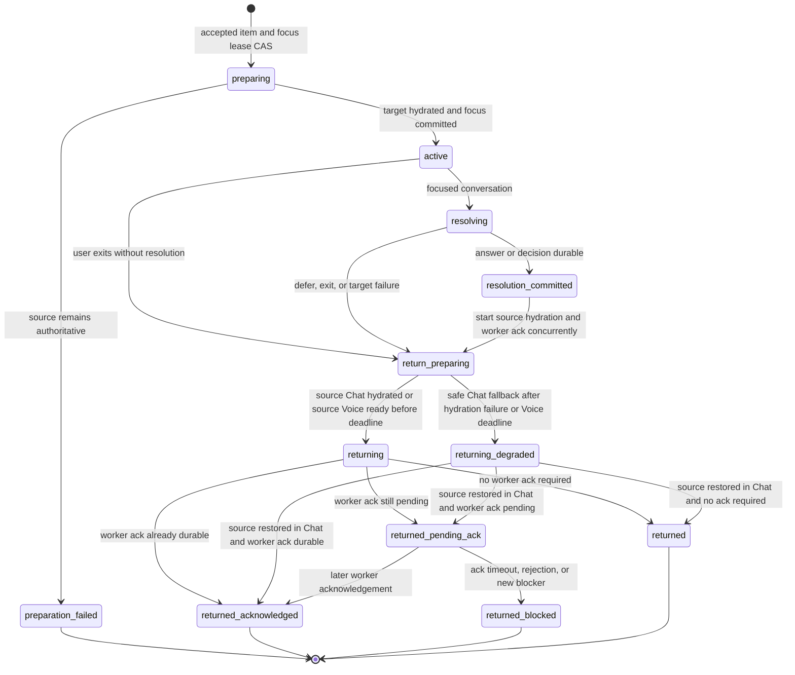

# Phase Two — relationship-first interaction

**Status: Draft Phase Two specification. Implementation begins only after the Phase One release gates pass.**
**Parent:** [Zyra Voice-Agent Architecture](README.md).
**Decision:** [ADR-0008](../../adr/0008-offer-relationship-first-interaction-as-an-optional-second-phase.md).

This document defines the optional second product phase that gives Zyra a persistent-assistant or “Jarvis-like” interaction posture. The user can address Zyra immediately, substantial work can branch into background work threads, and Zyra can carry the user into and back out of those threads through natural Voice conversation.

“V1” and “V2” in this document name **product interaction profiles**. They are not JSON Schema, resume-packet, provider-protocol, or database versions.

## Two independently usable product phases

| Product phase | Interaction profile | Home surface | Status |
|---|---|---|---|
| **Phase One / V1** | `conversation_scoped` | User opens or creates a canonical conversation, then optionally starts Voice inside it | The architecture defined by the rest of this package; must ship and remain usable independently |
| **Phase Two / V2** | `relationship_first` | User opens a permanent Zyra Home channel, talks immediately, and lets substantial work become scoped threads | Optional additive layer defined here; implementation follows Phase One |

Phase Two does not retire Phase One. A user may keep the conversation-scoped profile, opt into the relationship-first profile, or return to Phase One later. Profile changes alter navigation, focus, and orchestration presentation; they do not rewrite messages, tasks, approvals, artifacts, or worker history.

## Outcome

Phase Two should feel like one continuous working relationship:

1. The user can type or speak to **Zyra Home** without selecting a thread first.
2. Zyra can answer, privately consult the strong role, continue known work, or launch substantial work in a background thread.
3. A work thread is a conversation-first, folder-addressable chunk of work containing activity, decisions, files, results, and zero tasks only while discussing/preparing; background execution requires at least one durable task.
4. Running work threads and standalone tasks remain visible through a compact active-work strip and a hybrid Inbox.
5. Background workers ask the strong coordinator for missing context before the user is interrupted.
6. When user input is genuinely required, Zyra offers a short, purpose-bound visit into the relevant thread.
7. The same conversation canvas, Voice presence, and composer remain visually stable while scope changes.
8. After the answer is committed, Zyra restores the prior Home conversation within an independent bounded return deadline. A late worker acknowledgement updates the source thread asynchronously; timeout/failure creates a new blocker without trapping the user.
9. Existing canonical conversations and tasks remain searchable and actionable in either profile; V1 can expose Phase Two Home/thread conversations without implementing relationship orchestration.

## Product posture

Phase Two is a **relationship feed plus scoped work**, not a lifetime transcript fed wholesale to one model. The persistent element is Zyra’s logical identity and the user’s direct entry point. Canonical messages still belong to exactly one conversation. Work, context, authority, retention, and deletion remain scoped.

The product follows three rules:

- **Express first, organize when useful.** Casual discussion creates no task or thread by default.
- **Surface work when it matters.** Routine mechanics stay inside the thread; attention and verified outcomes return to Home.
- **Preserve one speaker.** Strong consultations and background workers never become competing user-facing personalities.

## Domain model



### Assistant relationship

An **AssistantRelationship** is the stable relationship aggregate for one local **user space**. The controller creates `user_space_id` once for the current OS-user-owned Zyra data store/installation; it is distinct from prompt `/profile` overlays, provider accounts/authentication, projects, model choices, and interaction profiles. The initial implementation enforces a unique `{user_space_id → relationship_id}` mapping and one current `home_generation`. It groups Zyra Home, folder/thread bindings, attention projections, relationship preferences, and one relationship-wide conversational focus lease. From milestone 9 onward, the selected product interaction profile lives in a revisioned user-space `InteractionProfilePreference` that can exist without an AssistantRelationship; pure Phase One before that milestone uses implicit `conversation_scoped` and no such record. The relationship mirrors its active revision only after V2 bootstrap. It is not a message ledger and does not grant execution authority.

A revisioned **RelationshipConversationBinding** is the canonical membership source. It binds relationship, canonical conversation, role (`home`, `work_thread`, or `ordinary_reference`), optional work-thread/folder/project IDs, source (`created`, `user_attached`, or `migration`), source catalog identity/manifest, status, and timestamps. Membership does not grant retrieval. Every Home/work thread, active-strip item, Inbox source, and relationship receipt must resolve through a current binding. Legacy migration creates bindings from a verified ordered manifest. Every verified conversation backing a running/actionable task, attention source, active-strip row, Inbox item, or receipt receives `ordinary_reference` when Home/work-thread classification is ambiguous. `unbound` is reserved for missing/unverifiable sources, which are excluded from V2 projections; any such source that is running or actionable blocks V2 activation while remaining available through V1. Migration never guesses a work-thread classification.

Only the focus-lease owner may move the relationship’s conversational/Voice focus. Other attached clients may inspect projections, request explicit takeover, or continue Phase One conversations that do not conflict; they cannot silently supersede the owner’s routes or move its canvas.

A takeover request names requester attachment, observed lease revision/generation, requested target, reason, and expiry. The current owner explicitly yields after quiescing output, or the controller applies a documented expiry/disconnect policy; silent heartbeat loss never lets two owners overlap. One CAS transaction terminalizes the old lease/owner attachment, supersedes or degrades its physical Voice session, increments focus generation, activates the new owner/route binding, and returns winner/loser receipts. Old generations reject input, output, speech, visits, and returns. Mirror clients receive projections only and cannot accept attention, switch scope, or drive Voice until they own the lease.

A nonretired relationship always has one current active-or-parked focus snapshot but may have zero live client owners while detached. After the disconnect grace period, the controller parks the lease, preserves the logical conversation/return anchor, supersedes physical Voice, and accepts no relationship interaction. Reattachment or takeover CAS-claims a fresh generation before input/output. Thus there is at most one active owner and exactly one whenever a relationship turn is accepted.

### Zyra Home

**Zyra Home** is a distinguished canonical conversation and the default V2 entry point. It has ordinary canonical messages, route epochs, retention, and deletion safeguards. It can reference work in other conversations without copying their full transcripts.

Home cannot be directly deleted while it is the active relationship entry. **Reset Home** is an explicit trusted-control maintenance operation allowed only while the requesting attachment owns active Home focus and no FocusVisit is nonterminal or can still return there. Speech may open the control but cannot confirm it. If Home Voice is active/preparing, Reset first requires the ordinary Return to Chat receipt, closed physical session/media, and a fresh quiescent Chat route.

1. One controller transaction validates relationship/Home-Chat-route/focus/visit/operation/relationship-receipt/narration-delivery heads plus absence of physical Realtime, appends a `HomeResetIntent`, and installs a generation-bound `reset_in_progress` writer fence.
2. The conversation gateway, narration scheduler/delivery gateway, relationship host, takeover/profile-switch/visit paths, and Home activity-projection writer reject new generation-bound Home mutation under that fence. Operations, relationship receipts, and NarrationDelivery records accepted before the fence drain to terminal receipts/states; uncertain speech becomes nonreplayable `outcome_unknown`. The controller records exact drained operation/receipt/narration watermarks. Background source tasks may continue, but post-fence relationship receipts wait as generation-unassigned intents and narration candidates remain undelivered source events for fresh post-reset policy evaluation.
3. The controller prepares the replacement canonical header through the conversation-creation intent/receipt protocol while the old Home remains fenced and authoritative for recovery only.
4. One activation transaction revalidates the same fence token/revision, relationship/Home/focus/Chat-route/visit/operation/receipt/narration heads, absence of physical Realtime, exact drain watermarks, and replacement receipt; it terminalizes the old route, appends the new Home’s epoch-1 Chat route/binding, advances `home_generation` and relationship focus, assigns post-fence pending receipt intents to the new generation, retires the old Home, marks the reset receipt committed, and releases the fence. Abort assigns those pending receipts to the retained old generation instead; pre-fence receipts never copy.

A crash resumes the same fenced intent. Abort may retain the old Home only before replacement activation and atomically supersedes its fenced route with a fresh Chat route while releasing the fence, invalidating pre-fence callbacks; it never accepts turns in an indeterminate generation. Background tasks linked to the old Home continue under their own task authority and remain discoverable. Messages and receipts are never copied into the replacement.

Reset’s trusted confirmation discloses that the default outcome is **archive, not erasure**: the old Home leaves relationship focus but remains searchable/openable from History and V1 under its existing conversation-retention policy, with its original tasks/receipts. The confirmation names old/new Home IDs and current retention setting. “Reset and erase old Home” is a separate trusted content-cascade choice performed after replacement activation; it closes dependent attention/references, reports failures, and yields redacted tombstones. Reset success never claims erasure.

Relationship lifecycle actions are distinct:

- **select V1/disable V2 routing** changes presentation only and deletes nothing;
- **remove relationship organization** requires explicit trusted non-speech control, V2 disabled, an ownerless `parked` focus snapshot, terminal visits, no relationship writer/reset, and a CAS over binding/projection heads; that transaction consumes the parked lease into terminal `retired`, tombstones the AssistantRelationship, terminalizes bindings/budgets, and removes derived Inbox/folder/receipt projections while preserving canonical conversations, tasks, artifacts, and source audit records as ordinary V1 data. Re-enabling later bootstraps a new relationship ID/Home; it never resurrects the retired lease;
- **delete contained content** is a separate trusted-control explicit cascade that enumerates each canonical conversation/task/artifact, quiesces/cancels authority under existing deletion policy, terminalizes dependent attention/visits first, reports external deletion failures, and never treats relationship membership as blanket deletion consent.

A partially completed cascade resumes from an ordered manifest and tombstones each completed source; rollback never resurrects deleted content or leaves an actionable projection pointing at it.

Its recent timeline may contain:

- direct user/Zyra conversation;
- work-thread launch receipts;
- accepted/deferred focus-visit receipts;
- decisions, blockers, failures, approvals, and reviews that require attention;
- verified completion receipts that enter Completed without pretending user action is required;
- compact links to the source thread.

Older detail remains inside its canonical source and is available through search or typed retrieval.

### Work thread

A **WorkThread** is a scoped chunk or set of work. It binds one canonical conversation to an objective, origin, optional folder/project, simple tasks, private execution records, and related artifacts. The user experiences it as a conversation with Zyra, not as a separate worker personality.

Rules:

- substantial, asynchronous, multi-step, or independently reviewable work qualifies for a thread;
- explicit “start a thread” intent launches one without another classification question;
- ambiguous discussion remains in Home until Zyra asks whether to keep discussing, attach to existing work, or launch a thread;
- a related request inside an existing thread remains there;
- a distinct outcome creates a sibling thread under the appropriate folder;
- work threads do not nest in the initial release;
- related-thread links are allowed;
- a generated title and inferred folder remain editable and reversible;
- uncertain filing never blocks work; the thread may begin unfiled.

A thread’s user-facing status is a projection over its tasks and attention state rather than a competing execution authority. Recommended states are `preparing`, `working`, `needs_user`, `ready_for_review`, `paused`, `settled`, `failed`, and `archived`. A thread may contain no task while discussion/kickoff is still preparing. Before any background execution starts, the controller must create at least one thread-bound durable task.

When preparation lacks a usable brief before any task exists, the controller creates a revisioned **KickoffRequest** bound to the WorkThread and its canonical conversation. It records the missing goal/scope/constraint/done-condition fields, exact question, source conversation/message, status, resolution, and a deterministic `pending_question_action_id` for that exact request revision. The related AttentionItem references the same source revision.

In V1 profile rollback, the V2-capable server specified here projects a generic `pending_question` activity carrying action ID, request ID/revision, source watermark, exact question, and reply affordance. The client submits the action identity with the reply. The conversation gateway commits the canonical user message idempotently, then `resolveKickoff` compare-and-swaps the still-current request/action/source revision using that message’s commit receipt. Replay of `{action_id, message_id}` is idempotent. With multiple requests, only the selected action can resolve; an unbound or stale reply remains ordinary conversation text, resolves nothing, and returns the refreshed pending action rather than being applied to another request. Kickoff context therefore remains actionable without the hybrid Inbox or a task record.

### Crash-safe work-thread creation

Canonical conversation JSONL and `controller.sqlite` cannot share one filesystem transaction. Home, Reset Home, and WorkThread creation therefore use the same intent/receipt protocol:

1. append a `ConversationCreationIntent`/`WorkThreadCreationIntent` with deterministic intended conversation ID and initial Chat route ID, user-space/relationship identity, role, origin, idempotency key, and expected controller heads;
2. ask the conversation gateway to create and durably flush that exact canonical session/header, idempotently;
3. return a `ConversationCreationReceipt` binding intended ID, canonical path/header hash, and observed timestamp;
4. in one controller transaction validate the receipt, append the epoch-1 Chat ForegroundRoute, RelationshipConversationBinding and WorkThread/Home metadata, create initial task/successor when applicable, terminally link an original promoted task only after its authority release, append the Home activity receipt when applicable, and mark the creation intent activated;
5. dispatch no worker and expose no active thread before activation commits.

A receipted canonical header whose creation intent is not yet activated is `pending_activation`: the catalog does not list/attach it and the gateway rejects input because no epoch-1 route exists. Controller activation makes it visible. Recovery retries the same intended conversation ID. A crash after JSONL creation but before activation reconciles the receipt and completes the controller transaction. A conflicting/nonempty orphan is quarantined for explicit recovery; only a proven empty, unreferenced session created by the failed intent may be removed. A failed target creation leaves a promotion source task safely parked/nonterminal rather than cancelled.

### Simple task

A task remains an individual thing to do. It may belong to a work thread or remain standalone. Opening a task inside a thread opens that conversation at the task’s relevant event; it does not create another chat.

A Phase One task’s `conversation_id` is immutable, so promotion never reparents it. Phase One Task/TaskEvent schemas are not overloaded with a forward-link field: the successor uses existing `supersedes_task_id`, while a separate Phase Two `TaskContinuation` supplies the audited forward link. A standalone task that becomes substantial is continued through an atomic successor flow:

1. quiesce or safely park its current attempt and reconcile every operation/receipt;
2. append the deterministic WorkThread/ConversationCreationIntent while leaving the original task safely parked/nonterminal;
3. create and flush the target canonical conversation/header and obtain its ConversationCreationReceipt;
4. in one controller activation transaction validate that receipt, append the relationship binding/thread metadata, terminally cancel the original with existing reason `promoted_to_work_thread`, create the thread-bound successor using its existing `supersedes_task_id`, and append a separate immutable Phase Two `TaskContinuation` linking both task/revision/conversation IDs, checkpoint/operation heads, and authority-release receipts;
5. preserve the exact request, context, decisions, approval outcomes as non-authorizing history, checkpoint, artifacts, and operation history; acquire successor authority only after original slot/locks/leases are released and re-evaluate every protected action;
6. append one promotion activity receipt and avoid replaying completed or unknown-outcome operations.

The product may present this as one seamless promotion, while task details retain both IDs and the exact lineage. No canonical message or task event changes conversation identity.

## Request-routing ladder

Phase Two adds a strong consultation and work-thread layer without changing Phase One authority rules.



The controller validates the route. A model may propose `answer`, `consult`, `task`, `thread`, or `attention`, but model confidence alone never grants tools, mutation, concurrency, or user interruption.

### Consent and proactive-behavior boundaries

The default `thread_launch_mode` is `ask_if_ambiguous`. An explicit substantial-work command (for example, “implement this and test it” or “start a thread”) may launch one visible thread receipt without an extra confirmation; discussion, brainstorming, mentions, future ideas, or unclear ownership do not. Ambiguous input produces **Ask**, preserving the user’s words without dispatch. `always_ask` and `auto_for_explicit_substantial_work` are user-selectable relationship preferences; no preference grants tool permission.

Read-only bounded consultation may happen automatically under the configured usage policy. Zyra acknowledges only if latency becomes noticeable. Mutation, ongoing background execution, new concurrency, consequential spend, or permission expansion still requires the user’s actionable request and existing approval policy. Every automatic promotion from consultation/task to work thread is visible before successor dispatch, preserves exact intent/provenance, and can be cancelled without replaying or authorizing a protected operation; durable task lineage is never rewritten.

Proactive behavior is limited to visual active-work updates plus actionable attention or verified outcomes. Zyra never starts a Voice session, moves focus, or interrupts speech unasked. During ordinary conversation it offers at most one item at a natural pause; quiet/deferred preferences suppress offers without hiding Needs you. Entering a work focus requires explicit acceptance of the offer or an explicit user command such as “open it.”

### Direct answer

Voice may answer from hydrated context or bounded inspection. Typed Chat continues to use the Phase One strong direct lane. Neither path creates durable work when no lasting execution is needed.

### Mostly invisible strong consultation

When Voice needs deeper reasoning but no lasting work, it may request a bounded, read-only **strong consultation**. This is not a task or work thread.

A consultation:

- preserves the exact user question and current scoped context;
- cannot mutate files, run consequential tools, create approvals, or speak directly;
- returns structured facts, uncertainty, and provenance to the realtime foreground;
- is privately metered as strong-agent usage;
- becomes visible only when latency warrants a natural “let me check” acknowledgment or the user opens diagnostics;
- returns `promotion_required` with exact request/evidence if it crosses the duration, scope, tool, or verification boundary; the controller launches only when the original request is explicit actionable substantial-work intent, otherwise Zyra asks once.

### Work decomposition

The strong coordinator classifies requests, creates/resumes work threads, decomposes tasks, and arbitrates context retrieval. It does not edit or integrate work by virtue of coordinating. Each thread task has one strong primary that owns execution, artifact integration, verification evidence, and completion submission under Phase One rules. Cross-thread synthesis becomes its own controller-managed task with one primary. Exceptional child workers retain explicit justification and attenuation. Workers receive only dedicated work context and never address the user directly.

The controller remains authoritative for creation, context, permission, cancellation, completion, and concurrency. “Main agent” describes a logical strong-model family; coordinator, consultation, and primary lanes have separate contracts even when one provider session lineage implements them.

## Context-escalation ladder

A worker that lacks information emits a structured context request instead of guessing or asking the user directly. The strong coordinator searches in this order:

1. the task’s delegation packet and acknowledged context revisions;
2. the current work-thread conversation and decisions;
3. folder/project constraints and accepted decisions;
4. relevant, provenance-linked Zyra Home exchanges;
5. explicitly related prior threads and artifacts;
6. the user, when no current trustworthy answer exists.

The coordinator uses targeted retrieval through a controller-issued **ContextRetrievalAuthorization**. The authorization binds the requesting task/attempt/owner, exact purpose/query class, allowed source conversation/thread/project IDs, data classes, policy/context revisions, redaction rules, byte/record limits, expiry, and one-use/iteration budget. Folder or relationship membership alone never grants access. The worker supplies the missing-information query but cannot widen allowed sources.

Every retrieval writes an access receipt recording authorization ID, requested and returned/denied source IDs, source watermarks, redaction decision, hashes, and outcome. The coordinator never sends a complete lifetime transcript to a worker. A found answer must include provenance, scope, freshness, and conflict checks. Conflicting, stale, ambiguous, injected, or authority-bearing statements become user attention rather than silent inference.

When context is found, the controller appends a scoped context revision, sends it to affected owners, waits for acknowledgements, and resumes work. Routine resolution remains inside the thread and may update the active-work strip without interrupting Home.

## Attention items and the hybrid Inbox

An **AttentionItem** is a non-authorizing coordination record that points to a canonical KickoffRequest, task, decision, approval, blocker, review, or actionable failure. It exists only when user input or deliberate review is required. Routine verified completion produces a Completed projection and relationship receipt directly; it does not create Needs you attention.

Minimum kinds:

- `kickoff_context` — more detail is required before delegation;
- `decision` — meaningful product or scope judgment;
- `approval` — trusted authorization UI required;
- `blocker` — work cannot continue safely;
- `review` — verified work is ready for inspection;
- `failure` — execution failed and requires a user recovery choice.

Each item carries its own revision plus exact source record ID/type/revision/watermark, source thread/task, context and policy revisions at creation/offer, reason, what the agent tried, known facts, exact unresolved question, options when applicable, recommendation, required answer shape, priority, expiry/snooze policy, and resume action.

Resolution atomically compares the current AttentionItem revision, exact source revision/watermark, current context version, relationship focus-lease revision/generation, and underlying decision/approval/task state. A stale item is superseded and reprojected; its old spoken or visual answer cannot resume work.

Source deletion, redaction, withdrawal, or terminal invalidation never leaves orphaned actionable attention. In one CAS transaction, the controller terminalizes the item as `source_unavailable` with a minimal provenance tombstone (source ID/type, last revision/watermark/hash, reason, timestamp), removes it from Needs you, and either aborts an unaccepted offer or safely returns an active FocusVisit before final deletion completes. The tombstone cannot open deleted content or authorize retrieval. A concurrent answer against the old source/item revision rejects and is never applied to another lineage.

The Inbox has three real views over the same records:

| View | Contents |
|---|---|
| **Needs you** | Pending kickoff questions, decisions, approvals, blockers, deliberate reviews, and failures requiring recovery input; this view owns the notification count |
| **Active** | Preparing, queued, working, paused, and waiting threads/tasks |
| **Completed** | Recent verified outcomes and settled work, regardless of whether the user opened them; older history remains under folders and search |

During ordinary conversation, Zyra offers at most one unsolicited attention visit at a natural boundary. During an explicit “review my Inbox” session, Zyra can move through the queue one item at a time with a visible position such as `1 of 3`.

If the user declines:

- the underlying work becomes or remains safely held;
- the item stays in Needs you;
- Zyra does not repeat the same offer during that conversational segment;
- “later,” “tomorrow,” “use your recommendation,” and “stop the work” map to distinct controller actions;
- deferral never becomes approval or permission.

## Focus visits

A **FocusVisit** is a durable, purpose-bound transition from one visible conversation scope into another and back. It is the mechanism behind “Can we step into that thread for a moment?” Visits preserve the source interaction modality by default and never start Realtime implicitly. An already-Voice source may change to a Chat visit only through a separate explicit pre-entry fallback choice:

- **Chat visit** — Desktop/TUI/keyboard/pointer entry remains Chat, requires no realtime provider binding, validates source/target Chat route heads without replacing them merely for navigation, and returns in Chat;
- **Voice visit** — entry from already-active Voice prepares a new immutable target provider-thread/session binding, atomically returns the source to Chat and activates target Voice, then restores source Voice or safe Chat/degraded Voice by the return deadline;
- when Voice isolation/preparation is unavailable, Zyra offers “Continue this visit in Chat?”; acceptance first returns Voice to Chat and creates a Chat visit, while decline creates no visit and leaves the AttentionItem pending.

`source_modality` and selected `visit_modality` are immutable. A difference requires `fallback_consent_id`; `RealtimeScopeBinding` is required exactly for `voice` and must be null for `chat`. An AttentionItem owns pending, offered, snoozed, deferred, superseded, and resolved offer state. A FocusVisit is created only after explicit acceptance or an explicit open/review command. The offer/proposal may read its already-projected item metadata but performs no target retrieval, hydration, or provider/session allocation. Acceptance first CAS-creates `state = preparing`; preparation is keyed to that accepted visit ID.



The persisted `state` enum is exactly `preparing`, `active`, `resolving`, `resolution_committed`, `return_preparing`, `returning`, `returning_degraded`, `returned_pending_ack`, `returned_acknowledged`, `returned_blocked`, `returned`, and `preparation_failed`. Pre-acceptance `deferred` belongs only to AttentionItem. `resolution_outcome` (`answered`, `deferred`, `cancelled`, or `target_failed`) and `return_transport_outcome` (`chat`, `voice`, or `chat_degraded`) are separate fields, never substitute states.

Every state has one legal predecessor set, immutable source/target identity, compare-and-swap revision, and crash reconciliation rule. `preparation_failed`, `returned_acknowledged`, `returned_blocked`, and `returned` are terminal. Preparation failure returns the source AttentionItem to a retryable/deferred state with an error receipt. `returned_pending_ack` may receive exactly one terminal acknowledgement/blocker revision.

`ack_deadline_at` limits how long Zyra waits for the worker; `return_deadline_at` independently bounds when the user leaves the target scope. Source hydration starts in parallel with worker acknowledgement as soon as resolution commits. For a Chat visit, successful `returning` CASes focus back while validating unchanged source/target Chat route heads, restores the anchor, and performs no realtime work; the deadline can still choose a safe degraded Chat projection if source hydration fails. For Voice, if source Voice cannot restore by the deadline, focus returns under a safe Chat route, the same canvas shows Voice as reconnectable/degraded, and the user is no longer trapped. A crash in `return_preparing`, `returning`, or `returning_degraded` retries the idempotent return transaction or takes that Chat fallback after the deadline.

### Entry contract

Zyra enters a visit only after explicit acceptance or an explicit user command to open/review the target. One relationship-wide **RelationshipFocusLease** serializes conversational focus across clients. It binds relationship, optional owner attachment/surface, active/parked/retired lifecycle, lease revision, focus generation, current conversation/route, optional Voice scope binding, heartbeat/expiry, and non-authorizing takeover state. Other clients receive read-only mirrored state or an explicit `focus_conflict`; they do not move automatically.

Before focus changes:

1. compare-and-swap the expected relationship revision, focus-lease revision/generation, AttentionItem/source revisions, and source/target route heads;
2. save the source conversation ID, route/epoch, canonical watermark, visual scroll anchor, and conversational return cue;
3. quiesce any source/target foreground response at a turn boundary and commit its complete/interrupted prefix without cancelling background execution;
4. materialize and validate the target thread packet through that committed prefix plus startup deltas;
5. for Voice only, prepare a new immutable target `RealtimeScopeBinding`; for Chat, prove the field is null and keep the existing valid Chat route heads;
6. keep the source focus/route authoritative until target hydration succeeds;
7. atomically advance the focus lease/generation; a Chat visit validates but does not replace unchanged Chat routes, while a Voice visit also transitions source Voice → Chat and target Chat → Voice;
8. reject stale focus callbacks for both modalities and stale route/provider-thread/physical-session callbacks for Voice.

Takeover requires an explicit action from the current owner, an accepted user takeover challenge, or lease expiry after disconnect and recovery. The losing attachment receives a stable reason and remains on its local read projection. It never silently steals Voice or changes another surface’s canvas.

The available conversation canvas and composer remain mounted while the scope label/projection changes. During an already-active Desktop Voice visit, the orb, microphone controls, and output preference also remain mounted. Chat/TUI visits do not instantiate Realtime. Keyboard, pointer, screen-reader, and TUI commands provide equivalent Chat entry and return controls.

### Physical-session behavior

“Same canvas” does not require reusing one provider model session across unrelated scopes. Reusing a context-bearing session can leak project information and cannot reliably remove prior context. Every **Voice** focus target therefore receives a new immutable binding `{conversation_id, realtime_provider_thread_id, realtime_session_id, session_generation, focus_generation}`; Chat visits carry no realtime binding. A provider thread ID maps to one canonical conversation for its lifetime and is never rebound.

The adapter reports one exact `focus_isolation_strategy` value:

- `isolated_scope_switch` — one lower-level transport can host a new isolated target provider-thread/session binding, and every callback identifies that binding;
- `prewarmed_session_handoff` — Zyra hydrates another physical session and switches media at the conversational boundary;
- `reconnect_required` — Zyra performs a bounded reconnect while preserving the same UI and explains a material delay;
- `unsupported` — current evidence proves Voice scope handoff unavailable;
- `unknown` — evidence is absent, expired, or invalidated.

`unsupported` and `unknown` disable Voice visit preparation. Zyra may offer the explicit Chat-modality fallback above; decline leaves attention pending. One immutable scope binding/focus generation may produce accepted Voice output at a time. A transport reuse that cannot identify/isolate distinct provider-thread bindings is `unsupported`.

### Resolution and return contract

A visit has an explicit answer requirement. When it is satisfied:

1. atomically validate current item/source/context/focus revisions and record the decision/context in the target thread;
2. propagate a versioned context revision to the strong primary and affected workers;
3. immediately begin source rehydration and worker acknowledgement in parallel, with separate `return_deadline_at` and `ack_deadline_at` values;
4. tell the user what was delegated and whether worker acknowledgement is complete or pending;
5. restore the source Voice scope when ready, or restore the source under a safe Chat route by the return deadline if Voice preparation fails;
6. restore the prior visual location/cue and append one compact controller activity receipt to Home;
7. when a pending acknowledgement later succeeds, update the source thread/active strip and terminally revise the receipt; when it rejects or expires, create one new blocker/attention item without dragging the user back automatically.

The detailed visit transcript remains in the target thread. Home receives no copied tool log, worker transcript, duplicate full conversation, or route-less assistant message.

## Conversation-first work-thread surface

Opening a work thread preserves the existing chat mental model. The surface leads with:

1. editable thread title, folder, and projected status;
2. a link to the originating Home exchange or source thread;
3. the scoped Zyra conversation;
4. one compact, collapsible objective/task summary;
5. meaningful background activity, decisions, blockers, previews, and verified results;
6. deliberate access to files, tests, artifacts, detailed logs, and worker provenance;
7. a composer labeled with the current thread scope.

The task list does not become another chat hierarchy. Selecting a task anchors the thread timeline at that task. Detailed mechanics remain collapsed unless requested.

## Zyra Home and active-work strip

Zyra Home uses a recent continuous timeline. It does not render every background event or load all history into model context.

When work exists, a compact strip above the composer shows the highest-priority live work threads and standalone tasks. Thread-owned tasks roll up into one thread row rather than appearing as duplicates:

```text
Active work   Improve onboarding — reviewing current flow    2 more
```

When attention is required:

```text
Needs you     Improve onboarding — choose a flow direction   Review
```

Rules:

- the strip disappears when no work is active or requires user attention;
- Needs you outranks routine progress;
- status is a verified sentence, not raw logs or invented percentages;
- narrow surfaces show one item plus an overflow count;
- collapsing the strip does not clear Inbox state;
- opening an item enters its thread at the meaningful event;
- Back or “return to Zyra” restores the prior Home position;
- routine verified completion leaves the strip and enters Completed with one Home outcome receipt;
- only work requiring deliberate review remains `Ready`/Needs you.

## Natural timing and conversational control

Background work may update visual state immediately. Voice mentions attention or outcomes at the next natural pause by default.

Zyra does not interrupt:

- while the user is speaking;
- during an unresolved foreground question;
- in the middle of a focus visit;
- repeatedly after a deferral;
- for routine progress.

Safety-critical revocation may interrupt at a safe boundary. Approvals may be described or opened through Voice, but only trusted controls authorize them.

During normal conversation, Zyra returns after one focus visit. During explicit Inbox review, it offers the next item until the queue is empty or the user stops. New attention arriving during a visit queues behind the current item unless safety policy requires immediate visual escalation.

## Interaction-profile switching

Profile selection is a revisioned user-space product preference with no authority effect. The request records `requested_profile`; `active_profile` changes only in the final route/focus/profile transaction and its ProfileSwitchReceipt drives rendering, so a crash leaves the prior profile active. V1 selection does not require an AssistantRelationship; V2 activation bootstraps/validates the relationship before marking the preference active.

### V1 to V2

- switch only at a quiescent foreground turn boundary; stop active physical Voice to a fresh Chat route before creating relationship focus unless the adapter proves and the owner explicitly accepts a same-conversation binding conversion;
- create or reveal the additive Zyra Home conversation and CAS-claim its relationship focus generation for the requesting attachment;
- associate existing conversations, folders, and tasks with the relationship without modifying canonical message bytes;
- preserve current thread selection as a recent reference;
- build Inbox and active-work projections from existing controller records;
- require an explicit Start Voice action before microphone/realtime use;
- keep V1 available as a rollback profile.

### V2 to V1

- stop offering relationship-level automatic focus visits;
- finish/safely abort any active visit, quiesce relationship output, preserve its selected canonical source, and park the relationship focus lease;
- keep an already valid Chat route, but convert Voice only through an explicit adapter-supported same-conversation binding; otherwise supersede it with fresh Chat before exposing V1 so no stale focus generation survives;
- expose Zyra Home and each work-thread canonical conversation as ordinary selectable conversations so no history disappears; the server still rejects direct deletion of the active Home generation;
- retain tasks, folders, decisions, approvals, artifacts, and controller activity receipts even when V1 ignores WorkThread presentation metadata;
- project every unresolved attention source through a V1-compatible affordance: pending kickoff question in its underlying thread conversation, pending task decision, trusted approval, blocker/failure action, or review row;
- let running work continue under its existing task/attempt authority;
- change the visible profile only after the route/focus transition commits and returns its receipt.

A profile switch never cancels work, revokes or grants capability, changes permission policy, merges conversations, or copies messages. This V1 fallback runs on the same V2-capable server/runtime that implements this design. Installing an older binary is a separate downgrade operation: it may attach only through a compatible server protocol and cannot write/skip unknown Phase Two controller records without an explicit compatible reader/migration.

## Proposed controller records

Phase Two contract work begins after Phase One. The following records are normative design requirements; machine-readable schemas are a Phase Two implementation deliverable.

| Record | Required identity and purpose |
|---|---|
| `UserSpace` | Random stable local-store ID, owner ACL/store generation, import lineage, lifecycle, timestamps; never derived from prompt/provider profiles |
| `InteractionProfilePreference` | Milestone-9 user-space requested/active profile, revision, compatibility/activation status, source, timestamps; pure V1 needs no record, persisted V1 needs no relationship |
| `AssistantRelationship` | Relationship ID, unique user-space ID, Home conversation ID/generation, active profile-preference revision, relationship/policy revision, lifecycle, timestamps |
| `RelationshipConversationBinding` | Binding revision, relationship/conversation IDs, role, optional thread/folder/project, source/manifest, status, timestamps; grants no retrieval authority |
| `ConversationCreationIntent` / `ConversationCreationReceipt` | Deterministic conversation/initial-Chat-route IDs, role/idempotency/controller heads, durably flushed canonical header/path hash, activation status |
| `WorkThreadCreationIntent` | Creation identity, relationship/origin/folder/objective, optional promotion source and expected release heads, status/activation receipt |
| `HomeResetIntent` / `HomeResetReceipt` | Trusted-control confirmation with disclosed archive/retention outcome, fenced generation and expected Chat-route/operation/relationship-receipt/narration heads and physical-Realtime absence, writer-fence token, exact drain watermarks, unassigned post-fence receipt intents, replacement receipt, activation/abort assignment/result, timestamps |
| `RelationshipFocusLease` | Lease ID/revision, relationship, active/parked/retired state, optional owner, heartbeat/expiry, focus generation, current conversation/route, Voice-only scope binding, takeover state; retired is terminal |
| `FocusTakeoverRequest` / `FocusTakeoverReceipt` | Observed owner/lease head, requester/target/reason/expiry, quiescence, winner/loser, new generation/route, policy evidence |
| `ProfileSwitchReceipt` | Old/new profile, selected canonical source, route/focus heads, quiescence, Voice conversion/fallback, committed timestamp |
| `RelationshipCascadeManifest` / `RelationshipCascadeReceipt` | Exact organization/content scope, ordered sources, dependency closures, per-source result/tombstone, external failures, resumable watermark |
| `WorkThread` | Thread/relationship/canonical-conversation IDs, origin, folder/project, objective, projected-status inputs, task IDs, related threads, timestamps |
| `TaskContinuation` | Original/successor task IDs/revisions/conversations, reason/thread/transaction, checkpoint/operation heads, authority-release receipts, timestamps; separate from Phase One task schemas |
| `KickoffRequest` | Request/thread/conversation revision, missing fields, exact question, source watermark, deterministic action ID, canonical reply receipt, status/resolution/supersession, timestamps |
| `AttentionItem` | Item revision, exact source identity/revision/watermark, context/policy/focus revision, thread/task, kind, question/facts/options, required answer, priority, lifecycle, snooze/expiry, source-unavailable tombstone, resume action |
| `FocusVisit` | Immutable source/selected Chat/Voice modalities and fallback-consent ID when different, source/target focus/routes, item/source revisions, return anchor, hydration, Voice-only scope binding, exact state, separate resolution/transport outcomes, context/ack/return deadlines and results |
| `RelationshipReceipt` | Deterministic controller activity ID/revision, Home target, source thread/visit/kind/revision/watermark, redacted verified summary, source deletion state; never an assistant message |
| `StrongConsultation` | Consultation ID, exact request, scoped context/retrieval provenance, budget, result/uncertainty, promotion-required reference, usage |
| `ContextRetrievalAuthorization` | Requesting task/attempt/owner, purpose, allowed source IDs/data classes, policy/context revisions, redaction/size limits, expiry/use budget |
| `ContextAccessReceipt` | Authorization, requested/returned/denied sources/watermarks, redaction decision, hashes, outcome, timestamp |
| `ContextEscalation` | Worker/task/thread missing-information request, authorization/access receipts, provenance/conflict, resulting context revision or AttentionItem |
| `RelationshipBudget` | Relationship/provider/account meter, concurrency/usage limits, reservations/usage, reset/expiry, unknown/exhausted policy, revision |
| `UsageReservation` | Budget revision, consultation/coordinator/thread/attempt identity, estimate, provider receipt or conservative unknown release state |

All revisioned records are append-only. Inbox, active strip, thread status, and Home receipts are structured controller activity projections. They are not canonical assistant messages or implicit model context. A natural spoken/text outcome uses the ordinary route-bound narration/gateway path only while an authorized foreground owner exists. Underlying decisions, approvals, tasks, attempts, operations, and canonical messages retain their Phase One authorities.

## Relationship budgets and reservations

Phase One `UsageSnapshot` remains reporting truth. Phase Two adds controller-owned `RelationshipBudget` and `UsageReservation` records so concurrent consultations, coordinator turns, and work-thread attempts cannot race past policy.

Before starting metered Phase Two work, the controller compares-and-swaps the current budget revision and reserves the relevant concurrency slot plus a conservative provider/account estimate. Provider receipts reconcile actual usage. A failed pre-dispatch reservation releases cleanly; dispatched work with unknown usage remains conservatively reserved until provider reconciliation or window reset. `unknown` and `exhausted` states block new optional parallel work while allowing policy-approved cleanup and safe in-flight settlement.

Budgets bind relationship, provider/account/meter, reset window, max concurrent threads/consultations, user cost/usage preferences, and policy revision. They never claim provider allowance that the provider did not report. Permission and usage remain separate: available budget grants no capability.

## Persistence and continuity

- Every Home or thread message remains in exactly one canonical conversation JSONL.
- User-space identity, relationship/conversation bindings, thread metadata, focus leases, visits, attention, budgets/reservations, retrieval authorizations/access receipts, and relationship activity receipts live in `controller.sqlite` and use its transaction/recovery rules.
- Desktop/TUI search and Inbox state remain rebuildable projections.
- A Home/work-thread launch first obtains a durably flushed ConversationCreationReceipt, then atomically activates its epoch-1 Chat route, binding/metadata, initial tasks or promotion lineage, and Home activity receipt in the controller; it does not require or fabricate a Home assistant-message route claim.
- Cross-conversation focus changes compare-and-swap the relationship focus lease plus both route heads in one controller transaction; canonical message appends retain their own idempotent outbox receipts.
- Resume materialization is scoped to the current focus. It includes relationship-level pending attention summaries and retrieval references, not complete sibling-thread transcripts.
- The saved return anchor contains canonical watermarks and presentation position; it is not conversation truth.
- Crash recovery rekeys all affected routes/scope bindings, reduces each persisted visit state according to its transition table, restores pending attention, and never invents a worker acknowledgement.
- Deleting a thread removes or redacts relationship projections according to retention policy and invalidates retrieval references; Home activity receipts become redacted source tombstones without preserving deleted private detail.
- Relationship bootstrap uses the unique user-space key and deterministic idempotency key. Home creation is prepared through an outbox/receipt before the relationship pointer activates, so replay after interruption cannot create a second generation-1 Home.
- Reset Home requires trusted non-speech confirmation, fresh quiescent Chat with physical Realtime absent, and a durable writer fence; it blocks new conversation/narration/focus/projection mutation, drains operation/receipt/NarrationDelivery streams exactly, revalidates the fence/heads/watermarks with the replacement receipt, and activates atomically or aborts safely. It never copies messages, and direct active-Home deletion rejects.

## Security and privacy invariants

1. Relationship/folder membership does not authorize cross-thread retrieval; every retrieval requires an exact ContextRetrievalAuthorization and access receipt.
2. Worker context requests are untrusted model output and cannot force Home retrieval, user interruption, or capability expansion.
3. Hidden strong consultations are read-only and cannot become an unlogged mutation path.
4. A focus visit grants conversational focus only. It grants no shell, write, approval, lease, or desktop authority.
5. User speech can resolve ordinary decisions and context questions but cannot authorize protected operations.
6. Profile selection, thread filing, Inbox acknowledgment, and visit acceptance never count as approval.
7. Stale focus-lease, route, provider-thread, session, visit, source-record, or AttentionItem revisions cannot append messages, request speech, resolve attention, or steer work.
8. Cross-project context conflicts fail toward a targeted user question rather than silent merging.
9. The Home timeline never becomes a raw aggregation of private worker transcripts, secrets, files, or full sibling conversations; controller activity receipts cannot masquerade as route-bound assistant messages.
10. Background concurrency remains bounded through atomic RelationshipBudget/UsageReservation records, controller policy, provider limits, writer scopes, and user usage preferences.
11. At most one active relationship focus-lease owner controls conversational scope; detached focus is parked and silent; multi-client losers receive explicit conflict/takeover state rather than route mutation.
12. Active Home deletion is rejected; reset and relationship deletion follow atomic generation/cascade rules.

## Accessibility and surface parity

The relationship model is semantic and shared across Desktop and TUI. Each surface must support:

- direct entry into Zyra Home;
- current-scope announcement exactly once on accepted entry, degraded return, and restored source;
- active-work and Needs you inspection;
- accepting, deferring, and returning from a focus visit;
- Inbox review without speech;
- keyboard/pointer equivalents for every Voice command;
- preserved focus and scroll position, with keyboard focus restored to the initiating control/return anchor;
- reduced-motion or instant scope transitions;
- text equivalents for every spoken offer, decision, and outcome;
- trusted non-speech approval controls;
- non-speech recovery for takeover conflicts, failed hydration, and Voice reconnect.

Desktop may use a stable conversation canvas with a persistent orb/composer. TUI may replace the scoped transcript while retaining its status/footer/composer. Both consume the same focus, attention, thread, and receipt records.

## Phase Two acceptance scenarios

The Phase Two release suite must prove:

- V1 works with no AssistantRelationship UI dependency beyond additive metadata;
- switching V1 ↔ V2 preserves every canonical message and running attempt;
- Zyra Home accepts immediate typed conversation and starts no Voice session until requested;
- a casual discussion creates no task/thread;
- a bounded action remains a simple task;
- a preparing conversational thread may have zero tasks, while background execution is rejected until at least one thread-bound task exists;
- substantial work creates one work thread and one deterministic Home launch activity receipt through intent → canonical conversation receipt → controller activation; crashes at each boundary cannot orphan/duplicate an active thread;
- a standalone task promotes through a safely released terminal original plus linked successor, with no conversation-ID rewrite, authority transfer, or duplicate operation;
- existing related work is resumed rather than duplicated;
- an unrelated outcome creates a sibling, never a nested thread;
- the active strip includes standalone active tasks and rolls thread-owned tasks into one row; all Inbox views agree with canonical controller state;
- routine completion enters Completed and one Home outcome receipt without Needs you; deliberate review remains Needs you;
- a worker context request cannot retrieve outside its ContextRetrievalAuthorization and every access attempt produces a receipt;
- an authorized worker context request is satisfied from trustworthy context without user interruption when possible;
- stale, conflicting, or missing context creates one attention item;
- declining a visit safely holds work and does not nag again in the same conversational segment;
- accepting a visit hydrates the target before focus changes and preserves the source return anchor;
- target preparation failure leaves the source scope authoritative;
- each provider thread remains bound to one canonical conversation; every Voice focus target creates a new immutable scope binding, while Chat carries null and starts no Realtime;
- at most one active relationship focus-lease owner and one physical/provider generation can produce accepted Voice output; detached focus is parked and silent; explicit takeover has one winner and stable loser state;
- resolving a visit produces one context revision and one compact Home activity receipt; return occurs by an independent deadline with safe Chat/degraded-Voice fallback, with late acknowledgement or blocker terminally updating the source without trapping the user;
- an explicit Inbox review visits items sequentially; ordinary conversation returns after one;
- approval discussion never resolves the trusted approval record;
- app restart during any AttentionItem offer or FocusVisit `preparing`, `active`, `resolving`, `resolution_committed`, `return_preparing`, `returning`, `returning_degraded`, `returned_pending_ack`, or terminal state recovers without duplicate speech, messages, receipts, or worker steering;
- Desktop and TUI render the same semantic focus and attention state;
- disabling V2 at a quiescent boundary safely closes visits, parks focus, rejects stale generations, converts same-conversation Voice only when proven or falls back to fresh Chat, and exposes Home/thread canonical conversations plus every unresolved kickoff question, decision, approval, blocker/failure action, and review through V1-compatible affordances;
- deterministic user-space bootstrap cannot create duplicate relationship/Home generation-1 records after interruption;
- every Home/thread/Inbox/active-strip/receipt/task-source reference has one current RelationshipConversationBinding; verified ambiguity uses `ordinary_reference`, and a running/actionable unverifiable source blocks V2 rather than being guessed;
- active Home deletion fails; trusted-control Reset first ends Voice to quiescent Chat, installs a writer fence, rejects late conversation/narration/visit/takeover/profile/projection writes, drains operation/receipt/NarrationDelivery streams, and revalidates exact heads/watermarks before generation activation or safe abort, with no copied/late old-Home message or replayed uncertain speech;
- concurrent usage reservations prevent consultations/threads from racing past relationship policy.

## Phase Two rollout and rollback

Phase Two ships through a dependency-ordered flag graph:

1. `relationship_records` — deterministic relationship/Home bootstrap and that V2-capable runtime’s V1 projection;
2. `relationship_projections` — Home, unresolved-source fallback, Inbox, and active strip; requires records;
3. `work_thread_routing` — typed launch and successor-task promotion; requires records, projections, and Phase One tasks;
4. `relationship_budgets` — reservations for consultations/coordinator/thread concurrency; requires records and usage reporting;
5. `strong_consultation` and `context_escalation` — require records, budgets, retrieval authorization, and work-thread routing;
6. `typed_focus_visits` — requires records, projections, attention, continuity, and focus lease;
7. `voice_focus_visits_fake` — requires typed visits and fake immutable scope bindings;
8. `provider_focus_handoff` — requires provider capability proof and Voice visits;
9. `proactive_attention_offers` — requires attention plus a working focus-visit path;
10. `relationship_first_profile` — exposed when the base records/projections/routing/budget/typed-visit dependencies are compatible; provider Voice handoff is not a base dependency.

`unsupported`/`unknown` provider isolation disables `provider_focus_handoff` and Voice focus visits only. Zyra offers an explicit consent-bound “Continue in Chat?” modality change; decline creates no visit and leaves attention pending. Typed V2/Home/Inbox/threads remain usable. Full V1 profile fallback is reserved for relationship base, migration, server-schema, or required typed-path incompatibility.

Disablement occurs in reverse order. A prerequisite cannot turn off while a dependent writer remains enabled. Initial rollout keeps `conversation_scoped` as the default. V2 can be disabled without downgrading controller schemas or deleting records. Rollback stops new offers/visits, safely returns or aborts active focus, quiesces output, parks relationship focus, converts same-conversation Voice only when proven or falls back to fresh Chat, preserves running work, exposes every underlying canonical conversation and unresolved source affordance in that V2-capable runtime’s V1 projection, then disables projections and base writers.

## Non-goals for the first Phase Two release

- one model context containing every lifetime conversation;
- automatic cross-project memory without provenance and policy;
- nested work-thread trees;
- worker personalities speaking directly to the user;
- automatic Voice activation or microphone access;
- speech-based protected approval;
- unbounded proactive reminders;
- replacing folders, search, or the existing thread list;
- requiring V2 to use Phase One safely.

## Open implementation questions

1. Which supported realtime providers can create an isolated new scope binding within one transport, and which require a prewarmed replacement session?
2. What handoff-latency threshold preserves conversational flow across Desktop hardware and subscription-backed Codex?
3. Which deterministic signals define a natural pause without suppressing urgent attention or interrupting the user?
4. How long should a deferred item wait before another offer, and which user preference controls that cadence?
5. How much recent Home conversation remains visible by default before day/history grouping?
6. Which folder inference is safe to apply automatically with Undo, and when must a thread remain unfiled?
7. What bounded strong-consultation budget separates an invisible consultation from a promoted work thread?
8. What focus-lease heartbeat, disconnect grace, and explicit takeover UX best implement the fixed one-owner arbitration contract?
9. What conservative reservation unit best prevents relationship-wide usage races across providers with incomplete usage receipts?

These questions may change provider adapters and presentation details. They do not weaken canonical message isolation, one-speaker behavior, permission separation, or deterministic task authority.
