```mermaid
flowchart LR
    P0[0 · Contracts and fakes] --> P1[1 · First-class task controller]
    P1 --> P2[2 · Foreground inspection gateway]
    P2 --> P3[3 · Provider-neutral realtime seam]
    P3 --> P4[4 · Voice in canonical chat]
    P4 --> P5[5 · Primary delegation and steering]
    P5 --> P6[6 · Selective narration]
    P6 --> P7[7 · Continuity and recovery]
    P7 --> P8[8 · Hardening and public beta]
```

# Implementation roadmap

**Status: Draft plan. No implementation is authorized by this document.**
**Parent:** [Zyra Voice-Agent Architecture](README.md).

The roadmap builds deterministic authority before attaching production Voice. Each phase has an independently testable rollback boundary.

## Sequence



## Phase 0 — contracts, fakes, and evaluation harness

### Deliver

- compile the JSON Schemas in this package;
- add TypeScript/domain types generated or hand-maintained from schemas;
- implement fake realtime, direct-Chat/primary, permission, usage, and ledger adapters;
- implement foreground-route, state-transition, and context-revision reducers in isolation;
- encode the routing, narration, continuity, and security scenario corpus;
- establish redacted evidence-bundle format.

### Exit gate

All contract/property tests pass with no provider or microphone connection. Invalid/unknown live-producer events cannot reach canonical append; recovery fixtures prove already durable newer events are preserved and hold projection read-only.

## Phase 1 — first-class task controller

### Build on

- `src/agents/contracts.mjs`
- `src/agents/event-store.mjs`
- `src/agents/reducer.mjs`
- `src/agents/runtime/fleet-controller.mjs`
- `src/agents/runtime/cancellation-tree.mjs`
- `src/agent-server/server.mjs`

### Deliver

- first-class foreground-route records with one active owner per canonical conversation;
- gateway checks binding assistant commits to route epoch and owner claim;
- direct strong-agent Chat through the existing canonical surface with structured activity projection;
- first-class task records linked to the canonical root session;
- canonical `controller.sqlite` event/record/snapshot/outbox store with backup, migration, and recovery tests;
- `task.*` events normalized from the existing orchestration domain;
- legal transition reducer and snapshots;
- context revision store and per-owner acknowledgements;
- decision, approval-request, capability-lease, and permission-epoch records;
- primary-run/task links plus execution-attempt/primary-slot leases;
- one-writer policy and idempotency intents/receipts;
- Desktop/TUI read projections without Voice dependency.

### Exit gate

A text-only canonical chat can talk directly to the strong agent, show structured tool/command activity, and create, steer, pause, resume, recover, verify, and complete a durable task without starting Realtime. Existing fleet/workflow behavior remains compatible.

## Phase 2 — bounded foreground inspection gateway

### Deliver

- dedicated read/list/find/search/Git-status/task-status/usage tools;
- project-root, symlink, size, time, and result guards;
- taint/provenance labels;
- deterministic quick-inspection budget;
- promotion packet preserving exact request and findings;
- no generic shell escape.

### Exit gate

Routing scenarios correctly separate direct strong Chat, realtime Voice answers, bounded realtime inspections, and durable promotion. Security tests prove no mutation path from foreground tools.

## Phase 3 — provider-neutral realtime seam

### Build on

- `desktop/src/main/assistant/codex-realtime-voice.ts`
- `desktop/src/main/assistant/codex-realtime-voice-contract.ts`
- `desktop/src/shared/assistant/contracts/realtime-voice.ts`
- `desktop/scripts/test-assistant-realtime-voice.ts`

### Deliver

- gateway-controlled strong direct-turn seam and deterministic fake;
- `RealtimeForegroundAdapter` domain seam;
- deterministic fake realtime adapter in the focused test suite;
- versioned capability discovery;
- normalized transcripts, interruption, usage, and session health;
- generation-safe start/stop/retry cleanup;
- experimental Codex adapter behind the same seam;
- generic API adapter contract documented, implementation optional.

### Exit gate

The same domain suite passes against the fake and supported Codex adapter. Unsupported provider versions fail closed with actionable errors.

## Phase 4 — Voice as a canonical conversation mode

### Integrate with

- canonical chat identity and history APIs;
- active foreground route/epoch and atomic owner handoff;
- existing Desktop assistant conversation, composer, message store, inline execution activity, attachments, settings, and permissions;
- server-owned runtime attachment/replay;
- TUI task visibility.

### Migrate from the Lab

Retain proven media and presentation work where compatible:

- WebRTC readiness and cleanup;
- transcript identity/deduplication;
- microphone/output activity metering;
- supported voice selection and local previews;
- responsive orb/transcript/settings/composer interactions.

Replace Lab-only foundations:

- Voice as a destination/page → explicit Start Voice action from the normal canonical Chat surface;
- ephemeral separate thread → canonical conversation attachment;
- isolated transcript array → canonical message projection;
- parallel composer → existing canonical composer/message transport;
- local-only task state → task controller;
- Lab instructions/permission assumptions → production settings and policy;
- route-specific image workaround → shared multimodal router.

### Exit gate

Starting Voice in an existing chat does not create a second chat ID. The strong Chat route remains active until Voice hydration succeeds. A running task keeps the same attempt, slot, locks, leases, and context while Realtime becomes foreground owner. Exiting Voice returns to direct strong Chat.

## Phase 5 — primary delegation, steering, and exceptional children

### Deliver

- delegation packet builder;
- one strong primary execution lineage activated for durable work, with one slot-owning attempt per canonical conversation and durable park/terminal release receipts;
- client/provider promotion signal proven in isolation;
- context-delta steering and acknowledgement;
- task events from private primary execution; direct canonical output allowed only under an active strong Chat owner claim;
- exceptional child justification and narrow envelopes;
- primary integration and verification authority;
- dynamic model-role routing with visible fallback reason.

### Exit gate

Quick inspection can promote without intent loss. User corrections reach the primary and active descendants. Child completion cannot bypass primary verification.

## Phase 6 — central selective narration

### Deliver

- `NarrationItem` producer and scheduler;
- durable `NarrationDelivery`, deterministic canonical message IDs, commit receipts, and crash-point recovery;
- significance, redaction, dedupe, expiry, and coalescing rules;
- explicit-speech adapter route;
- visual fallback when explicit speech is unavailable;
- user speaking/assistant speaking interruption policy;
- background task summaries plus compact structured execution activity in the canonical Chat timeline;
- per-user progress narration preference.

### Exit gate

The speech corpus produces zero raw tool/log/code/private output. Decisions, approvals, blockers, failures, and completion remain reliably surfaced.

## Phase 7 — prepared continuity and recovery

### Deliver

- deterministic continuity reducer;
- adapter-specific packet budgets with nontruncatable critical records;
- OS-key-wrapped encrypted packet cache keyed by complete canonical watermarks;
- silent startup, hydration barrier, and typed/hash-checked nontruncated deltas;
- foreground route/epoch plus permission/revocation/writer safety state and narration-delivery watermark;
- exact pending decision/approval records and typed retrieval references;
- restart reconciliation and unknown-outcome handling;
- repeated physical-session expiry/reconnect tests.

### Exit gate

Voice resumes silently with current active tasks and constraints without waking a third model. No stale completion or replayed side effect appears after restart.

## Phase 8 — hardening and public beta

### Deliver

- real microphone audio/text/muted E2E matrix;
- provider version compatibility table;
- accessibility and reduced-motion review;
- threat-model suite and privacy review;
- usage/health operator surfaces;
- documentation for provider adapters and contribution process;
- migration/rollback runbook;
- redacted release evidence.

### Exit gate

All gates in [Evaluation plan](evaluation.md) pass, known gaps are public, and the experimental adapter can be disabled without breaking canonical text/tasks.

## Proposed module map

Names are design suggestions and should be reconciled with current module locality before implementation.

```text
src/
  tasks/
    contracts.mjs
    reducer.mjs
    controller.mjs
    foreground-routes.mjs
    routing-policy.mjs
    context-revisions.mjs
    decisions.mjs
    idempotency.mjs
    continuity-view.mjs
    narration-policy.mjs
  inspection/
    gateway.mjs
    tools.mjs
    result-policy.mjs

desktop/src/main/assistant/
  foreground/
    route-owner.ts
    strong-chat-adapter.ts
    activity-projection.ts
  voice/
    realtime-adapter.ts
    codex-realtime-adapter.ts
    capability-probe.ts
    narration-bridge.ts
    session-owner.ts

desktop/src/shared/assistant/contracts/
  task.ts
  context.ts
  narration.ts
  provider-capabilities.ts
  usage.ts
```

The task controller may deserve a deep module behind a small interface. Avoid pass-through files that only rename existing fleet events. One adapter remains a hypothetical seam; the fake adapter makes each seam testable from day one.

## Data migration

The first release should be additive:

1. Existing canonical JSONL bytes remain unchanged.
2. Migration verifies every existing message ID, role, modality, timestamp, source sequence, and source-record hash before routing is enabled.
3. One initial `migration` Chat route is created at epoch 1 with `created_at` no later than the first verified canonical message.
4. A [`LegacyMessageRouteBinding`](schemas/legacy-message-route-binding.schema.json) records each message’s route identity, source hash/sequence, and one shared migration-manifest hash. Assistant bindings mint deterministic **migration receipts** proving that the canonical record already existed; they do not claim a historical provider route or replay an old response.
5. Resume v2 materialization reads route/modality/receipt metadata from these bindings while continuing to read message text from immutable canonical JSONL. Missing, duplicate, corrupt, or unprovable records hold the conversation read-only and block Voice until repaired or explicitly excluded; the migrator never guesses.
6. Existing fleet records remain readable; compatible fleet events import once into canonical controller records with stable root/fleet links and verified counts/hashes.
7. Controller/task/attempt snapshots rebuild from append-only records, and Desktop projections can drop/rebuild without touching JSONL.
8. Voice Lab preferences migrate only after explicit mapping; old Lab transcripts are never silently imported as production history.
9. Feature rollback uses a controller-schema-compatible runtime, disables new routing/Voice, and keeps canonical text plus existing fleet/private records and migration bindings readable.

## Feature flags

Recommended independent flags:

- task controller domain projection;
- exclusive foreground-route enforcement;
- direct strong Chat gateway lane;
- inline structured execution activity;
- foreground inspection tools;
- canonical Voice mode;
- Codex realtime adapter version;
- client-managed promotion;
- selective speech;
- continuity seed/delta;
- automatic idle close;
- exceptional child delegation.

A single all-or-nothing flag would make diagnosis and rollback harder.

## Rollback principles

- Physical Voice can be disabled while tasks/text remain healthy.
- Selective speech can fall back to visual messages.
- Continuity can reconnect with a fresh bounded packet when deltas fail.
- Provider adapter failure cannot mutate canonical task state directly.
- New controller records remain readable when features are disabled; executable downgrade never writes a newer schema.
- Restoring the pre-migration backup is allowed only before new canonical controller records exist; otherwise rollback keeps the current reader and disables features.
- Worktrees/artifacts are retained for explicit review.
- No rollback deletes canonical user data.

## Open implementation questions

These require isolated evidence before the relevant phase:

1. How reliably can subscription-backed Codex V3 expose a client-managed promotion signal for quick inspection versus deep work?
2. What encoded resume-packet budget remains reliable across supported voices, session versions, and startup context?
3. Which explicit-speech path consistently speaks typed/image/background results without triggering an unrelated response?
4. Which existing fleet event versions can migrate losslessly into the canonical controller tables, and which require compatibility adapters?
5. What idle timeout balances seamless presence, provider usage, and accessibility?
6. Which structured tool/activity fields can be shown inline by default while keeping raw payloads private and redacted?
7. How should primary model role selection interact with explicit user model pinning and subscription pressure?
8. Can an authenticated anti-replay voice-confirmation profile ever meet or exceed the baseline trusted-control approval guarantees?

Open questions do not weaken the fixed authority, identity, permission, and continuity invariants.

## Pull-request strategy

Prefer vertical, reversible changes:

1. schema/reducer/tests;
2. server persistence and query API;
3. one read-only projection;
4. fake adapter integration;
5. provider adapter behind flag;
6. canonical UI integration;
7. live proof and cleanup.

Each pull request documents source of truth, fallback behavior, migration, rollback, and evidence. Large UI and controller rewrites should not land together.
