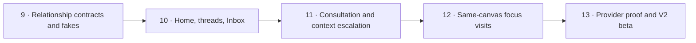

# Implementation roadmap

**Status: Draft plan. No implementation is authorized by this document.**
**Parent:** [Zyra Voice-Agent Architecture](README.md).

The roadmap builds deterministic authority before attaching production Voice. Each engineering milestone has an independently testable rollback boundary.

Two product phases remain independently usable:

- **Product Phase One / V1 (`conversation_scoped`)** comprises milestones 0–8 and ships the current canonical Chat/Voice architecture.
- **Product Phase Two / V2 (`relationship_first`)** begins at milestone 9 only after the Product Phase One exit gate passes. It remains optional, and V1 remains supported.

Product V1/V2 labels are independent from schema, provider, storage, and milestone versions. See [Product phases](product-phases.md).

## Product Phase One engineering sequence

```mermaid
flowchart LR
    P0[0 · Contracts and fakes] --> P1[1 · First-class task controller]
    P1 --> P2[2 · Foreground inspection gateway]
    P2 --> P3[3 · Provider-neutral realtime seam]
    P3 --> P4[4 · Voice in canonical chat]
    P4 --> P5[5 · Primary delegation and steering]
    P5 --> P6[6 · Selective narration]
    P6 --> P7[7 · Continuity and recovery]
    P7 --> P8[8 · Hardening and public beta]
```



## Milestone 0 — contracts, fakes, and evaluation harness

### Deliver

- compile the JSON Schemas in this package;
- add TypeScript/domain types generated or hand-maintained from schemas;
- implement fake realtime, direct-Chat/primary, permission, usage, and ledger adapters;
- implement foreground-route, state-transition, and context-revision reducers in isolation;
- encode the routing, narration, continuity, and security scenario corpus;
- establish redacted evidence-bundle format.

### Exit gate

All contract/property tests pass with no provider or microphone connection. Invalid/unknown live-producer events cannot reach canonical append; recovery fixtures prove already durable newer events are preserved and hold projection read-only.

## Milestone 1 — first-class task controller

### Build on

- `src/agents/contracts.mjs`
- `src/agents/event-store.mjs`
- `src/agents/reducer.mjs`
- `src/agents/runtime/fleet-controller.mjs`
- `src/agents/runtime/cancellation-tree.mjs`
- `src/agent-server/server.mjs`

### Deliver

- first-class foreground-route records with one active owner per canonical conversation;
- gateway checks binding assistant commits to route epoch and owner claim;
- direct strong-agent Chat through the existing canonical surface with structured activity projection;
- first-class task records linked to the canonical root session;
- canonical `controller.sqlite` event/record/snapshot/outbox store with backup, migration, and recovery tests;
- `task.*` events normalized from the existing orchestration domain;
- legal transition reducer and snapshots;
- context revision store and per-owner acknowledgements;
- decision, approval-request, capability-lease, and permission-epoch records;
- primary-run/task links plus execution-attempt/primary-slot leases;
- one-writer policy and idempotency intents/receipts;
- Desktop/TUI read projections without Voice dependency.

### Exit gate

A text-only canonical chat can talk directly to the strong agent, show structured tool/command activity, and create, steer, pause, resume, recover, verify, and complete a durable task without starting Realtime. Existing fleet/workflow behavior remains compatible.

## Milestone 2 — bounded foreground inspection gateway

### Deliver

- dedicated read/list/find/search/Git-status/task-status/usage tools;
- project-root, symlink, size, time, and result guards;
- taint/provenance labels;
- deterministic quick-inspection budget;
- promotion packet preserving exact request and findings;
- no generic shell escape.

### Exit gate

Routing scenarios correctly separate direct strong Chat, realtime Voice answers, bounded realtime inspections, and durable promotion. Security tests prove no mutation path from foreground tools.

## Milestone 3 — provider-neutral realtime seam

### Build on

- `desktop/src/main/assistant/codex-realtime-voice.ts`
- `desktop/src/main/assistant/codex-realtime-voice-contract.ts`
- `desktop/src/shared/assistant/contracts/realtime-voice.ts`
- `desktop/scripts/test-assistant-realtime-voice.ts`

### Deliver

- gateway-controlled strong direct-turn seam and deterministic fake;
- `RealtimeForegroundAdapter` domain seam;
- deterministic fake realtime adapter in the focused test suite;
- versioned capability discovery;
- normalized transcripts, interruption, usage, and session health;
- generation-safe start/stop/retry cleanup;
- experimental Codex adapter behind the same seam;
- generic API adapter contract documented, implementation optional.

### Exit gate

The same domain suite passes against the fake and supported Codex adapter. Unsupported provider versions fail closed with actionable errors.

## Milestone 4 — Voice as a canonical conversation mode

### Integrate with

- canonical chat identity and history APIs;
- active foreground route/epoch and atomic owner handoff;
- existing Desktop assistant conversation, composer, message store, inline execution activity, attachments, settings, and permissions;
- server-owned runtime attachment/replay;
- TUI task visibility.

### Migrate from the Lab

Retain proven media and presentation work where compatible:

- WebRTC readiness and cleanup;
- transcript identity/deduplication;
- microphone/output activity metering;
- supported voice selection and local previews;
- responsive orb/transcript/settings/composer interactions.

Replace Lab-only foundations:

- Voice as a destination/page → explicit Start Voice action from the normal canonical Chat surface;
- ephemeral separate thread → canonical conversation attachment;
- isolated transcript array → canonical message projection;
- parallel composer → existing canonical composer/message transport;
- local-only task state → task controller;
- Lab instructions/permission assumptions → production settings and policy;
- route-specific image workaround → shared multimodal router.

### Exit gate

Starting Voice in an existing chat does not create a second chat ID. The strong Chat route remains active until Voice hydration succeeds. A running task keeps the same attempt, slot, locks, leases, and context while Realtime becomes foreground owner. Exiting Voice returns to direct strong Chat.

## Milestone 5 — primary delegation, steering, and exceptional children

### Deliver

- delegation packet builder;
- one strong primary execution lineage activated for durable work, with one slot-owning attempt per canonical conversation and durable park/terminal release receipts;
- client/provider promotion signal proven in isolation;
- context-delta steering and acknowledgement;
- task events from private primary execution; direct canonical output allowed only under an active strong Chat owner claim;
- exceptional child justification and narrow envelopes;
- primary integration and verification authority;
- dynamic model-role routing with visible fallback reason.

### Exit gate

Quick inspection can promote without intent loss. User corrections reach the primary and active descendants. Child completion cannot bypass primary verification.

## Milestone 6 — central selective narration

### Deliver

- `NarrationItem` producer and scheduler;
- durable `NarrationDelivery`, deterministic canonical message IDs, commit receipts, and crash-point recovery;
- significance, redaction, dedupe, expiry, and coalescing rules;
- explicit-speech adapter route;
- visual fallback when explicit speech is unavailable;
- user speaking/assistant speaking interruption policy;
- background task summaries plus compact structured execution activity in the canonical Chat timeline;
- per-user progress narration preference.

### Exit gate

The speech corpus produces zero raw tool/log/code/private output. Decisions, approvals, blockers, failures, and completion remain reliably surfaced.

## Milestone 7 — prepared continuity and recovery

### Deliver

- deterministic continuity reducer;
- adapter-specific packet budgets with nontruncatable critical records;
- OS-key-wrapped encrypted packet cache keyed by complete canonical watermarks;
- silent startup, hydration barrier, and typed/hash-checked nontruncated deltas;
- foreground route/epoch plus permission/revocation/writer safety state and narration-delivery watermark;
- exact pending decision/approval records and typed retrieval references;
- restart reconciliation and unknown-outcome handling;
- repeated physical-session expiry/reconnect tests.

### Exit gate

Voice resumes silently with current active tasks and constraints without waking a third model. No stale completion or replayed side effect appears after restart.

## Milestone 8 — hardening and Product Phase One public beta

### Deliver

- real microphone audio/text/muted E2E matrix;
- provider version compatibility table;
- accessibility and reduced-motion review;
- threat-model suite and privacy review;
- usage/health operator surfaces;
- documentation for provider adapters and contribution process;
- migration/rollback runbook;
- redacted release evidence.

### Exit gate

All Product Phase One gates in [Evaluation plan](evaluation.md) pass, known gaps are public, and the experimental adapter can be disabled without breaking canonical text/tasks. V1 is then independently releasable; Product Phase Two work may begin without changing that release contract.

## Product Phase Two engineering sequence



### Milestone 9 — relationship contracts, migration, and fakes

#### Deliver

- versioned schemas/types/reducers for UserSpace, InteractionProfilePreference, AssistantRelationship, RelationshipConversationBinding, ConversationCreationIntent and ConversationCreationReceipt, WorkThreadCreationIntent, HomeResetIntent and HomeResetReceipt, RelationshipFocusLease, FocusTakeoverRequest and FocusTakeoverReceipt, ProfileSwitchReceipt, RelationshipCascadeManifest and RelationshipCascadeReceipt, WorkThread, TaskContinuation, KickoffRequest, AttentionItem, FocusVisit, RelationshipReceipt, StrongConsultation, ContextRetrievalAuthorization and ContextAccessReceipt, ContextEscalation, RelationshipBudget, and UsageReservation;
- explicit composition with Phase One foreground routes, tasks, attempts, operations, approvals, narration, and continuity;
- additive migration associating existing conversations/folders/tasks without rewriting JSONL;
- milestone-9 V1/V2 profile preference and compatibility contract (pure pre-milestone V1 remains implicit `conversation_scoped` with no relationship/profile record), including `ask_if_ambiguous` thread-launch and quiet/deferred proactive-attention boundaries;
- deterministic fake relationship host, consultation adapter, coordinator, attention queue, and focus-session handoff;
- property/fault tests for identity isolation, cross-store Home/work-thread creation crash boundaries, orphan reconciliation, deterministic Home bootstrap plus fenced-reset/visit/operation/receipt/narration/physical-media/takeover races, modality-preserving Chat/Voice visits, profile rollback, explicit-vs-ambiguous work-intent/proactive-behavior boundaries, source-revision-bound attention, stale/multiple KickoffRequest V1 reply actions, plus source-deletion/answer races and non-opening tombstones, controller activity receipts, budget reservations, multi-client lease takeover, provider-thread binding, and stale focus generations.

#### Exit gate

The complete Phase One suite stays green with all Phase Two flags disabled. Synthetic V2 records replay deterministically; migration leaves canonical message hashes unchanged; switching profiles changes no task/attempt authority; target preparation failure leaves source focus authoritative.

### Milestone 10 — Zyra Home, work threads, and hybrid Inbox

#### Deliver

- distinguished additive Zyra Home conversation and `relationship_first` profile selector;
- work-thread registry with origin, folder, objective, canonical conversation, simple-task links, and sibling relations;
- typed substantial-work launch and existing-thread resume routing;
- standalone-task-to-thread continuation through safely released original, successor using existing `supersedes_task_id`, and separate same-transaction Phase Two TaskContinuation, with no Phase One schema/conversation-ID rewrite or operation replay;
- deterministic launch/attention/failure/outcome controller activity-receipt path;
- conversation-first thread surface for Desktop and TUI;
- compact active-work strip and Needs you/Active/Completed Inbox projections;
- V1 fallback that exposes underlying Home/thread conversations plus every unresolved kickoff question, decision, approval, blocker/failure action, and review through server-normalized V1-compatible affordances.

#### Exit gate

Typed Home conversation can discuss without creating work, launch one substantial thread with a task before execution, continue talking, inspect its verified status, resolve one Inbox item, and review one outcome. Routine completion enters Completed without Needs you. V1 opens the underlying canonical records and unresolved source actions. No copied transcript, nested thread, reparented task, duplicate operation, or projection/source mismatch appears.

### Milestone 11 — strong consultation and retrieval-first escalation

#### Deliver

- bounded read-only strong-consultation seam with usage, latency, uncertainty, and promotion evidence;
- strong coordinator routing for answer/consult/task/thread/attention outcomes;
- dedicated work-thread primaries under existing execution and exceptional-child policy;
- structured worker context requests plus non-bearer retrieval authorizations and access receipts;
- principal/purpose/source/data-class/policy/context/redaction/limit/expiry-checked retrieval ladder;
- scoped context revisions and affected-owner acknowledgements;
- deduplicated attention creation only after retrieval fails or conflicts.

#### Exit gate

Voice can obtain a stronger one-shot answer without creating durable work, promote when the consultation budget is crossed, and resume a blocked worker from trusted context without interrupting the user. Mutation through consultation and cross-project leakage both remain zero.

### Milestone 12 — same-canvas focus visits

#### Deliver

- acceptance-first focus proposal with zero pre-acceptance target retrieval/provider allocation, plus durable modality-preserving focus-visit lifecycle, return anchors, target/source hydration, Chat focus-only CAS with null realtime binding, and Voice paired route/focus transaction;
- same-canvas Desktop and TUI scope transitions with stable Voice/composer state and accessible controls;
- fake isolated-new-binding transport, prewarmed replacement-session handoff, reconnect, and failure adapters;
- natural-pause offer policy, same-segment deferral suppression, and explicit Inbox review queue;
- resolution/context commit, independent bounded return/acknowledgement deadlines, `returned_pending_ack` path, Voice-or-safe-Chat return, and compact Home activity receipt;
- crash recovery at every entry/resolve/return boundary.

#### Exit gate

A fake Voice session offers a blocked thread, enters only after acceptance and hydration, resolves it, returns by an independent deadline through ready Voice or safe Chat/degraded-Voice fallback, restores the exact Home position, and commits one compact controller activity receipt. Late acknowledgement or blocker updates asynchronously. Every injected crash and stale source/target callback preserves at most one active relationship focus-lease owner (or one parked silent snapshot) and produces no duplicate message, speech, attention, receipt, or steering.

### Milestone 13 — provider proof, hardening, and Product Phase Two beta

#### Deliver

- capability evidence for isolated scope switch, prewarmed handoff, reconnect, or unsupported behavior per provider;
- subscription-backed Codex and supported generic adapter focus-handoff tests;
- real microphone audio/text/muted focus-visit matrix;
- atomic relationship-wide budget reservations/reconciliation and operator diagnostics;
- multi-client focus-lease takeover, Home reset/deletion, relationship-organization removal versus explicit content cascade, retention, accessibility, privacy, and adversarial authorized-retrieval tests;
- V2 onboarding, preference, migration, disable/rollback, and known-gap documentation;
- redacted release evidence binding tests to an exact candidate commit.

#### Exit gate

Every Phase One and enabled Phase Two quality gate passes. V2 can be selected and disabled without data loss or interrupted work; unsupported/unknown Voice-focus isolation disables Voice preparation and offers an explicit consent-bound Chat modality change (decline leaves attention pending) while typed V2 remains usable; only relationship/runtime incompatibility falls back to V1; no cross-thread leakage, provider-thread rebinding, stale-focus output, repeated deferred offer, duplicated Home activity receipt, budget oversubscription, or authority transfer through a visit occurs.

## Beyond Phase Two research

The [adaptive-coaching future direction](future-adaptive-coaching.md) is a separate Betum-informed exploration, not Milestone 14 and not a dependency of either product profile. Research may begin with read-only reflection receipts only after the underlying canonical, permission, deletion, and relationship contracts are stable. No live learner progression should ship before bounded tutor contracts, source-bound evidence, profile-layer separation, deterministic progression replay, simulation isolation, user inspection/deletion, and full V1/V2-disablement gates pass.

## Proposed module map

Names are design suggestions and should be reconciled with current module locality before implementation.

```text
src/
  tasks/
    contracts.mjs
    reducer.mjs
    controller.mjs
    foreground-routes.mjs
    routing-policy.mjs
    context-revisions.mjs
    decisions.mjs
    idempotency.mjs
    continuity-view.mjs
    narration-policy.mjs
  inspection/
    gateway.mjs
    tools.mjs
    result-policy.mjs
  relationship/                 # Product Phase Two only
    relationship-host.mjs
    work-threads.mjs
    focus-lease.mjs
    attention-queue.mjs
    focus-visits.mjs
    relationship-receipts.mjs
    strong-consultation.mjs
    context-retrieval.mjs
    context-escalation.mjs
    relationship-budget.mjs

desktop/src/main/assistant/
  foreground/
    route-owner.ts
    strong-chat-adapter.ts
    activity-projection.ts
  voice/
    realtime-adapter.ts
    codex-realtime-adapter.ts
    capability-probe.ts
    narration-bridge.ts
    session-owner.ts
    focus-session-handoff.ts    # Product Phase Two only
  relationship/                 # Product Phase Two only
    home-controller.ts
    work-thread-controller.ts
    attention-controller.ts

desktop/src/shared/assistant/contracts/
  task.ts
  context.ts
  narration.ts
  provider-capabilities.ts
  usage.ts
  relationship.ts              # Product Phase Two only
  work-thread.ts               # Product Phase Two only
  attention.ts                 # Product Phase Two only
  focus-visit.ts               # Product Phase Two only
```

The task controller may deserve a deep module behind a small interface. Avoid pass-through files that only rename existing fleet events. One adapter remains a hypothetical seam; the fake adapter makes each seam testable from day one.

## Data migration

The first release should be additive:

1. Existing canonical JSONL bytes remain unchanged.
2. Migration verifies every existing message ID, role, modality, timestamp, source sequence, and source-record hash before routing is enabled.
3. One initial `migration` Chat route is created at epoch 1 with `created_at` no later than the first verified canonical message.
4. A [`LegacyMessageRouteBinding`](schemas/legacy-message-route-binding.schema.json) records each message’s route identity, source hash/sequence, and one shared migration-manifest hash. Assistant bindings mint deterministic **migration receipts** proving that the canonical record already existed; they do not claim a historical provider route or replay an old response.
5. Resume v3 materialization reads route/modality/receipt metadata from these bindings while continuing to read message text from immutable canonical JSONL. It regenerates v2 caches from canonical conversation-message sequences, the complete operation revision index and terminal tombstones, task/attempt heads, and exact writer-lock IDs. Missing, duplicate, corrupt, or unprovable records hold the conversation read-only and block Voice until repaired or explicitly excluded; the migrator never guesses.
6. Existing fleet records remain readable; compatible fleet events import once into canonical controller records with stable root/fleet links and verified counts/hashes.
7. Controller/task/attempt snapshots rebuild from append-only records, and Desktop projections can drop/rebuild without touching JSONL.
8. Voice Lab preferences migrate only after explicit mapping; old Lab transcripts are never silently imported as production history.
9. Feature rollback uses a controller-schema-compatible runtime, disables new routing/Voice, and keeps canonical text plus existing fleet/private records and migration bindings readable.

Product Phase Two migration is separately additive:

1. create/read one stable user-space ID distinct from prompt/provider profiles, reserve its unique relationship ID and deterministically prepare generation-1 Home through an idempotent conversation-creation outbox/receipt without changing existing canonical JSONL;
2. write ordered, revisioned RelationshipConversationBinding records for verified existing conversations/folders/tasks using a migration manifest;
3. bind every verified conversation backing a projected/running/actionable source as `ordinary_reference` when classification is ambiguous; leave missing/unverifiable sources unbound and excluded, block V2 activation if any is running/actionable, and never guess work-thread/folder classification;
4. build Inbox, active-work, and thread-status projections from canonical controller records;
5. expose underlying Home/thread canonical conversations and unresolved kickoff/decision/approval/blocker/review affordances through the V2-capable candidate server’s V1 projection before enabling relationship focus;
6. retain the same V2-capable candidate runtime’s V1 projection and disable V2 routing on any migration, focus, budget, or projection mismatch;
7. prove interrupted reruns cannot create a duplicate relationship or Home generation.

## Feature flags

Recommended Phase One flags remain independently diagnosable. Phase Two flags form a dependency graph and disable in reverse order:

- task controller domain projection;
- exclusive foreground-route enforcement;
- direct strong Chat gateway lane;
- inline structured execution activity;
- foreground inspection tools;
- canonical Voice mode;
- Codex realtime adapter version;
- client-managed promotion;
- selective speech;
- continuity seed/delta;
- automatic idle close;
- exceptional child delegation;
- Phase Two relationship records/Home bootstrap (base);
- Phase Two V1 fallback plus hybrid Inbox/active-work projections (requires base);
- Phase Two typed work-thread launch/linked-successor continuation (requires base, projections, Phase One tasks);
- Phase Two relationship budgets/reservations (requires base and usage reporting);
- Phase Two strong consultation/authorized context escalation (requires routing, budgets, retrieval records);
- Phase Two typed same-canvas focus visits (requires base, attention, continuity, focus lease);
- Phase Two fake/provider focus-session handoff (requires focus visits and capability evidence);
- Phase Two proactive natural-pause offers (requires a working attention/focus path);
- Phase Two `relationship_first` profile selection (enabled last).

A single all-or-nothing flag would make diagnosis and rollback harder.

## Rollback principles

- Physical Voice can be disabled while tasks/text remain healthy.
- Selective speech can fall back to visual messages.
- Continuity can reconnect with a fresh bounded packet when deltas fail.
- Provider adapter failure cannot mutate canonical task state directly.
- New controller records remain readable when features are disabled; V1 profile rollback stays on the same V2-capable runtime, and executable downgrade never writes a newer schema.
- Older protocol-compatible clients receive server-normalized V1 records; incompatible clients are upgrade-required or read-only.
- Restoring the pre-migration backup is allowed only before new canonical controller records exist; otherwise rollback keeps the current reader and disables features.
- Worktrees/artifacts are retained for explicit review.
- No rollback deletes canonical user data.
- Disabling V2 stops relationship routing/offers but leaves underlying Home/thread conversations and unresolved source actions readable through V1.
- An active focus visit safely returns/aborts before a profile switch completes.
- Profile rollback never cancels tasks, moves messages, transfers authority, or drops pending attention.

## Open implementation questions

These require isolated evidence before the relevant milestone:

1. How reliably can subscription-backed Codex V3 expose a client-managed promotion signal for quick inspection versus deep work?
2. What encoded resume-packet budget remains reliable across supported voices, session versions, and startup context?
3. Which explicit-speech path consistently speaks typed/image/background results without triggering an unrelated response?
4. Which existing fleet event versions can migrate losslessly into the canonical controller tables, and which require compatibility adapters?
5. What idle timeout balances seamless presence, provider usage, and accessibility?
6. Which structured tool/activity fields can be shown inline by default while keeping raw payloads private and redacted?
7. How should primary model role selection interact with explicit user model pinning and subscription pressure?
8. Can an authenticated anti-replay voice-confirmation profile ever meet or exceed the baseline trusted-control approval guarantees?
9. Which providers can safely isolate cross-conversation focus in one session versus requiring a prewarmed replacement?
10. What target-prepare and media-handoff latency preserves a natural same-canvas visit?
11. Which deterministic signals identify a natural pause and suppress repeated deferral offers?
12. What bounded strong-consultation budget reliably separates one-shot reasoning from substantial work?
13. What focus-lease heartbeat, disconnect grace, and explicit takeover UX best implement the fixed one-owner arbitration contract?
14. What conservative usage-reservation unit prevents concurrent oversubscription for each provider?

Open questions do not weaken the fixed authority, identity, permission, and continuity invariants.

## Pull-request strategy

Prefer vertical, reversible changes:

1. schema/reducer/tests;
2. server persistence and query API;
3. one read-only projection;
4. fake adapter integration;
5. provider adapter behind flag;
6. canonical UI integration;
7. live proof and cleanup;
8. V1 compatibility and V2 disable/rollback proof for every Phase Two pull request.

Each pull request documents source of truth, fallback behavior, migration, rollback, and evidence. Large UI and controller rewrites should not land together.
