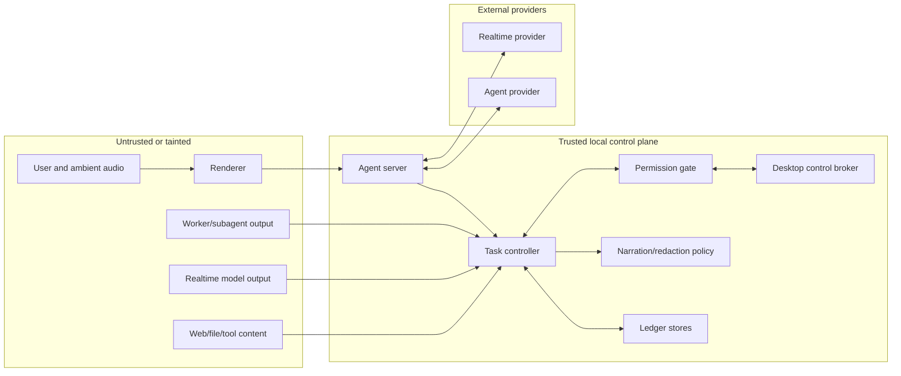
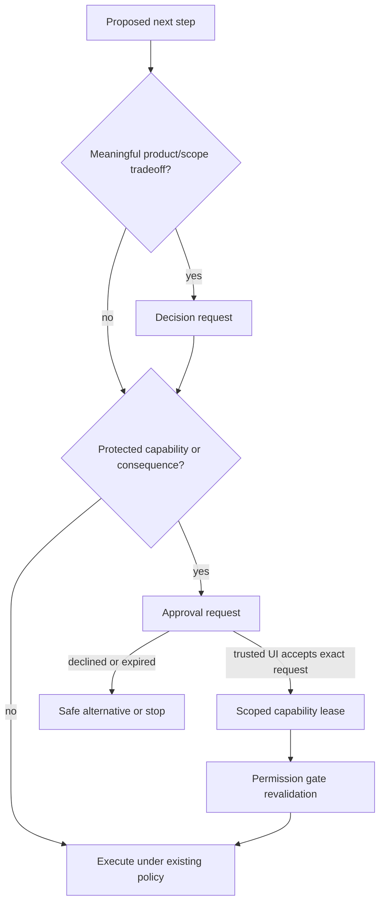

# Security and privacy

**Status: Draft threat model and policy.**
**Parent:** [Zyra Voice-Agent Architecture](README.md).
**Related:** [Agent-control security](../../security/agent-control.md).

## Security objective

A natural voice interface must not widen agent authority. Models propose; trusted code authorizes, records, and executes. The foreground role receives less authority than the ordinary primary coding agent.

## Trust zones

Every arrow crossing into trusted code requires schema validation, identity checks, size limits, and policy enforcement.

## Capability hierarchy

| Role | Default capabilities | Explicitly absent |
|---|---|---|
| Realtime foreground | Bounded read, search, inspection, retrieval, task status, usage status, task proposal | Generic shell, writes, tests, Git mutation, deploy, publish, browser/computer action, credential access |
| Strong primary | Ordinary scoped coding tools under current sandbox and approval policy | Authority outside granted roots/policy |
| Subagent | Attenuated subset of primary capabilities with explicit scope | User-facing speech, approval claims, recursive delegation initially, broad control |
| Renderer | Typed IPC and presentation | Credentials, task authority, capability minting |
| Task controller | State transitions and routing | Direct platform side effects without a tool/permission seam |
| Permission gate/control broker | Scoped capability grants and execution mediation | Model-driven grant creation |

Capability checks occur at execution time. Prompt instructions are defense in depth, never authorization.

## Threats and controls

| Threat | Required control |
|---|---|
| Spoken prompt injection | Treat audio as user input, preserve speaker/turn identity, and require explicit approvals for protected actions. Ambient speech cannot grant authority. |
| Prompt injection in files or web pages | Mark tool results tainted, keep instructions separate, restrict foreground tools to reads, and require primary/controller validation before action. |
| Foreground attempts a write through a read tool | Purpose-built tool implementation has no mutation primitive; controller rejects unsupported operation classes. |
| Worker claims the user approved something | Approval records come only from the permission gate; output scanner flags approval claims. |
| Collaboration mode bypasses approval | Permission policy is evaluated independently and cannot read autonomy level as a grant. |
| Stale approval reused after task changes | Lease binds task, authorized attempt, context/permission epochs, capability, action hash, target/scope/preconditions, expiry, and action count; material change invalidates it. |
| Duplicate/replayed side effect | Idempotency key, durable intent/receipt, and provider reconciliation before retry. |
| Stale context causes constraint violation | Required context version and owner acknowledgement gate completion and affected mutation. |
| Context poisoning across tasks | Scope every revision; propagate only through explicit task ancestry; no lateral child propagation. |
| Subagent addresses the user or injects narration | Children have no narration channel; output is untrusted evidence; scheduler accepts controller events only. |
| Secret read aloud | Redaction and speech eligibility gate precede explicit-speech calls; sensitive detail remains visual/private. |
| Raw logs leak into conversation | Logs stay in private task records; user-facing projection receives bounded summaries. |
| Renderer forges task/approval events | Main/server authenticates clients and validates actor authority; the general renderer cannot append controller events or invoke lease issuance, and only the broker-owned challenge callback creates a receipt. |
| Event stream replay or gap | Unique event IDs, monotonic sequence, watermarks, gap detection, and fresh snapshot recovery. |
| Realtime provider event from old session | Session generation and provider item identity reject stale callbacks. |
| Voice session drains allowance while idle | Visible connected state, optional idle timeout, separate usage meter, and seamless close/resume. |
| Audio spoofing or replay | Do not use voice identity as authentication; protected actions still require normal approval controls. |
| Malicious attachment | MIME/size validation, safe storage, no renderer path authority, and provider/tool sandboxing. |
| Symlink/path escape | Existing project-root and symlink-aware workspace guards apply to primary and children. |
| Runaway child fleet | Default zero children, bounded depth/concurrency/budget, cancellation tree, and explicit exceptional reason. |
| Crash repeats consequential work | Reconcile receipts; unknown outcome blocks automatic replay; expired grants remain expired. |
| Provider protocol changes | Startup capability probe and versioned schema validation fail closed. |

## Prompt-injection boundaries

The system separates four channels:

1. **Policy** — trusted system/project instructions and controller rules.
2. **User intent** — canonical user turns, including spoken turns.
3. **Reference data** — resume packets, files, web results, artifacts, and worker reports.
4. **Execution authority** — tool implementations, sandbox, permission gate, and capability leases.

Reference data never becomes policy merely because it contains instruction-like text. A resume packet is injected as bounded reference context and labels quoted user text and untrusted findings.

## Permission versus decision

A decision chooses an outcome. A trusted approval resolution authorizes issuance of a separate capability lease. They have separate schemas, UI, persistence, and event types.

A selected decision option can still require approval. An approval cannot decide an ambiguous product tradeoff on the user’s behalf.

## Approval requirements

An approval request MUST show:

- the exact action in understandable language;
- target, bounded scope, and exact observable preconditions;
- relevant irreversible or external consequences;
- which task requested it;
- duration/action count;
- available choices;
- what happens after decline.

In the reference profile, a **trusted approval control** is owned by the main-process/control broker, not by model output, worker events, or a general renderer IPC method. Desktop uses a main-owned native or equivalently isolated confirmation surface; TUI uses an authenticated attached client challenge with one-use server nonce. Untrusted surfaces may display a pending request but cannot call capability issuance directly.

The reference profile does not treat speech or model-generated text as authorization. A spoken response MAY navigate to or discuss the pending request, but only a trusted approval control can submit `{approval_request_id, record_revision, action_hash, decision}` before `expires_at` and produce a one-use `challenge_receipt_id` recorded with `authorization_channel: trusted_control`. The broker consumes each challenge nonce once; restart or redisplay rotates it, while the stable request/action hash remains visible. This prevents ambient, replayed, misrecognized, or synthesized speech and stale UI submissions from minting authority. All protected actions, including low-risk ones, require an equivalent keyboard-accessible trusted control; deployments can study stronger authenticated voice-confirmation protocols as a future extension, not silently weaken this baseline.

Approval scope/preconditions contain user-understandable, nonsecret values. A sensitive internal target is represented by a gate-keyed non-bearer digest in the hashed preconditions and resolved only inside the gate; raw control identifiers never enter model or renderer contracts.

Acceptance creates a separate durable capability lease. Lease material remains in the trusted controller/permission gate and is never exposed as a model bearer token or renderer secret. Before every protected tool call, the gate atomically checks request resolution, lease status, task and authorized attempt, exact action hash and scope, current relevant context, current permission epoch, expiry/revocation, and action count. It increments `actions_used` with the operation receipt. Parking, cancelling, terminal task state, emergency stop, context mismatch, or provider-session loss revokes the lease.

## Desktop and browser control

Production Voice reuses the existing `AgentControlBroker` path:

- control remains in Electron main;
- the foreground has no direct control capability;
- a primary receives only a revocable, attenuated lease;
- current observation revision and target scope are checked for each action;
- TUI/realtime attachment does not imply desktop authority;
- emergency stop revokes grants and aborts queued control.

Voice convenience does not create an ambient remote-desktop channel.

## Data classification

| Class | Examples | Conversation/TTS policy |
|---|---|---|
| Public | Public docs, repository source intended for publication | May be summarized with provenance |
| User-visible private | User messages, chosen file excerpts, task outcomes | Main conversation when relevant; TTS after policy check |
| Task-private | Raw logs, full child transcripts, detailed tool results | Task details only; no TTS by default |
| Secret | Tokens, keys, credentials, auth files, password fields | Never model context, narration, logs, or artifacts |
| Sensitive control | Pairing codes, grant tokens, internal target IDs | Trusted process only; never renderer/model contracts |

## Storage, encryption, migration, and retention

### Canonical stores

The reference implementation uses clear ownership rather than treating every SQLite file as a cache:

- existing canonical conversation JSONL remains the source of user/assistant message truth;
- a per-user `controller.sqlite` is canonical for append-only controller events, context revisions, tasks, execution attempts, operation intents, completion candidates, decisions, approval requests, capability leases, narration items/deliveries, idempotency receipts, and side-effect outbox entries;
- private provider/worker records remain under existing ignored task-run storage and are referenced by stable IDs;
- Desktop search/timeline SQLite remains a disposable projection and never mints authority;
- resume packets are replaceable encrypted cache blobs derived from the canonical stores.

`controller.sqlite` uses foreign keys, WAL, transaction boundaries, and durable synchronization for authority/side-effect records. Domain events and resolved requests are immutable; projections/snapshots are replaceable. A transaction appends the event, updates its reduced snapshot, updates relevant source watermarks, and writes any outbox intent atomically.

Conversation JSONL and the controller database cannot share one filesystem transaction. The controller therefore writes an outbox intent with a deterministic canonical message ID, the conversation gateway appends and durably flushes that ID idempotently, and the controller records the commit receipt. Recovery retries the ID, never a new message. External side effects use the same durable-intent/receipt pattern and classify missing receipts as `outcome_unknown` rather than assuming failure.

### At-rest protection

No access token, provider credential, microphone audio, WebRTC credential, or bearer capability token is stored in these records. Capability leases are authority references enforced inside the trusted permission gate, not transferable secrets.

The reference profile still protects sensitive local state:

- owner-only filesystem ACLs are mandatory for all canonical/private stores;
- resume packet blobs are authenticated-encrypted with a random data key wrapped by DPAPI, Keychain, or libsecret-compatible OS storage;
- sensitive controller payload fields such as exact approval scope and protected outbox operation payloads MUST use the same envelope encryption unless the whole controller database uses a supported authenticated encrypted-SQLite build;
- encryption metadata includes algorithm/version/key ID; plaintext keys never enter logs, renderer IPC, model context, or repository files;
- cache or field decryption failure fails closed and offers explicit recovery/deletion instead of starting with partial safety state.

Full-disk encryption remains recommended but is not treated as a substitute for application controls. Existing unencrypted conversation history must be disclosed accurately; this proposal does not claim it is already migrated or encrypted.

### Schema migration and recovery

`controller.sqlite` records storage schema version and minimum compatible reader version. Migrations follow `backup → integrity check → transactional expand/copy → schema and row validation → atomic activation`. The previous database is retained until the new store passes replay, foreign-key, and checksum checks. A reader that encounters an unsupported version or unknown event preserves bytes, stops projection before that record, and opens the affected conversation/task read-only.

Downgrade never writes through a newer schema. Crash recovery replays from the last committed sequence, validates outbox receipts and active lease/slot invariants, revokes orphaned authority, and regenerates projections/resume caches. Migration tests include interruption at every durable step and restoration from the backup.

### Reference retention defaults

User deletion and stricter configured policy always win. Initial defaults are:

| Record | Default |
|---|---|
| Canonical messages and context decisions | Follow the conversation retention setting |
| Active tasks/attempts and pending requests | Retain while active or pending |
| Terminal task-private logs and narration delivery diagnostics | 30 days, then compact/delete noncanonical detail |
| Approval/lease audit metadata and side-effect receipts | 90 days, without credentials or bearer material |
| Resume cache | Replace on every newer packet; delete after 7 disconnected days or with the conversation |
| Raw microphone/provider audio | Never retained unless a separate explicit recording feature/policy is enabled |
| Screenshots/control artifacts | Existing bounded artifact policy, with visible deletion controls |

Compaction preserves canonical messages, task terminal outcome, decisions, approval outcome, artifact metadata, and audit hashes while removing raw logs/content according to policy. Deletion tombstones references transactionally, revokes active leases, cancels active attempts, removes encrypted derivatives, and reports any external artifact it could not delete.

## Logging

Logs MUST redact:

- access/refresh tokens, API keys, cookies, SDP credentials, authorization headers;
- raw microphone audio;
- full private file contents and worker transcripts;
- typed sensitive values;
- provider payload fields not explicitly allowlisted.

Use IDs, event types, byte counts, durations, status, and redacted error codes for operational diagnosis. A debug mode cannot silently weaken secret filtering.

## Transport security

- Local client/server communication uses the authenticated per-user named pipe or Unix socket defined by the agent-server architecture.
- Raw LAN listeners remain disabled by default.
- WebRTC signaling and provider connections use provider-supported authenticated TLS paths.
- Session tokens stay in trusted main/server processes.
- Renderer IPC validates sender, schema, ownership, and generation.
- Experimental WebSocket listeners MUST NOT be enabled as an accidental network service.

## Provider and subscription boundaries

The Codex adapter uses the user’s supported Codex/ChatGPT authentication path. It must not copy tokens into prompts, URLs, logs, repository files, or child processes beyond the provider client’s normal credential mechanism.

Generic API-key Realtime is a different adapter and billing path. Documentation and UI must not imply that subscription access grants arbitrary API capabilities.

## Open-source publication safety

Contributions MUST NOT include:

- local auth files, tokens, session histories, private `.zyra` state, or screenshots containing personal data;
- copied/minified proprietary Desktop application code;
- private endpoint credentials or impersonation of first-party client identities;
- raw provider payload captures containing user/account identifiers;
- claims that experimental behavior is a stable provider guarantee.

Acceptable evidence includes public documentation, open-source provider code, generated public protocol schemas when redistribution permits, synthetic fixtures, and clean-room interoperability tests with sensitive fields removed.

## Security tests

Minimum adversarial coverage appears in [Evaluation plan](evaluation.md) and includes:

- prompt injection through speech, files, web results, and child output;
- approval forgery and stale-grant replay;
- context-version race during mutation/completion;
- session-generation replay;
- side-effect timeout with unknown outcome;
- secret and private-log narration attempts;
- child direct-speech attempts;
- symlink/path escape;
- disconnect/restart during approval and control action;
- usage-drain and runaway-delegation limits.

## Incident posture

An emergency stop cancels/revokes active control and worker capability leases while preserving the canonical audit trail. The user receives a concise safe status. Recovery requires fresh capability evaluation and approval; it never restores revoked authority from a resume packet.
