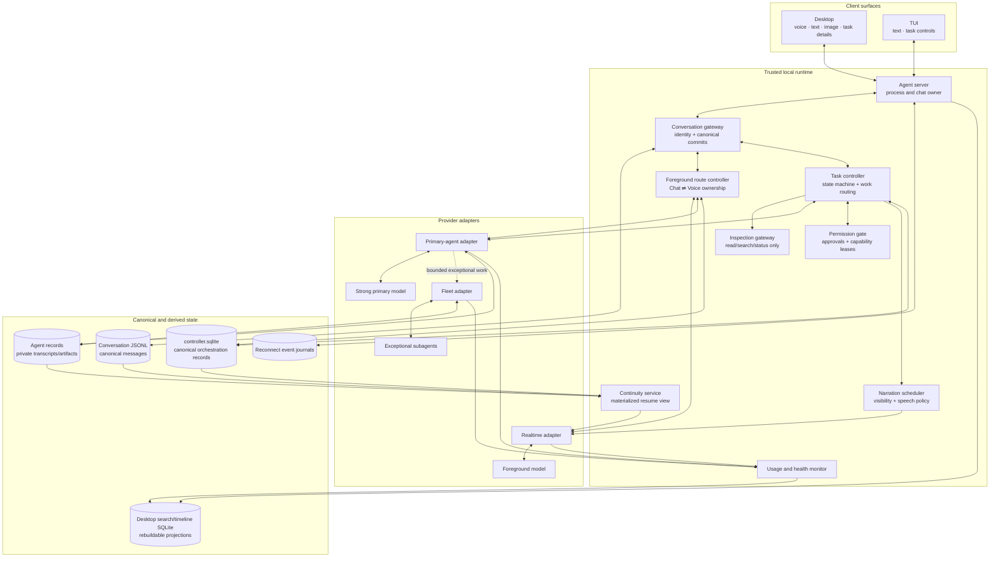
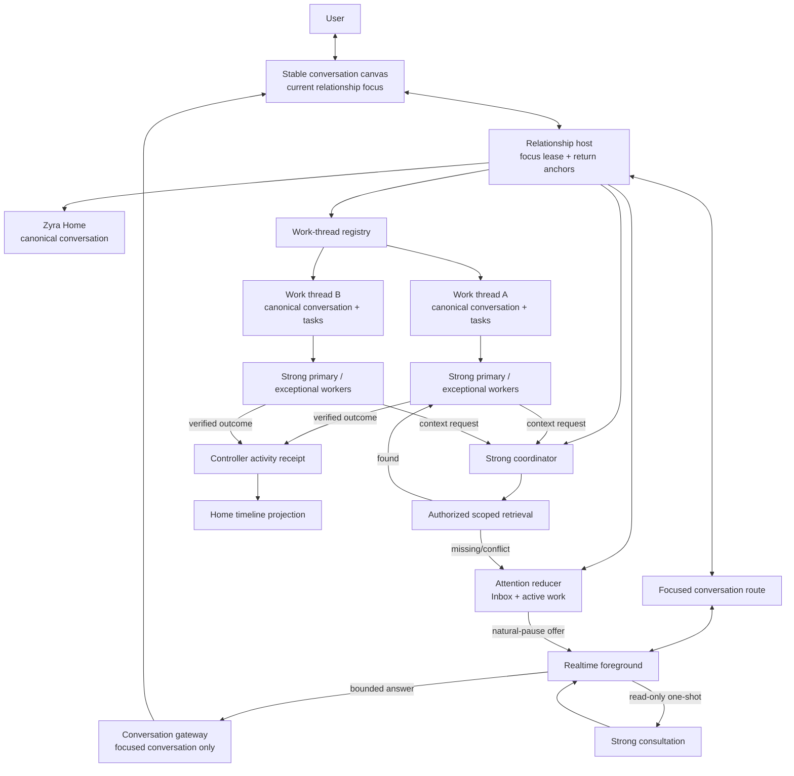
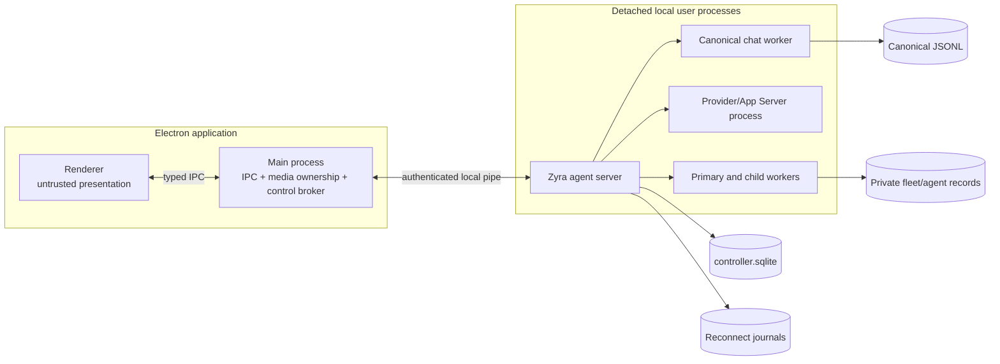
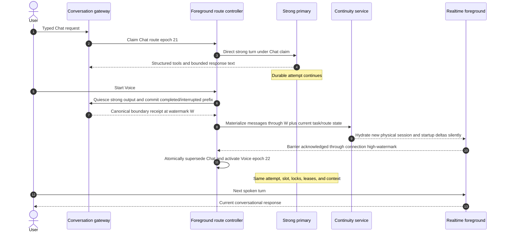
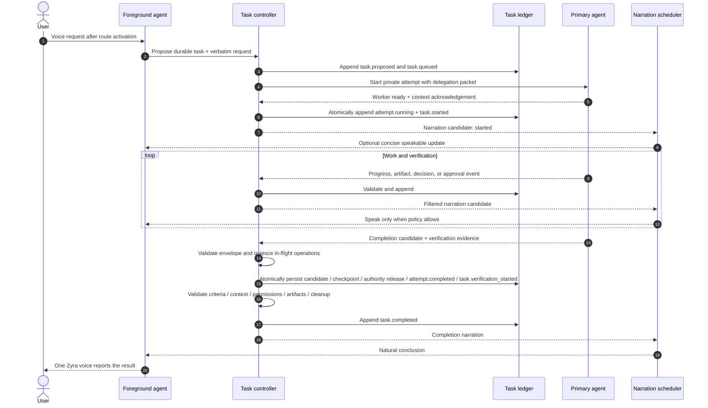

# System architecture

**Status: Draft specification.**
**Parent:** [Zyra Voice-Agent Architecture](README.md).

## Architectural shape

Product Phase One uses a manager-style orchestration pattern around one canonical chat. The strong primary owns direct responses while Chat is active. The realtime foreground owns conversation and narration while Voice is active. A deterministic foreground route and task controller mediate these roles and remain authoritative for ownership, state, and policy.

Optional Product Phase Two composes this architecture across multiple scoped canonical conversations under one AssistantRelationship. Phase One remains independently usable; see [Product phases](product-phases.md) and [Phase Two — relationship-first interaction](relationship-first-interaction.md).

The canonical conversation can survive many Chat/Voice handoffs and physical WebRTC sessions. Starting or closing Voice does not end the conversation, cancel an active task, or transfer the task’s execution authority.

## Phase Two relationship overlay

Phase Two adds product-level focus and orchestration above the Phase One conversation modules. It does not replace the conversation gateway, foreground routes, task controller, permission gate, or canonical ledgers.

The relationship host owns no task or permission authority. It coordinates one current active-or-parked focus snapshot for a nonretired relationship with at most one live owner, target hydration, Chat focus-only transitions, paired conversation-route changes for Voice, explicit multi-client takeover, and recovery. Home and every work thread retain distinct conversation ledgers. The stable canvas can conceal a provider-session replacement during Voice, but never starts Realtime for Chat/TUI or bypasses target hydration/immutable Voice provider binding.

The strong consultation, coordinator, and primary are separate domain lanes inside the existing strong-model role family. Work threads receive normal strong primaries; exceptional child workers still require ADR-0004 justification.

## Ownership table

Each concern has one authority. A projection MAY cache authority data but MUST be rebuildable or reconcilable from its source.

| Concern | Authority | Derived consumers |
|---|---|---|
| Conversation identity and user-visible message history | Canonical Pi session JSONL | Desktop SQLite, renderer stores, realtime resume view |
| Active Chat/Voice response ownership and route epoch | Canonical `ForegroundRoute` revisions in `controller.sqlite` | Gateway commit checks, surface state, continuity view |
| Root task lifecycle, context version, decisions, approvals, attempts, and artifacts | Canonical `controller.sqlite` records reduced from orchestration events | Task cards, narration candidates, continuity view |
| Primary/subagent private execution streams | Existing fleet/agent records linked to controller attempts | Root task projection, Inspector, usage summaries |
| Runtime lifetime and client attachment | Zyra agent server | Desktop and TUI presence indicators |
| Permissions and approvals | Durable controller records plus trusted permission gate/permission epoch | Models receive only scoped results, never lease bearer material |
| Desktop/browser/computer authority | Electron main-process `AgentControlBroker` | Primary agent through approved bounded calls |
| User-facing response owner | Active foreground route | Strong primary for Chat; realtime foreground for Voice |
| Product interaction profile | Pure Phase One implicitly defaults to `conversation_scoped`; milestone 9 adds revisioned `InteractionProfilePreference` keyed by user space, where V1 needs no relationship and V2 activates only after bootstrap/transition receipt | Navigation/router selection |
| Phase Two user-space/relationship identity | Stable `UserSpace`, `AssistantRelationship`, and `RelationshipConversationBinding` revisions in `controller.sqlite` | Home, Inbox, folder/thread navigation, settings; prompt/provider profiles remain separate |
| Phase Two conversational focus owner | `RelationshipFocusLease` plus the focused conversation’s foreground route | Owner surface, mirrored clients, same-canvas projection, realtime adapter |
| Work-thread identity and origin | `WorkThread` metadata linked to one canonical conversation | Thread list, folders, task anchors, search |
| User-attention lifecycle | Canonical source records plus `AttentionItem` revisions | Needs you, active-work strip, natural-pause offer queue |
| Home work activity receipt | Append-only `RelationshipReceipt` controller activity record | Compact Home timeline projection; not an assistant message; source thread retains full detail |
| Strong consultation | Bounded private consultation record, relationship budget reservation, and strong-adapter receipt | Realtime receives facts/provenance; diagnostics receive usage |
| Cross-thread retrieval | `ContextRetrievalAuthorization` plus append-only access receipt | Coordinator receives bounded redacted records; worker receives only selected context revision |
| Phase Two aggregate budget | `RelationshipBudget` and atomic `UsageReservation` revisions | Scheduler, usage UI, diagnostics |
| Spoken output selection | Narration scheduler policy | Realtime adapter receives approved speakable content only while Voice owns the route |
| Spoken wording and Voice turn-taking | Realtime foreground model | Audio output and transcript |
| Direct Chat wording | Strong primary under a foreground owner claim | Canonical text response through the conversation gateway |
| Resume context | Continuity materialized view | New physical realtime sessions |
| Provider usage and reset truth | Provider-reported usage events/endpoints | Usage monitor and local estimates |
| UI presentation | Surface adapters | Desktop/TUI components |

## Runtime modules

### Conversation gateway

The conversation gateway normalizes speech, typed text, and image messages into canonical user-message records. It MUST assign a client message ID before provider submission so replay and retries remain idempotent. It attaches the conversation ID, current context version, attachment references, active `foreground_route_id`, and route epoch.

It is also the sole assistant-message commit seam. Strong Chat turns, realtime provider items, and narration deliveries map to deterministic canonical message IDs; final/interrupted text commits idempotently and returns a durable receipt. Every commit proves that its owner claim and route epoch are current. Cross-store commits use the controller outbox, so recovery retries the same ID rather than duplicating a turn.

The gateway sends normal Chat input to the strong adapter, Voice input to the realtime adapter, and durable intent from either route to the task controller. It does not make capability or permission decisions. Private execution output becomes user-facing only when the strong role owns the active Chat route and the output is explicitly bound to its foreground claim.

### Foreground route controller

The route controller persists one active [`ForegroundRoute`](schemas/foreground-route.schema.json) per conversation. A route binds a monotonic epoch and non-authorizing owner claim to either `strong_primary` in Chat or `realtime_foreground` in Voice. It:

- makes ordinary Chat the default/home route;
- prepares Voice transport and complete hydration before ownership changes;
- atomically supersedes the old route and activates the new route;
- rejects provider events, message commits, and narration deliveries from stale route epochs;
- attaches active task IDs for context without changing task attempts, slots, locks, leases, or cancellation state;
- returns ownership to Chat when Voice exits or fails;
- replays the pre-crash route, then rekeys it to a fresh Chat epoch/owner claim before accepting new input or output.

The owner claim authorizes response production only. It grants no shell, write, control, or approval capability. During a Voice handoff, an in-flight strong response reaches a completed or explicitly interrupted canonical boundary before the route swap; its durable task execution can continue.

### Realtime foreground adapter

The adapter owns physical media/session mechanics:

- establish, monitor, and close WebRTC or another realtime transport;
- map provider events into provider-neutral transcript and usage events;
- seed a session with a prepared resume packet;
- append silent context deltas;
- request explicit speech for approved narration items;
- persist speech request/item/playback identities through narration delivery records;
- expose capability discovery rather than relying on provider assumptions;
- reject stale events from replaced session generations and never replay unknown-outcome speech.

It MUST NOT become a task-state authority or commit output after its foreground route epoch is superseded.

### Realtime foreground model

The realtime foreground model is the user-facing response owner only while Voice holds the active foreground route. It remains Zyra’s sole spoken narrator. It can:

- answer from its current context;
- clarify intent;
- invoke dedicated read/search/inspection/status tools;
- propose or promote a durable task;
- narrate controller-approved updates;
- relay decisions and approval requests in natural language while trusted controls capture authorization.

It cannot receive unrestricted shell, write, Git, deployment, or desktop-control tools. The controller validates every invocation even when the model was correctly instructed.

### Task controller

The task controller is deterministic application code. It:

- creates tasks and context revisions;
- validates legal state transitions;
- routes or promotes requests;
- constructs delegation packets;
- starts and steers one primary agent;
- links exceptional child runs;
- enforces cancellation trees, primary-slot leases, write ownership, capability leases, and idempotency;
- separates decisions, approval requests, and trusted capability-lease issuance;
- reduces typed events into task snapshots;
- produces narration candidates;
- reconciles incomplete work after restart.

Model output MAY propose a transition. Only the controller commits it.

### Inspection gateway

The inspection gateway offers purpose-built, read-only operations. Initial operations SHOULD include:

- read a bounded file range within allowed roots;
- list or find bounded paths;
- search text or symbols;
- search/fetch public web sources under policy;
- inspect Git status/diff without mutation;
- query task, agent, provider, and usage status.

Results are bounded, provenance-tagged, and treated as untrusted content. The gateway has no generic command execution escape hatch.

### Strong primary agent

The strong role supports two controller-separated lanes:

1. **Direct Chat lane.** While `strong_primary` owns the active foreground route, an ordinary canonical Chat turn can answer directly. Provider text commits only through the conversation gateway under the current owner claim. Structured tool calls, commands, diffs, tests, and artifacts render as execution activity; raw payloads remain bounded/redacted and outside assistant prose.
2. **Private execution lane.** A durable task runs in a server-owned task session linked to the canonical conversation and task. While Realtime owns Voice, this lane cannot append assistant messages directly; it emits task events, evidence, and narration candidates.

The same provider/model can implement both lanes, but route ownership and task execution authority remain separate. A Chat turn that crosses into writes, commands, tests, deep work, or asynchronous work is promoted to a controller task without losing its direct surface. Starting Voice changes only the response lane: the existing primary attempt keeps its ID, slot, locks, leases, and context obligations while Realtime becomes narrator.

The initial release schedules at most one active strong-primary attempt per canonical conversation; queued tasks can take the slot only after the current attempt parks or terminates and releases its slot, locks, and leases. The primary:

- preserves the exact request and inherited constraints;
- investigates, edits, runs commands, and tests as authorized;
- integrates all accepted child findings;
- records artifacts and evidence;
- requests meaningful user decisions through the controller;
- verifies acceptance criteria;
- emits a structured completion candidate into private/task records.

The controller rejects completion if required verification, approvals, or context acknowledgements are missing. Only the conversation gateway may commit a canonical assistant message. It accepts strong output only under an active Chat owner claim and realtime output only under an active Voice owner claim.

### Exceptional subagents

Subagents reuse Zyra’s existing fleet controller. The primary SHOULD begin alone. A child run is justified only by a recorded reason such as:

- work is genuinely independent and large enough to parallelize;
- a specialist capability materially improves the result;
- an independent high-risk verification has clear value;
- a read-only investigation can proceed without writer conflict.

Children receive attenuated tools and narrow context. Their output is untrusted evidence until the primary validates it. Shared writer scopes remain serialized; isolated worktrees are retained for explicit integration.

### Narration scheduler

The scheduler turns task events into zero or more narration items. It filters private data, applies urgency and interruption rules, and deduplicates updates. While Voice owns the route, it sends only explicit `speakable` content to the realtime adapter. In Chat, the same validated events feed visual activity and bounded user-facing summaries without TTS. It never forwards raw event payloads.

### Continuity service

The service reduces canonical ledgers into a bounded resume packet whenever relevant watermarks change. It uses deterministic selection and truncation. It does not call another model, write conversation truth, or pretend stale state is current.

### Usage and health monitor

The monitor maintains separate views for:

- realtime session health and voice allowance;
- primary/subagent model usage and subscription/API limits;
- local task-attributed estimates;
- provider reset times and warnings.

Provider-reported data is authoritative. Local elapsed time and token attribution are labeled estimates.

### Phase Two relationship host

The optional relationship host owns interaction-profile selection, stable user-space/relationship identity, revisioned conversation bindings, one current active-or-parked focus snapshot/generation for a nonretired relationship, target preparation, return anchors, Chat focus-only transitions, paired source/target route transitions for Voice, and explicit multi-client takeover. Cross-store Home/work-thread creation uses deterministic intent → canonical-header receipt → controller epoch-1-route/binding activation. The host reads controller and conversation state; membership grants no retrieval, and it cannot create execution capability or rewrite canonical messages. Disabling it at a quiescent boundary safely closes visits, parks focus, converts Voice only when proven or falls back to Chat, then returns that V2-capable runtime to Phase One conversation selection while unresolved kickoff questions/decisions/approvals/blocker-failure actions/reviews stay actionable through server-normalized V1 activity and additive records remain readable.

### Phase Two work-thread and attention modules

The work-thread registry binds substantial work to one canonical conversation, origin, folder, and task set. Background execution requires a task. Promotion creates a safely released linked successor rather than changing a task’s conversation ID. The attention reducer converts revision-bound canonical source records requiring user input into non-authorizing Inbox items and schedules natural-pause offers. Routine completion goes directly to Completed. The relationship receipt path appends one idempotent controller activity summary; natural assistant text/speech remains a separate route-bound delivery. Detailed work remains in the source thread.

### Phase Two strong consultation and coordination

A bounded consultation lets Realtime obtain deeper read-only reasoning without starting durable work. The strong coordinator classifies substantial work, creates or resumes threads, and arbitrates worker context requests through exact retrieval authorizations/access receipts. It does not become an editor/integration owner; each task primary retains execution, integration, verification, and completion. Atomic relationship budgets/reservations prevent concurrent lanes from racing past usage policy. These lanes use the existing strong-model family and task controller rather than introducing a third user-facing model.

## Deployment and process ownership

The renderer MUST NOT hold provider credentials, mint control authority, or own durable task lifetime. Client disconnect means detach. Explicit Stop means cancellation.

Voice media MAY terminate when Desktop closes while primary work continues in the server. A later Desktop attachment receives canonical replay, task snapshots, and a new resume view.

## Seams and adapters

A seam is real when at least two adapters or a deterministic fake exercise it. The initial seams are:

| Seam | First adapter | Required test adapter |
|---|---|---|
| Foreground route persistence | Controller SQLite route revisions + gateway owner checks | In-memory transactional route store |
| Direct strong Chat | Existing Zyra Pi/Codex canonical turn path behind gateway control | Scripted strong conversation adapter |
| Realtime foreground | Experimental Codex thread realtime | Deterministic fake realtime session |
| Primary coding agent | Zyra Pi/Codex runtime | Scripted fake worker |
| Inspection tools | Local bounded inspection gateway | In-memory fixture gateway |
| Controller ledger persistence | SQLite append-only event tables + transactional snapshots/outbox | In-memory transactional event store |
| Narration output | Realtime explicit-speech route | Capturing silent sink |
| Usage reporting | Codex/provider usage adapter | Synthetic limit source |

Provider-specific records MUST be normalized at these seams. Surface components consume provider-neutral domain events.

## Chat-to-Voice handoff while work continues

Voice preparation does not grant response ownership. The Chat response lane is quiesced and its final/partial canonical text commits before the resume snapshot is taken. The Chat route remains authoritative until Voice acknowledges that commit plus every startup delta and the route swap commits. If preparation fails, the controller atomically rekeys Chat into a new route epoch/owner claim before reopening its response lane; the strong task continues unchanged.

## End-to-end delegated flow

## Data minimization

Each role receives the smallest useful context:

- active foreground owner: recent user-visible turns, current route epoch, prepared task summaries, pending questions, and safe inspection results;
- direct strong Chat lane: canonical conversation context plus route claim and policy-bounded execution activity;
- primary private task lane: verbatim request, relevant turns/attachments, current task context, constraints, project state, and foreground findings;
- subagent: one objective, inherited constraints, scoped files/artifacts, success criteria, and explicit return schema;
- narration: event summary, significance, and safe speakable facts only.

Full worker transcripts remain private task records and are retrieved on demand. They are never copied wholesale into the foreground session.

## Failure containment

The architecture isolates five independent lifetimes:

1. **Physical realtime session** — reconnectable and disposable.
2. **Foreground route epoch** — exclusive Chat or Voice response ownership for the conversation.
3. **Logical Zyra identity** — tied to the canonical conversation across route changes.
4. **Durable task** — survives client, route, and media changes.
5. **Execution attempt** — retryable worker process with a unique attempt ID.

A failure in one lifetime MUST NOT silently corrupt another. Detailed transition and recovery rules are in [Lifecycle and routing](lifecycle-and-routing.md).
