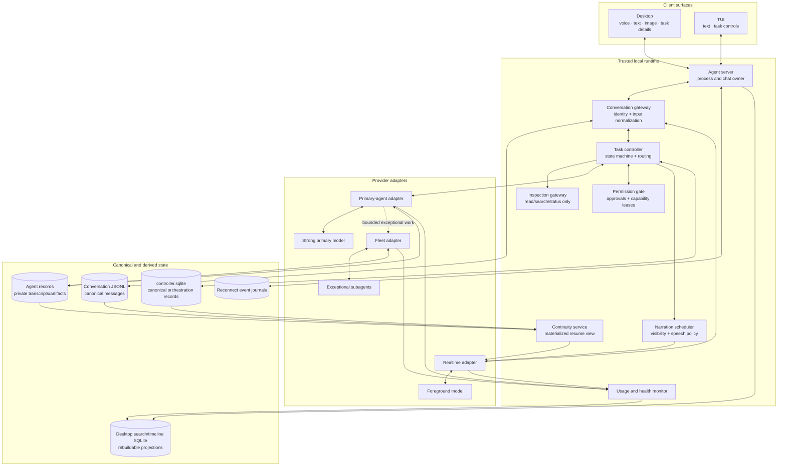
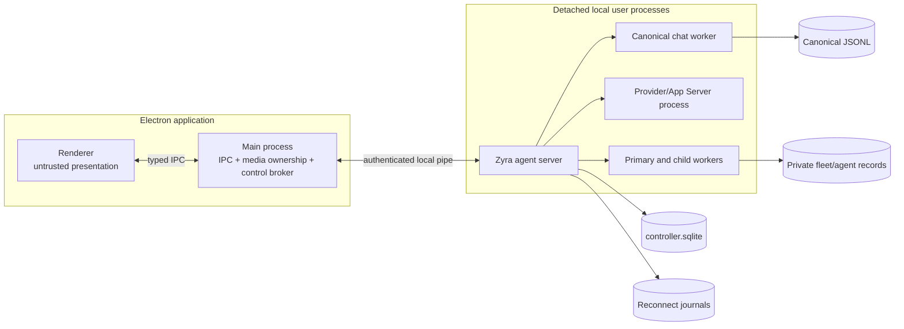
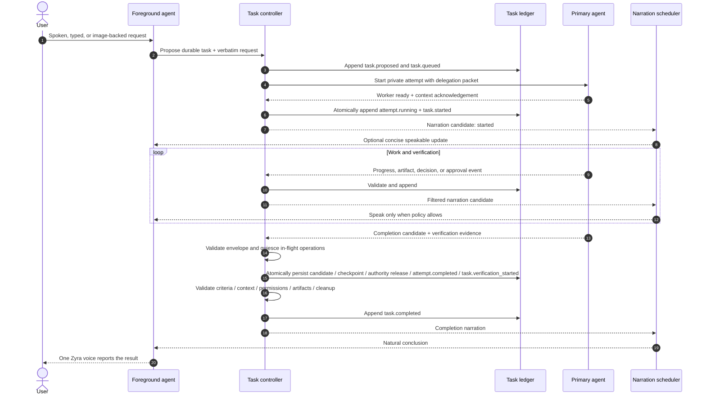

# System architecture

**Status: Draft specification.**
**Parent:** [Zyra Voice-Agent Architecture](README.md).

## Architectural shape

Zyra uses a manager-style orchestration pattern. The realtime foreground agent owns the conversational relationship. The strong primary agent acts as a durable execution worker. A deterministic controller mediates between them and remains authoritative for state and policy.

The logical foreground identity can survive many physical WebRTC sessions. Closing a voice connection does not end the canonical conversation or an active task.

## Ownership table

Each concern has one authority. A projection MAY cache authority data but MUST be rebuildable or reconcilable from its source.

| Concern | Authority | Derived consumers |
|---|---|---|
| Conversation identity and user-visible message history | Canonical Pi session JSONL | Desktop SQLite, renderer stores, realtime resume view |
| Root task lifecycle, context version, decisions, approvals, attempts, and artifacts | Canonical `controller.sqlite` records reduced from orchestration events | Task cards, narration candidates, continuity view |
| Primary/subagent private execution streams | Existing fleet/agent records linked to controller attempts | Root task projection, Inspector, usage summaries |
| Runtime lifetime and client attachment | Zyra agent server | Desktop and TUI presence indicators |
| Permissions and approvals | Durable controller records plus trusted permission gate/permission epoch | Models receive only scoped results, never lease bearer material |
| Desktop/browser/computer authority | Electron main-process `AgentControlBroker` | Primary agent through approved bounded calls |
| Spoken output selection | Narration scheduler policy | Realtime adapter receives approved speakable content |
| Spoken wording and conversational turn-taking | Realtime foreground model | Audio output and transcript |
| Resume context | Continuity materialized view | New physical realtime sessions |
| Provider usage and reset truth | Provider-reported usage events/endpoints | Usage monitor and local estimates |
| UI presentation | Surface adapters | Desktop/TUI components |

## Runtime modules

### Conversation gateway

The conversation gateway normalizes speech, typed text, and image messages into canonical user-message records. It MUST assign a client message ID before provider submission so replay and retries remain idempotent. It attaches the active conversation ID, current context version, and attachment references.

It is also the sole assistant-message commit seam. Foreground provider items and narration deliveries map to deterministic canonical message IDs; final/interrupted text commits idempotently and returns a durable receipt. Cross-store commits use the controller outbox, so recovery retries the same ID rather than duplicating a turn.

The gateway routes conversational input to the realtime adapter and durable intent to the task controller. It does not make capability or permission decisions and rejects private worker output as a direct canonical message source.

### Realtime foreground adapter

The adapter owns physical media/session mechanics:

- establish, monitor, and close WebRTC or another realtime transport;
- map provider events into provider-neutral transcript and usage events;
- seed a session with a prepared resume packet;
- append silent context deltas;
- request explicit speech for approved narration items;
- persist speech request/item/playback identities through narration delivery records;
- expose capability discovery rather than relying on provider assumptions;
- reject stale events from replaced session generations and never replay unknown-outcome speech.

It MUST NOT become a task-state authority.

### Foreground model

The foreground model is the single user-facing voice identity. It can:

- answer from its current context;
- clarify intent;
- invoke dedicated read/search/inspection/status tools;
- propose or promote a durable task;
- narrate controller-approved updates;
- relay decisions and approval requests in natural language while trusted controls capture authorization.

It cannot receive unrestricted shell, write, Git, deployment, or desktop-control tools. The controller validates every invocation even when the model was correctly instructed.

### Task controller

The task controller is deterministic application code. It:

- creates tasks and context revisions;
- validates legal state transitions;
- routes or promotes requests;
- constructs delegation packets;
- starts and steers one primary agent;
- links exceptional child runs;
- enforces cancellation trees, primary-slot leases, write ownership, capability leases, and idempotency;
- separates decisions, approval requests, and trusted capability-lease issuance;
- reduces typed events into task snapshots;
- produces narration candidates;
- reconciles incomplete work after restart.

Model output MAY propose a transition. Only the controller commits it.

### Inspection gateway

The inspection gateway offers purpose-built, read-only operations. Initial operations SHOULD include:

- read a bounded file range within allowed roots;
- list or find bounded paths;
- search text or symbols;
- search/fetch public web sources under policy;
- inspect Git status/diff without mutation;
- query task, agent, provider, and usage status.

Results are bounded, provenance-tagged, and treated as untrusted content. The gateway has no generic command execution escape hatch.

### Strong primary agent

The primary agent receives a durable delegation packet and owns execution end to end. It runs in a server-owned **private task session** linked to the canonical conversation and task; it never runs as a canonical user-facing root turn and cannot append assistant messages to the conversation ledger. The private session can use the ordinary Zyra/Pi/Codex tool runtime under current sandbox and approval policy. The initial release schedules at most one active strong-primary attempt per canonical conversation; queued tasks can take the slot only after the current attempt parks or terminates and releases its slot, locks, and leases. It:

- preserves the exact request and inherited constraints;
- investigates, edits, runs commands, and tests as authorized;
- integrates all accepted child findings;
- records artifacts and evidence;
- requests meaningful user decisions through the controller;
- verifies acceptance criteria;
- emits a structured completion candidate into private/task records.

The controller rejects completion if required verification, approvals, or context acknowledgements are missing. Only the conversation gateway may commit a final foreground/narrator assistant message to canonical Pi JSONL.

### Exceptional subagents

Subagents reuse Zyra’s existing fleet controller. The primary SHOULD begin alone. A child run is justified only by a recorded reason such as:

- work is genuinely independent and large enough to parallelize;
- a specialist capability materially improves the result;
- an independent high-risk verification has clear value;
- a read-only investigation can proceed without writer conflict.

Children receive attenuated tools and narrow context. Their output is untrusted evidence until the primary validates it. Shared writer scopes remain serialized; isolated worktrees are retained for explicit integration.

### Narration scheduler

The scheduler turns task events into zero or more narration items. It filters private data, applies urgency and interruption rules, deduplicates updates, and sends only explicit `speakable` content to the realtime adapter. It never forwards raw event payloads.

### Continuity service

The service reduces canonical ledgers into a bounded resume packet whenever relevant watermarks change. It uses deterministic selection and truncation. It does not call another model, write conversation truth, or pretend stale state is current.

### Usage and health monitor

The monitor maintains separate views for:

- realtime session health and voice allowance;
- primary/subagent model usage and subscription/API limits;
- local task-attributed estimates;
- provider reset times and warnings.

Provider-reported data is authoritative. Local elapsed time and token attribution are labeled estimates.

## Deployment and process ownership

The renderer MUST NOT hold provider credentials, mint control authority, or own durable task lifetime. Client disconnect means detach. Explicit Stop means cancellation.

Voice media MAY terminate when Desktop closes while primary work continues in the server. A later Desktop attachment receives canonical replay, task snapshots, and a new resume view.

## Seams and adapters

A seam is real when at least two adapters or a deterministic fake exercise it. The initial seams are:

| Seam | First adapter | Required test adapter |
|---|---|---|
| Realtime foreground | Experimental Codex thread realtime | Deterministic fake realtime session |
| Primary coding agent | Zyra Pi/Codex runtime | Scripted fake worker |
| Inspection tools | Local bounded inspection gateway | In-memory fixture gateway |
| Controller ledger persistence | SQLite append-only event tables + transactional snapshots/outbox | In-memory transactional event store |
| Narration output | Realtime explicit-speech route | Capturing silent sink |
| Usage reporting | Codex/provider usage adapter | Synthetic limit source |

Provider-specific records MUST be normalized at these seams. Surface components consume provider-neutral domain events.

## End-to-end delegated flow

## Data minimization

Each role receives the smallest useful context:

- foreground: recent user-visible turns, prepared task summaries, pending questions, and safe inspection results;
- primary private task session: verbatim request, relevant turns/attachments, current task context, constraints, project state, and foreground findings;
- subagent: one objective, inherited constraints, scoped files/artifacts, success criteria, and explicit return schema;
- narration: event summary, significance, and safe speakable facts only.

Full worker transcripts remain private task records and are retrieved on demand. They are never copied wholesale into the foreground session.

## Failure containment

The architecture isolates four independent lifetimes:

1. **Physical realtime session** — reconnectable and disposable.
2. **Logical foreground identity** — tied to the canonical conversation.
3. **Durable task** — survives client and media loss.
4. **Execution attempt** — retryable worker process with a unique attempt ID.

A failure in one lifetime MUST NOT silently corrupt another. Detailed transition and recovery rules are in [Lifecycle and routing](lifecycle-and-routing.md).
