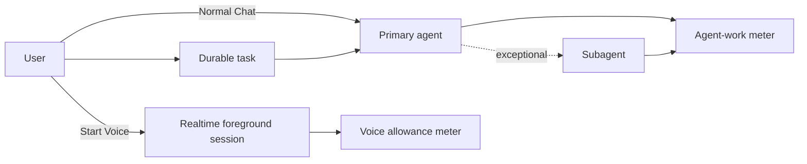
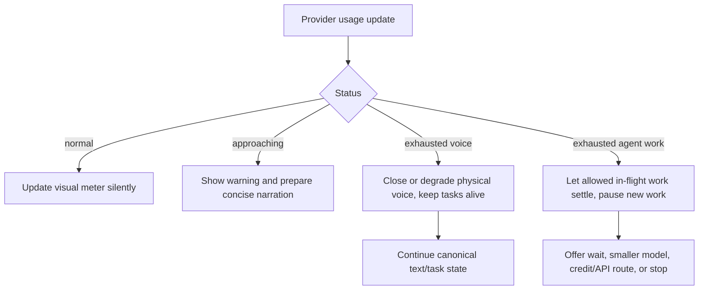

# Usage and operations

**Status: Draft operational specification.**
**Parent:** [Zyra Voice-Agent Architecture](README.md).
**Provider facts reviewed:** 2026-08-02.

## Two independent meters

Voice presence and coding work consume different allowances. Zyra must never combine them into one percentage.



| Activity | Voice meter | Agent-work meter |
|---|---:|---:|
| Normal direct strong-agent Chat | No | Yes |
| Live Voice conversation with no delegated task | Yes | No separate primary run |
| Realtime bounded inspection | Voice session continues | Provider-dependent; local deterministic tools do not create a strong-model turn |
| Primary agent task while Voice remains open | Yes | Yes |
| Subagent work | Voice only if session remains open | Yes for every model run |
| Voice starts while a task continues | Starts per provider accounting | Existing attempt continues without a new charge category |
| Voice closes while task continues | Stops/ends per provider accounting | Continues; Chat becomes available |
| Reconnect later for result | New physical voice session | Existing task usage remains attributed to task |

## OpenAI/Codex plan behavior

OpenAI’s current Codex pricing documentation states:

- Desktop Voice uses a separate plan-dependent allowance measured in rolling five-hour windows.
- Tasks started through Voice use the existing Codex usage budget.
- Desktop Voice uses a duplex model: GPT-Live handles live conversation and GPT-5.6 Terra starts and coordinates tasks in the first-party app.
- Pro 20x ($200/month) includes unlimited Desktop Voice access, while tasks remain limited.
- Unlimited access remains subject to provider fair-use policy.
- Model, context, reasoning, tools, retrieval, caching, and task complexity affect Codex work usage.
- The Codex usage dashboard and `/status` expose current task limits.

Sources: [OpenAI Codex pricing](https://developers.openai.com/codex/pricing) and [ChatGPT Voice](https://developers.openai.com/codex/features/voice), accessed 2026-08-02.

These values are time-sensitive provider policy, not core architecture constants. Zyra should link to current provider documentation rather than hardcode plan allowances into routing logic.

## Measurement truth

### Voice

The provider is authoritative for allowance status, reset, and fair-use enforcement. A local client can measure connected elapsed time but cannot infer undocumented provider weighting.

Zyra labels values as:

- **Provider reported** — exact status/value from provider events or endpoint;
- **Local estimate** — connected/active elapsed time measured by Zyra;
- **Provider + estimate** — provider status alongside local elapsed time.

An “unlimited” plan displays `Unlimited · fair use applies`, not an invented remaining-minute count.

### Agent work

Direct strong-agent Chat turns, primary execution, and subagent work all count toward the agent-work meter. Starting Voice does not reset or duplicate attribution for an already running attempt.

Provider rate-limit snapshots and completed-turn usage are authoritative. Local task attribution can sum reported tokens/requests/cost for primary and child runs, but broad subscription “messages remaining” may be weighted and approximate.

Model choice matters. A strong Sol-class task can consume more allowance than a Terra/Luna-class route. The task controller can recommend a lower-cost role for routine work but cannot silently change a user-pinned model policy.

## Usage snapshot

The domain record follows [`usage-snapshot.schema.json`](schemas/usage-snapshot.schema.json):

```json
{
  "schema_version": 1,
  "conversation_id": "chat_demo",
  "voice": {
    "provider": "codex_subscription_realtime",
    "status": "unlimited",
    "metering_source": "provider_and_local_estimate",
    "elapsed_seconds_estimate": 1320,
    "fair_use_applies": true
  },
  "agent_work": {
    "provider": "codex_subscription",
    "status": "normal",
    "metering_source": "provider",
    "used_percent": 35,
    "window_seconds": 604800,
    "resets_at": "2026-08-09T00:00:00Z",
    "model": "gpt-5.6-sol",
    "usage": {
      "requests": 3,
      "input_tokens": 25000,
      "output_tokens": 4200
    }
  },
  "observed_at": "2026-08-02T12:00:00Z"
}
```

The values above are fictional schema examples, not a promise about any user’s current account.

## User-facing presentation

A compact view:

```text
Voice        Unlimited · fair use applies
Agent work   35% used · resets Aug 9
Active task  Sol · 3 requests · usage updated moments ago
```

Task details can show:

- selected and fallback model;
- primary and child run attribution;
- request/token/cost data when available;
- provider window and reset;
- whether values are provider-reported or estimated;
- why a more expensive route was selected.

The main conversation receives only limit warnings that affect the user’s current action.

## Limit behavior



Rules:

- Approaching warnings are deduplicated per limit window.
- Voice exhaustion does not cancel a primary task.
- Agent-work exhaustion does not corrupt or falsely complete a task.
- A provider may allow an in-flight turn to finish; Zyra records the actual result.
- New expensive work is not launched after a known exhausted state.
- API-key fallback requires a separately configured API connection and explicit billing disclosure.

## Idle-session policy

A physically open voice session may consume allowance and resources even while quiet; exact provider weighting can be undocumented. Zyra SHOULD offer:

- visible connected state;
- configurable idle warning;
- safe auto-close after a conservative idle period when no speech or pending narration exists;
- one-click reconnect using the prepared resume packet;
- no task cancellation on idle close.

Unlimited plans still benefit from resource cleanup and robust resume testing.

## Health model

Operational health is tracked independently for:

| Area | States |
|---|---|
| Foreground route | chat, voice_preparing, voice, switching, recovery_required |
| Realtime transport | disconnected, connecting, ready, degraded, closing, failed |
| Input media | unavailable, permission_required, muted, active, failed |
| Output media | muted, active, interrupted, failed |
| Provider control channel | initializing, ready, overloaded, incompatible, failed |
| Primary worker | queued, running, waiting, verifying, terminal |
| Continuity | current, delta_pending, stale, rebuilding, failed |
| Usage | unknown, normal, approaching, exhausted, unlimited, error |

A green microphone indicator cannot imply that the task controller or strong agent is healthy.

## Observability

Record structured, redacted metrics:

- session connect latency by stage;
- media/data/control readiness;
- session duration and reconnect count;
- transcript finalization and duplicate suppression;
- foreground route epoch, handoff latency, stale-owner rejection, route class, and promotion reason;
- task time in each state;
- decision/approval wait time;
- primary and child attempt count;
- context-version lag and acknowledgement latency;
- narration candidate, suppression, coalescing, and delivery counts;
- resume packet byte size, omitted records, and hydration gaps;
- provider usage snapshots and warning transitions;
- cleanup failures and orphan-process count.

Metrics use synthetic or opaque IDs. Logs exclude audio, secrets, raw private content, and unredacted provider payloads.

## Operator views

### User view

- current voice/agent usage;
- active tasks and blockers;
- pending decisions/approvals;
- reconnect/retry controls;
- task detail with artifacts and safe diagnostics.

### Maintainer diagnostics

- adapter/provider versions and capability report;
- event watermarks and sequence gaps;
- active foreground route/epoch and physical session generation;
- response owner plus execution slot/leases/locks;
- process and media cleanup state;
- redacted last error category;
- schema validation and recovery warnings.

## Service-level objectives to validate

Initial targets for local development:

| Measure | Target |
|---|---:|
| Warm Voice readiness | p95 under 3 seconds where provider permits |
| Chat-to-Voice owner handoff after hydration | p95 under 250 ms, with zero duplicate owners |
| User interruption to local playback stop | p95 under 200 ms |
| Task event to visual projection | p95 under 500 ms |
| High-priority event to queued narration | p95 under 1 second |
| Prepared resume snapshot freshness | within 1 event/version |
| Clean stop orphan processes | zero |
| Duplicate canonical messages after reconnect | zero |
| Consequential operation replay after unknown outcome | zero |

These are product targets, not provider guarantees.

## Operational runbooks

### Voice transport fails, task healthy

1. stop/clean the physical session generation;
2. reconcile each narration/provider item as completed, interrupted, or `outcome_unknown` and never replay uncertainty;
3. preserve idempotently committed canonical transcript text;
4. atomically return foreground ownership to Chat while continuing the task;
5. rebuild the resume packet and offer Voice reconnect without restarting work.

### Primary worker fails, Voice healthy

1. terminally reconcile the failed/interrupted attempt, its slot, locks, leases, operations, and artifacts;
2. keep the task paused/queued while recovery remains safe, and explain the next option through central narration;
3. retry only when policy, receipts, and idempotency permit;
4. create a new attempt ID linked to the prior attempt while retaining the stable task/primary lineage;
5. if recovery is unrecoverable, terminally fail the task; an explicit later retry creates a linked superseding task.

### Usage becomes unavailable

1. show `Unknown`, never `Unlimited` or `0%`;
2. retain last observation with timestamp;
3. avoid aggressive new parallel work;
4. retry status with backoff;
5. keep local estimates explicitly labeled.

### App restarts

1. validate/migrate canonical stores, replay ledgers, and reconcile attempts plus outbox receipts;
2. replay the pre-crash foreground route, supersede it with a fresh Chat route epoch/owner claim, and restore pending decisions/approvals, permission epoch, revocations, writer ownership, and narration delivery state without reviving expired authority;
3. rebuild a complete continuity snapshot and apply lossless deltas through a hydration barrier;
4. attach clients to the canonical conversation;
5. wait silently for user speech unless an urgent undelivered event qualifies.
