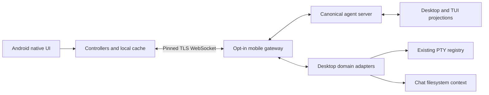

# Mobile architecture

The PC is authoritative for sessions, execution, approvals, terminals and workspace files. Android is a native Kotlin/Compose client with local machine keys, recent projections, drafts and an outbound intent journal. LAN access does not require a Zyra account or relay.

## Ownership and boundaries

- Desktop owns the gateway lifecycle and settings. Pairing chooses a private network automatically and defaults to a full-client catalog: existing and future projects are visible unless explicitly hidden. Project visibility is stored per paired device and edited from its row; network settings are host-wide and opened beside Pair phone. Changing a device policy closes only that device connection and clears its deferred body references; other clients retain their policies and connections. Earlier host-wide exclusions are copied once to existing devices without restricting future pairings. A separate CLI can connect to an existing agent-server namespace; Desktop-only features require Desktop adapters.
- The canonical server continues work when any client disconnects. A mobile `session.join` does not replace Desktop's plugin, filesystem or control authority. Cold Desktop chats are prepared through their existing Desktop configuration.
- A paired device is trusted to work in shared chats, respond to approvals and control exposed PC shells. Project visibility constrains chat/file APIs and which terminals are offered; a shell is a command interface with the PC user's permissions, not a filesystem sandbox.
- Plugin/provider credentials remain on the PC. The gateway uses a normal mobile agent-server client and never receives Desktop authority proof.
- The terminal adapter binds to Desktop's existing PTY registry. Closing a view detaches its receiver; ending a shell is a separate action. Android preserves host geometry and supports panning. Screen snapshots preserve ANSI modes and cursor state.

## Pairing and transport

The host maintains a stable identity and TLS certificate. A two-minute, single-use pairing link carries the certificate fingerprint and a random secret. The phone reviews the endpoint and pins that certificate before pairing. The host returns a device capability token; only its hash is stored on the PC, and Android seals the token using Android Keystore. Revocation closes the active connection and invalidates future authentication.

The listener binds one explicit interface. Authentication has a short deadline, browser origins are rejected, request/frame sizes and concurrent requests are limited, and only explicit mobile operations are exposed. One active host process owns the gateway state directory. No port forwarding is configured automatically.

The protocol is versioned separately from the canonical runtime protocol. A future relay must transport the same authenticated session protocol while preserving end-to-end machine identity and PC ownership. Relay delivery, cloud identity and internet discovery are not implemented by the LAN release.

## Delivery and recovery

1. Before a state-changing send, Android stores its intent and stable operation identifier.
2. The gateway durably appends the operation intent before dispatch. Repeating the same identifier with different content is rejected. A known completed operation returns its receipt; an uncertain operation is not dispatched again.
3. The canonical server emits sequence-numbered events. Android saves a bounded projection and joins the same canonical chat after reconnect.
4. Recovery loads paged durable history plus current live message, pending tools and attention. It does not transfer the whole event journal. Events arriving while history loads are buffered within a fixed budget and applied after the snapshot.
5. Text batches retain their first/final sequence and per-delta lengths, allowing recovery from a cursor in the middle of a batch without duplicated text.
6. Android reconciles pending send receipts in one bounded read. Terminal keystrokes are volatile, ordered and never retried automatically.

Desktop retains its existing replay path, supplemented by current attention/tool snapshots when opening events have been evicted. The server's replay window and durable journal are bounded by both event count and bytes. Oversized events retain a sequence marker rather than breaking continuity.

## Transfer priorities and budgets

| Data | Policy |
| --- | --- |
| Stop, approvals, questions | Reserved request capacity; flush earlier text before control events to preserve order |
| Live assistant text | New deltas only, coalesced for at most 50 ms; bounded batches |
| Terminal output | Separate buffer threshold; drop stale bulk output and request a current screen when the connection catches up |
| Catalog/history | Stable pages; shared-project filtering before pagination; server-side catalog search |
| Bodies and files | Small inline results; larger content fetched on demand in 48 KiB chunks |
| Background catalog changes | Debounced invalidation rather than full history broadcasts |

Frames are limited to 256 KiB, inline results to 32 KiB and the expiring body cache to 16 MiB. Replay is capped at 512 events and 8 MiB. Android's recent projection cache is bounded separately from drafts; quota pressure does not silently delete drafts. These limits are transport/cache bounds, not a declaration that all large-media workflows are complete.

## Session preferences

Chat preferences use the attached canonical runtime. `preferences.get` returns speaking-style names/descriptions and the current chat's memory-learning mode, without profile bodies or global memory sources. `configure.profile` retains the existing runtime persistence and project-default behavior. `memory.configure` accepts only a boolean `enabled`; the runtime selects its own thread and emits `session_memory` for attached clients. Neither endpoint accepts a project, data-root or thread override. These operations use the normal attached-session and per-device access boundaries.

Android keeps preference reads and saves under a connection/chat owner. Navigation cancels pending UI work, and newer streamed preference updates take precedence over delayed read/save responses. Opening the settings again reads the authoritative PC state. The learning switch controls whether this chat contributes to memory; it does not delete existing memory.

## Verification

Plugin management resolves the local Desktop session/project from the attached canonical chat on every call. A scoped projection returns installed summaries, that project's defaults and the chat's saved release identities; private package paths, manifests and other scopes stay on the PC. Global defaults require unrestricted device access. Existing chat refresh checks the reviewed catalog revision inside the registry's serialized mutation queue, so a concurrent PC change cannot silently replace the reviewed selection.

The native Plugin editor preserves its draft and original project revision across same-owner reconnects. Switching machines/chats cancels the old controller. Uncertain writes require a fresh read before retry. Visible-page refreshes use a compact version check bound to the resolved chat/project and device authority; unchanged responses preserve the installed list's loaded pages. Background pages do not poll. Instant push invalidation remains pending.

The Plugin Store reuses Desktop's pinned catalog and acquisition service. Catalog browsing sends bounded pages; publisher artwork is bundled from Desktop assets. PC download owners are allocated in a separate positive integer range and never accepted from phone input. Download preparation, cancellation and exact-digest installation require unrestricted device access. Each connection owns one acquisition, and revocation cancels it even when startup completes late. Reviews expose structured skills, capabilities, file counts, bytes and contribution notes without package paths or raw manifests. Android pauses progress polling when hidden and never automatically repeats preparation/installation after reconnect. Successful installation reloads PC state so an existing disabled Plugin remains accurately represented.

### Voice ownership and transport

Voice uses the existing Desktop canonical Voice adapter and ChatGPT account signaling. Android owns an audio-only WebRTC peer and `oai-events` data channel. SDP, canonical transcript events and client commands pass through the paired TLS gateway; bounded audio uploads are used only to recover missing user transcripts. Provider account credentials stay on the PC. Both devices need the provider connectivity their part of the call requires.

Each authenticated socket gets a fresh Desktop owner ID. Every Voice request requires an attached, visible chat. Startup, stop and media signaling are transient and never enter the durable command journal. Transcript uploads are ordered, capped at 32 events/64 KiB per batch, and queued under count/byte limits. Slow or failed transcript forwarding ends the call with an error rather than dropping history. Canonical context commands require matching adapter/realtime/generation IDs and are deduplicated; speakable commands wait for an idle response.

Android stops capture synchronously when stopping, switching chat/PC, closing the task or losing its foreground service. Backgrounding the Activity alone preserves the call. It then drains outstanding transcript work before ending the PC lease and detaching the chat. A failed stop closes that PC socket to trigger host cleanup. PC termination events retain their original owner even after Desktop clears the active owner. Revocation/replacement/connection loss also release the lease. Ordinary canonical chat work remains separate; Desktop currently cancels call-scoped private Voice inspections when a call ends.

Normalized live transcript events carry their original adapter/realtime/generation identity. Android renders them through the existing chat bubbles, scoped to one PC/chat, and removes each only when the canonical timeline contains its provider or canonical message ID. Spoken/hydration replays suppressed by Desktop explicitly remove their temporary live rows. Delivery timeouts remain visibly uncertain. The live presentation has bounded rows and characters and is not persisted as canonical history.

The running PC bridge publishes canonical commits only after durable append, including the actual saved message and history position. These events do not change an unrelated strong turn or streaming summary. Direct history reads incrementally refresh the selected transcript's index, so a reconnect need not wait for a catalog listing to see a newly saved message.

Voice selection is a phone preference, captured when the call starts and validated on the PC. The dedicated settings page uses Desktop's nine voices, palette and bundled recorded samples. Sample playback requests audio focus, releases it on completion/error/navigation/background, and never creates a provider connection. Unknown stored choices fall back to Desktop's Cove default.

Missing-input recovery follows Desktop's speech boundaries, 650 ms preroll and 1.5 second transcript grace. Native PCM16 callbacks feed a synchronized, bounded 24 kHz mono buffer directly, with no per-frame UI task queue. Audio remains in memory. At most eight unresolved utterances share a 120-second PCM budget; an overflowing recording is never sent as a partial transcript. Normal transcript completion, mute and call end cancel pending recovery and clear capture buffers. Captures transferred to the recovery worker are erased when its work settles.

Recovery uses one sequential, checksummed upload per connection in chunks no larger than 48 KiB, paced by the existing bulk-transfer lane. Raw upload reservations share a 24 MiB host budget, and abandoned uploads expire after 30 seconds. The PC's existing WAV validator and transcription provider handle the finished recording. Cancellation reaches both provider request and response-body reads. Recovery methods bypass the durable command ledger. Returned text is accepted only for the still-pending provider item and is fed through the normal canonical transcript bridge; late originals are deduplicated. Failures remain visibly unsaved and do not fabricate text or terminate an otherwise usable media call.

This source implementation does not yet establish physical microphone/playback, Bluetooth, foreground-service calls or provider interoperability. Review APK 0.1.3-dev includes this source; physical verification is still pending.

`FEATURES.md` is the release coverage record. Gateway tests use temporary TLS hosts, device credentials and scoped files. Server tests cover approval races, join/configuration preservation, journal eviction and recovery. A separate smoke test drives one real Windows PTY through two transport bindings. Android JVM tests cover data projection, questions, sequence recovery, keyboard delivery and the native terminal adapter. Native rendering, camera, audio, background lifecycle and physical LAN tests remain distinct gates.

## Image transport

The mobile history projection is optional. It preserves actual entry indexes even when damaged journal records are skipped, and replaces inline image data with an entry locator, content path and SHA-256. Desktop history retains its established shape. The gateway rechecks shared-chat access for every image chunk; expired cache entries are reconstructed from canonical history and verified against their original content hash. Live images use a bounded five-minute cache until canonical history is refreshed.

Uploads use stable identifiers, a durable byte offset, per-chunk overlap verification and a final SHA-256. The host serializes writes and syncs bytes before acknowledging them. Manifest files scope uploads to a paired device and canonical chat, reserve quota in advance and expire after 24 hours. The ordinary command receipt journal is bypassed only for these independently idempotent transfer operations. Image chunks use their own pacing (48 KiB every 24 ms per connection), keeping the ordinary interaction quota available and avoiding false rate-limit pauses on a fast LAN. A prompt resolves upload identifiers into validated native image content on the PC. Temporary upload files are removed after its request completes.

Android copies selected images into private durable storage before uploading. Pending delivery records retain image identifiers; confirmed delivery releases their local files. Cached chats, drafts and attachments can be opened before a network operation. Image downloads have a separate bounded cache, retain partial bytes across interruption and verify the complete hash before display. Viewing is explicit, decoded previews are downsampled, and saving uses the Android document picker.

## Native call lifetime

The Application owns a reference-counted session store. The Activity ViewModel holds only a lease; the independently scoped session holds connections, canonical chat state and Voice. A user-started, non-exported microphone/media-playback foreground service takes a second lease before capture. The media controller awaits successful foreground promotion before constructing its peer. The service never restarts a call after process death and never accepts credentials, chat content or session identifiers through intents.

Backgrounding the Activity leaves the call active. After the normal grace period, only the owning PC connection stays awake; other PCs reconnect on foreground return. Task removal, service destruction, PC disconnection or call end closes capture immediately, then permits the bounded transcript/stop drain before final session release. Navigating away from the chat inside Zyra still ends Voice. Permission denial for notifications leaves in-app controls usable and explains why lock-screen controls are unavailable.

Android 12+ audio outputs are discovered through AudioManager's available communication devices. The picker follows confirmed device callbacks, exposes a pending switch and a 30-second timeout, and removes disconnected devices. Earlier Android versions expose Speaker/System audio, leaving headset selection to Android. Callback registration, pending timers, audio focus and the communication route are released at call end. Physical lifecycle and routing behavior remain release gates.

## Plugin authority and review

Mobile Plugin requests resolve the attached canonical chat to its Desktop session and project on the PC. Catalog projections omit local package paths, manifests, other projects and other chat scopes. Installed pages use a compact conditional version check; a saved-version detail request returns only the selected version's complete skill summary. New-chat defaults and existing chats' frozen Plugin versions remain separate operations.

The Store uses Desktop's pinned directory and bundled publisher artwork. Downloads run on the PC under a host-assigned connection owner. Installation requires that owner's unexpired review identifier and exact content digest. Disconnecting or losing device access cancels owned preparation. A phone with restricted project access can inspect installed versions and browse the Store, but cannot install, enable, disable or restore PC-wide Plugins.

State changes use AssistantService's runtime-authority coordination. Enable/disable and restore carry the reviewed catalog revision; the core registry checks it inside its mutation queue. Disabling removes the Plugin from new-chat defaults, and enabling does not silently restore those selections. Restoring an installed version preserves disabled state and existing chats' frozen versions. Native review snapshots stay immutable, and uncertain responses require a fresh read before another mutation. No real user Plugin was modified by the synthetic validation fixtures.

Desktop's Plugin registry emits an advisory change only after a successful catalog write; observer failures cannot undo that write. A mobile connection subscribes lazily after authorized Plugin access, coalesces changes for 250 ms and sends a content-free `plugins.changed` frame. Access changes and disconnects remove subscriptions immediately. Native refreshes suspend while backgrounded, busy or reviewing, and recheck connection ownership before acting. The visible installed page uses its existing conditional catalog version check; no catalog payload is pushed and no off-screen refresh loop is introduced.

## Conversation, Markdown, and review surfaces

Opening a conversation hydrates recent user turns rather than treating raw event-page length as visible message count. The mobile-only lazy history policy defers tool-output bodies, including the newest output, and widens the initial indexed page toward three recent user prompts within 480 entries and 1 MiB of nondeferred data. Desktop history policy is unchanged. Android starts cold or sparse-cache context retrieval independently of attachment cleanup, keeps a soft 240-entry/400,000-character window with a 480-entry/800,000-character ceiling for a coherent latest turn, and preserves content keys and pixel offsets when older pages arrive. Pagination requires renewed upward intent rather than cascading on every changed cursor. Existing bounded memory/disk snapshots are retained, and canonical attach/replay ownership remains authoritative.

Shared native Markdown uses CommonMark with table, strikethrough, task, autolink, and footnote extensions. HTML is translated through a bounded Jsoup allowlist into native blocks; scripts and embedded browser content are excluded. The file editor uses block/cell-scoped Compose Rich Editor state; only an edited region is serialized. Untouched source spacing and structure are preserved. Source mode remains available for complex HTML or nested image markup. Saves retain the existing file hash conflict check.

Mermaid uses the same pinned runtime as Desktop in one transient offline WebView, then renders bounded sanitized SVG through AndroidSVG. User chart text is a quoted string argument to trusted bundled code; runtime configuration directives and external requests are blocked. Rendering has a timeout, cancellation teardown, serialized queue, and bounded theme-aware cache. This path does not create a persistent web-based chat surface.

Remote Markdown images load only after a tap using a separate credential-free HTTPS client. They share a 20 MiB cache with per-owner keys, a 5 MiB transfer limit, dimension checks, and cancellation when their surface is left. HTTP, redirects and unsupported formats retain a browser fallback. Scoped local images continue using the paired host's authenticated transfer protocol.

Changes defaults to Desktop's canonical per-turn review when the host advertises `turn-review`; Git remains an explicit alternative. The host maps canonical chat IDs to Desktop records, filters both lexical and real file paths through the paired device's scope, and loads selected patches on demand. Workspace and Git operations also exclude hidden descendant projects reachable through a shared parent. Terminals retain their existing machine command authority; project visibility is not an OS sandbox.

## Client storage, limits and workspace transfers

Limits are projected from the selected paired computer through a read-only capability, retaining actual limit windows and reset times while omitting account identity and billing data. Storage measures cached history, drafts, queued messages and completed downloads separately; clearing history affects only session-cache rows, and clearing downloads preserves active partials and unrelated files.

Workspace downloads require fresh scoped metadata before cache reuse. Cache keys include machine/session ownership, root, path and file version. Requests adapt between 8 and 48 KiB using observed transfer throughput, with a 64 MiB file limit, 20 MiB image-preview limit and 96 MiB download cache. Hash-bearing files can resume interrupted prefixes and verify the complete content; binary metadata without a content hash restarts safely. Native sharing grants temporary read access only to completed workspace downloads. File moves stay inside one authorized writable root, require an unchanged etag and existing destination directory, reject overwrites and linked paths, and coordinate with saves. Exclusive destination creation uses hard links; unsupported filesystems fail, and interruption can leave two names without losing source content.

Turn review follows list, selected turn and selected file navigation. The per-turn request and response use shared native Markdown. Sheet body scrolling is isolated from dismissal; only the sheet header accepts drag-to-dismiss. Composer morph geometry separates control movement from input expansion and responds to the keyboard animation target. These gesture paths still require physical-device acceptance.

## Review 021 interaction and attachment boundaries

Consecutive tool activity is projected into mixed-action segments separated by visible narration, reasoning or questions. Invisible assistant call envelopes do not split the segment. The latest recorded batch intent supplies its title; action counts remain optional.

Folder search runs before paging and reuses the folder access policy. Changing its query cancels the previous request; navigating folders clears the query. Catalog change/work flags are nullable while their bounded, scope-checked metadata projection loads, so unknown history is not misclassified as no work.

Camera capture is bound to the active composer owner and Activity lifecycle. Cancel, navigation and background immediately disable the outgoing capture controller; an animation does not prolong camera access. Captured images use existing image validation and transfer. Generic prompt attachments use a separate validated UTF-8 envelope, checksum and ownership checks, with bounded per-file and aggregate size. These prompt attachments are not a general-purpose binary upload or arbitrary PC write capability.

## Local usage and thread details

Usage is read on demand from canonical Zyra session paths and supported Codex, Claude and OpenCode ledgers. The host keeps a versioned numeric index with incremental offsets, file guards, a 40,000-record global limit and a 16 MiB persisted-file ceiling. It does not cache prompts or tool output. Phone-selected source filters cannot override server-selected project visibility; scope is reapplied for every response. Repeated logical response updates retain high-water token counts. Ambiguous Codex fork ledgers are omitted with explicit partial coverage instead of guessed deduplication.

JSONL scans use 1 MiB file slices and an 8 MiB request budget. Android continues a bounded number of slices only while the Usage page remains active. OpenCode's unindexed SQLite ordering is isolated in a short-lived Node-mode child: read-only/query-only access, 64 MiB JS heap, 32 MiB SQLite heap limit, 1,000 rows / 2 MiB output maximum and a three-second hard timeout. The host kills and reaps that exact child on timeout or output overflow. Unsupported or slow sources remain unavailable; the desktop event loop stays responsive.

Recorded model costs and dated standard API estimates remain separate from subscription billing. Unknown models and uncertain pricing tiers remain unpriced. Thread details resolves the authorized canonical chat and rejects totals belonging to another thread. The limits-only Desktop request skips reset-credit loading; mobile retries when the selected computer reconnects and presents request timeouts explicitly.

Usage charts consume a bounded 30-day UTC series returned beside existing summaries. The server applies current device project scope, logical-response deduplication and identical cost rules before totals, model groups and daily buckets. No extra provider requests or transcript scans are needed for the chart. Native Canvas plots support day selection and accessibility actions; Limits rings visualize only current provider quota snapshots, with unavailable data kept distinct from zero.

## Review 022 settings and live reconciliation

Chat settings is a full routed page, with model/thinking on a child page. Returning restores the session-owned list position and reading intent. Finished work retains the user's disclosure choice; only a transition out of active work automatically collapses it. Thought-process visibility is an opt-in appearance preference, and hidden entries do not split consecutive action groups.

Usage and account limits share one machine selector and one scrolling page. The harness selector scopes recorded usage; provider allowances remain account-level snapshots. Fetches restart on reconnect, retain available quota data on refresh failure, and reject late results after cancellation. Usage indexing remains bounded to eight requests per refresh and stops when coverage makes no progress.

Pending questions own the existing composer surface while retaining the unsent draft. The gateway supplies a stable client and operation identity; the canonical server resolves the answer and schedules exactly one continuation after the current foreground prompt finishes cleanup. Answer retries, reconnects and concurrent taps reuse the same continuation; conflicting responses are rejected and Stop cancels queued work. The gateway refuses an incomplete receipt from an older host runtime. Canonical resolved-question events drive the compact answered-question message.

Desktop live user-message events use the same validated image materialization and attachment envelope as history hydration. Android seeds the bounded media cache from matching outgoing originals before draft cleanup. Pending sends read attachment ownership from the durable operation and render the same thumbnails as canonical messages; another machine or chat cannot supply those previews. Replay reconciliation retains one canonical message.
